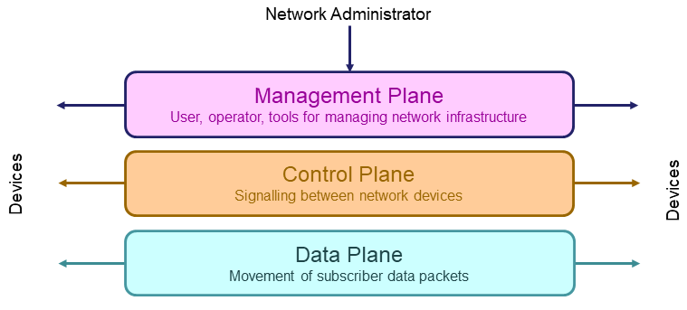

# Module 10: Active Incident Containment

## Isolation Techniques

### Network Isolation

_Primarily used to prevent network congestion and improve overall network performance. However, it also allows us to establish discrete zones within a network, each furnished with its distinct security policy and access controls._

### Tiered Isolation

Tier 0: Highest importance within the organization.

Tier 1: Assets essential to an organizations' daily operations, though not as critical as Tier 0.

Tier 2: Assets that, while less critical, still contribute value to the organizations' operations.

<figure><figcaption>
Isolating Network Planes
</figcaption></figure>

### Virtualization Isolation

<figure><figcaption>
Tenancy Isolation
</figcaption></figure>

## Containment Strategies

### Containment Impact on Businesses

_Weigh the impacts of isolation, etc. against business operations._

### Manual and Automated Containment

Automation can be rigid in its flexibility and can have an increased amount of false positives. Manual can be slow and resource (human resources) intensive.

### Single-Host Compromise Containment

_Walkthrough of a single compromised host being contained._

### Partial Compromise Containment

_Walkthrough of an incident surpassing the confines of a single compromised host or device within the network, extending its reach and the potential breach._

### Full Compromise Containment

_Walkthrough of a full compromise containment._
