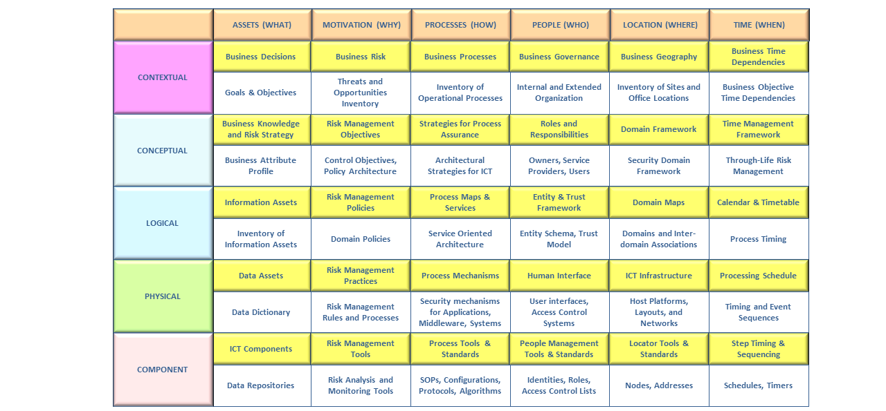

# Module 12: Post-Mortem Reporting

## The Post-mortem Report

### Post-Mortem Reporting Basics

Essential elements:

* Overview
* Timeline of Events
* Impact and Damage Assessment
* Root Cause Analysis
* Lessons Learned and Recommendations

### Metrics and KPIs in Post-Mortem Reporting

KPIs are Key Performance Indicators. There are four main areas where these metrics provide value:

1. Guided Learning
2. Performance Improvement
3. Resource Allocation
4. Compliance and Reporting

### Distinguishing Between Blame and Accountability

* **Blame**. Being blamed is to be found at fault, to be culpable for an incident occurring. It's the act of censuring someone, holding them responsible for a negative act.
* **Accountability**. To be accountable means to have authority to make decisions, to be able to justify those decisions, and to be answerable for the performance of something.

Accountability is often documented in a RASCI chart:

| Process           | SOC Mgr | SOC Level 1 | SOC Level 2 | CSIRT |
| ----------------- | ------- | ----------- | ----------- | ----- |
| Alert Monitoring  | A       | R           | I           |       |
| Investigations    | A       |             | R           | C     |
| Impact Assessment | A       |             |             | R     |
| Incident Response | A       |             | R           | R     |

### Post-Mortem Report Template

_Overview (Table)/Executive Summary_

| Field              | Description                                                                                                                            |
| ------------------ | -------------------------------------------------------------------------------------------------------------------------------------- |
| Incident ID        | Unique identifier for the incident                                                                                                     |
| Date of Incident   | Specify when the incident occurred                                                                                                     |
| Report Prepared By | Name of the individual/team preparing the report                                                                                       |
| Criticality Level  | Define the severity of the incident (e.g., High, Medium, Low)                                                                          |
| Summary Narrative  | A brief narrative summarizing the key points about the incident, including what happened, the response, and any follow-up action plans |

_Timeline Table_

| Field             | Description                                                         |
| ----------------- | ------------------------------------------------------------------- |
| Date              | The date when a particular event occurred                           |
| Time              | The time at which the event occurred                                |
| Critical Moments  | Brief descriptions of the event                                     |
| Actions/Responses | Detailed account of the actions or responses initiated at the event |

_Impact Assessment Table_

| Field                     | Description                                                                                                                                                                    |
| ------------------------- | ------------------------------------------------------------------------------------------------------------------------------------------------------------------------------ |
| Affected Systems/Services | Enumerate the systems, platforms, or services compromised by the incident.                                                                                                     |
| Duration of Outage        | Detail the time that the system/service was unavailable or compromised.                                                                                                        |
| Business Impact           | Articulate the implications on business operations, user experience, and potential Service Level Agreement (SLA) breaches.                                                     |
| Potential Data Impact     | Assess the likelihood of unauthorized data access, leaks, or breaches. Include the type of data potentially compromised (personal data, financial information, etc.).          |
| Financial Impact          | Quantify the immediate costs related to incident response, recovery, and potential longer-term expenses (such as lawsuits, fines, or lost business).                           |
| Reputational Impact       | Gauge the potential damage to the company's public image and trustworthiness in the market. Highlight efforts needed for public relations campaigns and rebuilding user trust. |

_Root Cause Table_

| Field                                | Description                                                                          |
| ------------------------------------ | ------------------------------------------------------------------------------------ |
| Initial Point of Compromise          | Detail the first breach or event that indicated a security compromise.               |
| Root Cause of the Initial Compromise | Results of the root cause analysis.                                                  |
| Identified Subsequent Compromises    | Explore how the initial breach led to further security incidents or vulnerabilities. |
| Methods Used                         | Detail the tactics, techniques, and procedures used by the adversaries.              |

_Lessons Learned Table_

| Field                 | Description                                  |
| --------------------- | -------------------------------------------- |
| Positive Takeaways    | Highlight what went well during the incident |
| Areas for Improvement | Discuss what could have been done better     |

_Action Table Plan_

| Field              | Description                                                                                                                     |
| ------------------ | ------------------------------------------------------------------------------------------------------------------------------- |
| Short-Term Actions | Actions to be taken immediately to address the issues                                                                           |
| Long-Term Actions  | Actions that are to be included in future plans and budgets to reduce vulnerability, enhance capability, and improve resilience |

## Root Cause Analysis

### Cause Mapping for Root Cause Analysis

_Five Whys Table_

| Why | Question                                       | Finding                                                                                               |
| --- | ---------------------------------------------- | ----------------------------------------------------------------------------------------------------- |
| 1   | What was the immediate cause?                  | An employee clicked on a suspicious link within a phishing email.                                     |
| 2   | Why did the employee click the link?           | The employee hadn't undergone cyber security training, lacking the knowledge to recognize the threat. |
| 3   | Why hadn't the employee been trained?          | Cyber security training was available but optional, creating knowledge gaps.                          |
| 4   | Why did the employee not opt for the training? | Some employees view the optional training as burdensome and chose to bypass it.                       |
| 5   | Why did we not make training mandatory?        | We don't think investing in cyber training is justified.                                              |

<figure><figcaption>
Five Whys
</figcaption></figure>

<figure><figcaption>
Cause Mapping
</figcaption></figure>

<figure><figcaption>
Cause Mapping Example
</figcaption></figure>

### Initial and Subsequent Points of Compromise

_Document initial foothold gained as well as any further compromises._

## Impact and Damage Assessment

### Connecting Technology to Business

<figure><figcaption>
SABSA Matrix
</figcaption></figure>

### Updating our Initial Impact Assessment

_Updating the lab's initial impact assessment._

## Lessons Learned

### Incident Response Lessons Learned

_Identify any lessons that can enhance our security posture against potential future threats._

### Identifying Capability Improvements

_Ask the hard questions to figure out how to do better next time._

## Bringing It Together

### Lab Scenario Post-Mortem Report

_Walkthrough of the lab's post-mortem report._
