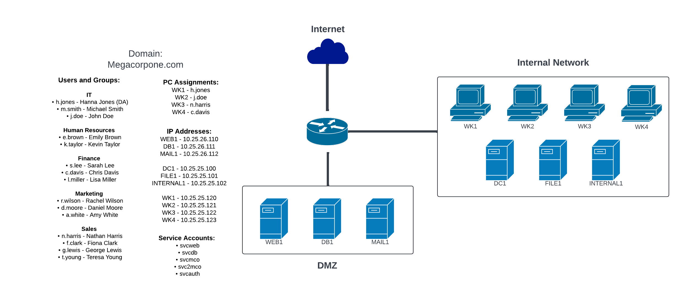

# Module 13: Incident Response Challenge Labs

## IR-200 Challenge Lab 1

### Lab Environment

<figure><figcaption>
Megacorp One Network Topology
</figcaption></figure>

* DEV - Development Machine for Defensive Teams
* SPLUNK - [_Splunk_](https://www.splunk.com/en_us/products/splunk-enterprise.html) SIEM
* FILE1 - SMB Shares for departmental file storage
* INTERNAL1 - Enterprise Applications
* DC1 - Domain Controller for the Megacorp One Active Directory Domain
* WK1 - _h.jones_ (IT and Domain Admin)
* WK2 - _e.brown_ (Human Resources)
* WK3 - _n.harris_ (Sales)
* WK4 - _c.davis_ (Finance)

### Incident Information

_**Phase 1** begins when the SOC team notices that several Splunk alerts have been triggered. They escalate the situation to you, a member of the Incident Response team. Your task is to review the triggered alerts, determine which are false positives, and identify the one(s) requiring detailed investigation._

_**Phase 2** involves performing a forensic analysis on a disk image provided by a colleague from another branch of the company's Incident Response team. Based on their analysis, the disk image may contain the key to decrypt all files affected by a ransomware attack in their branch._

## Scoring Mechanism

_Enter required information via the flags.exe to get a hash. If it matches one of their provided 10, enter it as the answer._

## Next Steps

_Do the Challenge Lab and take the exam._
