# Module 8: Digital Forensics for Incident Responders

Fundamentals of Digital Evidence Handling

### Importance of Evidence Handling

Failing to handle evidence properly can result in the integrity of the evidence bein compromised or become untrustworthy.

### Evidence Collection and Preservation

1. Identify potential sources of digital evidence.
2. Gather content, and metadata.
   1. Limit interactino with media that may contain digital evidence to avoid altering the original data.
3. Maintain integrity via cryptographic hashes for validation.
4. Use a hardware write blocker when duplicating data.
5. Store evidence securely.
6. Protect sensitive data/digital evidence via encryption.
7. Control and monitor chain of custody.

### Kali Linux Forensics Mode

Kali live has a boot option for forensics mode which protects from writing/modifying contents of the hard drive(s). It also has auto-mounting disabled.

_Capturing a disk image using dd_


```bash
┌──(kali㉿kali)-[~]
└─$ sudo dd if=/dev/nvme0n1 of=/mnt/external/VICTIM-OS.raw bs=4M conv=sync,noerror status=progress
587202560 bytes (587 MB, 560 MiB) copied, 14 s, 41.6 MB/s
```



| Option                           | Explanation                                                                                                                                               |
| -------------------------------- | --------------------------------------------------------------------------------------------------------------------------------------------------------- |
| `if=/dev/nvme0n1`                | This specifies the input file.                                                                                                                            |
| `of=/mnt/external/VICTIM-OS.raw` | This specifies the output file.                                                                                                                           |
| `bs=4M`                          | This specifies the size of each block.                                                                                                                    |
| `conv=sync,noerror`              | This is specifying that if there is a read error, pad the output block with null bytes to "sync" with the original device. If there are errors, continue. |
| `status=progress`                | Display a visual status of the progress of the image copy.                                                                                                |

`sha256sum` can be used to obtain a sha256 hash of the resulting image.

### Legal and Procedural Aspects of Evidence Handling


Prominent resource by IETF


It is suggested that evidence is gathered in this order, with most volatile being first:

* Registers, cache
* Routing table, ARP cache, process table, kernel statistics, memory
* Temporary file systems
* Disk
* Remote logging and monitoring data that is relevant to the system in question
* Physical configuration, network topology
* Archival media

A very detailed, standardized, and methodical approach is provided in ISO 27037:



### Response Kits

Bare minimum necessities:

* Administrative Documents
* Hard Drive Cloner/Eraser
* Storage Devices
* SSD/HDD Converters
* Laptop
* Forensics Tools

## Forensic Tools and Techniques

### Computer Forensics

* Disk imaging
  * Offline imaging
  * Live imaging
  * remote imaging
  * VM imaging

<figure><figcaption><p>Creating a new Case in Autopsy</p></figcaption></figure>

<figure><figcaption><p>Adding a Data Source in Autopsy Step 1</p></figcaption></figure>

<figure>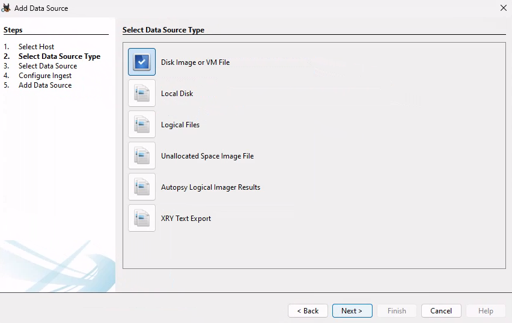<figcaption><p>Adding a Data Source in Autopsy Step 2</p></figcaption></figure>

<figure><figcaption><p>Adding a Data Source in Autopsy Step 3</p></figcaption></figure>

<figure><figcaption><p>Adding a Data Source in Autopsy Step 4</p></figcaption></figure>

<figure><figcaption><p>Adding a Data Source in Autopsy Step 5</p></figcaption></figure>

<figure>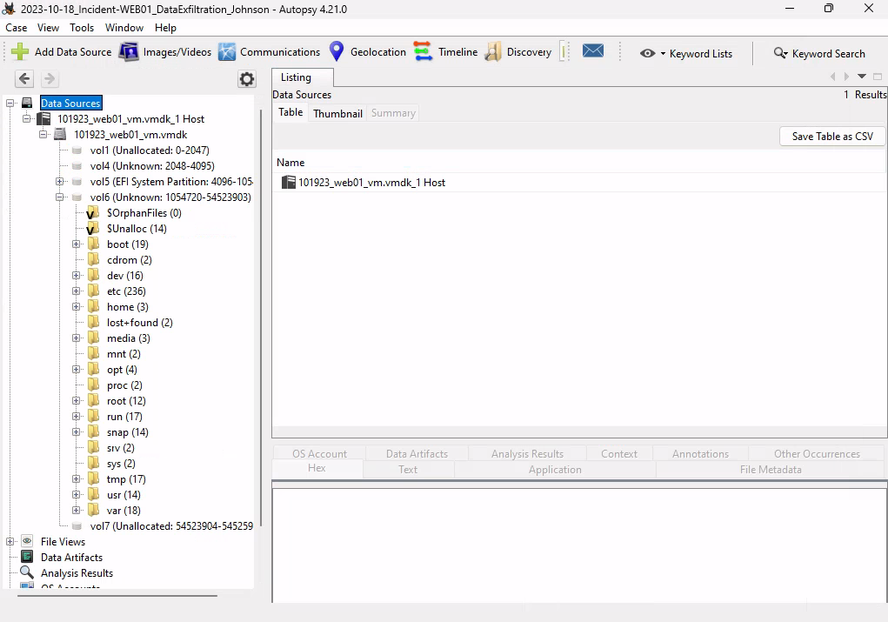<figcaption><p>File System of WEB01</p></figcaption></figure>

<figure>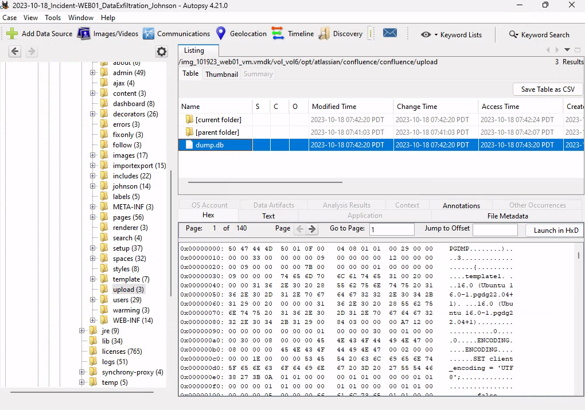<figcaption><p>Navigating to the database file dump.db</p></figcaption></figure>

<figure><figcaption><p>Creating a Timeline</p></figcaption></figure>

<figure>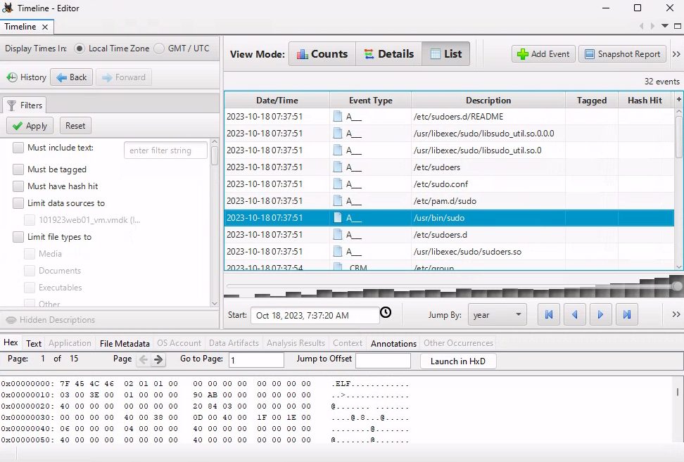<figcaption><p>Analyzing the Timeline</p></figcaption></figure>

<figure>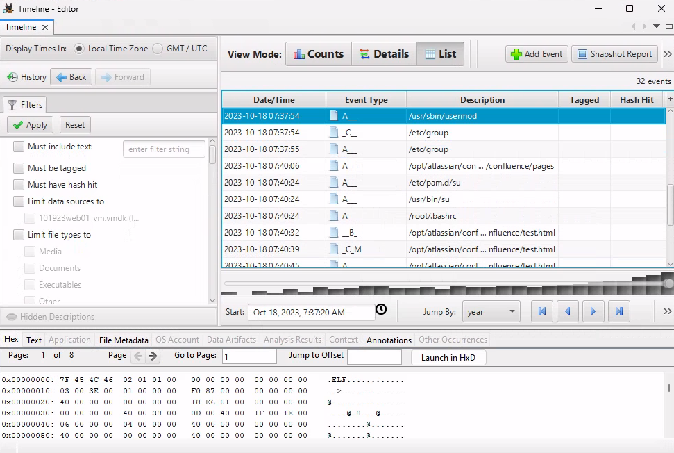<figcaption><p>Following the activities in the Timeline</p></figcaption></figure>

### Memory Forensics

_Using volatility to perform some memory forensics._

_Displaying Windows Information with Volatility3:_


```powershell
PS C:\Tools\volatility3> python vol.py -f E:\memdump.mem windows.info
Volatility 3 Framework 2.5.0
Progress:  100.00               PDB scanning finished                        
Variable        Value

Kernel Base     0xf80621600000
DTB     0x1ae000
Symbols file:///home/kali/volatility3-2.5.0/volatility3/symbols/windows/ntkrnlmp.pdb/CF32DE2E4A334C7C06FB63FCB6FAFB5C-1.json.xz
Is64Bit True
IsPAE   False
layer_name      0 WindowsIntel32e
memory_layer    1 FileLayer
KdVersionBlock  0xf806222099a0
Major/Minor     15.22621
MachineType     34404
KeNumberProcessors      2
SystemTime      2023-11-15 15:45:06
NtSystemRoot    C:\Windows
NtProductType   NtProductWinNt
NtMajorVersion  10
NtMinorVersion  0
PE MajorOperatingSystemVersion  10
PE MinorOperatingSystemVersion  0
PE Machine      34404
PE TimeDateStamp        Tue Jun 17 09:32:46 2036
```


_Displaying Networking Information with Volatility3_


```powershell
PS C:\Tools\volatility3> python vol.py -f E:\memdump.mem windows.netstat.NetStat
Volatility 3 Framework 2.5.0
Progress:  100.00               PDB scanning finished                        
Offset  Proto   LocalAddr       LocalPort       ForeignAddr     ForeignPort     State   PID     Owner   Created

0xe38e07e278a0  TCPv4   172.16.50.92    49917   192.229.211.108 80      ESTABLISHED     -       -       N/A
0xe38e07e148a0  TCPv4   172.16.50.92    49903   192.229.211.108 80      ESTABLISHED     -       -       N/A
0xe38e08c51010  TCPv4   172.16.50.92    49850   52.226.139.180  443     ESTABLISHED     -       -       N/A
0xe38e06d08aa0  TCPv4   172.16.50.92    49790   172.16.50.80    389     ESTABLISHED     -       -       N/A
0xe38e0657a490  TCPv4   172.16.50.92    49718   172.16.50.80    389     ESTABLISHED     -       -       N/A
0xe38e06586520  TCPv4   172.16.50.92    49763   192.168.48.130  443     ESTABLISHED     -       -       N/A
...
```



Advanced C2 frameworks such as Cobalt Strike or Sliver typically use beacons instead of fully-fledged reverse shells that maintain a permanent connection to the attacker's infrastructure. If the memory dump wasn't created at the exact moment the beacon check-in was performed, NetStat will not show this connection.


_Displaying Process Tree Information with Volatility3_


```powershell
PS C:\Tools\volatility3> python vol.py -f E:\memdump.mem windows.pstree.PsTree

Volatility 3 Framework 2.5.0
Progress:  100.00               PDB scanning finished                        
PID     PPID    ImageFileName   Offset(V)       Threads Handles SessionId       Wow64   CreateTime      ExitTime

4       0       System  0xe38e038ec040  174     -       N/A     False   2023-11-15 15:37:13.000000      N/A
* 380   4       smss.exe        0xe38e0566e040  2       -       N/A     False   2023-11-15 15:37:13.000000      N/A
...
684     580     winlogon.exe    0xe38e06533080  2       -       1       False   2023-11-15 15:37:20.000000      N/A
* 5552  684     userinit.exe    0xe38e0891c080  0       -       1       False   2023-11-15 15:37:36.000000      2023-11-15 15:38:00.000000 
** 5580 5552    explorer.exe    0xe38e089450c0  74      -       1       False   2023-11-15 15:37:37.000000      N/A
*** 8768        5580    application_bu  0xe38e09306080  2       -       1       False   2023-11-15 15:38:19.000000      N/A
**** 8904       8768    cmd.exe 0xe38e091aa080  1       -       1       False   2023-11-15 15:38:29.000000      N/A
***** 8912      8904    conhost.exe     0xe38e085020c0  4       -       1       False   2023-11-15 15:38:29.000000      N/A
***** 9032      8904    powershell.exe  0xe38e0955c080  12      -       1       False   2023-11-15 15:38:38.000000      N/A
...
6412    3416    FTK Imager.exe  0xe38e092f3080  23      -       1       False   2023-11-15 15:40:20.000000      N/A
```


### Network Forensics

Useful sources:

* Netflow data
* Full Packet Capture (FPC)

<figure>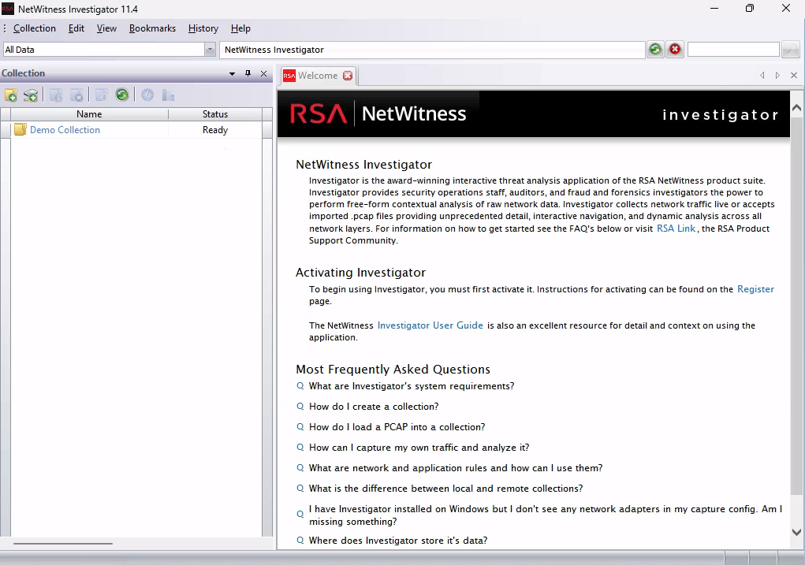<figcaption><p>Starting NetWitness Investigator</p></figcaption></figure>

<figure>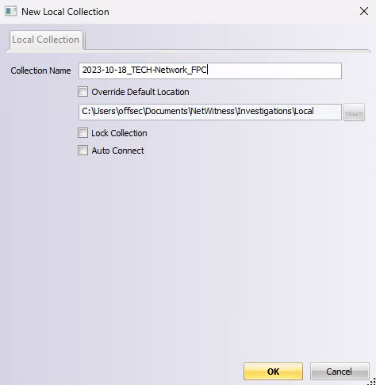<figcaption><p>Creating a new Local Connection</p></figcaption></figure>

<figure>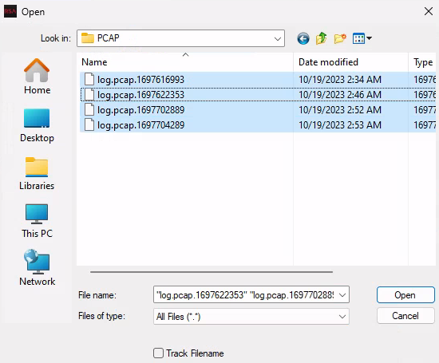<figcaption><p>Selecting the PCAP files recorded on IDS01</p></figcaption></figure>

<figure>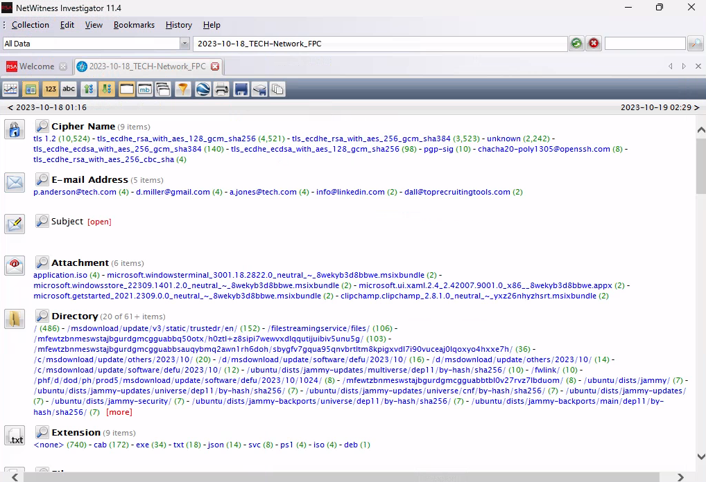<figcaption><p>Values identified by NetWitness Investigator</p></figcaption></figure>

<figure>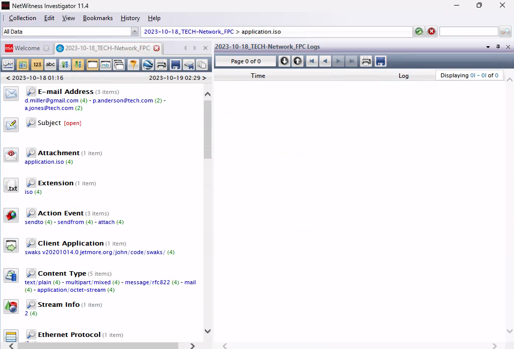<figcaption><p>Reviewing Attachments</p></figcaption></figure>

<figure>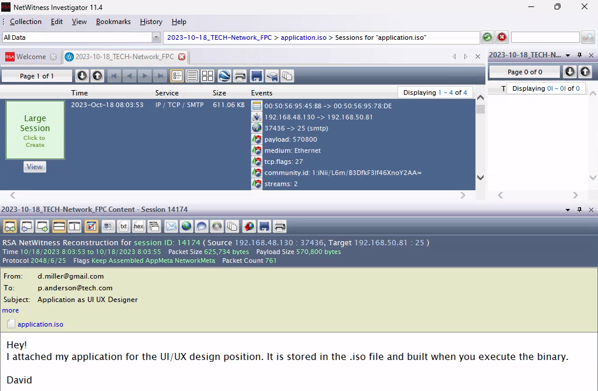<figcaption><p>Analyzing one of the phishing emails</p></figcaption></figure>

### Log Forensics

_We already did this earlier via Splunk. Do it again._

## Malware Analysis

### Basic Static Analysis

<figure>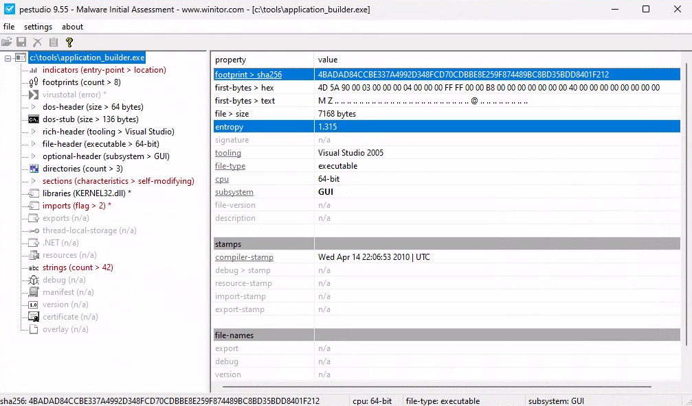<figcaption><p>Loaded Binary in pestudio</p></figcaption></figure>

_PowerShell Script to calculate Shannon's Entropy for all .exe files in a specified directory_


```powershell
function Get-FileEntropy {
    param ([string]$FilePath)

    $bytes = [System.IO.File]::ReadAllBytes($FilePath)
    $freq = @{}
    $bytes | ForEach-Object { $freq[$_] = $freq[$_]+1 }
    $entropy = 0
    $freq.Values | ForEach-Object {
        $p = $_ / $bytes.Length
        $entropy -= $p * [Math]::Log($p, 2)
    }
    $entropy
}

$dir = "C:\Tools\"
Get-ChildItem -Path $dir -Filter "*.exe" | ForEach-Object {
    Write-Host "$($_.Name) entropy: $(Get-FileEntropy $_.FullName)"
}
```


<figure><figcaption><p>Searching for the hash in VirusTotal</p></figcaption></figure>

<figure>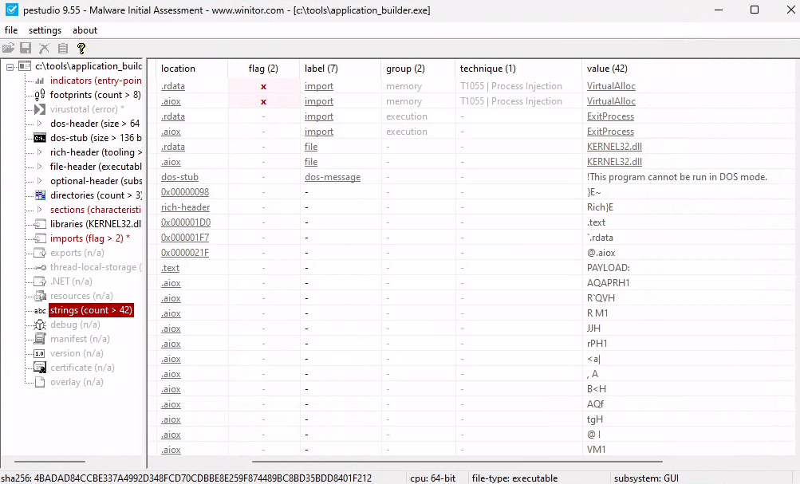<figcaption><p>String Analysis in PEStudio</p></figcaption></figure>

<figure>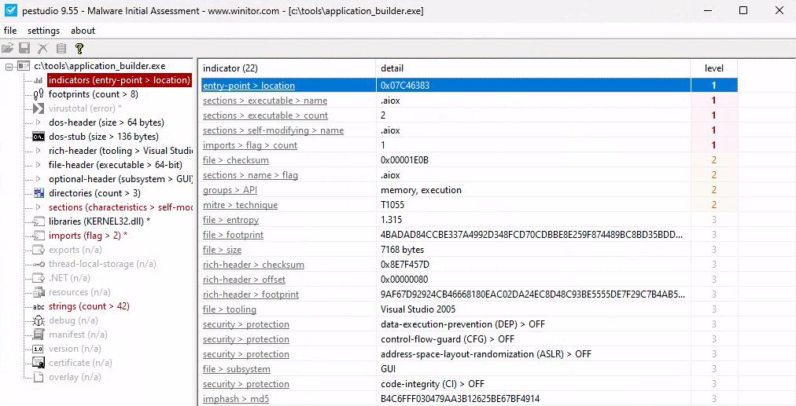<figcaption><p>Analysis of Indicators</p></figcaption></figure>

### Basic Dynamic Analysis


It is **critical** that your system is isolated before executing potentially destructive binaries.


<figure>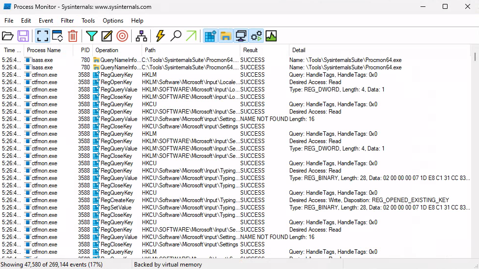<figcaption><p>ProcMon displaying numerous events</p></figcaption></figure>

<figure>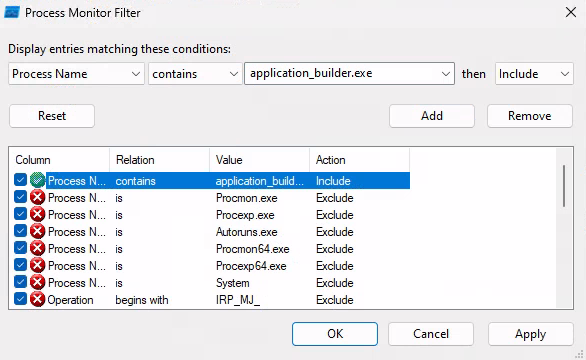<figcaption><p>Creating a ProcMon filter</p></figcaption></figure>

_Starting the binary application\_builder.exe in PowerShell_

```powershell
PS C:\Tools> .\application_builder.exe
```

<figure>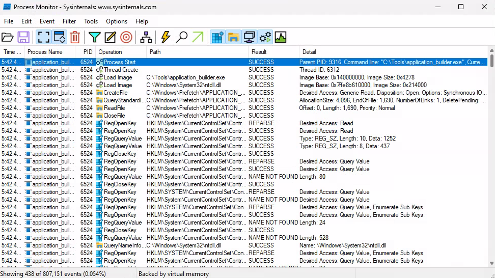<figcaption><p>ProcMon shows events related to the started binary</p></figcaption></figure>

<figure>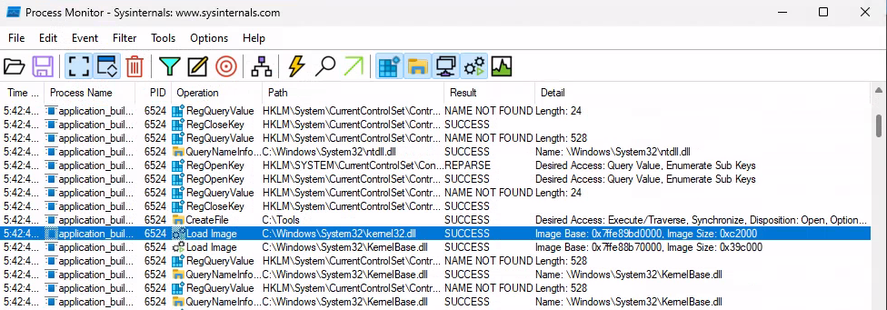<figcaption><p>The binary loads kernel32.dll</p></figcaption></figure>

<figure>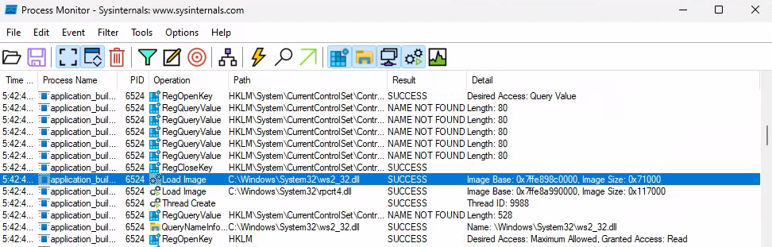<figcaption><p>The binary loads ws2_32.dll</p></figcaption></figure>

<figure>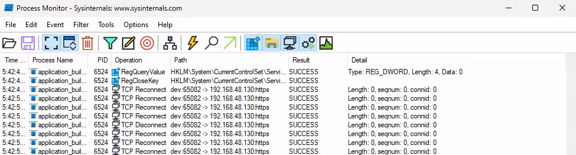<figcaption><p>The binary attempts network connections to 192.168.48.130</p></figcaption></figure>

### Automated Analysis

_Use tools like_ [_VirusTotal_](https://www.virustotal.com/gui/home/upload)_,_ [_ANY.RUN_](https://any.run/)_,_ [_Hybrid Analysis_](https://www.hybrid-analysis.com/)_,_ [_Joe Sandbox Cloud's Community Edition_](https://www.joesandbox.com/#windows)_,_ [_Cuckoo Sandbox_](https://github.com/cuckoosandbox/cuckoo)_, etc. If they have APIs, you can automate this even further._
