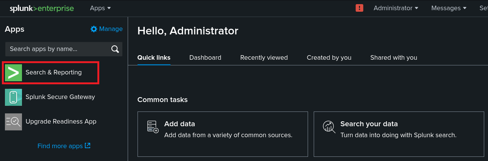
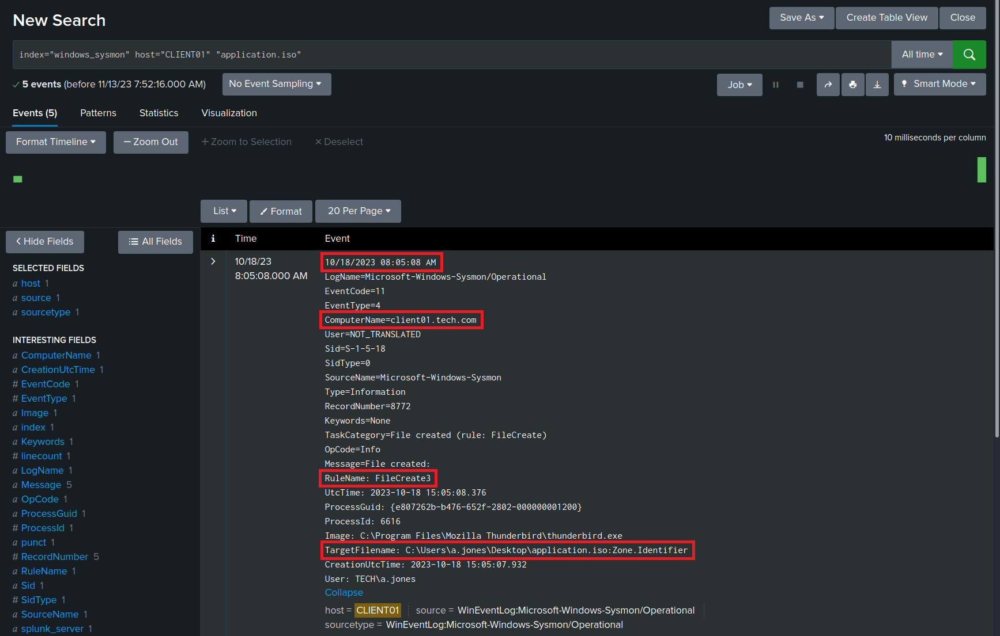
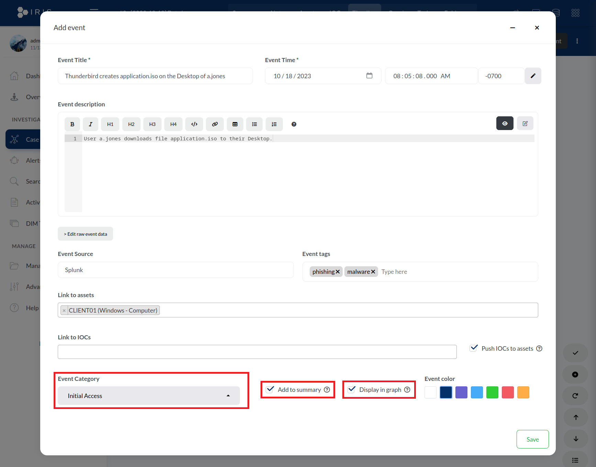
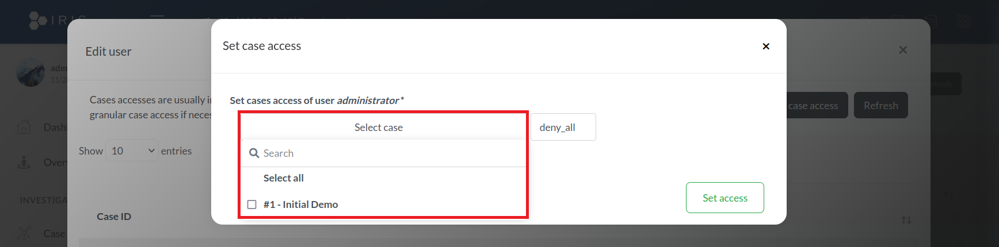

# Module 9: Incident Response Case Management

## Creating and Managing Incident Cases

### Following Along

_Just a section for starting the VM group._

### Introducing IRIS for Case Management

<figure><figcaption><p>The IRIS login page</p></figcaption></figure>

<figure><figcaption><p>The IRIS dashboard</p></figcaption></figure>

<figure><figcaption><p>Navigating to the customer management page</p></figcaption></figure>

<figure><figcaption><p>The Customer management page</p></figcaption></figure>

<figure><figcaption><p>Entering our customer's information</p></figcaption></figure>

<figure><figcaption><p>Our new customer</p></figcaption></figure>

<figure><figcaption><p>The IRIS dashboard and Add Case button</p></figcaption></figure>

<figure><figcaption><p>The fields for adding a new case in IRIS</p></figcaption></figure>

<figure><figcaption><p>The Select customer dropdown</p></figcaption></figure>

<figure><figcaption><p>Some of the options under Select classification</p></figcaption></figure>

<figure><figcaption><p>All of the fields in our new case</p></figcaption></figure>

<figure><figcaption><p>Successful case creation message</p></figcaption></figure>

<figure><figcaption><p>Our new case in list of open cases</p></figcaption></figure>

<figure><figcaption><p>The page for our case</p></figcaption></figure>

### Adding Assets

<figure><figcaption><p>The Assets tab</p></figcaption></figure>

<figure><figcaption><p>The fields to add an asset</p></figcaption></figure>

<figure><figcaption><p>Available asset types</p></figcaption></figure>

<figure><figcaption><p>Available compromise statuses</p></figcaption></figure>

<figure><figcaption><p>Available analysis statuses</p></figcaption></figure>

<figure><figcaption><p>All the fields for our new asset</p></figcaption></figure>

<figure><figcaption><p>Our new asset in the list of assets</p></figcaption></figure>

### Creating a Timeline

<figure><figcaption><p>Navigating to the search feature in Splunk</p></figcaption></figure>

<figure><figcaption><p>Querying for our event in Splunk</p></figcaption></figure>

<figure><figcaption><p>The Timeline tab in IRIS</p></figcaption></figure>

<figure><figcaption><p>The fields to add an event in IRIS</p></figcaption></figure>

<figure><figcaption><p>Specifying our event's time</p></figcaption></figure>

<figure><figcaption><p>Expanding our Splunk log</p></figcaption></figure>

<figure><figcaption><p>Opening the raw log</p></figcaption></figure>

<figure><figcaption><p>Locating our raw log</p></figcaption></figure>

<figure><figcaption><p>Pasting our raw log into IRIS</p></figcaption></figure>

<figure><figcaption><p>Linking our event to an asset</p></figcaption></figure>

<figure><figcaption><p>The event category options in IRIS</p></figcaption></figure>

<figure><figcaption><p>All of our fields to add our event</p></figcaption></figure>

<figure><figcaption><p>Our new event in the timeline</p></figcaption></figure>

### Adding Evidence

_Email evidence in lab scenario:_


```splunk-spl
Return-Path: d.miller@gmail.com
Received: from kali (Unknown [172.16.50.254])
	by mail01.tech.com with ESMTP
	; Wed, 18 Oct 2023 08:04:04 -0700
Date: Wed, 18 Oct 2023 11:04:03 -0400
To: a.jones@tech.com
From: d.miller@gmail.com
Subject: Application as UI UX Designer
Message-Id: <20231018110403.1751702@kali>
X-Mailer: swaks v20201014.0 jetmore.org/john/code/swaks/
MIME-Version: 1.0
Content-Type: multipart/mixed; boundary="----=_MIME_BOUNDARY_000_1751702"

------=_MIME_BOUNDARY_000_1751702
Content-Type: text/plain

Hey!
I attached my application for the UI/UX design position. It is stored in the .iso file and built when you execute the binary.

David

------=_MIME_BOUNDARY_000_1751702
Content-Type: application/octet-stream; name="application.iso"
Content-Description: application.iso
Content-Disposition: attachment; filename="application.iso"
Content-Transfer-Encoding: BASE64

AAAAAAAAAAAAAAAAAAAAAAAAAAAAAAAAAAAAAAAAAAAAAAAAAAAAAAAAAAAAAAAAAAAAAAAAAAAA
AAAAAAAAAAAAAAAAAAAAAAAAAAAAAAAAAAAAAAAAAAAAAAAAAAAAAAAAAAAAAAAAAAAAAAAAAAAA
AAAAAAAAAAAAAAAAAAAAAAAAAAAAAAAAAAAAAAAAAAAAAAAAAAAAAAAAAAAAAAAAAAAAAAAAAAAA
AAAAAAAAAAAAAAAAAAAAAAAAAAAAAAAAAAAAAAAAAAAAAAAAAAAAAAAAAAAAAAAAAAAAAAAAAAAA
AAAAAAAAAAAAAAAAAAAAAAAAAAAAAAAAAAAAAAAAAAAAAAAAAAAAAAAAAAAAAAAAAAAAAAAAAAAA
AAAAAAAAAAAAAAAAAAAAAAAAAAAAAAAAAAAAAAAAAAAAAAAAAAAAAAAAAAAAAAAAAAAAAAAAAAAA
...(CUT)...
```


<figure><figcaption><p>The datastore icon</p></figcaption></figure>

<figure><figcaption><p>The Summary tab</p></figcaption></figure>

<figure><figcaption><p>Adding a file</p></figcaption></figure>

<figure><figcaption><p>The fields to upload a file</p></figcaption></figure>

<figure><figcaption><p>All of the fields to upload evidence filled out</p></figcaption></figure>

<figure><figcaption><p>Our file in the datastore</p></figcaption></figure>

<figure><figcaption><p>Our file under the Evidences tab</p></figcaption></figure>

### Communicating and Collaborating

<figure><figcaption><p>Adding a comment to an event</p></figcaption></figure>

<figure><figcaption><p>A series of comments on the event</p></figcaption></figure>

<figure><figcaption><p>The tasks tab</p></figcaption></figure>

<figure><figcaption><p>The fields to create a task</p></figcaption></figure>

<figure><figcaption><p>Our new task</p></figcaption></figure>

<figure><figcaption><p>Navigating to Access control</p></figcaption></figure>

<figure><figcaption><p>Managing user access</p></figcaption></figure>

<figure><figcaption><p>The access of the administrator user</p></figcaption></figure>

<figure><figcaption><p>The case options</p></figcaption></figure>

<figure><figcaption><p>Access type options</p></figcaption></figure>

<figure><figcaption><p>Managing group access</p></figcaption></figure>

### Generating a Report

<figure><figcaption><p>Navigating to report templates</p></figcaption></figure>

<figure><figcaption><p>Report templates list</p></figcaption></figure>

<figure><figcaption><p>Downloading the report templates</p></figcaption></figure>

<figure><figcaption><p>The cover page of the report templates</p></figcaption></figure>

<figure><figcaption><p>The asset list in the report templates</p></figcaption></figure>

<figure><figcaption><p>Our case's Summary tab</p></figcaption></figure>

<figure><figcaption><p>Generating and downloading our report template</p></figcaption></figure>

<figure><figcaption><p>The cover page of our report</p></figcaption></figure>

<figure><figcaption><p>The asset list in our report</p></figcaption></figure>

### Closing a Case and Case Retention

<figure><figcaption><p>The Manage button</p></figcaption></figure>

<figure><figcaption><p>Editing the case</p></figcaption></figure>

<figure><figcaption><p>Editing the Outcome of the case</p></figcaption></figure>

<figure><figcaption><p>Closing the case </p></figcaption></figure>

<figure><figcaption><p>Our closed case</p></figcaption></figure>

_Becoming the root user on the IRIS server_

```bash
offsec@iris01:~$ sudo su
[sudo] password for offsec:

root@iris01:/home/offsec# cd /root/iris-web/
```

_IRIS case database backup step_


```bash
root@iris01:~/iris-web# docker container ls | grep iriswebapp_db
cd41ed129c5f   iriswebapp_db:v2.3.3           "docker-entrypoint.s..."   6 weeks ago   Up 5 weeks             127.0.0.1:5432->5432/tcp

root@iris01:~/iris-web# docker exec cd41ed129c5f pg_dump -U postgres iris_db | gzip > ../iris_db_backup.gz
```


## Creating a Case Based on Our Lab Incident

### Creating a Case For Our Incident

_Do it all again for the lab._

### Adding Our Compromised and Investigated Assets

_Do it all again for the lab._

### Creating a Timeline Based on What We Know

_Do it all again for the lab._

### Adding Evidence from Our Investigation

_Do it all again for the lab._
