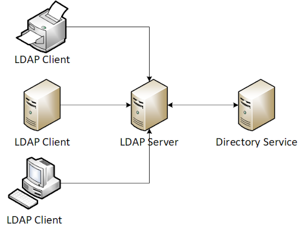

# Module 21: Active Directory Introduction and Enumeration

### Active Directory - Introduction

#### Enumeration - Defining our Goals

Context for following sections.

### Active Directory - Manual Enumeration

#### Active Directory - Enumeration Using Legacy Windows Tools

Some low-hanging fruit in terms of enumeration:

```batch
C:\Users\stephanie> net user /domain
C:\Users\stephanie> net user <username> /domain
C:\Users\stephanie> net group /domain
C:\Users\stephanie> net group "<group_name>" /domain
```

#### Enumerating Active Directory using PowerShell and .NET Classes

LDAP path format:

```powershell
LDAP://HostName[:PortNumber][/DistinguishedName]
```

It's best to find the Primary Domain Controller -- the DC holding the most updated information. Only one of these can exist in a domain. To find this, we must find the DC holdin the _PdcRoleOwner_ property.

An example DistinguishedName:

```vbnet
CN=Stephanie,CN=Users,DC=corp,DC=com
```

The newly introduced _CN_ is the _Common Name_ which specifies the identifier of an object in the domain. DC in this context (when referring to a Distinguished Name) means _Domain Component_.\
When reading these kinds of entries, you start from the right: `DC=corp,DC=com` refers to the top of an LDAP tree. It is the Distinguished Named of the domain itself.&#x20;

Next, is `CN=Users` which is the Common Name of the container where the user object is stored. i.e. parent container. Lastly is `CN=Stephanie` which is the Common Name for the object itself.

Invoking the _Domain Class_ and the _GetCurrentDomain_ method:


```powershell
PS C:\Users\stephanie> [System.DirectoryServices.ActiveDirectory.Domain]::GetCurrentDomain()

Forest                  : corp.com
DomainControllers       : {DC1.corp.com}
Children                : {}
DomainMode              : Unknown
DomainModeLevel         : 7
Parent                  :
PdcRoleOwner        : DC1.corp.com
RidRoleOwner            : DC1.corp.com
InfrastructureRoleOwner : DC1.corp.com
Name                  	: corp.com
```


To automate our script to find the PDC, we'll begin the script as so:

```powershell
# Store the domain object in the $domainObj variable
$domainObj = [System.DirectoryServices.ActiveDirectory.Domain]::GetCurrentDomain()

# Print the variable
$domainObj
```

Because $domainObj will contain all the information, we'll single out the PdcRoleOwner:

```powershell
# Store the domain object in the $domainObj variable
$domainObj = [System.DirectoryServices.ActiveDirectory.Domain]::GetCurrentDomain()

# Store the PdcRoleOwner name to the $PDC variable
$PDC = $domainObj.PdcRoleOwner.Name

# Print the $PDC variable
$PDC
```

Now we want to grab the DN:

```powershell
# Store the domain object in the $domainObj variable
$domainObj = [System.DirectoryServices.ActiveDirectory.Domain]::GetCurrentDomain()

# Store the PdcRoleOwner name to the $PDC variable
$PDC = $domainObj.PdcRoleOwner.Name

# Store the Distinguished Name variable into the $DN variable
$DN = ([adsi]'').distinguishedName

# Print the $DN variable
$DN
```

Finally, let's build the LDAP path:


```powershell
$PDC = [System.DirectoryServices.ActiveDirectory.Domain]::GetCurrentDomain().PdcRoleOwner.Name
$DN = ([adsi]'').distinguishedName 
$LDAP = "LDAP://$PDC/$DN"


```


#### Adding Search Functionality to our Script

Using the _DirectoryEntry_ and _DirectorySearcher_ classes to build in a search to the script:


```powershell
$PDC = [System.DirectoryServices.ActiveDirectory.Domain]::GetCurrentDomain().PdcRoleOwner.Name
$DN = ([adsi]'').distinguishedName 
$LDAP = "LDAP://$PDC/$DN"

$direntry = New-Object System.DirectoryServices.DirectoryEntry($LDAP)

$dirsearcher = New-Object System.DirectoryServices.DirectorySearcher($direntry)
$dirsearcher.FindAll()
```


Enumerating all users via the _samAccountType_ 0x30000000 (decimal 805306368):


```powershell
$PDC = [System.DirectoryServices.ActiveDirectory.Domain]::GetCurrentDomain().PdcRoleOwner.Name
$DN = ([adsi]'').distinguishedName 
$LDAP = "LDAP://$PDC/$DN"

$direntry = New-Object System.DirectoryServices.DirectoryEntry($LDAP)

$dirsearcher = New-Object System.DirectoryServices.DirectorySearcher($direntry)
$dirsearcher.filter="samAccountType=805306368"
$dirsearcher.FindAll()
```


Iterating through each found user, displaying their attributes:

```powershell
$domainObj = [System.DirectoryServices.ActiveDirectory.Domain]::GetCurrentDomain()
$PDC = $domainObj.PdcRoleOwner.Name
$DN = ([adsi]'').distinguishedName 
$LDAP = "LDAP://$PDC/$DN"

$direntry = New-Object System.DirectoryServices.DirectoryEntry($LDAP)

$dirsearcher = New-Object System.DirectoryServices.DirectorySearcher($direntry)
$dirsearcher.filter="samAccountType=805306368"
$result = $dirsearcher.FindAll()

Foreach($obj in $result)
{
    Foreach($prop in $obj.Properties)
    {
        $prop
    }

    Write-Host "-------------------------------"
}
```

Turning the functionality of our script into a function:


```powershell
function LDAPSearch {
    param (
        [string]$LDAPQuery
    )

    $PDC = [System.DirectoryServices.ActiveDirectory.Domain]::GetCurrentDomain().PdcRoleOwner.Name
    $DistinguishedName = ([adsi]'').distinguishedName

    $DirectoryEntry = New-Object System.DirectoryServices.DirectoryEntry("LDAP://$PDC/$DistinguishedName")

    $DirectorySearcher = New-Object System.DirectoryServices.DirectorySearcher($DirectoryEntry, $LDAPQuery)

    return $DirectorySearcher.FindAll()

}
```


Examples calling the newly revised script:


```powershell
PS C:\Users\stephanie> Import-Module .\function.ps1
PS C:\Users\stephanie> LDAPSearch -LDAPQuery "(samAccountType=805306368)"
PS C:\Users\stephanie> LDAPSearch -LDAPQuery "(objectclass=group)"
PS C:\Users\stephanie> $sales = LDAPSearch -LDAPQuery "(&(objectCategory=group)(cn=Sales Department))"
PS C:\Users\stephanie> $sales.properties.member
PS C:\Users\stephanie> $group = LDAPSearch -LDAPQuery "(&(objectCategory=group)(cn=Development Department*))"
PS C:\Users\stephanie> $group.properties.member
PS C:\Users\stephanie\Desktop> $group = LDAPSearch -LDAPQuery "(&(objectCategory=group)(cn=Management Department*))"
PS C:\Users\stephanie\Desktop> $group.properties.member
CN=jen,CN=Users,DC=corp,DC=com
```


#### AD Enumeration with PowerView


PowerView docs


PowerView is a powerful PowerShell script with many functions to improve the effectiveness of our enumeration.

```powershell
PS C:\Tools> Import-Module .\PowerView.ps1

# Useful commands
PS C:\Tools> Get-NetDomain
PS C:\Tools> Get-NetUser
PS C:\Tools> Get-NetUser | Select cn,pwdlastset,lastlogon
PS C:\Tools> Get-NetGroup | select cn
PS C:\Tools> Get-NetGroup "Sales Department" | Select member
```

### Manual Enumeration - Expanding our Repertoire

#### Enumerating Operating Systems

Still using PowerView to enumerate:

```powershell
PS C:\Tools> Get-NetComputer
PS C:\Tools> Get-NetComputer | Select operatingsystem,dnshostname
```

#### Getting an Overview - Permissions and Logged on Users

PowerView's _Find-LocalAdminAccess_ scans the network in an attempt to determine if our current user has administrative permissions on any computers in the domain. This command relies on the _OpenServiceW_ function which connects to the _Service Control Manager (SCM)_ on the target machines. SCM essentially maintains a database of installed services/drivers on Windows computers. PowerView will attempt to open this database with the _SC\_MANAGER\_ALL\_ACCESS_ access right, which requires administrative privileges.

Gathering currently logged on users of remote machines:

<pre class="language-powershell" data-overflow="wrap"><code class="lang-powershell">PS C:\Tools> Find-LocalAdminAccess
client74.corp.com

PS C:\Tools> Get-NetSessions -ComputerName files04
<strong>
</strong># We don't always have permissions and newer Windows versions tend to limit access via Get-NetSessions. In this case we'll use PsLoggedOn from SysInternals.
PS C:\Tools\PSTools> .\PsLoggedOn.exe \\files04
Users logged on locally:
     &#x3C;unknown time>             CORP\jeff
Unable to query resource logons
</code></pre>

#### Enumeration Through Service Principal Names

Enumerating SPNs in a domain:

```batch
: Using a binary available by default on Windows
C:\Tools> setspn -L iis_service
```

<pre class="language-powershell"><code class="lang-powershell"><strong># Using PowerView
</strong>PS C:\Tools> Get-NetUser -SPN | select samaccountname,serviceprincipalname
samaccountname serviceprincipalname
-------------- --------------------
krbtgt         kadmin/changepw
iis_service    {HTTP/web04.corp.com, HTTP/web04, HTTP/web04.corp.com:80}
</code></pre>

#### Enumerating Object Permissions

Querying ACEs with PowerView:

```powershell
PS C:\Tools> Get-ObjectAcl -Identity stephanie
```

Converting SIDs to names via PowerView:

```powershell
PS C:\Tools> Convert-SidToName S-1-5-21-1987370270-658905905-1781884369-1104
CORP\stephanie

PS C:\Tools> Convert-SidToName S-1-5-21-1987370270-658905905-1781884369-553
CORP\RAS and IAS Servers
```

We're primarily interested in the _ActiveDirectoryRights_ and _SecurityIdentifier_ for each object enumerated. The highest permission we can have on an object is _GenericAll_.

Filtering for the **ActiveDirectoryRights** property of the Management Department group, only displaying objects that have **GenericAll** permission on it.


```powershell
PS C:\Tools> Get-ObjectAcl -Identity "Management Department" | ? {$_.ActiveDirectoryRights -eq "GenericAll"} | select SecurityIdentifier,ActiveDirectoryRights

SecurityIdentifier                            ActiveDirectoryRights
------------------                            ---------------------
S-1-5-21-1987370270-658905905-1781884369-512             GenericAll
S-1-5-21-1987370270-658905905-1781884369-1104            GenericAll
S-1-5-32-548                                             GenericAll
S-1-5-18                                                 GenericAll
S-1-5-21-1987370270-658905905-1781884369-519             GenericAll

PS C:\Tools> "S-1-5-21-1987370270-658905905-1781884369-512","S-1-5-21-1987370270-658905905-1781884369-1104","S-1-5-32-548","S-1-5-18","S-1-5-21-1987370270-658905905-1781884369-519" | Convert-SidToName
CORP\Domain Admins
CORP\stephanie
BUILTIN\Account Operators
Local System
CORP\Enterprise Admins
```


#### Enumerating Domain Shares

Enumeration with PowerView:

```powershell
PS C:\Tools> Find-DomainShare
# We could use the -CheckShareAccess flag to display shares only available to us too.
```

Start by enumerating sysvol shares as it may include files/folders that reside on the DC itself. This share is typically used for various domain policies and scripts. By default this share is mapped to **%SystemRoot%\SYSVOL\Sysvol\\\<domain-name>**. Historically, sysadmins would change local workstation passwords through _Group Policy Preferences (GPP)_. These GPP-stored passwords are encrypted with AES-256, but the private key has been posted on [MSDN](https://learn.microsoft.com/en-us/openspecs/windows\_protocols/ms-gppref/2c15cbf0-f086-4c74-8b70-1f2fa45dd4be?redirectedfrom=MSDN#endNote2). This key can thus be used to decrypt the encrypted passwords found.


The 32-byte AES key is as follows:

```
 4e 99 06 e8  fc b6 6c c9  fa f4 93 10  62 0f fe e8
 f4 96 e8 06  cc 05 79 90  20 9b 09 a4  33 b6 6c 1b
```


```bash
kali@kali:~$ gpp-decrypt "+bsY0V3d4/KgX3VJdO/vyepPfAN1zMFTiQDApgR92JE"
P@$$w0rd
```

### Active Directory - Automated Enumeration

#### Collecting Data with SharpHound

_SharpHound_ is the companion data collection tool to _BloodHound_. It is written in C# and uses Windows API functions and LDAP namespace functions. It is available to us in a few different formats: compiling it ourselves, using an already compiled binary, or use it as a PowerShell script.

Using SharpHound as a PowerShell script:


```powershell
PS C:\Users\stephanie> cd .\Downloads\
PS C:\Users\stephanie\Downloads> powershell -ep bypass
PS C:\Users\stephanie\Downloads> Import-Module .\Sharphound.ps1
PS C:\Users\stephanie\Downloads> Get-Help Invoke-Bloodhound
NAME
    Invoke-BloodHound

SYNOPSIS
    Runs the BloodHound C# Ingestor using reflection. The assembly is stored in this file.


SYNTAX
    Invoke-BloodHound [-CollectionMethods <String[]>] [-Domain <String>] [-SearchForest] [-Stealth] [-LdapFilter
    <String>] [-DistinguishedName <String>] [-ComputerFile <String>] [-OutputDirectory <String>] [-OutputPrefix
    <String>] [-CacheName <String>] [-MemCache] [-RebuildCache] [-RandomFilenames] [-ZipFilename <String>] [-NoZip]
    [-ZipPassword <String>] [-TrackComputerCalls] [-PrettyPrint] [-LdapUsername <String>] [-LdapPassword <String>]
    [-DomainController <String>] [-LdapPort <Int32>] [-SecureLdap] [-DisableCertVerification] [-DisableSigning]
    [-SkipPortCheck] [-PortCheckTimeout <Int32>] [-SkipPasswordCheck] [-ExcludeDCs] [-Throttle <Int32>] [-Jitter
    <Int32>] [-Threads <Int32>] [-SkipRegistryLoggedOn] [-OverrideUsername <String>] [-RealDNSName <String>]
    [-CollectAllProperties] [-Loop] [-LoopDuration <String>] [-LoopInterval <String>] [-StatusInterval <Int32>]
    [-Verbosity <Int32>] [-Help] [-Version] [<CommonParameters>]


DESCRIPTION
    Using reflection and assembly.load, load the compiled BloodHound C# ingestor into memory
    and run it without touching disk. Parameters are converted to the equivalent CLI arguments
    for the SharpHound executable and passed in via reflection. The appropriate function
    calls are made in order to ensure that assembly dependencies are loaded properly.


RELATED LINKS

REMARKS
    To see the examples, type: "get-help Invoke-BloodHound -examples".
    For more information, type: "get-help Invoke-BloodHound -detailed".
    For technical information, type: "get-help Invoke-BloodHound -full".
```


Using the _-CollectionMethod_ to gather **All** data. This will perform all collection methods except local group policies. By default, SharpHound will gather the data in JSON files and automatically zip them up for us as well:


```powershell
PS C:\Users\stephanie\Downloads> Invoke-BloodHound -CollectionMethod All -OutputDirectory C:\Users\stephanie\Desktop\ -OutputPrefix "corp audit"
PS C:\Users\stephanie\Downloads> ls C:\Users\stephanie\Desktop\
    Directory: C:\Users\stephanie\Desktop


Mode                 LastWriteTime         Length Name
----                 -------------         ------ ----
-a----         8/10/2024   8:16 PM          26255 corp audit_20240810201601_BloodHound.zip
-a----         8/10/2024   8:16 PM           2110 MTk2MmZkNjItY2IyNC00MWMzLTk5YzMtM2E1ZDcwYThkMzRl.bin
```


The **bin** cache file is used to speed up data collection. It is not needed for our analysis and can safely be deleted.

#### Analysing Data using BloodHound

To use BloodHound, we need to start the Neo4j service which is installed by default on Kali. Neo4j is essentially an open source graph database (NoSQL) that creates nodes, edges, and properties instead of simple rows & columns. This facilitates the visual representation of our collected data.

```bash
kali@kali:~$ sudo neo4j start
Directories in use:
home:         /usr/share/neo4j
config:       /usr/share/neo4j/conf
logs:         /usr/share/neo4j/logs
plugins:      /usr/share/neo4j/plugins
import:       /usr/share/neo4j/import
data:         /usr/share/neo4j/data
certificates: /usr/share/neo4j/certificates
licenses:     /usr/share/neo4j/licenses
run:          /usr/share/neo4j/run
Starting Neo4j.
Started neo4j (pid:334819). It is available at http://localhost:7474
There may be a short delay until the server is ready.
```

Log in to the web console with _**neo4j**_ as both the username and password. After updating the password, we can use Bloodhound!

```bash
kali@kali:~$ bloodhound
```

We're then presented with an authentication window asking us to log in to the Neo4j Database:

<figure><figcaption></figcaption></figure>

Once the .zip from SharpHound is transferred to Kali, we can then use the _Upload Data_ function on the right side of the GUI to upload it. Once finished, we can analyze the data. Selecting the _Hamburger_ menu at the top-left, we can view the _Database Info_. We're primarily interested in the _Analysis_ button. A nice setting change can be to update the _Node Label Display_ to _Always Display_.

A _very_ useful feature is utilizing the _Shortest Paths to Domain Admins from Owned Principals_ as it lets us simulate a "what if" scenario regarding accounts, etc. that we own and what we could then do with them. We must manually mark objects as Owned if we have full access to them to assist BloodHound in determine shortest paths, etc.
