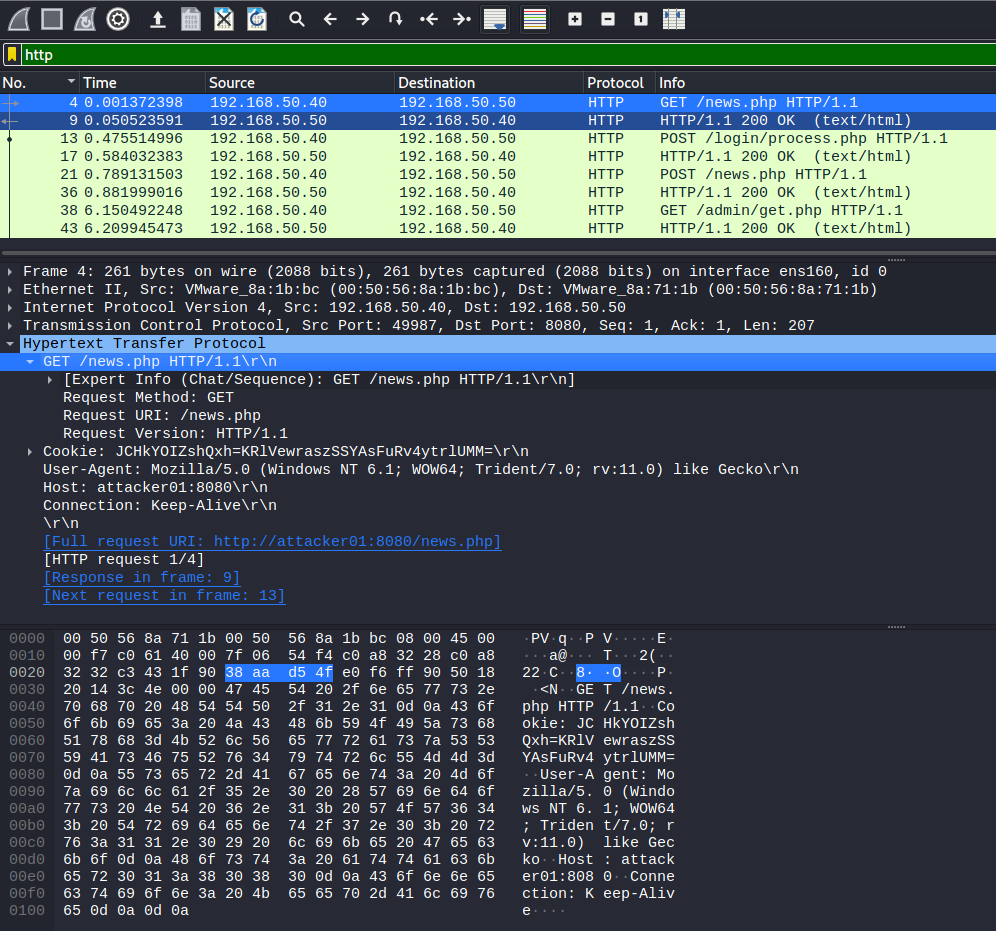
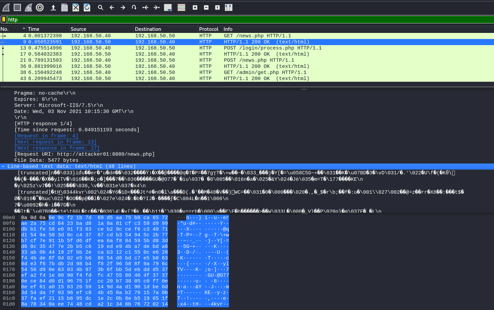

# Module 11: Network Detections

## Intrusion Detection Systems

### Theory and Methodology

_NetFlow_ and its iterations have one goal: produce a metadata-only summary of the network flows.

There are two IDS placement types: _inline_ and _passive_ modes. Passive stores all the network traffic so it can perform various tasks. Inline would be pass the traffic through it, inspecting as it goes.&#x20;


Presently, IDS/IPS modules are often integrated into modern firewall solutions to ensure rule blocking automations are performed on the same device.


Snort is one of the most-used IDS solutions and relies on different iterations of _rulesets_ in both free and paid subscriptions. These rulesets define the criteria to match against when inspecting traffic.

### Foundations of IDS and Rule Crafting

IDS rules are also known as signatures and need to be always evolving.

Snort rules consist of two main components: the _rule header_ and the _rule options_. The header dictates the action taken, then checks any network-related data. The options are the core mechanisms of a rule and are split into two sub-categories: _General Rule Options_ and _Detection Options_. General Rule options provide classification information. Detection Options implements the actual detection routine, based on the provided pattern.

To maximize performance, filter on the rule headers first.&#x20;

_Example Snort Rule to detect ICMP traffic_


```firestore-security-rules
alert icmp $HOME_NET any <> $EXTERNAL_NET any ( msg:"ICMP Traffic Detected"; sid:10000001; metadata:policy security-ips alert;)
```


The header tells Snort to alert on ICMP traffic originating from local networks ($HOME\_NET) to any external networks ($EXTERNAL\_NET), in a bidirectional (<>) fashion. The rule options, surrounded by parentheses, includes the log message, the snort id, and the metadata tag.

_Restartin the external Snort service_

```bash
offsec@snort01:~$ sudo systemctl restart snort3_external
```

_Launchin ga single ping from attacker01 to test the rule_

```bash
kali@attacker01:~$ ping 192.168.51.40 -c 1
PING 192.168.51.40 (192.168.51.40) 56(84) bytes of data.
64 bytes from 192.168.51.40: icmp_seq=1 ttl=64 time=0.654 ms

--- 192.168.51.40 ping statistics ---
1 packets transmitted, 1 received, 0% packet loss, time 0ms
rtt min/avg/max/mdev = 0.654/0.654/0.654/0.000 ms
```

_Reviewing the Snort logs_


```log
offsec@snort01:~$ cat /var/log/snort/alert_fast.txt
10/13-04:50:58.214963 [**] [1:10000001:0] "ICMP Traffic Detected" [**] [Priority: 0] {ICMP} 192.168.51.50 -> 192.168.51.40
10/13-04:50:58.215019 [**] [1:10000001:0] "ICMP Traffic Detected" [**] [Priority: 0] {ICMP} 192.168.51.40 -> 192.168.51.50
```


The ping generated two entries, one for the _ICMP Echo request_ and the other for the _ICMP Echo reply_.&#x20;

## Detecting Attacks

### Known Vulnerabilities

Example known vulnerability for practice: [ZeroLogon (CVE-2020-1472)](https://www.secura.com/uploads/whitepapers/Zerologon.pdf).

_ZeroLogon Snort rule_


```turtle
alert tcp any any -> $HOME_NET any ( msg:"OS-WINDOWS Microsoft Windows Netlogon crafted NetrServerReqChallenge elevation of privilege attempt"; flow:to_server,established; dce_iface:uuid 12345678-1234-abcd-ef00-01234567cffb; dce_opnum:"4"; content:"|04 00|",depth 2,offset 22,fast_pattern; content:"|00 00 00|",distance 0; isdataat:7,relative; isdataat:!8,relative; byte_extract:1,0,first_cc_byte,relative; byte_test:1,=,first_cc_byte,0,relative; byte_test:1,=,first_cc_byte,1,relative; byte_test:1,=,first_cc_byte,2,relative; byte_test:1,=,first_cc_byte,3,relative; detection_filter:track by_src, count 10, seconds 10; metadata:policy balanced-ips drop,policy max-detect-ips drop,policy security-ips drop; service:dcerpc; reference:cve,2020-1472; reference:url,portal.msrc.microsoft.com/en-US/security-guidance/advisory/CVE-2020-1472; classtype:attempted-admin; sid:55703; rev:4; )
```


Explaining the rule header:

_Flow session tracking_

```turtle
flow:to_server,established;
```

_DCE/RPC UUID filtering_

```turtle
dce_iface:uuid 12345678-1234-abcd-ef00-01234567cffb; dce_opnum:"4";
```

_#1 content directive_

```turtle
content:"|04 00|",depth 2,offset 22,fast_patter
```

_#2 content directive_

```turtle
content:"|00 00 00|",distance 0;isdataat:7,relative; isdataat:!8,relative;
```

_#3 byte-extraction_

```turtle
byte_extract:1,0,first_cc_byte,relative;
```

_#4 byte-testing_

```turtle
byte_test:1,=,first_cc_byte,0,relative; 
byte_test:1,=,first_cc_byte,1,relative;
byte_test:1,=,first_cc_byte,2,relative;
byte_test:1,=,first_cc_byte,3,relative;
```

_#5 threshold definition_

```turtle
detection_filter:track by_src, count 10, seconds 10;
```

_Launching the ZeroLogon attack_


```bash
kali@attacker01:~/SOC-200/Network_Detections$ python3 zerologon.py server02 172.16.51.10
Performing authentication attempts...
=====
Attack failed. Target is probably patched.
```


_Inspecting ZeroLogon exploit alert_


```log
offsec@snort01:~$ cat /var/log/snort/alert_fast.txt
10/19-07:11:26.417656 [**] [1:55703:4] "OS-WINDOWS Microsoft Windows Netlogon crafted NetrServerReqChallenge elevation of privilege attempt" [**] [Classification: Attempted Administrator Privilege Gain] [Priority: 1] {TCP} 192.168.51.50:54810 -> 172.16.51.10:49675
...
```


### Extra Mile I

The snort01 machine has tshark preinstalled. Replicate the zerologon pcap Snort rule analysis directly on the machine without using Wireshark.

### Novel Vulnerabilities

In regards to the unknown and unrecognizable threats, there are some ways to defend still. One means of defense is implementing an _allow access-list_. Essentially a whitelist stating specific items are allowed.

Web application vulnerabilities can be grouped into macro categories that OWASP tracks in their popular Top 10 charts. Most attacks targeting the same macro-vulnerability have a common denominator, which means multiple generic detection rules can be crafted to catch various stages of the attack.

#### Utilizing the SQLi rulesets that ship with Snort, developed by the Talos group

_Verifyin gthe Snort daemons and SQLi ruleset are running and being used_


```bash
offsec@snort01:~$ systemctl status snort3_external
● snort3_external.service - Snort3 NIDS Daemon external
     Loaded: loaded (/lib/systemd/system/snort3_external.service; enabled; vendor preset: enabled)
     Active: active (running) since Mon 2021-10-25 06:41:28 EDT; 2h 44min ago
   Main PID: 46868 (snort)
      Tasks: 2 (limit: 4650)
     Memory: 81.5M
     CGroup: /system.slice/snort3_external.service
             └─46868 /usr/local/bin/snort -D -u snort -g snort -c /usr/local/etc/snort/snort.lua -R /usr/local/etc/rules/sql.rules -R /usr/local/etc/rules/local.rules -R /usr/local/etc/rules/pulledpork.rules -i ens160 -s 65535 -k none -l /var/log/snort -m 0x1b --create-pidfile


offsec@snort01:~$ systemctl status snort3_internal
● snort3_internal.service - Snort3 NIDS Daemon internal
     Loaded: loaded (/lib/systemd/system/snort3_internal.service; enabled; vendor preset: enabled)
     Active: active (running) since Mon 2021-10-25 06:41:33 EDT; 2h 44min ago
   Main PID: 46873 (snort)
      Tasks: 2 (limit: 4650)
     Memory: 84.3M
     CGroup: /system.slice/snort3_internal.service
             └─46873 /usr/local/bin/snort -D -u snort -g snort -c /usr/local/etc/snort/snort.lua -R /usr/local/etc/rules/sql.rules -R /usr/local/etc/rules/local.rules -R /usr/local/etc/rules/pulledpork.rules -i ens192 -s 65535 -k none -l /var/log/snort -m 0x1b --create-pidfile
```


_Executing an automated sqli attack_

```bash
kali@attacker01:~/SOC-200/Network_Detections$ ./sqli.sh
...
web application technology: Apache 2.4.51, PHP 8.0.11
back-end DBMS: MySQL >= 5.0.12 (MariaDB fork)
Database: hacking_db
Table: users
[14 entries]
+----+----------------+----------+
| id | password       | username |
+----+----------------+----------+
| 1  | somesecrect    | john     |
| 2  | supertopsecret | mallory  |
| 3  | p@ssword       | admin    |
| 4  | verysafe       | secure   |
| 5  | offsec         | offsec   |
| 6  | genious        | superman |
| 7  | mob!le         | eve      |
| 8  | admin          | admin    |
| 9  | admin1         | admin1   |
| 10 | admin2         | admin2   |
| 11 | admin3         | admin3   |
| 12 | anything       | bob      |
| 13 | admin4         | admin4   |
| 14 | verysecret     | dbadmin  |
+----+----------------+----------+
```

_Inspecting the SQLi attack in the Snort log_


```log
offsec@snort01:~$ cat /var/log/snort/alert_fast.txt
10/25-09:33:26.109347 [**] [1:1061:13] "SQL xp_cmdshell attempt" [**] [Classification: Web Application Attack] [Priority: 1] {TCP} 192.168.51.50:48176 -> 172.16.50.10:80
10/25-09:33:26.109277 [**] [1:1061:13] "SQL xp_cmdshell attempt" [**] [Classification: Web Application Attack] [Priority: 1] {TCP} 192.168.51.50:48176 -> 192.168.51.40:80
10/25-09:33:26.109347 [**] [1:13990:27] "SQL union select - possible sql injection attempt - GET parameter" [**] [Classification: Misc Attack] [Priority: 2] {TCP} 192.168.51.50:48176 -> 172.16.50.10:80
10/25-09:33:26.109347 [**] [1:19439:10] "SQL 1 = 1 - possible sql injection attempt" [**] [Classification: Web Application Attack] [Priority: 1] {TCP} 192.168.51.50:48176 -> 172.16.50.10:80
10/25-09:33:26.109277 [**] [1:13990:27] "SQL union select - possible sql injection attempt - GET parameter" [**] [Classification: Misc Attack] [Priority: 2] {TCP} 192.168.51.50:48176 -> 192.168.51.40:80
10/25-09:33:26.109277 [**] [1:19439:10] "SQL 1 = 1 - possible sql injection attempt" [**] [Classification: Web Application Attack] [Priority: 1] {TCP} 192.168.51.50:48176 -> 192.168.51.40:80
...
```


_Using grep to filter the log output_


```log
offsec@snort01:~$ cat /var/log/snort/alert_fast.txt  | grep -o .[\*\*\].*\{ | sort -u
[**] [1:1061:13] "SQL xp_cmdshell attempt" [**] [Classification: Web Application Attack] [Priority: 1] {
[**] [1:13990:27] "SQL union select - possible sql injection attempt - GET parameter" [**] [Classification: Misc Attack] [Priority: 2] {
[**] [1:19439:10] "SQL 1 = 1 - possible sql injection attempt" [**] [Classification: Web Application Attack] [Priority: 1] {
[**] [1:24172:2] "SQL use of concat function with select - likely SQL injection" [**] [Classification: Web Application Attack] [Priority: 1] {
[**] [1:26925:2] "SQL generic convert injection attempt - GET parameter" [**] [Classification: Web Application Attack] [Priority: 1] {
[**] [1:37443:2] "SQL use of sleep function with select - likely SQL injection" [**] [Classification: Web Application Attack] [Priority: 1] {
[**] [1:41449:2] "SQL use of sleep function with and - likely SQL injection" [**] [Classification: Web Application Attack] [Priority: 1] {
[**] [1:49666:2] "SQL HTTP URI blind injection attempt" [**] [Classification: Web Application Attack] [Priority: 1] {
```


_Extracting specific Snort rule IDs_

```bash
offsec@snort01:~$ cat /var/log/snort/alert_fast.txt | cut -d ':' -f 4 | sort | uniq
1061
13990
19439
24172
26925
37443
41449
49666
```

_Simple script to map Snort rule IDs to Snort Rules_


```python
#!/usr/bin/env python

import sys
import re
import os

snort_sql_rule_file_path = "/usr/local/etc/rules/sql.rules"

rules = os.popen("cat /var/log/snort/alert_fast.txt | cut -d ':' -f 4 | sort | uniq").read()
rules = rules.split('\n')
for rule in rules[:-1]:
    cmd = 'cat {} | grep {}'.format(snort_sql_rule_file_path,rule)
    ret = os.popen(cmd).read()
    print(ret)
```


_Executing the Python script to mape the rules_


```turtle
offsec@snort01:~/SOC-200/Network_Detections$ python3 extract_sql_rules.py
alert tcp $EXTERNAL_NET any -> $HTTP_SERVERS $HTTP_PORTS ( msg:"SQL xp_cmdshell attempt"; flow:to_server,established; content:"xp_cmdshell",fast_pattern,nocase; metadata:ruleset community; service:http; reference:bugtraq,5309; classtype:web-application-attack; sid:1061; rev:13; )
...
```


## Detecting C2 Infrastructure

### C2 Infrastructure

_IOC Categories_

| **TYPE**              | **DIFFICULTY** | **DESCRIPTION**                                                                                       |
| --------------------- | -------------- | ----------------------------------------------------------------------------------------------------- |
| Hash Values           | Trivial        | MD5, SHA256 or other hashed value that matches a specific file                                        |
| IP Addresses          | Easy           | IPv4/IPv6 host address or CIDR belonging to an attacker infrastructure (i.e. a C2 server)             |
| Domain Names          | Simple         | Full domain name or subdomain, often employed to dynamically resolve C2 servers IPs                   |
| Network/Host Artifact | Annoying       | Any byte or distinctive traits that can be used to identify the attacker traffic                      |
| Tools                 | Challenging    | Any piece of software that is crafted by the attacker                                                 |
| TTPs                  | Tough          | Reconstruct the Tactic, Technique and Procedure (TTP) that the attacker adopt during a specific phase |

C2 would typically call back to a static IP address or domain name. Because this can be easily blocked by an IPS, attackers created the _domain flux_ technique where domains are dynamically generated at runtime through a _Domain Generation Algorithm (DGA)._

_Example Domain Generation Script_


```python
import sys

def usage():
    print("Usage: "   + sys.argv[0] + " [date]")
    print("Usage: "   + sys.argv[0] + " 12.02.2021")
    sys.exit()

def generate_domain(year: int, month: int, day: int) -> str:
    domain = ""

    for i in range(0x10):
        year = ((year ^ 8 * year) >> 11) ^ ((year & 0xFFFFFFF0) << 17)
        month = ((month ^ 4 * month) >> 25) ^ 16 * (month & 0xFFFFFFF8)
        day = ((day ^ (day << 13)) >> 19) ^ ((day & 0xFFFFFFFE) << 12)
        domain += chr(((year ^ month ^ day) % 25) + 97)

    print(domain + ".com")

if __name__ == "__main__":
    if len(sys.argv) > 1:
        date    = sys.argv[1]
        y,m,d = date.split('.')
        generate_domain(int(y),int(m),int(d))
    else:
        usage()
```


The above script takes a date in the format of _MM.DD.YYYY_ as input and returns a 16-byte-long pseudo-random domain name string.

Empire is an open-source post-exploitation C2 framework that support several options, including Windows, Linux, and macOS agents.

_Launching Empire client console_


```bash
kali@attacker01:~$ sudo powershell-empire client
...
   _______   ___  ___   ______    __   ______        _______
  |   ____| |   \/   | |   _  \  |  | |   _  \      |   ____|
  |  |__    |  \  /  | |  |_)  | |  | |  |_)  |     |  |__
  |   __|   |  |\/|  | |   ___/  |  | |      /      |   __|
  |  |____  |  |  |  | |  |      |  | |  |\  \----. |  |____
  |_______| |__|  |__| | _|      |__| | _| `._____| |_______|


       393 modules currently loaded

       1 listeners currently active

       0 agents currently active

[*] Connected to localhost
(Empire) >
```


_Starting the packet capture to catch Empire's communication_


```bash
offsec@snort01:~$ sudo tshark -f "tcp port 8080" -i ens160 -w /home/offsec/SOC-200/Network_Detections/empire.pcap
```


After launching the **launcher.bat**  on the target's desktop...

_Verifying the Empire agent_

```bash
(Empire) >
[+] New agent LGK4AE5C checked in
[*] Sending agent (stage 2) to LGK4AE5C at 192.168.50.40
(Empire) > agents

┌Agents──────────┬────────────┬──────────────┬──────────────────┬────────────┬──────┬───────┬─────────────────────────┬──────────┐
│ ID │ Name      │ Language   │ Internal IP  │ Username         │ Process    │ PID  │ Delay │ Last Seen               │ Listener │
├────┼───────────┼────────────┼──────────────┼──────────────────┼────────────┼──────┼───────┼─────────────────────────┼──────────┤
│ 3  │ LGK4AE5C* │ powershell │ 172.16.50.10 │ AD\Administrator │ powershell │ 6160 │ 5/0.0 │ 2021-11-03 05:52:18 EDT │ SOC200   │
│    │           │            │              │                  │            │      │       │ (3 seconds ago)         │          │
└────┴───────────┴────────────┴──────────────┴──────────────────┴────────────┴──────┴───────┴─────────────────────────┴──────────┘
```

### Extra Mile II

Try to set up a new Empire listener on Kali attacker01 in a way that cannot be detected by the Snort rule we covered in the Learning Module. Once configured, generate the Agent, test the C2 channel between server02 and attacker01, and then build a Snort rule to detect the newly-created C2.

**Note:** remember to restart both internal and external Snort services on snort01 in order to load the new rules.

### Network Communications

Historically, attackers have used several protocols for command delivery and exfiltration to include HTTP, HTTPS, DNS, IRC, and others.

<figure><figcaption><p><em>Empire HTTP client communication pcap</em></p></figcaption></figure>

<figure><figcaption><p>Empire's news.php response</p></figcaption></figure>

_Inspecting Snort logs for Empire's HTTP communication trails_


```log
offsec@snort01:~$ cat /var/log/snort/alert_fast.txt
11/03-10:43:03.719729 [**] [1:38259:5] "MALWARE-CNC PowerShell Empire variant outbound connection" [**] [Classification: A Network Trojan was detected] [Priority: 1] {TCP} 172.16.51.10:59935 -> 192.168.51.50:8080
11/03-10:43:03.719742 [**] [1:38259:5] "MALWARE-CNC PowerShell Empire variant outbound connection" [**] [Classification: A Network Trojan was detected] [Priority: 1] {TCP} 192.168.51.40:59935 -> 192.168.51.50:8080
```


_Snort rule for detecting Empire's HTTP based C2_


```turtle
offsec@snort01:~$ cat /usr/local/etc/rules/c2.rules
alert tcp $HOME_NET any -> $EXTERNAL_NET $HTTP_PORTS ( msg:"MALWARE-CNC PowerShell Empire variant outbound connection"; flow:to_server,established; content:"/news.php HTTP/1.1|0D 0A|",fast_pattern,nocase; content:"User-Agent: Mozilla/5.0 (Windows NT 6.1|3B| WOW64|3B| Trident/7.0|3B| rv:11.0) like Gecko"; metadata:impact_flag red; service:http; reference:url,attack.mitre.org/techniques/T1086; reference:url,powershellempire.com; classtype:trojan-activity; sid:38259; rev:5; )
```


Snort rule explained...

_1st content directive_

```turtle
content:"/news.php HTTP/1.1|0D 0A|"
```

_2nd content directive_


```turtle
content:"User-Agent: Mozilla/5.0 (Windows NT 6.1|3B| WOW64|3B| Trident/7.0|3B| rv:11.0) like Gecko"
```

