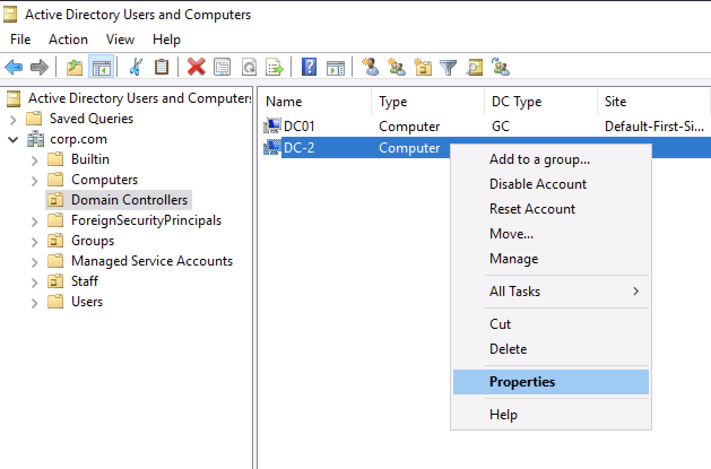
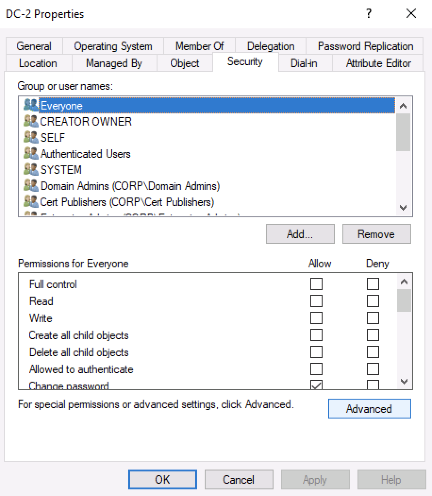
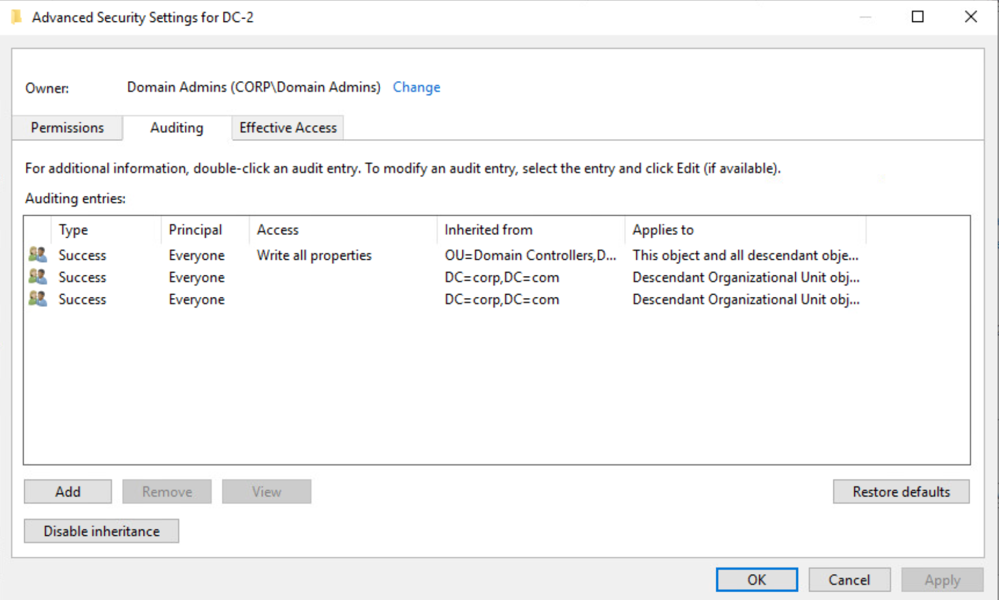
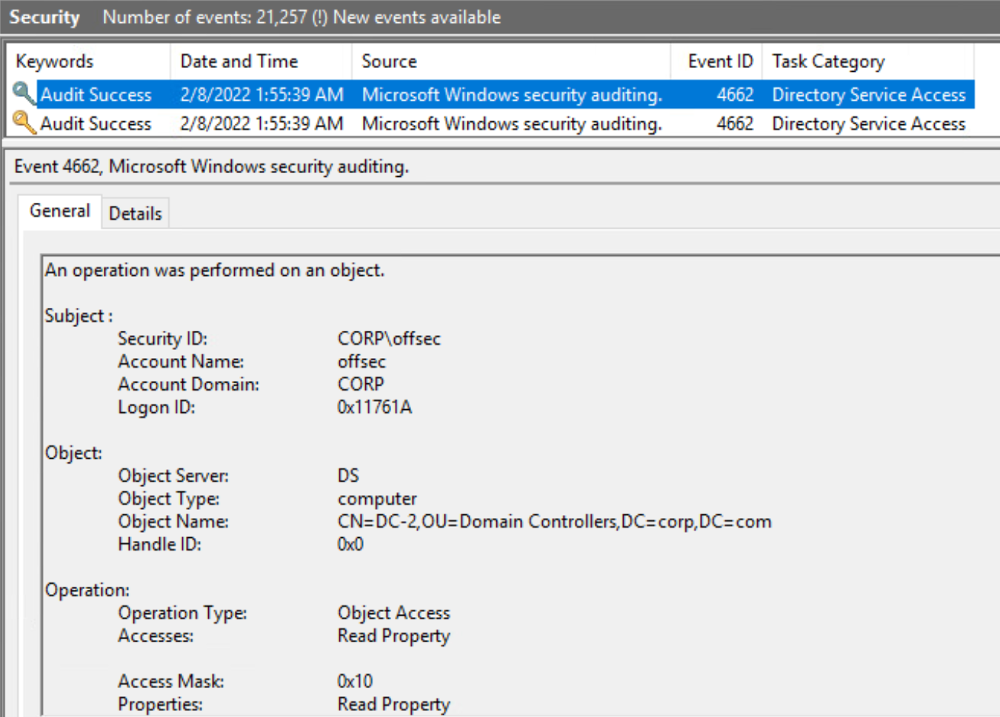
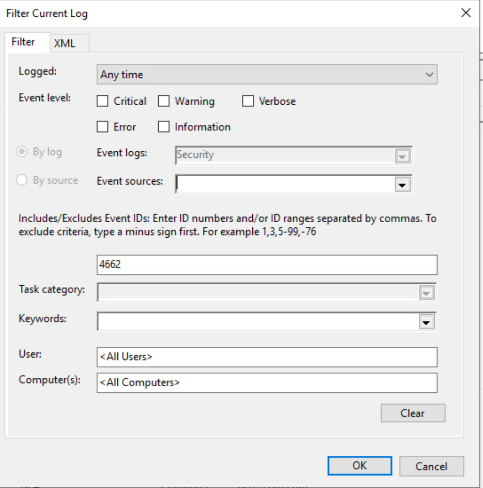
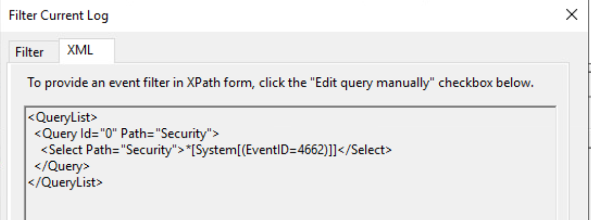

# Module 13: Active Directory Enumeration

## Abusing Lightweight Directory Access Protocol

### Understanding LDAP

LDAP was designed to interact with a directory service, such as Active Directory. It is built upon the _client-server model_.

LDAP clients send requests called _operations_ to an LDAP server. These are used to authenticated clients or retrieve/modify entries within a directory.

<figure><figcaption><p>Simple LDAP client-server model</p></figcaption></figure>

### Interacting with LDAP

LDAP is inter-operable with custom applications, which is largely possible due to the inclusion of _Active Directory Service Interfaces_ (ADSI).

_PowerShell script to perform LDAP lookup_


```powershell
PS C:\Users\offsec> $Searcher = New-Object System.DirectoryServices.DirectorySearcher

PS C:\Users\offsec> $Searcher.Filter = '(distinguishedName=CN=DC-2,OU=Domain Controllers,DC=corp,DC=com)'

PS C:\Users\offsec> $Searcher.FindOne()
```



By default, _DirectorySearcher_ instantiates an object with the Filter property to the value of _(objectClass=\*)_, which is an LDAP query returning every entry within a directory service.


_PowerShell script to execute LDAP as a different user_


```powershell
PS C:\Users\offsec> $Searcher = New-Object System.DirectoryServices.DirectorySearcher

PS C:\Users\offsec> $Searcher.SearchRoot = New-Object System.DirectoryServices.DirectoryEntry("LDAP://DC=corp,DC=com", 'corp\jdoe','Qwerty09!')

PS C:\Users\offsec> $Searcher.Filter = '(&(objectClass=computer)(cn=*dc*))'

PS C:\Users\offsec> $Searcher.FindAll()

Path                                                Properties
----                                                ----------
LDAP://CN=DC01,OU=Domain Controllers,DC=corp,DC=com {ridsetreferences, logoncount, codepage, ob...
LDAP://CN=DC-2,OU=Domain Controllers,DC=corp,DC=com {logoncount, codepage, objectcategory, iscr...
```


### Enumerating Active Directory with PowerView

PowerView contains dozens of functions that can be used to enumerate Active Directory. They incorporate OS APIs.

## Detecting Active Directory Enumeration

### Auditing Object Access

To identify malicious enumeration events taking place against AD, we need to implement an _audit policy_. These are extensions of the built-in Windows logging.

We can display and configure audit policies with the _auditpol_ command line utility.&#x20;

_Listing audit policy categories_

```powershell
PS C:\Windows\system32> auditpol /list /category
Category/Subcategory
Account Logon
Account Management
Detailed Tracking
DS Access
Logon/Logoff
Object Access
Policy Change
Privilege Use
System
```

_Listing audit policy subcategories_

```powershell
and PS C:\Windows\system32> auditpol /list /subcategory:*
Category/Subcategory
...
DS Access
  Directory Service Access
  Directory Service Changes
  Directory Service Replication
  Detailed Directory Service Replication
...
```

_Listing audit policy subcategory setting_

```powershell
PS C:\Windows\system32> auditpol /get /subcategory:"Directory Service Access"
System audit policy
Category/Subcategory                      Setting
DS Access
  Directory Service Access                Success
```

<figure><figcaption><p>DC-2 Options</p></figcaption></figure>

<figure><figcaption><p>DC-2 Properties</p></figcaption></figure>

<figure><figcaption><p>Auditing permissions on DC-2</p></figcaption></figure>

_Object audit security elements_

| Element        | Description                                                                                                                             |
| -------------- | --------------------------------------------------------------------------------------------------------------------------------------- |
| Principal      | The identity that is being targeted for auditing                                                                                        |
| Type           | Target success, failure, or both types of events                                                                                        |
| Access         | Types of permissions that can be granted (and tracked)                                                                                  |
| Inherited From | Designates whether an audit entry was configured at a higher level than the target object, which would recurse down to any sub entries. |
| Applies To     | Designates whether the entry is targeting only the current object, descendant objects, or specific object types                         |

<figure><figcaption><p>Object Access event</p></figcaption></figure>

_Key information_

* Subject: Details about the Account that accessed the object.
* Object: Details about the object accessed.
* Operation: Details about the action taken place.

### Baseline Monitoring

Utilize _XPath_ filters to select specific nodes from an XML document. When using the "Filter Current Log" option in Event Viewer, we are essentially building an XPath query that is parsed by the logging engine to provide the requested data.

<figure><figcaption><p>Event log filter through GUI</p></figcaption></figure>

<figure><figcaption><p>Event log filter in XPath form</p></figcaption></figure>

_XPath query for expected access_


```powershell
$FilterXML = @'
<QueryList>
  <Query Id="0" Path="Security">
    <Select Path="Security">
     *[System[(EventID=4662)]] and *[EventData[(Data[@Name='SubjectUserSid']='S-1-5-21-2154860315-1826001137-329834519-1107')]] and *[EventData[(Data[@Name='ObjectName']='%{0ca1d341-b9ee-4d46-ab3b-3a2732aa4b51}')]] and *[EventData[(Data[@Name='OperationType']='Object Access')]]
   </Select>
  </Query>
</QueryList>
'@
```


_Running Get-WinEvent with created XPath_


```powershell
PS C:\Windows\system32> Get-WinEvent -FilterXml $FilterXML
   ProviderName: Microsoft-Windows-Security-Auditing
TimeCreated Id LevelDisplayName Message
----------- -- ---------------- -------
1/19/2022 11:24:04 AM   4662 Information   An operation was performed on an object....
1/19/2022 11:24:04 AM   4662 Information   An operation was performed on an object....
1/19/2022 11:24:04 AM   4662 Information   An operation was performed on an object....
...
```


_Get-WinEvent script with XML parsing_


```powershell
$Logs = Get-WinEvent -LogName Security -FilterXPath $FilterXML
ForEach ($L in $Logs) {
   [xml]$XML = $L.toXml()
   $TimeStamp = $XML.Event.System.TimeCreated.SystemTime
   $SubjectUserName = $XML.Event.EventData.Data[1].'#text'
   $ObjectName = $XML.Event.EventData.Data[6].'#text'
   $AccessMask = $XML.Event.EventData.Data[10].'#text'
   [PSCustomObject]@{'TimeStamp' = $TimeStamp; 'SubjectUserName' = $SubjectUserName; 'ObjectName' = $ObjectName; 'AccessMask' = $AccessMask }
}
```


_Results from updated Get-WinEvent script_


```powershell
PS C:\Windows\system32> C:\Users\offsec\Desktop\Audit.ps1

TimeStamp SubjectUserName ObjectName AccessMask
--------- --------------- ---------- ----------
2022-01-19T16:24:04.312607600Z offsec   %{0ca1d341-b9ee-4d46-ab3b-3a2732aa4b51} 0x10      
2022-01-19T16:24:04.312154600Z offsec   %{0ca1d341-b9ee-4d46-ab3b-3a2732aa4b51} 0x10      
2022-01-19T16:24:04.048692000Z offsec   %{0ca1d341-b9ee-4d46-ab3b-3a2732aa4b51} 0x10      
2022-01-19T16:24:04.048326000Z offsec   %{0ca1d341-b9ee-4d46-ab3b-3a2732aa4b51} 0x10      
...  
```



We could perform LDAP lookups to dynamically retrieve the friendly name of the Access Mask, however this would generate access alerts.


_XPath filter to suppress displaying events where the SID matches offsec's SID_


```xml
<QueryList>
  <Query Id="0" Path="Security">
    <Select Path="Security">
     *[System[(EventID=4662)]] and 
     *[EventData[(Data[@Name='ObjectName']='%{0ca1d341-b9ee-4d46-ab3b-3a2732aa4b51}')]] and
     *[EventData[(Data[@Name='OperationType']='Object Access')]]
     </Select>
   <Suppress Path="Security">
    *[EventData[(Data[@Name='SubjectUserSid']='S-1-5-21-2154860315-1826001137-329834519-1107')]]
   </Suppress>
  </Query>
</QueryList>
```


### Using Honey Tokens

The difference between a honey token and a general honeypot is that a honey token is a collection of different types of objects created throughout the directory. Any traffic destined to these lures should be considered suspect.
