# Module 17: SIEM Part One: Intro to ELK

## Log Management Introduction

### SIEM Concepts

<figure>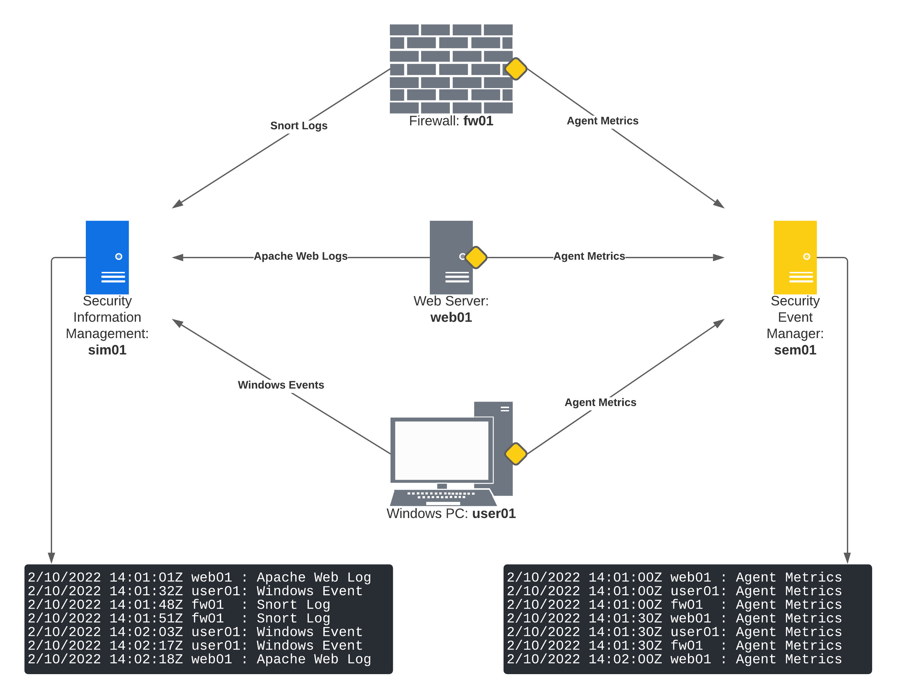<figcaption><p>Example Network Diagram with SIM and SEM</p></figcaption></figure>

<figure>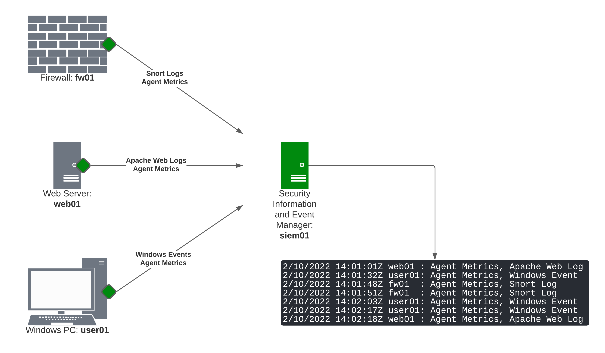<figcaption><p>Example Network Diagram with SIEM</p></figcaption></figure>

### Elastic Stack (ELK)

<figure>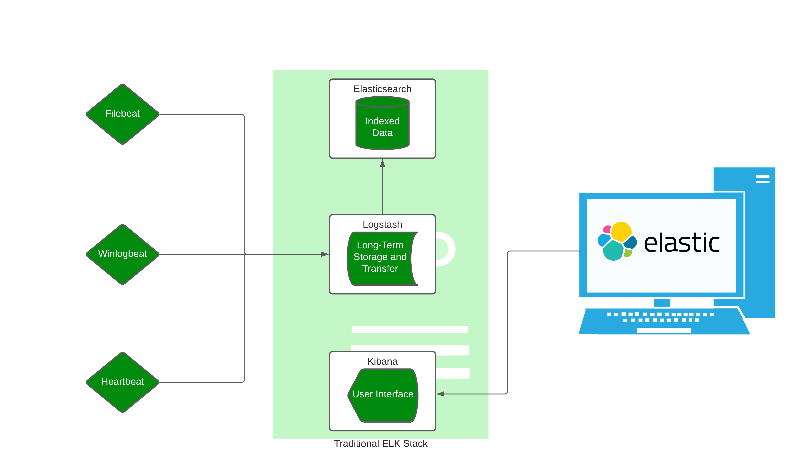<figcaption><p>Example Diagram of Traditional ELK Stack with Elasticsearch, Logstash, Kibana, and Beats</p></figcaption></figure>

<figure><figcaption><p>Example Diagram of Elastic Stack with Elastic Agents, Elasticsearch, and Kibana</p></figcaption></figure>

The Discover page is where all the incoming data from agents is presented. A search bar located at the top allows users to submit their queries in _Kibana Query Language (KQL)_ format.

_Example of Standard KQL Syntax_


```aql
field1: value1 and field2: "value 2" and not field3: value3* and field4.subfield <= 30
```


_KQL Query for Sysmon ProcessCreate Events_


```sql
host.hostname: "appsrv01" and data_stream.dataset : "windows.sysmon_operational" and process.name : "svchost.exe" and event.code: "1"
```


_KQL Query for Apache access log_


```aql
"apache-access" and host.hostname: "web01" and not source.ip: 127.0.0.1
```


_Results from KQL Query for Apache access log_

| **Field**               | **Value**           |
| ----------------------- | ------------------- |
| source.ip               | 192.168.51.54       |
| tags                    | apache-access       |
| url.extension           | php                 |
| url.path                | /wp-admin/login.php |
| user\_agent.device.name | Other               |
| user\_agent.name        | curl                |
| user\_agent.original    | curl/7.74.0         |

_KQL Query for Snort logs_


```aql
tags : "snort.log" and network.type : "ipv4"
```


_Results from KQL Query for Snort logs_

| **Field**        | **Value**                    |
| ---------------- | ---------------------------- |
| network.type     | ipv4                         |
| observer.product | ids                          |
| observer.type    | ids                          |
| observer.vendor  | snort                        |
| related.ip       | 192.168.50.54, 192.168.50.51 |
| rule.description | "ICMP Traffic Detected"      |
| rule.id          | 10000001                     |
| rule.version     | 0                            |
| snort.gid        | 1                            |
| source.address   | 192.168.50.54                |
| source.ip        | 192.168.50.54                |
| tags             | forwarded, snort.log         |

### ELK Integrations with OSQuery

For Elastic Agents, there is only one active integration called _OSQuery_. This integration is based on the original project and stores device-specific information into a relational database that can be queried on-demand.

<figure>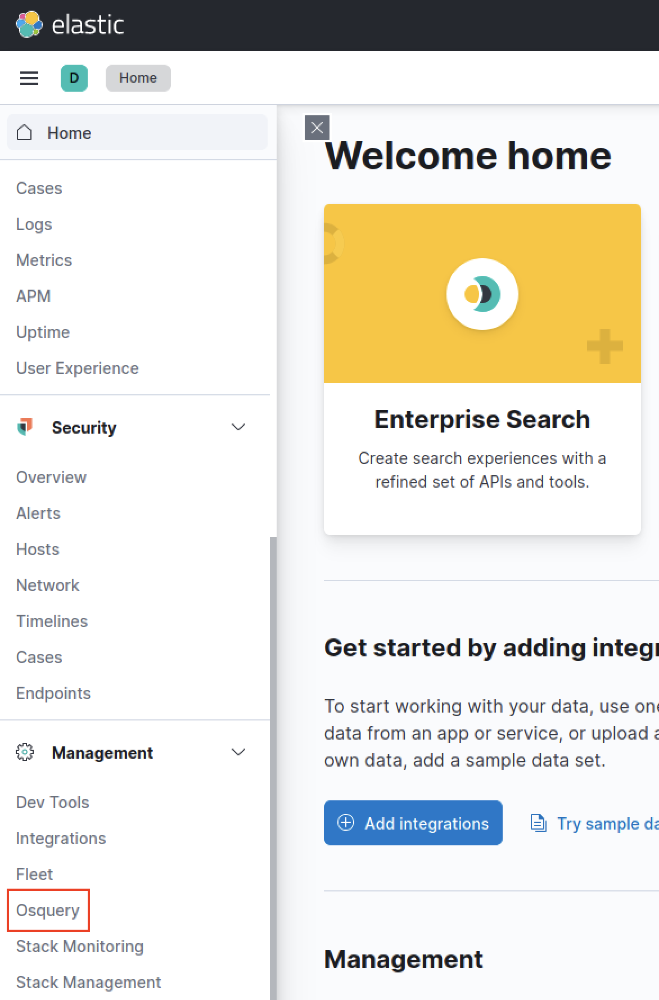<figcaption><p>OSQuery in Navigation Pane</p></figcaption></figure>

Every listing of OSQuery has the following:

* **Query**: Query that was submitted to Elastic Agents
* **Agents**: The Elastic Agent(s) that received the query
* **Created at**: The query's creation time
* **Run by**: The user that submitted the query

<figure>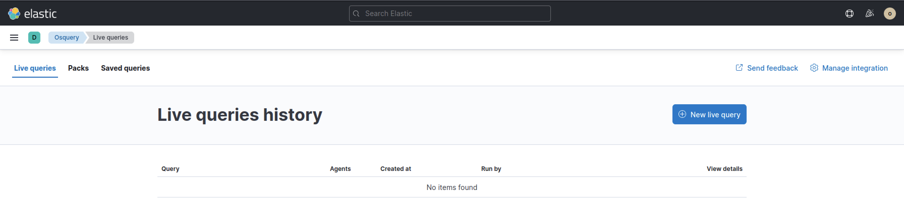<figcaption><p>OSQuery page</p></figcaption></figure>


% can be used as a wildcard.


_Example of SQL syntax for OSQuery_


```sql
SELECT field1, field2, fieldx FROM table1 WHERE field1 = value1 AND field2 like '%value2%';
```


_OSQuery for text files on every Windows user's Desktop_


```sql
select directory, filename from file where path like 'C:\Users\%\Desktop\%' and filename like '%.txt';
```


_OSQuery results for text files_

| agent    | directory                      | filename  |
| -------- | ------------------------------ | --------- |
| appsrv01 | C:\Users\Administrator\Desktop | proof.txt |

OSQuery for processes listening on network ports


```sql
select distinct processes.name, listening_ports.port, listening_ports.address, processes.pid from processes join listening_ports on processes.pid = listening_ports.pid;
```


_OSQuery results for processes listening on network ports_

| agent | address   | name          | pid    | port |
| ----- | --------- | ------------- | ------ | ---- |
| web01 | 127.0.0.1 | elastic-agent | 292547 | 6789 |
| web01 | 0.0.0.0   | httpd         | 293453 | 80   |
| web01 | 127.0.0.1 | cupsd         | 1259   | 631  |
| ...   | ...       | ...           | ...    | ...  |

OSQuery for all processes with outbound connections to nonstandard ports


```sql
select pos.pid, p.name, pos.local_address, pos.remote_address, pos.local_port, pos.remote_port from process_open_sockets pos join processes p on pos.pid = p.pid where pos.remote_port not in (80, 443) and pos.family = 2 and pos.local_address not in ("0.0.0.0", "127.0.0.1");
```


| agent    | local\_address | local\_port | name            | pid    | remote\_address | port |
| -------- | -------------- | ----------- | --------------- | ------ | --------------- | ---- |
| appsrv01 | 172.16.51.32   | 57301       | osquerybeat.exe | 5104   | 172.16.51.35    | 9200 |
| ...      | ...            | ...         | ...             | ...    | ...             | ...  |
| web01    | 172.16.51.33   | 33522       | metricbeat      | 292468 | 172.16.51.35    | 9200 |
| ...      | ...            | ...         | ...             | ...    | ...             | ...  |
| snort03  | 172.16.51.254  | 41088       | elastic-agent   | 754    | 172.16.51.35    | 8220 |

## ELK Security

### Rules and Alerts

_KQL for failed authentications_

```aql
event.code : "4625"
```

_Creating a RDP Brute Force rule_

<figure><figcaption><p>"Define rule" input for RDP Brute Force rule</p></figcaption></figure>

<figure><figcaption><p>"About rule" input for RDP Brute Force rule</p></figcaption></figure>

<figure><figcaption><p>"Schedule rule" input for RDP Brute Force rule</p></figcaption></figure>

<figure><figcaption><p>"Rule actions" input for RDP Brute Force rule</p></figcaption></figure>

### Timelines and Cases

<figure>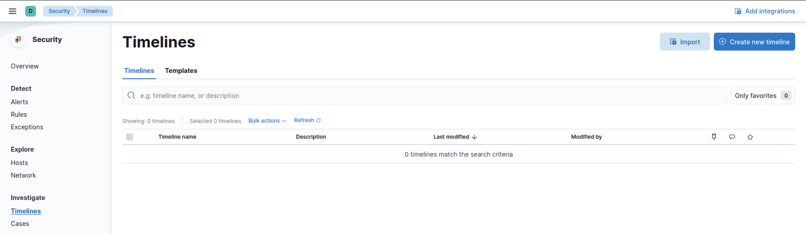<figcaption><p>Timelines home page</p></figcaption></figure>

<figure>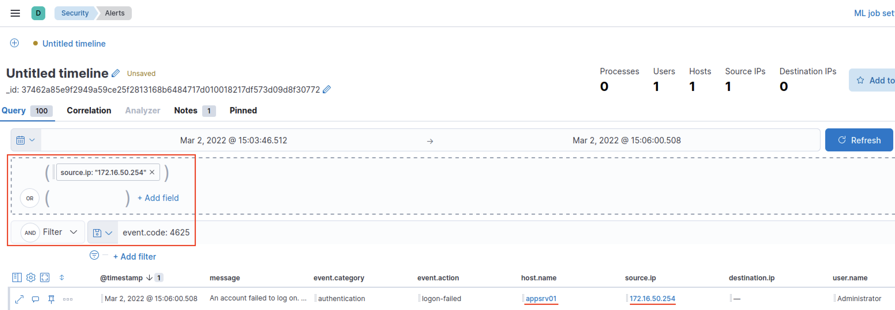<figcaption><p>Timeline for RDP Brute Force</p></figcaption></figure>

_Expanded query for RDP Brute Force_


```aql
(event.code: 4625 or event.code : 4624) and host.hostname : "appsrv01"
```


<figure>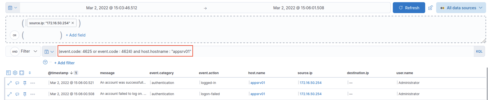<figcaption><p>Updated Timeline for RDP Brute Force</p></figcaption></figure>

_Successful authentication from RDP Brute Force in most recent entry_

| @timestamp                 | message            | event.category | event.action | host.name | source.ip     | destination.ip | user.name     |
| -------------------------- | ------------------ | -------------- | ------------ | --------- | ------------- | -------------- | ------------- |
| Mar 2, 2022 @ 15:06:00.521 | An account was ... | authentication | logged-in    | appsrv01  | 172.16.50.254 | --             | Administrator |


There is no perfect way to draft an incident report. Many organizations develop their own reporting standards to adequately describe attacks.


<figure>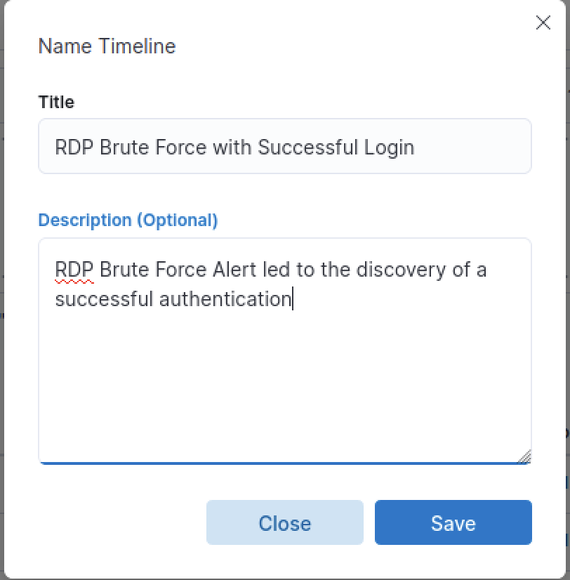<figcaption><p>Name and Description of timeline</p></figcaption></figure>

<figure>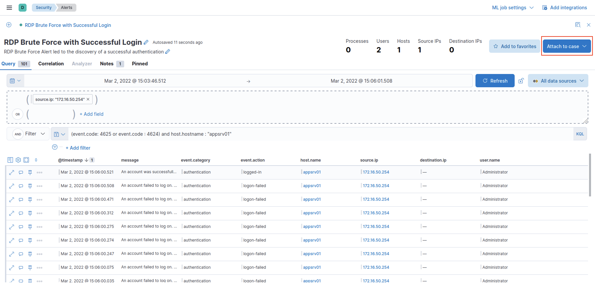<figcaption><p>Timeline with highlighted "Attach to case" button</p></figcaption></figure>

<figure>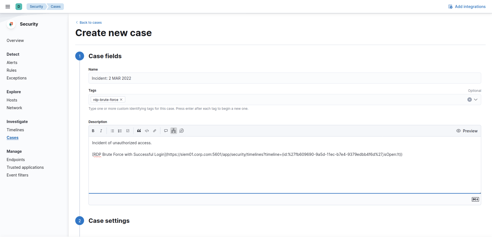<figcaption><p>Creating a new case in Kibana</p></figcaption></figure>

<figure>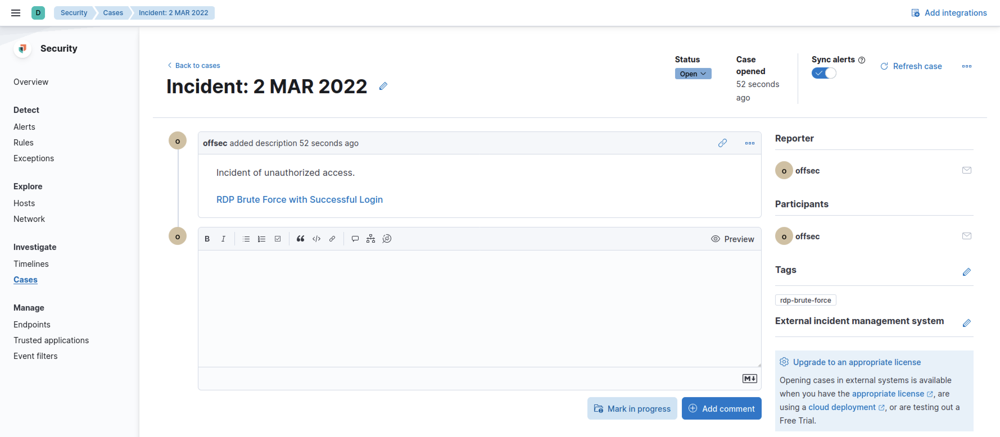<figcaption><p>New case starting with RDP Brute Force timeline</p></figcaption></figure>
