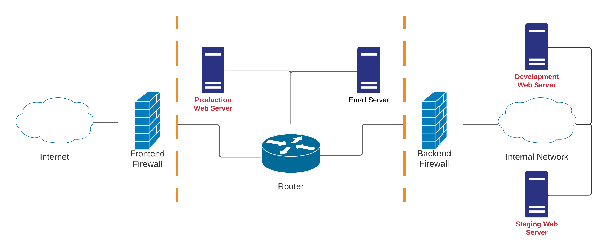
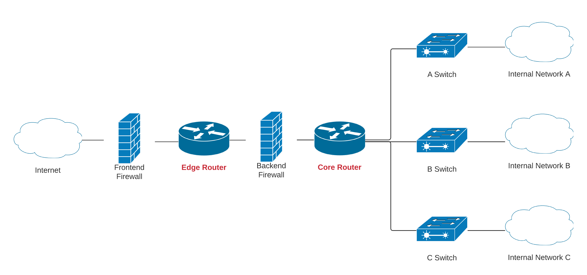
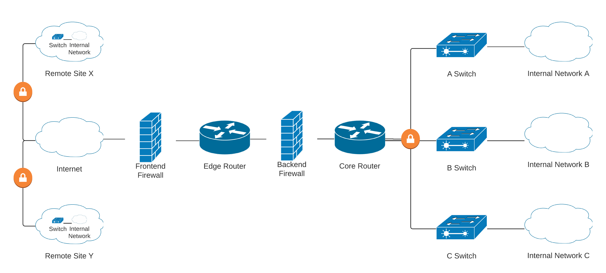

# Module 2: Attacker Methodology Introduction

## The Network as a Whole

### The DMZ

Most ingress attacks pass through the DMZ due to it facing the internet.&#x20;

<figure><figcaption>
Simplified Enterprise DMZ
</figcaption></figure>


Some security professionals suggest implementing front-end and back-end firewalls from different vendors since one vulnerability will rarely affect both firewalls. However, this may increase the initial cost and complicate maintenance.


### Deployment Environments

_Deployment Environments_ separate the development and production environments.

<figure><figcaption>
Simplified Enterprise with Deployment
</figcaption></figure>

The _development_ (dev) server allows for safely writing and testing code before moving it to production. If there is a catastrophic failure, no impact on users or business will occur. If compromised, no real information is leaked.

The _staging_ server is a near-perfect replication of the production server to ensure production will behave as expected. It can be used to emulate potential updates with additional testing prior to being pushed to production.

The _production_ (prod) server is the live system that user's interact with. There is no guarantee of being invulnerable, but this entire process helps mitigate issues.

### Core and Edge Network Devices

_Edge_ devices provide connectivity between networks. _Core_ devices pass network traffic through to intended destinations.

<figure><figcaption>
Simplified Enterprise with Core/Edge Devices
</figcaption></figure>

### Virtual Private Networks and Remote Sites

A VPN provides the means to securely access a private network while being geographically removed from it. As with anything else, it must be properly configured and maintained to ensure safe and secure business operations.

VPN connectivity also enables the geographic distribution of _remote sites._ This allows enterprises to expand their operations.

<figure><figcaption>
Simplified Enterprise with Remote Sites via VPN
</figcaption></figure>

Remote sites are just as critical as main offices due to the connection they have via the VPN.

## The Lockheed-Martin Cyber Kill-Chain

### The Importance of the Kill-Chain

The inclusion of the word "chain" means that each phase depends on the next. If interrupted, the APT cannot complete their objective.

The phases of the Lockheed Martin Kill-Chain:

* Reconnaissance
* Weaponization
* Delivery
* Exploitation
* Installation
* Command & Control (C2)
* Actions on Objectives

### Case Study 1: Monero Cryptomining





### Case Study 2: Petya, Mischa, and GoldenEye







## MITRE ATT\&CK Framework



### Tactics, Techniques, and Sub-Techniques

The fourteen enterprise-specific tactics:

* Reconnaissance
* Resource Development
* Initial Access
* Execution
* Persistence
* Privilege Escalation
* Defense Evasion
* Credential Access
* Discovery
* Lateral Movement
* Collection
* Command and Control
* Exfiltration
* Impact

Each tactic has _techniques_ and _sub-techniques_.


Note that security professionals often refer to APT behavior as TTPs: Tactics, Techniques, and Procedures. While tactics and techniques align with the MITRE ATT\&CK Framework, sub-techniques are a generalized form of procedures.


### Case Study 1: OilRig



### Case Study 2: APT3



### Case Study 3: APT28


