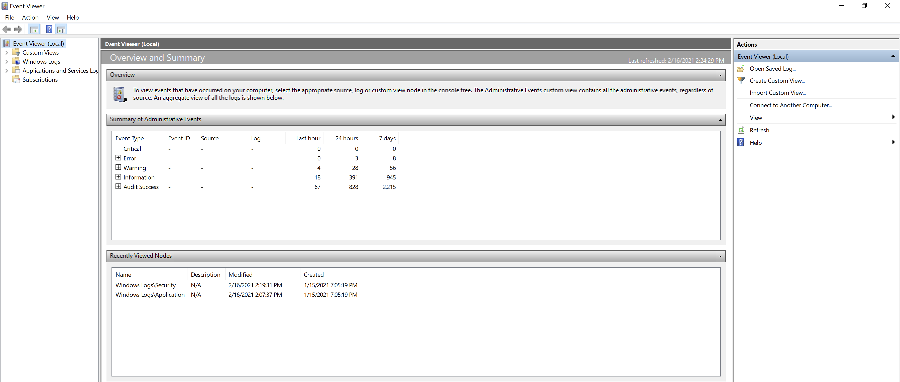

# Module 3: Windows Endpoint Introduction

## Windows Processes

A process is an instance of a program running in system memory, used by both the OS and applications. Some applications use one process, others may use more.

## Windows Registry

Windows maintains service and applications configurations in the Windows Registry. It is a hierarchical database that store critical information for the OS and for applications that use it. It stores settings, options, and various other information in hives, keys, and values.

Keys can contain a single value, or even more keys with their own values/keys. Values are made up of three fields: _name, type,_ and _data._

## Command Prompt, VBScript, and Powershell

### Command Prompt


The predecessor to cmd.exe was COMMAND.COM, which used the same command syntax.


Also known as cmd.exe, the command prompt is the most commonly-used command-line interface for the Windows operating system. Automated command-line tasks can be created via _batch files_.&#x20;

_Example Batch File_

```batch
@ECHO OFF
TITLE Example Batch File
ECHO This batchfile will show Windows 10 Operating System information
systeminfo | findstr /C:"Host Name"
systeminfo | findstr /C:"OS Name"
systeminfo | findstr /C:"OS Version"
systeminfo | findstr /C:"System Type"
systeminfo | findstr /C:"Registered Owner"
PAUSE
```

### Visual Basic Script (VBScript)

These scripts require the file extension **.vbs** and must be run through the **cscript.exe** interpreter.

_Getting WMIService reference in our VBScript_

```visual-basic
' List Operating System and Service Pack Information

strComputer = "."
Set objWMIService = GetObject("winmgmts:" _
 & "{impersonationLevel=impersonate}!\\" & strComputer & "\root\cimv2")
```

With the reference set, we can now use it.

_Querying WMIService for all entries in Win32\_OperatingSystem_

```visual-basic
Set colOSes = objWMIService.ExecQuery("Select * from Win32_OperatingSystem")
```


CIM is an open standard for defining and organizing information technology details in a structured model. It is similar to WMI, except that WMI is Microsoft's implementation of CIM and was developed later. Their resources are present in modern versions of Windows.


_For each loop to print system information_

```visual-basic
For Each objOS in colOSes
  Wscript.Echo "Computer Name: " & objOS.CSName
  Wscript.Echo "Caption: " & objOS.Caption 'Name
  Wscript.Echo "Version: " & objOS.Version 'Version & build
  Wscript.Echo "Build Number: " & objOS.BuildNumber 'Build
  Wscript.Echo "Build Type: " & objOS.BuildType
  Wscript.Echo "OS Type: " & objOS.OSType
  Wscript.Echo "Other Type Description: " & objOS.OtherTypeDescription
  WScript.Echo "Service Pack: " & objOS.ServicePackMajorVersion & "." & _
   objOS.ServicePackMinorVersion
Next
```

_Operating System Information VBScript stored in osinfo.vbs_

```visual-basic
' List Operating System and Service Pack Information

strComputer = "."
Set objWMIService = GetObject("winmgmts:" _
 & "{impersonationLevel=impersonate}!\\" & strComputer & "\root\cimv2")
 
Set colOSes = objWMIService.ExecQuery("Select * from Win32_OperatingSystem")
For Each objOS in colOSes
  Wscript.Echo "Computer Name: " & objOS.CSName
  Wscript.Echo "Caption: " & objOS.Caption 'Name
  Wscript.Echo "Version: " & objOS.Version 'Version & build
  Wscript.Echo "Build Number: " & objOS.BuildNumber 'Build
  Wscript.Echo "Build Type: " & objOS.BuildType
  Wscript.Echo "OS Type: " & objOS.OSType
  Wscript.Echo "Other Type Description: " & objOS.OtherTypeDescription
  WScript.Echo "Service Pack: " & objOS.ServicePackMajorVersion & "." & _
   objOS.ServicePackMinorVersion
Next
```

_Running osinfo.vbs to get OS information_

```batch
C:\tools\windows_endpoint_introduction>cscript osinfo.vbs
Microsoft (R) Windows Script Host Version 5.812
Copyright (C) Microsoft Corporation. All rights reserved.

Computer Name: CLIENT01
Caption: Microsoft Windows 10 Pro for Workstations
Version: 10.0.19042
Build Number: 19042
Build Type: Multiprocessor Free
OS Type: 18
Other Type Description:
Service Pack: 0.0
```

### PowerShell

PowerShell is a scripting language that leverages the .NET Framework. The scripts are plaintext files, typically with an extension of **.ps1**. Powershell commands are called cmdlets.

PowerShell uses something called an execution policy which is a protective measure designed to block potentially malicious scripts from executing. Your current execution policy can be queried with `Get-ExecutionPolicy` inside a PowerShell prompt.&#x20;

_Getting Operating System information with Get-CimInstance_


```powershell
PS C:\Users\offsec> Get-CimInstance -ClassName Win32_OperatingSystem | Select-Object -Property CSName, Caption, Version,BuildNumber, BuildType, OSType, RegisteredUser, OSArchitecture, ServicePackMajorVersion, ServicePackMinorVersion


CSName                  : CLIENT01
Caption                 : Microsoft Windows 10 Pro for Workstations
Version                 : 10.0.19043
BuildNumber             : 19043
BuildType               : Multiprocessor Free
OSType                  : 18
RegisteredUser          : offsec
OSArchitecture          : 64-bit
ServicePackMajorVersion : 0
ServicePackMinorVersion : 0
```


_Getting a list of all services with Get-Service_

```powershell
PS C:\Users\offsec> Get-Service

Status   Name               DisplayName
------   ----               -----------
Stopped  AarSvc_e9593       Agent Activation Runtime_e9593
Running  AdvancedSystemC... Advanced SystemCare Service 9
Stopped  AJRouter           AllJoyn Router Service
Stopped  ALG                Application Layer Gateway Service
Stopped  AppIDSvc           Application Identity
Running  Appinfo            Application Information
Stopped  AppMgmt            Application Management
...
```

_Using Where-Object to get all **running** services retrieved from Get-Service_

```powershell
PS C:\Users\offsec> Get-Service | Where-Object { $_.Status -eq "Running" }

Status   Name               DisplayName
------   ----               -----------
Running  AdvancedSystemC... Advanced SystemCare Service 9
Running  Appinfo            Application Information
Running  AppXSvc            AppX Deployment Service (AppXSVC)
Running  AudioEndpointBu... Windows Audio Endpoint Builder
Running  Audiosrv           Windows Audio
Running  BFE                Base Filtering Engine
...
```

_Source code for our hostinfo.ps1 script_


```powershell
Get-CimInstance -ClassName Win32_OperatingSystem | Select-Object -Property CSName, Caption, Version,BuildNumber, BuildType, OSType, RegisteredUser, OSArchitecture, ServicePackMajorVersion, ServicePackMinorVersion
Get-Service | Where-Object { $_.Status -eq "Running" }
```


_Executing our hostinfo.ps1 script_


```powershell
PS C:\tools\windows_endpoint_introduction> .\hostinfo.ps1

CSName                  : CLIENT01
Caption                 : Microsoft Windows 10 Pro for Workstations
Version                 : 10.0.19043
BuildNumber             : 19043
BuildType               : Multiprocessor Free
OSType                  : 18
RegisteredUser          : offsec
OSArchitecture          : 64-bit
ServicePackMajorVersion : 0
ServicePackMinorVersion : 0

Status      : Running
Name        : AdvancedSystemCareService9
DisplayName : Advanced SystemCare Service 9

Status      : Running
Name        : Appinfo
DisplayName : Application Information
...
```


_Getting help for the Get-CimInstance cmdlet_

```powershell
PS C:\Users\offsec> Get-Help Get-CimInstance

NAME
    Get-CimInstance

SYNOPSIS
    Gets the CIM instances of a class from a CIM server.
...

DESCRIPTION
    The Get-CimInstance cmdlet gets the CIM instances of a class
    from a CIM server. You can specify either the class name or
    a query for this cmdlet. This cmdlet returns one or more CIM
    instance objects representing a snapshot of the CIM instances
    present on the CIM server.

...
    Get-CimInstance [-ClassName] <System.String> [-ComputerName
    <System.String[]>] [-Filter <System.String>]
    [-KeyOnly] [-Namespace <System.String>] [-OperationTimeoutSec
    <System.UInt32>] [-Property <System.String[]>]
    [-QueryDialect <System.String>] [-Shallow] [<CommonParameters>]
...
```

Aliases can be queried with the _Get-Alias_ cmdlet.

_Using Get-Alias with gcim to show the original cmdlet_

```powershell
PS C:\Users\offsec> Get-Alias gcim

CommandType     Name                                        Version    Source
-----------     ----                                        -------    ------
Alias           gcim -> Get-CimInstance
```

If built-in PowerShell functions and scripts don't fit our needs, we can build our own.

_Custom Function Example Get-AVInfo_

```powershell
function Get-AVInfo {
    gcim -Namespace root/SecurityCenter2 -ClassName AntivirusProduct
}
```

_Importing and Executing the Get-AVInfo function_


```powershell
PS C:\Users\offsec> Import-Module C:\tools\windows_endpoint_introduction\get_avinfo.ps1

PS C:\Users\offsec> Get-AVInfo

displayName              : Windows Defender
instanceGuid             : {D68DDC3A-831F-4fae-9E44-DA132C1ACF46}
pathToSignedProductExe   : windowsdefender://
pathToSignedReportingExe : %ProgramFiles%\Windows Defender\MsMpeng.exe
productState             : 397568
timestamp                : Fri, 21 May 2021 13:08:38 GMT
PSComputerName           :
```



While some commands from cmd.exe still work in PowerShell, there may be analogous commands that are better for scripting purposes. For example, we can use _\[Security.Principal.WindowsIdentity]::GetCurrent().Name_ in place of whoami, or _Get-NetIPConfiguration_ in lieu of ipconfig. In addition, we can store output subsets into variables and perform complicated function calls.


## Programming on Windows

### Component Object Model

COM is a code _wrapper_. Code wrappers reduce complexity of code without sacrificing utility. COM was later upgraded to the _Distributed Component Object Model_ (DCOM). It addressed new issues between COM objects including memory and formatting issues when passing data between objects running on two different networked machines.

ActiveX later came into play, allowing execution of code that would run in the browser. ActiveX later evolved into .NET as well as .NET Core, aiming to address shortcomings of ActiveX whiel also enhancing reliability and suitability for applications.

### .NET and .NET Core

The .NET Framework introducted C# and Visual Basic.NET, which provides wrappers for the Windows API as well as COM objects within the OS. .NET Core makes .NET available to other OS' in the marketplace. i.e. applications written in C# and other supportedl anguages can be compiled and executed on Linux as well as macOS without using a compatability layer.

## Windows Event Log

### Introduction to Windows Events

Event logs are stored in **C:\Windows\System32\winevt\Logs** where they're saved as **.evtx** files. These are restricted to privileged users and is encoded into hexadecimal values. _Event Viewer_ can be used to parse the logs.

<figure><figcaption><p>Windows Event Viewer</p></figcaption></figure>

Windows Logs categories:

* Application: events generated by Windows applications.
* Security: authentication and other security-related activities.
* Setup: details about upgrade installations or replacements by Windows Update
* System: Native operating system behaviors that don't fit any of the other categories. ex. system restarts, mounting drives, etc.

### PowerShell and Event Logs

_Using Get-WinEvent to list all the different Windows Event Logs_

```powershell
PS C:\Windows\system32> Get-WinEvent -ListLog Application, Security, Setup, System

LogMode   MaximumSizeInBytes RecordCount LogName
-------   ------------------ ----------- -------
Circular            20971520        4388 Application
Circular            20971520         981 Security
Circular             1052672          60 Setup
Circular            20971520        1019 System
```

_Getting all Security events with Get-WinEvent_

```powershell
PS C:\Windows\system32> Get-WinEvent -LogName Security | Select-Object -first 10

   ProviderName: Microsoft-Windows-Security-Auditing

TimeCreated             Id LevelDisplayName Message
-----------             -- ---------------- -------
4/23/2021 11:44:01 AM 4702 Informational    A scheduled task was updated....
4/23/2021 11:34:00 AM 4702 Informational    A scheduled task was updated....
4/23/2021 11:34:00 AM 4702 Informational    A scheduled task was updated....
4/23/2021 11:34:00 AM 4702 Informational    A scheduled task was updated....
4/23/2021 11:33:59 AM 4702 Informational    A scheduled task was updated....
4/23/2021 11:33:59 AM 4702 Informational    A scheduled task was updated....
4/23/2021 11:33:59 AM 4624 Information      An account was successfully logged on....
4/23/2021 11:23:59 AM 4702 Informational    A scheduled task was updated....
4/23/2021 11:23:59 AM 4702 Informational    A scheduled task was updated....
4/23/2021 11:23:59 AM 4702 Informational    A scheduled task was updated....
```

_Getting all Logon Events with Get-WinEvent_


```powershell
PS C:\Windows\system32> Get-WinEvent -LogName 'Security' | Where-Object { $_.Id -eq "4624" } | Select-Object -Property TimeCreated,Message -first 10

TimeCreated          Message
-----------          -------                               
4/23/2021 2:18:25 PM An account was successfully logged on....
4/23/2021 2:18:24 PM An account was successfully logged on....
4/23/2021 2:12:23 PM An account was successfully logged on....
4/23/2021 10:16:55 AM An account was successfully logged on....
4/23/2021 10:05:57 AM An account was successfully logged on....
4/23/2021 10:05:57 AM An account was successfully logged on....
4/23/2021 10:00:11 AM An account was successfully logged on....
4/23/2021 9:54:07 AM  An account was successfully logged on....
4/23/2021 9:52:18 AM  An account was successfully logged on....
4/23/2021 9:48:55 AM  An account was successfully logged on....
```


Hash tables, in Powershell, are data structures that store pairings of keys and associated values. Using `-FilterHashtable`is more efficient because we're not piping all the results into another command.

_Using FilterHashtable with Get-WinEvent to filter events_


```powershell
PS C:\Windows\system32> Get-WinEvent -FilterHashtable @{LogName='Security'; StartTime="4/23/2021 14:00:00"; EndTime="4/23/2021 14:30:00"; ID=4624} | Select-Object -Property TimeCreated,Message

TimeCreated           Message
-----------           -------
4/23/2021 2:18:25 PM An account was successfully logged on....
4/23/2021 2:18:24 PM An account was successfully logged on....
4/23/2021 2:12:23 PM An account was successfully logged on....  
```


_Filter Logon events over the course of a weekend_


```powershell
PS C:\Windows\system32> Get-WinEvent -FilterHashtable @{LogName='Security'; StartTime="4/23/2021 19:00:00"; EndTime="4/26/2021 07:00:00"; ID=4624} | Select-Object -Property TimeCreated,Message

TimeCreated           Message
-----------           -------
4/24/2021 03:17:22 AM An account was successfully logged on....
```


Rather than memorize every possible XML format for Windows events, Microsoft provides a reference for each one. The [_Logon Events_](https://docs.microsoft.com/en-us/windows/security/threat-protection/auditing/event-4624) documentation contains an example of XML data mapping.

_Mapping elements in EventData for Logon events_

```
Index 0 is "SubjectUserSid"
Index 1 is "SubjectUserName"
Index 2 is "SubjectDomainName"
Index 3 is "SubjectLogonId"
Index 4 is "TargetUserSid"
Index 5 is "TargetUserName"
Index 6 is "TargetDomainName"
Index 7 is "TargetLogonId"
Index 8 is "LogonType"
...
```

_Filtering out a Logon Event and a specific Logon Type_


```powershell
PS C:\Windows\system32> Get-WinEvent -FilterHashtable @{LogName='Security'; StartTime="4/23/2021 00:00:00"; EndTime="4/26/2021 07:00:00"; ID=4624 } | Where-Object { $_.properties[8].value -eq 10 } | Format-List

TimeCreated  : 4/24/2021 03:17:22 AM
ProviderName : Microsoft-Windows-Security-Auditing
Id           : 4624
Message      : An account was successfully logged on.

               Subject:
                Security ID:            S-1-5-18
                Account Name:           CLIENT01$
                Account Domain:         WORKGROUP
                Logon ID:               0x3E7

               Logon Information:
                Logon Type:             10
                Restricted Admin Mode:  No
                Virtual Account:                No
                Elevated Token:         No

               Impersonation Level:             Impersonation
...
               Network Information:
                Workstation Name:       CLIENT01
                Source Network Address: 192.168.51.50
                Source Port:            0
```


## Empowering the Logs

### System Monitor (Sysmon)

SysMon is an enhanced auditing tool from the Sysinternals suite. It can be deployed to a Windows endpoint and create its own events as a separate provider under _Applications and Services Logs._

Configuration Entires in a Sysmon XML File

```markup
<HashAlgorithms>MD5,SHA256,IMPHASH</HashAlgorithms>
<CopyOnDeletePE>True</CopyOnDeletePE>
<ArchiveDirectory>BackupDeleted</ArchiveDirectory>
```

_Process Rule Group for Event Filtering in Sysmon Configuration_

```markup
<RuleGroup name="Process Rules" groupRelation="or">
  <ProcessCreate onmatch="exclude">
    <Image condition="is">C:\Program Files\Windows Media Player\wmplayer.exe</Image>
    <Image condition="is">C:\Windows\system32\powercfg.exe</Image>
  </ProcessCreate>  
</RuleGroup>
```

_Driver Rule Group for Event Filtering in Sysmon Configuration_

<pre class="language-markup"><code class="lang-markup"><strong>&#x3C;RuleGroup name="Driver Rules" groupRelation="or">
</strong>  &#x3C;Driverload onmatch="exclude">
    &#x3C;Signature condition="begin with">AMD&#x3C;/Signature>
    &#x3C;Signature condition="contains">microsoft&#x3C;/Signature>
    &#x3C;Signature condition="contains">windows&#x3C;/Signature>
  &#x3C;/Driverload>  
&#x3C;/RuleGroup>
</code></pre>

_Network Rule Groups for Event Filtering in Sysmon Configuration_

<pre class="language-markup"><code class="lang-markup"><strong>&#x3C;RuleGroup name="Network Process Rules" groupRelation="or">
</strong>  &#x3C;NetworkConnect onmatch="exclude">
    &#x3C;Image condition="end with">Chrome.exe&#x3C;/Image>
    &#x3C;Image condition="end with">msedge.exe&#x3C;/Image>
  &#x3C;/NetworkConnect>
&#x3C;/RuleGroup>
&#x3C;RuleGroup name="Network Port Rules" groupRelation="or">
  &#x3C;NetworkConnect onmatch="include">
    &#x3C;DestinationPort condition="is">8080&#x3C;/DestinationPort>
    &#x3C;DestinationPort condition="is">443&#x3C;/DestinationPort>
  &#x3C;/NetworkConnect>
&#x3C;/RuleGroup>
</code></pre>

_Example Sysmon Config file_


```markup
<Sysmon schemaversion="3.2">
  <HashAlgorithms>MD5,SHA256,IMPHASH</HashAlgorithms>
  <CopyOnDeletePE>True</CopyOnDeletePE>
  <ArchiveDirectory>BackupDeleted</ArchiveDirectory>
 <EventFiltering>
  <RuleGroup name="Process Rules" groupRelation="or">
    <ProcessCreate onmatch="exclude">
      <Image condition="is">C:\Program Files\Windows Media Player\wmplayer.exe</Image>
      <Image condition="is">C:\Windows\system32\powercfg.exe</Image>
  </RuleGroup>
  <RuleGroup name="Driver Rules" groupRelation="or">
    <Driverload onmatch="exclude">
      <Signature condition="begin with">AMD</Signature>
      <Signature condition="contains">microsoft</Signature>
      <Signature condition="contains">windows</Signature>
  </RuleGroup>
  <RuleGroup name="Network Process Rules" groupRelation="or">
    <NetworkConnect onmatch="exclude">
      <Image condition="end with">Chrome.exe</Image>
      <Image condition="end with">msedge.exe</Image>
    </NetworkConnect>
  </RuleGroup>
  <RuleGroup name="Network Port Rules" groupRelation="or">
    <NetworkConnect onmatch="include">
      <DestinationPort condition="is">8080</DestinationPort>
      <DestinationPort condition="is">443</DestinationPort>
    </NetworkConnect>
  </RuleGroup>
  </EventFiltering>
</Sysmon>
```




The above-linked Sysmon Configuration not only works as-is but includes many event filtering rules suitable for most enterprise environments.

_Running Sysmon for the first time, confirming the config file in use_


```powershell
PS C:\Sysmon> .\Sysmon64.exe -c | Select-Object -first 10

System Monitor v13.10 - System activity monitor
Copyright (C) 2014-2021 Mark Russinovich and Thomas Garnier
Using libxml2. libxml2 is Copyright (C) 1998-2012 Daniel Veillard. All Rights Reserved.
Sysinternals - www.sysinternals.com

Current configuration:
 - Service name:                  Sysmon64
 - Driver name:                   SysmonDrv
 - Config file:                   C:\Sysmon\sysmonconfig-export.xml
```


### Sysmon and Event Viewer

Sysmon events are stored in **Applications and Services Logs/Microsoft/Windows/Sysmon/Operational**.

The most important detail in the event is the _Channel_ tag. This is the Log Name to be used when querying events via `Get-WinEvent`.


After deploying an XML configuration file for Sysmon, you may notice some additional false positives. These may be in the form of hundreds of events being created that are unhelpful and require tuning out. If this happens, we can update the configuration file to remove the rules associated with the events or add a rule to exclude them. You can use the "-c" argument of Sysmon to update the configuration that Sysmon uses.


### Sysmon and PowerShell

_Getting Sysmon events with Get-WinEvent_

```powershell
PS C:\Windows\system32> Get-WinEvent -LogName "Microsoft-Windows-Sysmon/Operational"

   ProviderName: Microsoft-Windows-Sysmon

TimeCreated                      Id LevelDisplayName Message
-----------                      -- ---------------- -------
4/29/2021 11:10:02 AM             1 Information      Process Create:...
4/29/2021 11:10:02 AM             1 Information      Process Create:...
4/29/2021 11:02:16 AM             5 Information      Process terminated:...
4/29/2021 10:52:38 AM            13 Information      Registry value set:...
4/29/2021 10:52:38 AM            13 Information      Registry value set:...
4/29/2021 10:52:38 AM            13 Information      Registry value set:...
4/29/2021 10:52:38 AM            13 Information      Registry value set:...
...
```

_Custom function Get-SysmonEvent_

```powershell
function Get-SysmonEvent {
    Get-WinEvent -LogName "Microsoft-Windows-Sysmon/Operational"
}
```

_Filtering out ProcessCreate Sysmon events_

```powershell
PS C:\Windows\system32> Get-SysmonEvent | Where-Object { $_.id -eq "1" }

   ProviderName: Microsoft-Windows-Sysmon

TimeCreated                      Id LevelDisplayName Message
-----------                      -- ---------------- -------
4/29/2021 1:43:31 PM              1 Information      Process Create:...
4/29/2021 1:43:30 PM              1 Information      Process Create:...
4/29/2021 1:43:30 PM              1 Information      Process Create:...
```

_Updated Get-SysmonEvent with parameter support_

```powershell
function Get-SysmonEvent{
    param (
        $eventid,
        $start,
        $end
    )
    $filters = @{LogName = "Microsoft-Windows-Sysmon/Operational"}
    
    if ($eventid -ne $null) {
        $filters.ID = $eventid
    }
    
    if ($start -ne $null) {
        $filters.StartTime = $start
    }

    if ($end -ne $null) {
        $filters.EndTime = $end
    }
    Get-WinEvent -FilterHashtable $filters
}
```

_Full Event Data for FileCreate Event_


```powershell
PS C:\Sysmon> Get-SysmonEvent 11 "4/28/2021 13:48:00" "4/28/2021 13:49:00" | Format-List

TimeCreated  : 4/28/2021 1:48:42 PM
ProviderName : Microsoft-Windows-Sysmon
Id           : 11
Message      : File created:
               RuleName: -
               UtcTime: 2021-04-28 18:48:42.900
               ProcessGuid: {71c0553d-bf88-60fa-d200-000000003300}
               ProcessId: 2032
               Image: C:\Windows\System32\WindowsPowerShell\v1.0\powershell.exe
               TargetFilename: C:\Sysmon\FileCreate.bat
               CreationUtcTime: 2021-04-28 18:48:42.900
```


_Event Data in XML format for ProcessCreate_

<pre class="language-markup"><code class="lang-markup">&#x3C;EventData>
     &#x3C;Data Name="RuleName">-&#x3C;/Data>
     &#x3C;Data Name="UtcTime">2017-04-28 22:08:22.025&#x3C;/Data>
     &#x3C;Data Name="ProcessGuid">{A23EAE89-BD56-5903-0000-0010E9D95E00}&#x3C;/Data>
     &#x3C;Data Name="ProcessId">6228&#x3C;/Data>
...
<strong>&#x3C;/EventData>
</strong></code></pre>

_ProcessCreate Event found with ProcessId Discovered from Another Event_


```powershell
PS C:\Sysmon> Get-SysmonEvent 1 $null "7/28/2021 13:48:42" | Where-Object { $_.properties[3].value -eq 2032 } | Format-List

TimeCreated  : 4/28/2021 13:48:02 AM
ProviderName : Microsoft-Windows-Sysmon
Id           : 1
Message      : Process Create:
               RuleName: -
               UtcTime: 2021-04-28 18:48:02.646
               ProcessGuid: {71c0553d-bf88-60fa-d200-000000003300}
               ProcessId: 2032
               Image: C:\Windows\System32\WindowsPowerShell\v1.0\powershell.exe
```


### Remote Access with PowerShell Core

_Connecting to a Windows 10 Machine using pwsh_


```powershell
PS /home/kali> Enter-PSSession 192.168.51.10 -Credential offsec -Authentication Negotiate

PowerShell credential request
Enter your credentials.

Password for user offsec: ***

[192.168.51.10]: PS C:\Users\offsec\Documents> 
```


_Importing a local module while remotely connected via pwsh_


```powershell
[192.168.51.10]: PS C:\Users\offsec\Documents> Import-Module C:\Sysmon\Get-Sysmon.psm1

[192.168.51.10]: PS C:\Users\offsec\Documents> Get-Module

ModuleType Version    Name                                ExportedCommands                         
---------- -------    ----                                ----------------
Script     0.0    Get-Sysmon                          {Get-SysmonEvent}
Manifest   3.1.0.0    Microsoft.PowerShell.Management     {Add-Computer, Add-Content, Checkpoint-Computer, Clear-Content...}
Manifest   3.1.0.0    Microsoft.PowerShell.Utility        {Add-Member, Add-Type, Clear-Variable, Compare-Object...}
```



From an auditing perspective, it's important to note that accessing Windows machines with pwsh generates a large volume of Logon/Logoff events with every command. When using Enter-PSSession interactively, it would be best to remember that the convenience comes with a price in terms of audit volume.

