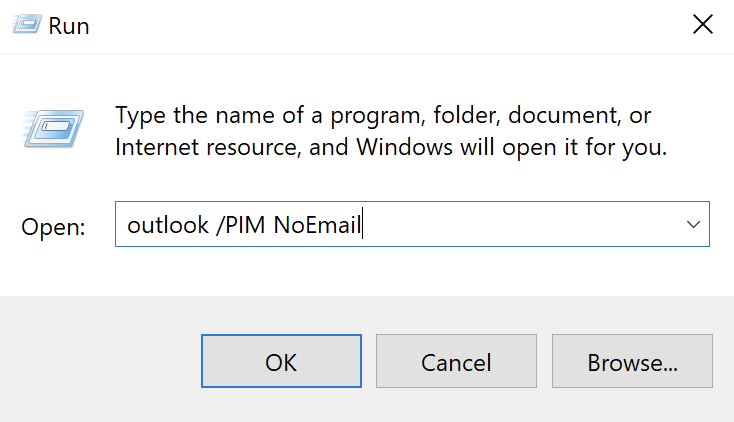
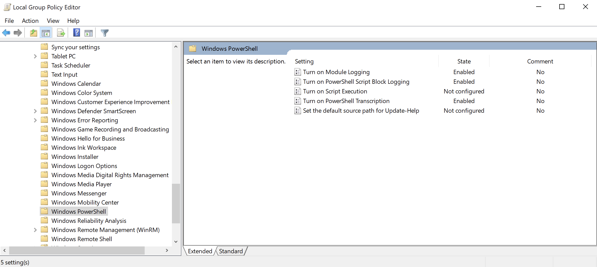
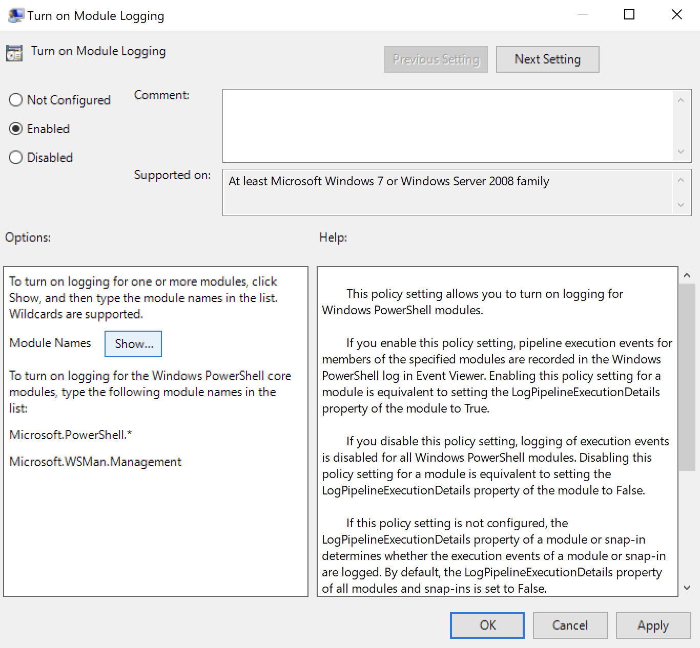
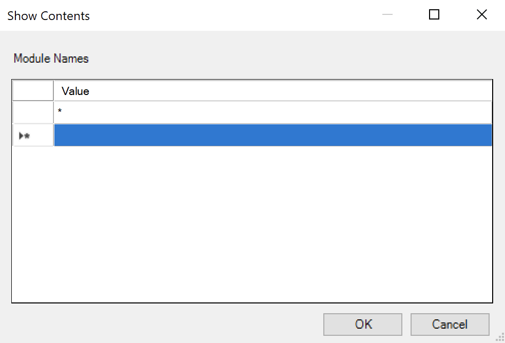
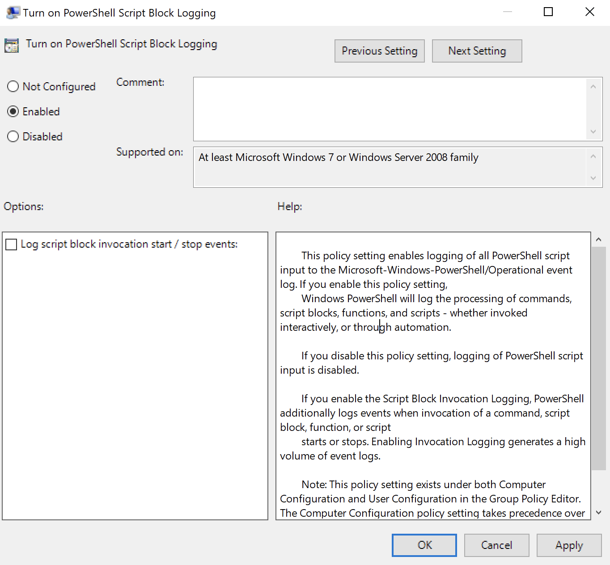
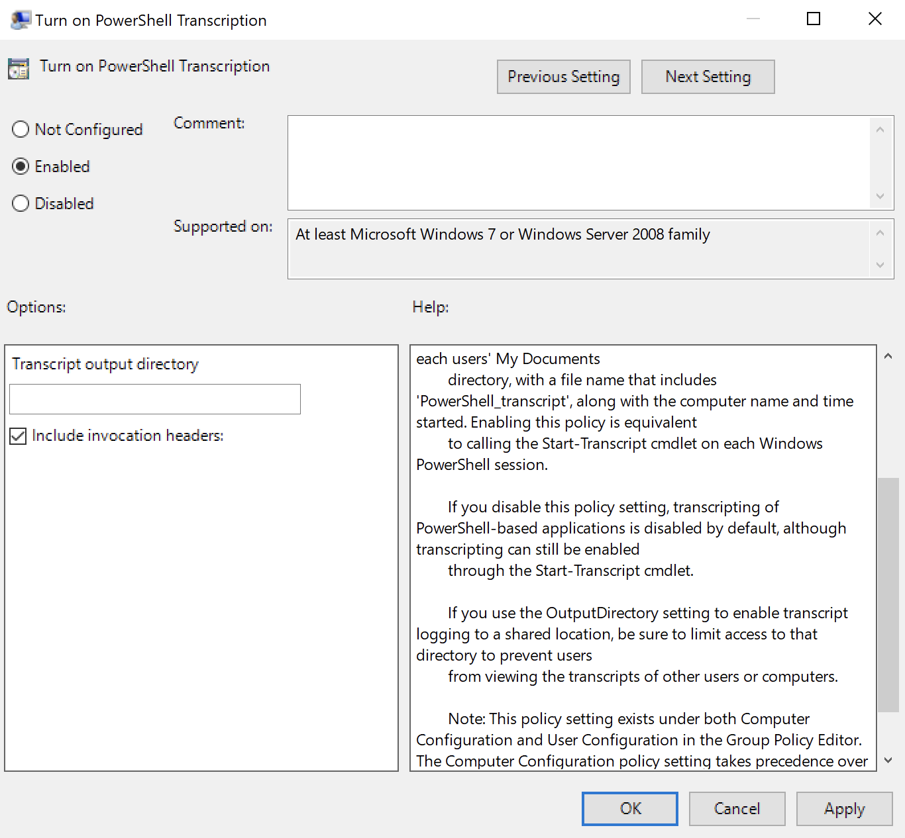

# Module 5: Windows Client-Side Attacks

## Attacking Microsoft Office

### Social Engineering and Spearphishing

Social Engineering is where an attacker tricks a user into disclosing secrets or engaging in risky technical actions via deception.

Spearphishing is a form of phishing in which an email is customized to the target, increasing likelihood of the victim succumbing to the attack.

Typically the attack comes in three forms:

1. User solicitation
2. Malicious attachment
3. Malicious link

### Installing Microsoft Office

_This is specific to the OffSec labs._

Navigate to **C:\tools\windows\_client\_side\_attacks\\** and double click the **Office2019.img** file to mount it. Run the installer **Setup64.exe** located in the **Office** directory on this new mount. Close the pop-up to begin a 7-day trial.

### Using Macros

Macros are a series of command and instructions grouped together to accomplish a task programmatically.

<figure><figcaption><p>Running Outlook with an empty PIM file</p></figcaption></figure>

_Setting up a listener for our infected attachment reverse shell to connect to_


```bash
kali@attacker01:~/SOC-200/Windows_Client_Side_Attacks$ ./wcsa_met_443.sh 192.168.51.50
Initiating... please wait
[*] Using configured payload generic/shell_reverse_tcp
PAYLOAD => windows/x64/meterpreter/reverse_https
LPORT => 443
LHOST => 192.168.51.50
[*] Started HTTPS reverse handler on https://192.168.51.50:443
```


_Protected View followed by Compatibility Mode both stop the macro from executing. In our scenario, we'll select **Enable Editing** followed by **Enable Content** so the macro executes._


Compared to a staged payload, a non-staged payload sends all of the shellcode at the same time. The attachment would contain the full reverse shell to be encoded and executed when opened by the user. Non-staged payloads are typically larger in size and present two problems. First, they may be too large for the deployment attachment or buffer. Second, they can be easier to detect by most endpoint anti-virus solutions.


_Table of all SysmonEvents within the minute of downloading and running Meterpreter_


```powershell
[192.168.51.10]: PS C:\Users\offsec> Import-Module C:\Sysmon\Get-Sysmon.psm1

[192.168.51.10]: PS C:\Users\offsec> Get-SysmonEvent $null "6/17/2021 15:10:00" "6/17/2021 15:11:00"

   ProviderName: Microsoft-Windows-Sysmon

TimeCreated                      Id LevelDisplayName Message
-----------                      -- ---------------- -------
6/17/2021 3:10:43 PM              3 Information      Network connection detected:...
6/17/2021 3:10:42 PM              3 Information      Network connection detected:...
6/17/2021 3:10:42 PM             22 Information      Dns query:...
6/17/2021 3:10:40 PM             11 Information      File created:...
6/17/2021 3:10:40 PM              1 Information      Process Create:...
6/17/2021 3:10:39 PM             11 Information      File created:...
6/17/2021 3:10:39 PM              1 Information      Process Create:...
6/17/2021 3:10:18 PM              3 Information      Network connection detected:...                                       6/17/2021 3:10:17 PM              3 Information      Network connection detected:...                                                6/17/2021 3:10:17 PM              3 Information      Network connection detected:...                                                6/17/2021 3:10:12 PM              3 Information      Network connection detected:...
6/17/2021 3:10:11 PM             15 Information      File stream created:...
6/17/2021 3:10:10 PM              1 Information      Process Create:...
6/17/2021 3:10:10 PM             11 Information      File created:...
6/17/2021 3:10:10 PM             15 Information      File stream created:...
6/17/2021 3:10:10 PM             11 Information      File created:...
6/17/2021 3:10:10 PM             11 Information      File created:...
6/17/2021 3:10:10 PM             11 Information      File created:...
6/17/2021 3:10:10 PM             15 Information      File stream created:...
6/17/2021 3:10:10 PM             11 Information      File created:...
6/17/2021 3:10:10 PM             11 Information      File created:...
6/17/2021 3:10:04 PM              1 Information      Process Create:...
6/17/2021 3:10:04 PM             10 Information      Process accessed:...
6/17/2021 3:10:04 PM             10 Information      Process accessed:...
6/17/2021 3:10:04 PM             10 Information      Process accessed:...
6/17/2021 3:10:04 PM             10 Information      Process accessed:...
6/17/2021 3:10:03 PM              1 Information      Process Create:...
6/17/2021 3:10:03 PM              1 Information      Process Create:...  
```


_Limiting the Sysmon events to ProcessCreate_


```powershell
[192.168.51.10]: PS C:\Users\offsec\> Get-SysmonEvent 1 "6/17/2021 15:10:38" "6/17/2021 15:10:40" | Format-List

...
TimeCreated  : 6/17/2021 3:10:39 PM
ProviderName : Microsoft-Windows-Sysmon
Id           : 1
Message      : Process Create:
               RuleName: -
               UtcTime: 2021-06-17 19:10:39.347
               ProcessGuid: {71c0553d-9e2f-60cb-4a01-000000002b00}
               ProcessId: 6260
               Image: C:\Windows\System32\WindowsPowerShell\v1.0\powershell.exe
               FileVersion: 10.0.19041.546 (WinBuild.160101.0800)
               Description: Windows PowerShell
               Product: Microsoft® Windows® Operating System
               Company: Microsoft Corporation
               OriginalFileName: PowerShell.EXE
               CommandLine: "C:\Windows\System32\WindowsPowerShell\v1.0\powershell.exe" -nop -w hidden -e aQBmACgAWwBJAG4AdABQA
               ... 
               wBuAG8AcwB0AGkAYwBzAC4AUAByAG8AYwBlAHMAcwBdADoAOgBTAHQAYQByAHQAKAAkAHMAKQA7AA==
               CurrentDirectory: C:\Users\offsec\Documents\
               User: CLIENT01\offsec
               LogonGuid: {71c0553d-9b79-60cb-3ee1-040000000000}
               LogonId: 0x4E13E
               TerminalSessionId: 1
               IntegrityLevel: Medium
               Hashes: MD5=04029E121A0CFA5991749937DD22A1D9,SHA256=9F914D42706FE215501044ACD85A32D58AAEF1419D404FDDFA5D3B48F66CCD9F,IMPHASH=7C955A0ABC747F57CCC4324480737EF7
               ParentProcessGuid: {71c0553d-9e19-60cb-4201-000000002b00}
               ParentProcessId: 5340
               ParentImage: C:\Program Files\Microsoft Office\root\Office16\WINWORD.EXE
               ParentCommandLine: "C:\Program Files\Microsoft Office\Root\Office16\WINWORD.EXE" /n "C:\Users\offsec\AppData\Local\Microsoft\Windows\INetCache\Content.Outlook\EGM16G0U\Engineer_Resume.doc
```


_Querying the FileCreate events_


```powershell
[192.168.51.10]: PS C:\Users\offsec\> Get-SysmonEvent 11 "6/17/2021 15:10:38" "6/17/2021 15:10:40" | Format-List

TimeCreated  : 6/17/2021 3:10:39 PM
ProviderName : Microsoft-Windows-Sysmon
Id           : 11
Message      : File created:
               RuleName: -
               UtcTime: 2021-06-17 19:10:39.416
               ProcessGuid: {71c0553d-9e2f-60cb-4a01-000000002b00}
               ProcessId: 6260
               Image: C:\Windows\System32\WindowsPowerShell\v1.0\powershell.exe
               TargetFilename: C:\Users\offsec\AppData\Local\Temp\__PSScriptPolicyTest_vs04jxg2.a0n.ps1
               CreationUtcTime: 2021-06-17 19:10:39.416
```


_Querying the following events_


```powershell
[192.168.51.10]: PS C:\Users\offsec> Get-SysmonEvent $null "6/17/2021 15:10:39" "6/17/2021 15:10:41" | Format-List

TimeCreated  : 6/17/2021 3:10:40 PM
ProviderName : Microsoft-Windows-Sysmon
Id           : 11
Message      : File created:
...
               TargetFilename: C:\Users\offsec\AppData\Local\Temp\__PSScriptPolicyTest_mkcgjnfx.kbw.ps1
...

TimeCreated  : 6/17/2021 3:10:40 PM
ProviderName : Microsoft-Windows-Sysmon
Id           : 1
Message      : Process Create:
...
               CommandLine: "powershell.exe" -nop -w hidden -c &([scriptblock]::create((New-Object System.IO.StreamReader(New-Object System.IO.Compression.GzipStream((New-Object System.IO.MemoryStream(,[System.Convert]...
...              
```



Sysmon can be configured to save files that are deleted based on extension, including PowerShell scripts. The configuration entry for this is CopyOnDeleteExtensions.


_Querying the DNSEvent created by the malicious attachment_


```powershell
[192.168.51.10]: PS C:\Users\offsec> Get-SysmonEvent 22 "6/17/2021 15:10:41" "6/17/2021 15:11:00" | Format-List

TimeCreated  : 6/17/2021 3:10:42 PM
ProviderName : Microsoft-Windows-Sysmon
Id           : 22
Message      : Dns query:
               RuleName: -
               UtcTime: 2021-06-17 19:10:41.181
               ProcessGuid: {71c0553d-9e30-60cb-4c01-000000002b00}
               ProcessId: 6056
               QueryName: kali
               QueryStatus: 0
               QueryResults: ::ffff:192.168.51.50;
               Image: C:\Windows\System32\WindowsPowerShell\v1.0\powershell.exe
```



When encountering network indicators of suspicious activity, it is worthwhile to check other resources in your environment such as firewalls and proxies. Reviewing these resources may mean the difference between a successful infection or a potential incident that was stopped with automated mechanisms.


_Searching for NetworkConnect events with the identified IPv4 address_


```powershell
[192.168.51.10]: PS C:\Users\offsec> Get-SysmonEvent 3 "6/17/2021 15:10:41" "6/17/2021 15:11:00" | Where-Object { $_.properties[14].value -eq "192.168.51.50" } | Format-List

TimeCreated  : 6/17/2021 3:10:43 PM
ProviderName : Microsoft-Windows-Sysmon
Id           : 3
Message      : Network connection detected:
               RuleName: -
               UtcTime: 2021-06-17 19:10:41.730
               ProcessGuid: {71c0553d-9e30-60cb-4c01-000000002b00}
               ProcessId: 6056
               Image: C:\Windows\System32\WindowsPowerShell\v1.0\powershell.exe
               User: CLIENT01\offsec
               Protocol: tcp
               Initiated: true
               SourceIsIpv6: false
               SourceIp: 192.168.51.10
               SourceHostname: CLIENT01
               SourcePort: 49801
               SourcePortName: -
               DestinationIsIpv6: false
               DestinationIp: 192.168.51.50
               DestinationHostname: kali
               DestinationPort: 443
               DestinationPortName: https

TimeCreated  : 6/17/2021 3:10:42 PM
ProviderName : Microsoft-Windows-Sysmon
Id           : 3
Message      : Network connection detected:
               UtcTime: 2021-06-17 19:10:41.180
               SourcePort: 49800
...
               DestinationIp: 192.168.51.50
               DestinationHostname: ATTACKER01
               DestinationPort: 443
...
```


## Monitoring Windows PowerShell

### Introduction to PowerShell Logging

_PowerShell logging can be enabled via group policy._\
The settings for PowerShell logging are located in _Local Computer Policy > Computer Configuration > Administrative Templates > Windows Components > Windows PowerShell._

<figure><figcaption><p>Local Group Policy Editor - Windows PowerShell settings</p></figcaption></figure>

### PowerShell Module Logging

Module logging records all pipeline execution events in PowerShell, showing the order and details of the executing activity.

<figure><figcaption><p>Turn on Module Logging configuration</p></figcaption></figure>

<figure><figcaption><p>Wildcard selection for all Modules for Module Logging</p></figcaption></figure>

_Runnin Get-WMIObject to generate events_


```powershell
[192.168.51.10]: PS C:\Users\offsec> Get-WmiObject -Class Win32_Process | Format-Table ProcessId, ParentProcessId, Name; Write-Host (Get-Date)

ProcessId ParentProcessId Name
--------- --------------- ----
        0               0 System Idle Process
        4               0 System
       92               4 Registry
      316               4 smss.exe
      348             604 svchost.exe
      440             432 csrss.exe
...
Monday, June 14, 2021 1:25:53 PM
```


The event ID for module logging events is 4103.

_Pipeline Execution events with Module Logging_


```powershell
[192.168.51.10]: PS C:\Users\offsec> Get-WinEvent -FilterHashtable @{Logname='Microsoft-Windows-PowerShell/Operational'; StartTime="6/14/2021 13:25:52"; EndTime="6/14/2021 13:25:54"; ID=4103}

   ProviderName: Microsoft-Windows-PowerShell

TimeCreated                      Id LevelDisplayName Message
-----------                      -- ---------------- -------
6/14/2021 1:25:53 PM           4103 Information      CommandInvocation(Out-Default): "Out-Default"...
6/14/2021 1:25:53 PM           4103 Information      CommandInvocation(Write-Host): "Write-Host"...
6/14/2021 1:25:53 PM           4103 Information      CommandInvocation(Get-Date): "Get-Date"...
6/14/2021 1:25:53 PM           4103 Information      CommandInvocation(Get-WmiObject): "Get-WmiObject"...  
```


_Expanding an entry to view the content_


```powershell
[192.168.51.10]: PS C:\Users\offsec> Get-WinEvent -FilterHashtable @{Logname='Microsoft-Windows-PowerShell/Operational'; StartTime="6/14/2021 13:25:52"; EndTime="6/14/2021 13:25:54"; ID=4103} | Format-List

   ProviderName: Microsoft-Windows-PowerShell

...
TimeCreated  : 8/20/2021 9:16:32 AM
ProviderName : Microsoft-Windows-PowerShell
Id           : 4103
Message      : CommandInvocation(Get-WmiObject): "Get-WmiObject"
               ParameterBinding(Get-WmiObject): name="Class"; value="Win32_Process"
               CommandInvocation(Format-Table): "Format-Table"
               ParameterBinding(Format-Table): name="Property"; value="ProcessId, ParentProcessId, Name"
               ParameterBinding(Format-Table): name="InputObject"; value="\\CLIENT01\root\cimv2:Win32_Process.Handle="0""
               ParameterBinding(Format-Table): name="InputObject"; value="\\CLIENT01\root\cimv2:Win32_Process.Handle="4""
...
```


_Context entry of Get-WMIObect, Format-Table event_

```powershell
...
Context:
        Severity = Informational
        Host Name = ServerRemoteHost
        Host Version = 1.0.0.0
        Host ID = bee883d3-7ebf-4e72-8f4a-70d283c190ac
        Host Application = C:\Windows\system32\wsmprovhost.exe -Embedding
        Engine Version = 5.1.19041.1151
        Runspace ID = 6b83aae0-ef79-421f-a6a7-6563439d23f8
        Pipeline ID = 13
        Command Name = Get-WmiObject
        Command Type = Cmdlet
        Script Name = 
        Command Path = 
        Sequence Number = 26
        User = CLIENT01\offsec
        Connected User = CLIENT01\offsec
        Shell ID = Microsoft.PowerShell
```

The _Command Name_ is the cmdlet that initiated the pipeline execution. If it was a script, it would be shown beside _Script Name_. The Sequence Number tracks the order for PowerShell event execution while Pipeline ID is the unique ID for a given pipeline.

### PowerShell Script Block Logging

Script block logging captures the contents of code contained within script blocks, including some deobfuscated commands.

<figure><figcaption><p>Turn on PowerShell Script Block Logging configuration</p></figcaption></figure>

_Generating an event_


```powershell
[192.168.51.10]: PS C:\Users\offsec> { "This is a script block" }; Write-Host (Get-Date)                     
 "This is a script block" 
6/15/2021 2:49:43 PM
```


The event ID for Script Block events is 4104.

_Script Block event_


```powershell
[192.168.51.10]: PS C:\Users\offsec\Documents> Get-WinEvent -FilterHashtable @{Logname='Microsoft-Windows-PowerShell/Operational'; StartTime="06/15/2021 14:49:42"; EndTime="06/15/2021 14:49:44"; ID=4104} | Format-List


TimeCreated  : 6/15/2021 2:49:43 PM
ProviderName : Microsoft-Windows-PowerShell
Id           : 4104
Message      : Creating Scriptblock text (1 of 1):
               { "This is a script block" }; Write-Host (Get-Date)
               
               ScriptBlock ID: e01d4655-46ad-44f8-a459-be392a6f8119
               Path: 
```


_Encoding a Get-Hotfix PowerShell cmdlet_


```powershell
[192.168.51.10]: PS C:\Users\offsec> $Command = 'Write-Host (Get-Date); Get-Hotfix'
[192.168.51.10]: PS C:\Users\offsec> $Bytes = [System.Text.Encoding]::Unicode.GetBytes($Command)
[192.168.51.10]: PS C:\Users\offsec> $EncodedCommand = [Convert]::ToBase64String($Bytes)
[192.168.51.10]: PS C:\Users\offsec> $EncodedCommand
VwByAGkAdABlAC0ASABvAHMAdAAgACgARwBlAHQALQBEAGEAdABlACkAOwAgAEcAZQB0AC0ASABvAHQAZgBpAHgA
```


_Executing the encoded PowerShell command_


```powershell
[192.168.51.10]: PS C:\Users\offsec> powershell -Encoded VwByAGkAdABlAC0ASABvAHMAdAAgACgARwBlAHQALQBEAGEAdABlACkAOwAgAEcAZQB0AC0ASABvAHQAZgBpAHgA
6/15/2021 11:19:09 AM

Source        Description      HotFixID      InstalledBy          InstalledOn
------        -----------      --------      -----------          -----------     
CLIENT01      Update           KB4562830     NT AUTHORITY\SYSTEM  2/8/2021 12:00:00 AM
CLIENT01      Security Update  KB4570334                          11/18/2020 12:00:00 AM
CLIENT01      Update           KB4577586     NT AUTHORITY\SYSTEM  4/19/2021 12:00:00 AM
CLIENT01      Security Update  KB4580325                          11/19/2020 12:00:00 AM
CLIENT01      Security Update  KB4586864                          11/19/2020 12:00:00 AM
CLIENT01      Update           KB4589212     NT AUTHORITY\SYSTEM  4/20/2021 12:00:00 AM
CLIENT01      Security Update  KB4598481     NT AUTHORITY\SYSTEM  2/4/2021 12:00:00 AM
CLIENT01      Update           KB5000736     NT AUTHORITY\SYSTEM  6/10/2021 12:00:00 AM

6/15/2021 11:19:09 AM
PS C:\Users\offsec>
```


_Script block event for the encoded command_


```powershell
[192.168.51.10]: PS C:\Users\offsec> Get-WinEvent -FilterHashtable @{Logname='Microsoft-Windows-PowerShell/Operational'; StartTime="6/15/2021 11:19:08"; EndTime="6/15/2021 11:19:10"; ID=4104} | Format-List
...
TimeCreated  : 6/15/2021 11:19:09 AM
ProviderName : Microsoft-Windows-PowerShell
Id           : 4104
Message      : Creating Scriptblock text (1 of 1):
               Write-Host (Get-Date); Get-Hotfix
               
               ScriptBlock ID: 05417384-e8c9-4d5d-adf8-0e0149584a35
               Path: 
```


### PowerShell Transcription

Transcription generates full records of a PowerShell session, with all input and output stored in a text file.


Information saved in a transcript is in cleartext, ensure these files are secured properly.


<figure><figcaption><p>Turn on PowerShell Transcription configuration</p></figcaption></figure>

_Generating an event_


```powershell
[192.168.51.10]: PS C:\Users\offsec> Get-CimInstance Win32_ComputerSystem | Select-Object -Property Name, PrimaryOwnerName, Domain, TotalPhysicalMemory, Model, Manufacturer

Name                : CLIENT01
PrimaryOwnerName    : offsec
Domain              : WORKGROUP
TotalPhysicalMemory : 2146418688
Model               : VMware7,1
Manufacturer        : VMware, Inc.
...
```


_Transcription file header information_

```
**********************
Windows PowerShell transcript start
Start time: 20210615141747
Username: CLIENT01\offsec
RunAs User: CLIENT01\offsec
Configuration Name: 
Machine: CLIENT01 (Microsoft Windows NT 10.0.19043.0)
Host Application: C:\Windows\system32\wsmprovhost.exe -Embedding
Process ID: 6524
PSVersion: 5.1.19041.1151
PSEdition: Desktop
PSCompatibleVersions: 1.0, 2.0, 3.0, 4.0, 5.0, 5.1.19041.1151
BuildVersion: 10.0.19041.1151
CLRVersion: 4.0.30319.42000
WSManStackVersion: 3.0
PSRemotingProtocolVersion: 2.3
SerializationVersion: 1.1.0.1
**********************
...
```

_Transcription logging input command and output_


```powershell
**********************
Command start time: 20210615142013
**********************
PS C:\Users\offsec> CommandInvocation(Get-CimInstance): "Get-CimInstance"
>> ParameterBinding(Get-CimInstance): name="ClassName"; value="Win32_ComputerSystem"
>> CommandInvocation(Select-Object): "Select-Object"
>> ParameterBinding(Select-Object): name="Property"; value="Name, PrimaryOwnerName, Domain, TotalPhysicalMemory, Model, Manufacturer"
>> ParameterBinding(Select-Object): name="InputObject"; value="Win32_ComputerSystem: CLIENT01 (Name = "CLIENT01")"


Name                : CLIENT01
PrimaryOwnerName    : offsec
Domain              : WORKGROUP
TotalPhysicalMemory : 2146418688
Model               : VMware7,1
Manufacturer        : VMware, Inc.
```


### Case Study: PowerShell Logging for Phishing Attacks

_Custom Function Get-PSLogEvent for PowerShell logs_


```powershell
function Get-PSLogEvent{
    param (
        $eventid,
        $start,
        $end
    )
    $filters = @{LogName = "Microsoft-Windows-PowerShell/Operational"}
    
    if ($eventid -ne $null) {
        $filters.ID = $eventid
    }
    if ($start -ne $null) {
        $filters.StartTime = $start
    }

    if ($end -ne $null) {
        $filters.EndTime = $end
    }

    Get-WinEvent -FilterHashtable $filters
}
```


### Extra Mile

In regards to the Extra\_Mile.msg:

1. Identify the .exe that runs the malicious .hta file with Sysmon.
2. Identify the PowerShell script block and module log events generated by the malicious attachment.
3. Find the malicious attachment activity in a PowerShell transcription log.

### Obfuscating/Deobfuscating Commands

Obfuscation is _**not**_ the same as encoding. Encoding is a translation that is meant to be converted and restored using the same encoding scheme. Obfuscation is the deliberate act of makin something harder to understand for evasive purposes.



_Invoke-Obfuscation Menu_


```powershell
PS /home/kali/SOC-200/Windows_Client_Side_Attacks> Import-Module ./Invoke-Obfuscation/Invoke-Obfuscation.psd1
PS /home/kali/SOC-200/Windows_Client_Side_Attacks> Invoke-Obfuscation
...
HELP MENU :: Available options shown below:                                                                                                                                                                                

[*]  Tutorial of how to use this tool             TUTORIAL
[*]  Show this Help Menu                          HELP,GET-HELP,?,-?,/?,MENU
[*]  Show options for payload to obfuscate        SHOW OPTIONS,SHOW,OPTIONS
[*]  Clear screen                                 CLEAR,CLEAR-HOST,CLS
[*]  Execute ObfuscatedCommand locally            EXEC,EXECUTE,TEST,RUN
[*]  Copy ObfuscatedCommand to clipboard          COPY,CLIP,CLIPBOARD
[*]  Write ObfuscatedCommand Out to disk          OUT
[*]  Reset ALL obfuscation for ObfuscatedCommand  RESET
[*]  Undo LAST obfuscation for ObfuscatedCommand  UNDO
[*]  Go Back to previous obfuscation menu         BACK,CD ..
[*]  Quit Invoke-Obfuscation                      QUIT,EXIT
[*]  Return to Home Menu                          HOME,MAIN


Choose one of the below options:

[*] TOKEN       Obfuscate PowerShell command Tokens
[*] AST         Obfuscate PowerShell Ast nodes (PS3.0+)
[*] STRING      Obfuscate entire command as a String
[*] ENCODING    Obfuscate entire command via Encoding
[*] COMPRESS    Convert entire command to one-liner and Compress
[*] LAUNCHER    Obfuscate command args w/Launcher techniques (run once at end)
```


_Setting Script Block command for Invoke-Obfuscation_


```powershell
Invoke-Obfuscation> SET SCRIPTBLOCK Get-CimInstance Win32_ComputerSystem | Select-Object -Property Name, PrimaryOwnerName, Domain, TotalPhysicalMemory, Model, Manufacturer; Write-Host (Get-Date)

Successfully set ScriptBlock:

Get-CimInstance Win32_ComputerSystem | Select-Object -Property Name, PrimaryOwnerName, Domain, TotalPhysicalMemory, Model, Manufacturer; Write-Host (Get-Date)
```


_Invoke-Obfuscation: Obfuscating command tokens menu_

```powershell
Invoke-Obfuscation> token

Choose one of the below Token options:

[*] TOKEN\STRING        Obfuscate String tokens (suggested to run first)
[*] TOKEN\COMMAND       Obfuscate Command tokens
[*] TOKEN\ARGUMENT      Obfuscate Argument tokens
[*] TOKEN\MEMBER        Obfuscate Member tokens
[*] TOKEN\VARIABLE      Obfuscate Variable tokens
[*] TOKEN\TYPE          Obfuscate Type tokens
[*] TOKEN\COMMENT       Remove all Comment tokens
[*] TOKEN\WHITESPACE    Insert random Whitespace (suggested to run last)
[*] TOKEN\ALL           Select All choices from above (random order)

Invoke-Obfuscation\Token> command

Choose one of the below Token\Command options to APPLY to current payload:

[*] TOKEN\COMMAND\1     Ticks                   --> e.g. Ne`w-O`Bject
[*] TOKEN\COMMAND\2     Splatting + Concatenate --> e.g. &('Ne'+'w-Ob'+'ject')
[*] TOKEN\COMMAND\3 Splatting + Reorder --> e.g.
&('{1}{0}'-f'bject','New-O')
```

_Invoke-Obfuscation: Obfuscated Cmdlets_


```powershell
Invoke-Obfuscation\Token\Command> 1

[*] Obfuscating 2 Command tokens.

Executed:
  CLI:  Token\Command\1
  FULL: Out-ObfuscatedTokenCommand -ScriptBlock $ScriptBlock 'Command' 1

Result: gE`T-ci`mIns`TANce Win32_ComputerSystem | s`ele`ct-OBJe`CT -Property Name, PrimaryOwnerName, Domain, TotalPhysicalMemory, Model, Manufacturer; wr`itE-`HoST (GeT-`d`ATe)
```


_Moving back to the Token submenu_

```powershell
Invoke-Obfuscation\Token\Command> back


Choose one of the below Token options:

[*] TOKEN\STRING        Obfuscate String tokens (suggested to run first)
[*] TOKEN\COMMAND       Obfuscate Command tokens
[*] TOKEN\ARGUMENT      Obfuscate Argument tokens
...
```

_Invoke-Obfuscation: Obfuscating argument tokens menu_

```powershell
Invoke-Obfuscation\Token> argument

Choose one of the below Token\Argument options to APPLY to current payload:

[*] TOKEN\ARGUMENT\1    Random Case --> e.g. nEt.weBclIenT
[*] TOKEN\ARGUMENT\2    Ticks       --> e.g. nE`T.we`Bc`lIe`NT
[*] TOKEN\ARGUMENT\3    Concatenate --> e.g. ('Ne'+'t.We'+'bClient')
[*] TOKEN\ARGUMENT\4    Reorder     --> e.g. ('{1}{0}'-f'bClient','Net.We')
```

_Invoke-Obfuscation: Obfuscated Arguments_


```powershell
Invoke-Obfuscation\Token\Argument> 4

[*] Obfuscating 7 Argument tokens.

Executed:
  CLI:  Token\Argument\4
  FULL: Out-ObfuscatedTokenCommand -ScriptBlock $ScriptBlock 'CommandArgument' 4                                                                                                                                           
Result:
gE`T-ci`mIns`TANce ("{5}{6}{4}{0}{2}{1}{3}"-f'Co','puterSy','m','stem','32_','Wi','n') | s`ele`ct-OBJe`CT -Property ("{1}{0}" -f 'e','Nam'), ("{1}{0}{3}{4}{2}"-f'rim','P','e','a','ryOwnerNam'), ("{0}{1}" -f'Domai','n'), ("{4}{2}{1}{0}{5}{3}"-f'c','si','otalPhy','ry','T','alMemo'), ("{1}{0}" -f'l','Mode'), ("{3}{0}{2}{1}"-f'ctu','er','r','Manufa'); wr`itE-`HoST (GeT-`d`ATe)
```


_Showing optiosn in Invoke-Obfuscation_


```powershell
Invoke-Obfuscation\Token\Argument> show
SHOW OPTIONS :: Yellow options can be set by entering SET OPTIONNAME VALUE.

[*] ScriptPath : N/A
[*] ScriptBlock: Get-CimInstance Win32_ComputerSystem | Select-Object -Property Name, PrimaryOwnerName, Domain, TotalPhysicalMemory, Model, Manufacturer; Write-Host (Get-Date)
[*] CommandLineSyntax: Invoke-Obfuscation -ScriptBlock {Get-CimInstance Win32_ComputerSystem | Select-Object -Property Name, PrimaryOwnerName, Domain, TotalPhysicalMemory, Model, Manufacturer; Write-Host (Get-Date)} -Command 'Token\Command\1,Token\Argument\4' -Quiet                 
[*] ExecutionCommands:
    Out-ObfuscatedTokenCommand -ScriptBlock $ScriptBlock 'Command' 1
    Out-ObfuscatedTokenCommand -ScriptBlock $ScriptBlock 'CommandArgument' 4
[*] ObfuscatedCommand: gE`T-ci`mIns`TANce ("{5}{6}{4}{0}{2}{1}{3}"-f'Co','puterSy','m','stem','32_','Wi','n') | s`ele`ct-OBJe`CT -Property ("{1}{0}" -f 'e','Nam'), ("{1}{0}{3}{4}{2}"-f'rim','P','e','a','ryOwnerNam'), ("{0}{1}" -f'Domai','n'), ("{4}{2}{1}{0}{5}{3}"-f'c','si','otalPhy','ry','T','alMemo'), ("{1}{0}" -f'l','Mode'), ("{3}{0}{2}{1}"-f'ctu','er','r','Manufa'); wr`itE-`HoST (GeT-`d`ATe)

[*] ObfuscationLength: 375 
```


_Obfuscated command generating expected results_


```powershell
PS C:\Users\offsec> gE`T-ci`mIns`TANce ("{5}{6}{4}{0}{2}{1}{3}"-f'Co','puterSy','m','stem','32_','Wi','n') | s`ele`ct-OBJe`CT -Property ("{1}{0}" -f 'e','Nam'), ("{1}{0}{3}{4}{2}"-f'rim','P','e','a','ryOwnerNam'), ("{0}{1}" -f'Domai','n'), ("{4}{2}{1}{0}{5}{3}"-f'c','si','otalPhy','ry','T','alMemo'), ("{1}{0}" -f'l','Mode'), ("{3}{0}{2}{1}"-f'ctu','er','r','Manufa'); wr`itE-`HoST (GeT-`d`ATe)

Name                : CLIENT01
PrimaryOwnerName    : offsec
Domain              : WORKGROUP
TotalPhysicalMemory : 4293898240
Model               : VMware7,1
Manufacturer        : VMware, Inc.

6/21/2021 7:35:07 PM
...
```


_Script Block Log event for obfuscated command_


```powershell
[192.168.51.10]: PS C:\Users\offsec> Get-PSLogEvent 4104 "6/21/2021 19:35:06" "6/21/2021 19:35:08" | Format-List

...
TimeCreated  : 6/21/2021 7:35:07 PM
ProviderName : Microsoft-Windows-PowerShell
Id           : 4104
Message      : Creating Scriptblock text (1 of 1):
               gE`T-ci`mIns`TANce ("{5}{6}{4}{0}{2}{1}{3}"-f'Co','puterSy','m','stem','32_','Wi','n') | s`ele`ct-OBJe`CT -Property ("{1}{0}" -f 'e','Nam'), ("{1}{0}{3}{4}{2}"-f'rim','P','e','a','ryOwnerNam'), ("{0}{1}" -f'Domai','n'), ("{4}{2}{1}{0}{5}{3}"-f'c','si','otalPhy','ry','T','alMemo'), ("{1}{0}" -f'l','Mode'), ("{3}{0}{2}{1}"-f'ctu','er','r','Manufa'); wr`itE-`HoST (GeT-`d`ATe)     
               
               ScriptBlock ID: adebb422-ca19-4694-aad9-dd72cd332026
               Path: 
```


_Module Log event for obfuscated command_


```powershell
[192.168.51.10]: PS C:\Users\offsec> Get-PSLogEvent 4103 "6/21/2021 19:35:06" "6/21/2021 19:35:08" | Format-List

...

TimeCreated  : 10/8/2021 7:35:07 PM
ProviderName : Microsoft-Windows-PowerShell
Id           : 4103
Message      : CommandInvocation(Get-CimInstance): "Get-CimInstance"
               ParameterBinding(Get-CimInstance): name="ClassName"; value="Win32_ComputerSystem"
               CommandInvocation(Select-Object): "Select-Object"
               ParameterBinding(Select-Object): name="Property"; value="Name, PrimaryOwnerName, Domain, TotalPhysicalMemory, Model, Manufacturer"
               ParameterBinding(Select-Object): name="InputObject"; value="Win32_ComputerSystem: CLIENT01 (Name = "CLIENT01")"
```




_Importing Revoke-Obfuscation module_


```powershell
[192.168.51.10]: PS C:\Users\offsec> Import-Module C:\tools\windows_client_side_attacks\Revoke-Obfuscation\Revoke-Obfuscation.psm1
WARNING: The names of some imported commands from the module 'Revoke-Obfuscation' include unapproved verbs that might make them less discoverable. To find the commands with unapproved verbs, run the Import-Module command again with the Verbose parameter. For a list of approved verbs, type Get-Verb.
```


_Obfuscated PowerShell script_

```powershell
IEX ( ((("{9}{53}{75}{67}{63} ... {44}{56}"
-f'0x76,0x0,0x38,0x0,0x4', ... ,'0x58,0x48','YDVnZTzYvVrH = @F70

[DllImport(F70kernel3',',0x','x0,0x43,0x0 ... YDVqSSpkgzxOJQzhS.Length)
```

_Exporting PowerShell log events using wevtutil_


```powershell
[192.168.51.10]: PS C:\Users\offsec> wevtutil export-log Microsoft-Windows-PowerShell/Operational C:\users\offsec\Desktop\pwsh_export.evtx
```


_Deobfuscated PowerShell script from Event Logs_


```powershell
[192.168.51.10]: PS C:\Users\offsec> Get-RvoScriptBlock -Path 'C:\Users\offsec\Desktop\pwsh_export.evtx' -Verbose
VERBOSE: Parsing 1 of 1 .evt/.evtx file(s) :: pwsh_export.evtx
VERBOSE: Found file c:\users\offsec\desktop\pwsh_export.evtx
VERBOSE: Grouping and reassembling script blocks from the input 36
event log record(s).
...

ScriptBlock           : $nZTzYvVrH = @"                                                 
                        [DllImport("kernel32.dll")] public static
                        extern IntPtr VirtualAlloc(IntPtr lpAddress,
                        uint dwSize, uint flAllocationType, uint
                        flProtect);
                                                                                                     
                        [DllImport("kernel32.dll")]
                        
                        public static extern IntPtr
                        CreateThread(IntPtr lpThreadAttributes, uint
                        dwStackSize, IntPtr lpStartAddress, IntPtr
                        lpParameter, uint dwCreationFlags, IntPtr
                        lpThreadId);
                        
                        "@
                        
                        $wNWdSJLmPApxvX = Add-Type -memberDefinition
                        $nZTzYvVrH -Name "Win32" -namespace
                        Win32Functions -passthru
                        [Byte[]] $qSSpkgzxOJQzhS = 0xfc,0x48,0x83 ...
                        
                        $jbfGzUQDQBIuV =
                        $wNWdSJLmPApxvX::VirtualAlloc(0,[Math]::Max($qSSpkgzxOJQzhS.Length,0x1000),0x3000,0x40)
                        [System.Runtime.InteropServices.Marshal]::Copy($qSSpkgzxOJQzhS,0,$jbfGzUQDQBIuV,$qSSpkgzxOJQzhS.Length)
                        $wNWdSJLmPApxvX::CreateThread(0,0,$jbfGzUQDQBIuV,0,0,0)   
```

