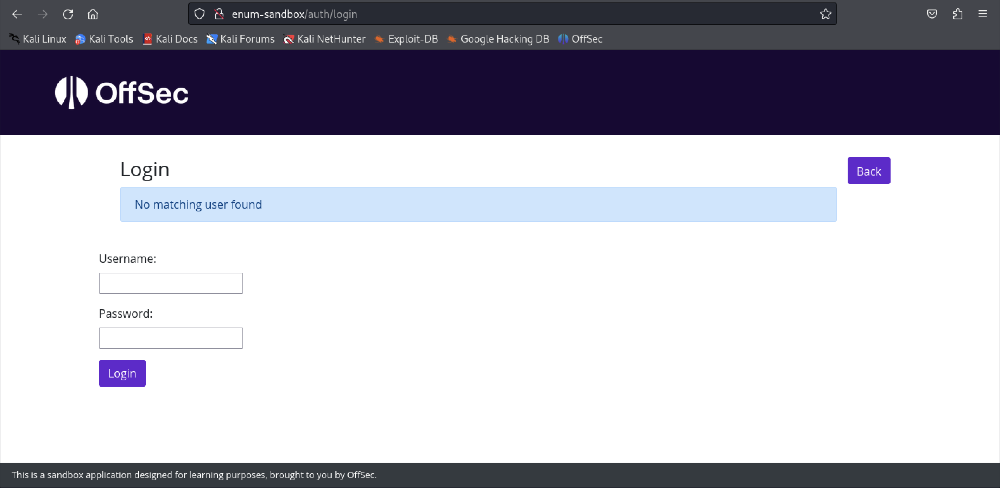
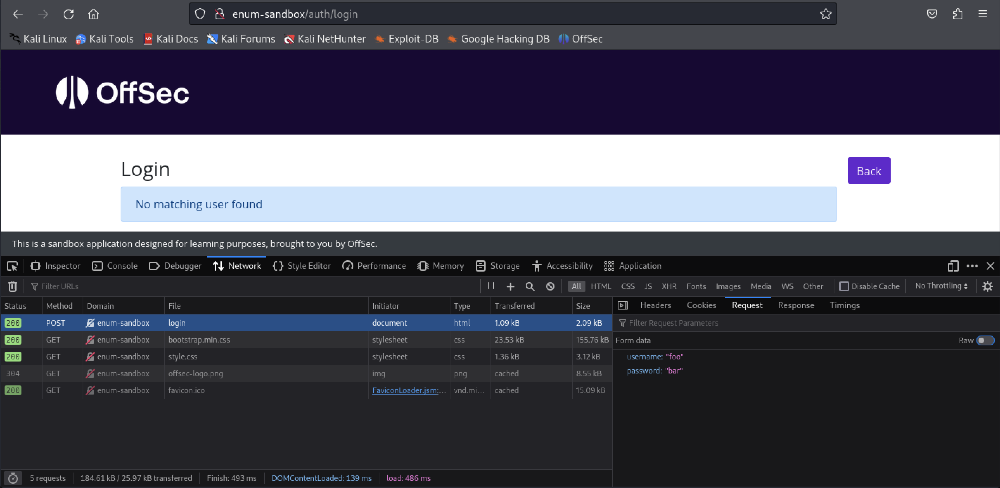

# Module 3: Web Application Enumeration Methodology

## Web Application Reconnaissance

## Determine the Scope

_Identify what you can and can't touch._

### Passive Information Gathering

_Use tools like whois, DNSDumpster, crt.sh, Shodan, etc. to gather information without actively touching the target._

## Web Application Enumeration

### Accessing the Enumeration Sandbox Application

_Start the VM and add it to your hosts file._

### Discovering Running Services

_Use nmap._

### Banner Grabbing

_Checking server headers with curl_


```bash
kali@kali:~$ curl -I http://enum-sandbox      
HTTP/1.1 200 OK
Date: Thu, 18 Apr 2024 18:22:37 GMT
Server: Apache/2.4.52 (Ubuntu)
Content-Type: text/html; charset=utf-8
Content-Length: 2546
Vary: Accept-Encoding
```


_Checking service banners with netcat_

```bash
kali@kali:~$ netcat -v enum-sandbox 22 
enum-sandbox [192.168.50.108] 22 (ssh) open
SSH-2.0-OpenSSH_8.9p1 Ubuntu-3ubuntu0.6
^C
```

### Manual HTTP Endpoint Discovery

Use Burp Suite's site map, check robots.txt along with sitemaps.xml.

### Automated HTTP Endpoint Discovery

Use tools like hakrawler, gobuster, dirb, etc.

_Example usage of hakrawler_


```bash
kali@kali:~$ echo "http://enum-sandbox" | hakrawler -u
http://enum-sandbox/
http://enum-sandbox/services
http://enum-sandbox/banners
http://enum-sandbox/bannersExercise
http://enum-sandbox/manual/
http://enum-sandbox/automated/
http://enum-sandbox/auth
http://enum-sandbox/shells
http://enum-sandbox/manual/products
http://enum-sandbox/manual/reviews
http://enum-sandbox/manual/testimonials
http://enum-sandbox/manual/about
http://enum-sandbox/manual
http://enum-sandbox/shells/bind
http://enum-sandbox/shells/reverse
http://enum-sandbox/auth/login
```


_Example usage of dirb_


```bash
kali@kali:~$ dirb http://enum-sandbox

-----------------
DIRB v2.22    
By The Dark Raver
-----------------

START_TIME: Thu Apr 18 14:31:09 2024
URL_BASE: http://enum-sandbox/
WORDLIST_FILES: /usr/share/dirb/wordlists/common.txt

-----------------

GENERATED WORDS: 4612                                                          

---- Scanning URL: http://enum-sandbox/ ----
+ http://enum-sandbox/auth (CODE:308|SIZE:237)
+ http://enum-sandbox/banners (CODE:200|SIZE:1181)
+ http://enum-sandbox/favicon.ico (CODE:200|SIZE:15086)
+ http://enum-sandbox/manual (CODE:308|SIZE:241)
+ http://enum-sandbox/robots.txt (CODE:200|SIZE:162)
+ http://enum-sandbox/server-status (CODE:403|SIZE:277)

-----------------
END_TIME: Thu Apr 18 14:35:46 2024
DOWNLOADED: 4612 - FOUND: 6
```


_Dirb options, focusing on the extension option_


```bash
kali@kali:~$ dirb      

dirb <url_base> [<wordlist_file(s)>] [options]

========================= NOTES =========================
 <url_base> : Base URL to scan. (Use -resume for session resuming)
 <wordlist_file(s)> : List of wordfiles. (wordfile1,wordfile2,wordfile3...)

...

======================== OPTIONS ========================
...
 -X <extensions> / -x <exts_file> : Append each word with this extensions.
 -z <millisecs> : Add a milliseconds delay to not cause excessive Flood.

======================== EXAMPLES =======================
 dirb http://url/directory/ (Simple Test)
 dirb http://url/ -X .html (Test files with '.html' extension)
 dirb http://url/ /usr/share/dirb/wordlists/vulns/apache.txt (Test with apache.txt wordlist)
 dirb https://secure_url/ (Simple Test with SSL)
```


### Information Disclosure

_These are issues where unnecessary information is provided. Example: login page informing of the correct/incorrect usernamed and/or password._

<figure><figcaption><p>Login Page with Error Message disclosing information</p></figcaption></figure>

In the above example, this error allows us to enumerate valid usernames.

<figure><figcaption><p>Using Developer Tools to identify POST request parameters</p></figcaption></figure>

_Example usage of ffuf_


```bash
kali@kali:~$ ffuf -w users.txt -u http://enum-sandbox/auth/login -X POST -d 'username=FUZZ&password=bar' -H 'Content-Type: application/x-www-form-urlencoded'

...

________________________________________________

 :: Method           : POST
 :: URL              : http://enum-sandbox/auth/login
 :: Wordlist         : FUZZ: /home/kali/users.txt
 :: Header           : Content-Type: application/x-www-form-urlencoded
 :: Data             : username=FUZZ&password=bar
 :: Follow redirects : false
 :: Calibration      : false
 :: Timeout          : 10
 :: Threads          : 40
 :: Matcher          : Response status: 200-299,301,302,307,401,403,405,500
________________________________________________

t_jones     [Status: 200, Size: 2093, Words: 678, Lines: 66, Duration: 61ms]
foo         [Status: 200, Size: 2093, Words: 678, Lines: 66, Duration: 61ms]
tomjones    [Status: 200, Size: 2093, Words: 678, Lines: 66, Duration: 60ms]
tom.jones   [Status: 200, Size: 2093, Words: 678, Lines: 66, Duration: 59ms]
tom_jones   [Status: 200, Size: 2093, Words: 678, Lines: 66, Duration: 59ms]
t.jones     [Status: 200, Size: 2093, Words: 678, Lines: 66, Duration: 59ms]
:: Progress: [5/5] :: Job [1/1] :: 0 req/sec :: Duration: [0:00:00] :: Errors: 0 ::
```


### Components with Vulnerabilities

_Some frameworks, add-ons, plugins, etc. contain vulnerabilities._

## Sourcing Wordlists

### Common Wordlists

[_SecLists_](https://github.com/danielmiessler/SecLists) _is great. So is_ [_payloadsallthethings_](https://github.com/swisskyrepo/PayloadsAllTheThings)_._

### Creating Custom Wordlists

_Running cewl and checking the results_


```bash
kali@kali:~$ cewl --write output.txt --lowercase -m 4 http://enum-sandbox/manual
CeWL 6.1 (Max Length) Robin Wood (robin@digi.ninja) (https://digi.ninja/)

kali@kali:~$ tail output.txt          
vision
pushing
possibilities
problem
small
them
apply
logic
intuition
pursuit
```


## Types of Attacks

### Authentication Bypass

_Trying to gain new permissions — use valid credentials, SQLi, brute force, hijacking, abusing CORS, etc._

### Data Exfiltration

_Extracting sensitive/restricted data from the target network._

### Remote Code Execution

_Executing commands on the target. Bind shell is listening on the target. Reverse shell calls back to our device._

### Web Shells

_Limited, shell-like interface through a script installed on the web server. Check out **/usr/share/webshells/**._

## Appendix

_Proxy Tools_

* [_Burp Suite_](https://portswigger.net/burp) is a robust platform that can perform security testing of web applications. It includes several tools that can help identify web application vulnerabilities. There's a simplified free version available, but the professional/commercial version offers more comprehensive tools.
* [_Zed Attack Proxy_](https://www.zaproxy.org/) (ZAP) is a free, open-source web application security scanner. It includes features to allow automated and manual testing for web application vulnerabilities.
* [_Fiddler_](https://www.telerik.com/fiddler) has several versions of its debugging proxy tool. While this tool can capture and inspect HTTP traffic, it does not include any security tools.

***

_Content Discovery Tools_

* [_DIRB_](https://dirb.sourceforge.net/) is a content scanner that uses a wordlist to discover web resources through brute forcing.
* [_DirBuster_](https://www.kali.org/tools/dirbuster/) is a multi-threaded content scanner. It can be run with a GUI or headless. It is typically included in Kali Linux by default.
* [_Gobuster_](https://github.com/OJ/gobuster) is a brute forcing tool written in Go, which usually makes it more performant than DIRB or DirBuster. Gobuster also supports enumerating DNS subdomains, and [_AWS S3_](https://aws.amazon.com/s3/) and [_Google Cloud_](https://cloud.google.com/storage/docs/json_api/v1/buckets) buckets.
* [_Hakrawler_](https://github.com/hakluke/hakrawler) is a web crawler that discovers URLs and JavaScript files.

***

_Vulnerability Scanners_

* [_Nessus_](https://www.tenable.com/products/nessus) is a comprehensive commercial vulnerability scanning tool. It can identify a variety of vulnerabilities and provides detailed reports and remediation recommendations.
* [_Qualys_](https://www.qualys.com/) provides a selection of security tools, including commercial cloud security, compliance, and scanning services.
* [_OpenVAS_](https://www.openvas.org/) is an open source vulnerability scanner maintained by [_Greenbone_](https://www.greenbone.net/en/).

***

_Specialty Tools_

* [_Nikto_](https://cirt.net/Nikto2) is a free, open source web server scanner that can conduct comprehensive tests against web servers for various vulnerabilities.
* [_Wfuzz_](https://www.edge-security.com/wfuzz.php) is a web application brute forcing tool. We can use it for content discovery, fuzzing, or more advanced attacks.
* [_ffuf_](https://github.com/ffuf/ffuf) is a web application brute forcing tool similar to Wfuzz, but written in Go.
* [_sqlmap_](https://sqlmap.org/) is a tool for discovering and exploiting SQL injection vulnerabilities in a variety of database servers.
* [_Metasploit Framework_](https://www.metasploit.com/) (MSF) is a pentesting framework with scanning and exploitation capabilities. While maintained by [_Rapid7_](https://www.rapid7.com/), it is frequently updated with new exploits by the community. For more information on using the Metasploit Framework, refer to OffSec's [_Metasploit Unleashed_](https://www.offsec.com/metasploit-unleashed/) (MSFU).
