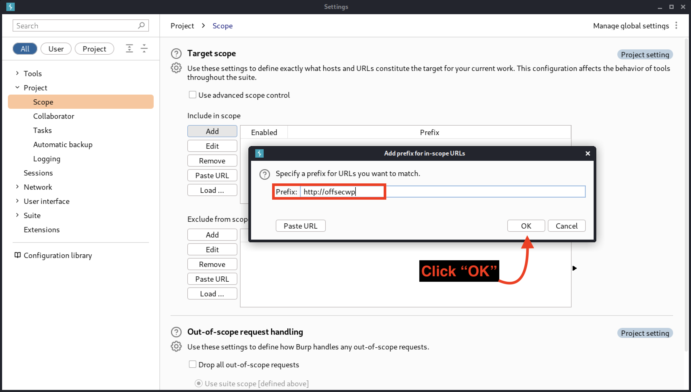
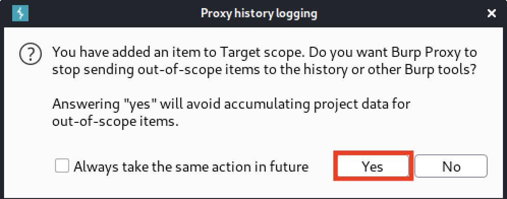
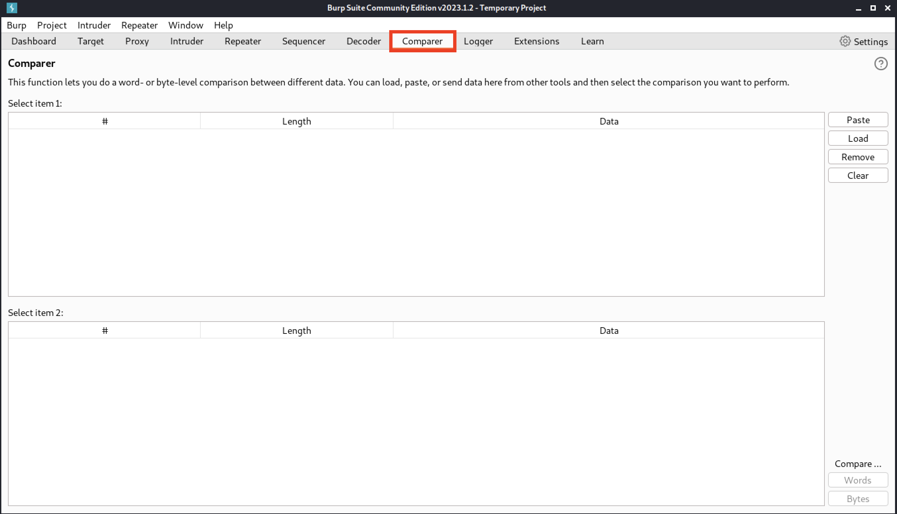
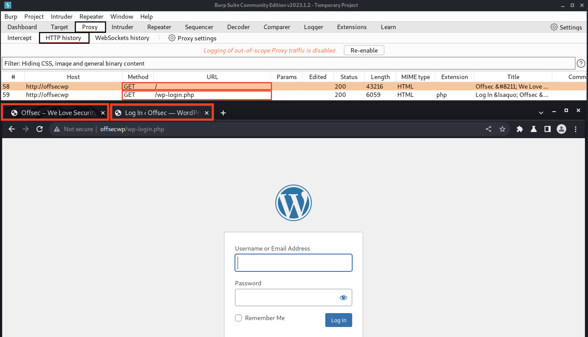
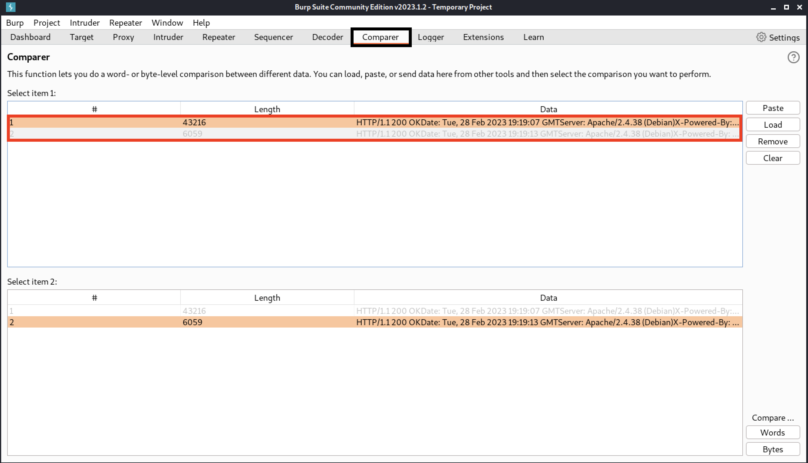
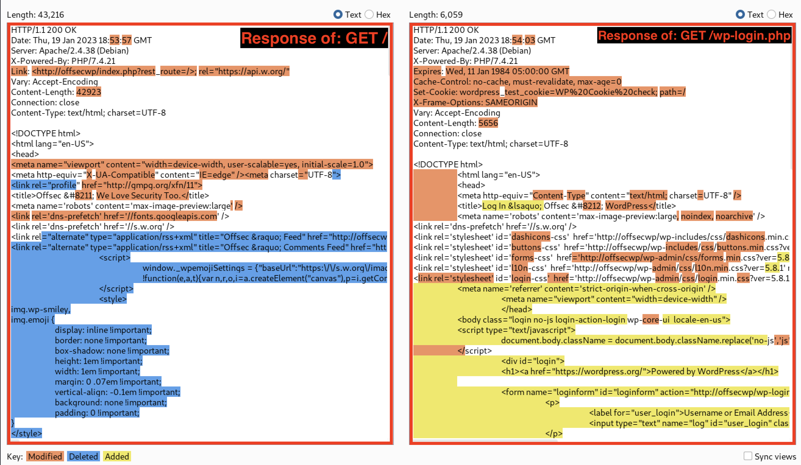
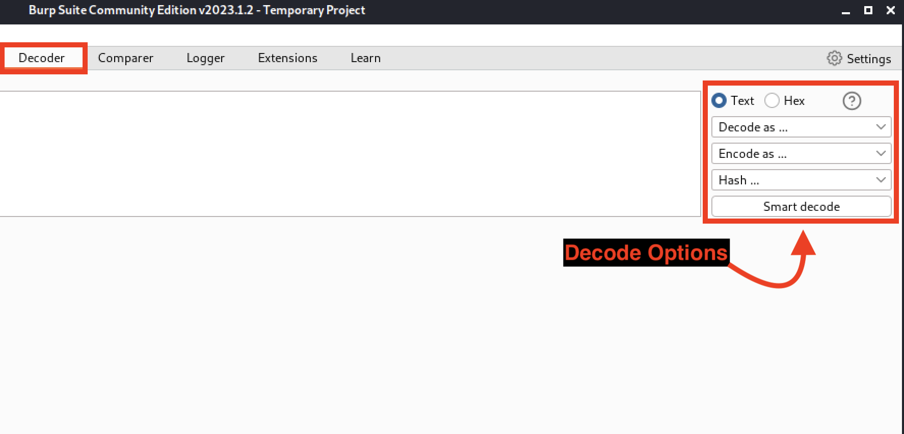
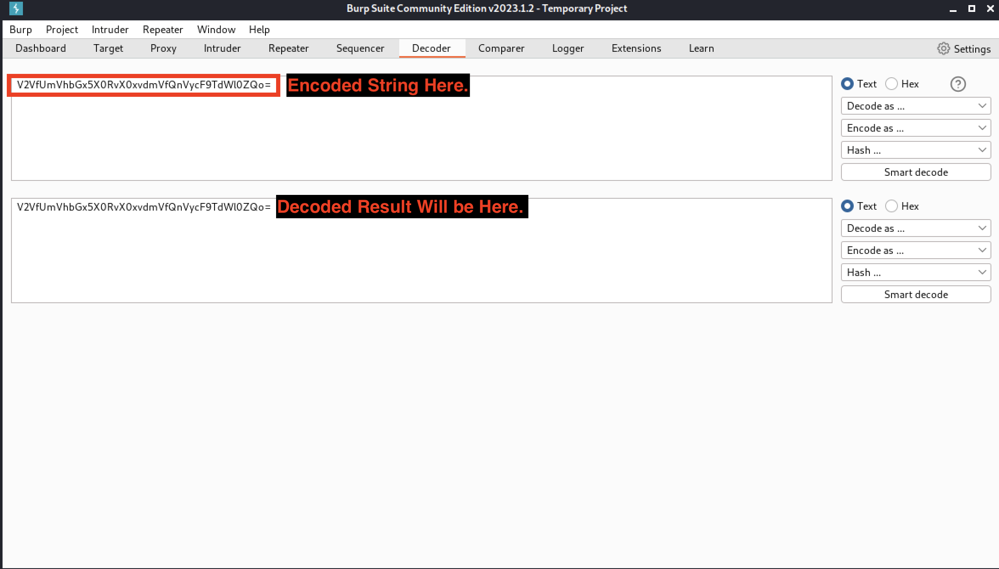
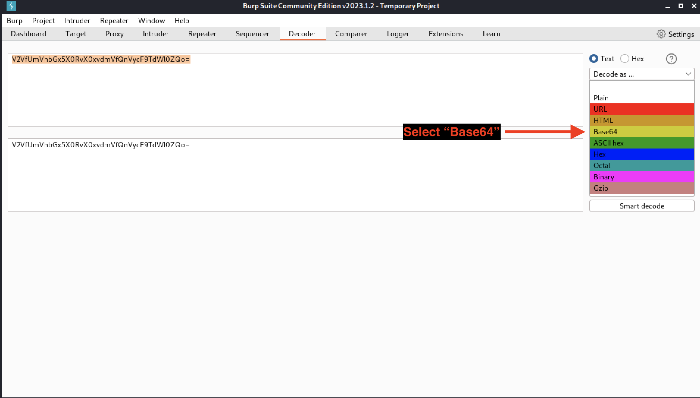
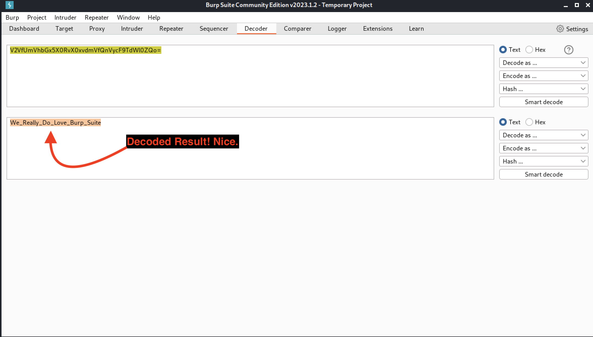

# Module 4: Introduction to Burp Suite

## Browser and Integration

### Launching Burp Suite

### [Using Burp Suite's Built-in Browser](https://appl3tree.gitbook.io/notes/courses/offsec/web-200/module-2-tools-archived#burp-suite)

### [Integrating Burp Suite with Other Browsers](https://appl3tree.gitbook.io/notes/courses/offsec/web-200/module-2-tools-archived#using-burp-suite-with-other-browsers)

## Proxy and Scope

### [Proxy](https://appl3tree.gitbook.io/notes/courses/offsec/web-200/module-2-tools-archived#proxy)

### Scope

_Options > Project > Scope_.

<figure><figcaption>
Adding offsecwp to our target scope
</figcaption></figure>

<figure><figcaption>
Ignoring out-of-scope (OOS) items
</figcaption></figure>

## Core Burp Suite Tools and Tabs

### [Repeater](https://appl3tree.gitbook.io/notes/courses/offsec/web-200/module-2-tools-archived#repeater)

### Comparer

<figure><figcaption>
The Comparer tool
</figcaption></figure>

<figure><figcaption>
Loading two separate endpoins for comparison
</figcaption></figure>

<figure><figcaption>
Both Responses loaded into Comparer
</figcaption></figure>

<figure><figcaption>
Comparing the Responses of our Requests
</figcaption></figure>

### [Intruder](https://appl3tree.gitbook.io/notes/courses/offsec/web-200/module-2-tools-archived#intruder)

* Sniper: Single field brute force.
* Battering Ram: Bruteforce multiple fields with a wordlist.
* Pitchfork: Bruteforce multiple fields with different wordlists.
* Cluster Bomb: Bruteforce multiple fields with multiple wordlists.

### Decoder

<figure><figcaption>
Decoder
</figcaption></figure>

<figure><figcaption>
A new box apperars after entering data
</figcaption></figure>

<figure><figcaption>
Telling Burp Suite to decode as Base64
</figcaption></figure>

<figure><figcaption>
Decoded string result
</figcaption></figure>

## Professional Features

### Burp Scanner, Active Scan, Collaborator, and Intruder

* Burp Scanner: automated scanning on a domain, an endpoint, or even from a specific intercepted request.
* Extensions like ActiveScan++
* Collaborator tool: requests/payloads are sent additionally to the collaborator server. If there is interaction between the request made and its internal database, collaborate notifies the tester.
* Intruder is no longer throttled.
* CSRF PoC generator.
