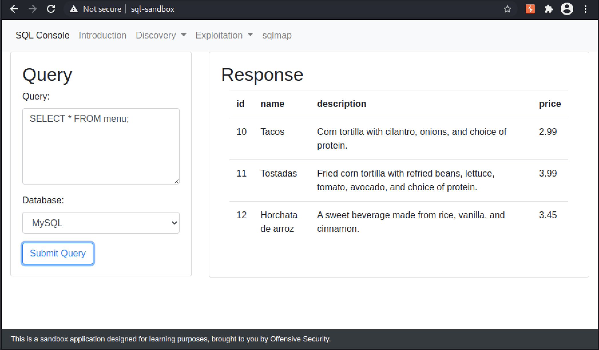
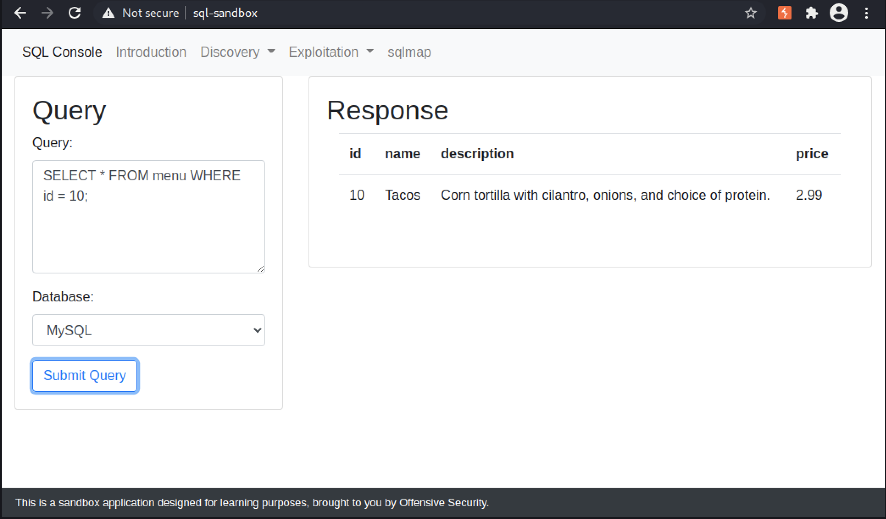

# Module 8: Introduction to SQL

## SQL Overview

### Basic SQL Syntax

_Keywords are not case sensitive, however it's common practice to write them in all caps. Some software is case sensitive when handling column/table names._

_A simple select query_

```sql
SELECT * FROM menu;
```

<figure><figcaption><p>Contents of the menu table</p></figcaption></figure>

<figure><figcaption><p>Selecting only one row</p></figcaption></figure>

_Querying MySQL flag_

```sql
select * from flags
```

_Querying Oracle flag_

```sql
select * from sys.flags
```

_Querying PostgreSQL flag_

```sql
select * from flags
```

_Querying SQL Server flag_

```sql
select * from app.dbo.flags
```

### Manual Database Enumeration

_There are differences between different database software. Understand their basic syntaxes._

## Enumerating MySQL Databases

### MySQL Specific Functions and Tables

_Getting the version of a MySQL database_

```sql
mysql> select version();
+-----------+
| version() |
+-----------+
| 5.7.28    |
+-----------+
1 row in set (0.00 sec)
```

_Getting the user connected to a MySQL database_

```sql
mysql> select current_user();
+----------------+
| current_user() |
+----------------+
| user@%         |
+----------------+
1 row in set (0.00 sec)
```

_Getting a list of databases or schemas_

```sql
mysql> select table_schema from information_schema.tables group by table_schema;
+--------------------+
| table_schema       |
+--------------------+
| information_schema |
| app                |
| exercise           |
| mysql              |
| performance_schema |
| sqlmap             |
| sys                |
+--------------------+
7 rows in set (0.00 sec)
```

_Getting a list of tables in a database or schema_

```sql
mysql> select table_name from information_schema.tables where table_schema = 'app';
+------------+
| table_name |
+------------+
| flags      |
| menu       |
| users      |
+------------+
3 rows in set (0.00 sec)
```

_Getting a list of columns and their data type in a table in MySQL_


```sql
mysql> select column_name, data_type from information_schema.columns where table_schema = 'app' and table_name = 'menu';
+-------------+-----------+
| column_name | data_type |
+-------------+-----------+
| id          | int       |
| name        | varchar   |
| description | varchar   |
| price       | decimal   |
+-------------+-----------+
4 rows in set (0.00 sec)
```


## Enumerating Microsoft SQL Server Databases

### Microsoft SQL Server Specific Functions and Tables

_Selecting the version of MS SQL Server_

```sql
1> select @@version;

2> GO
 
-------------------------------------------------------------------------
Microsoft SQL Server 2019 (RTM-CU11) (KB5003249) - 15.0 (X64) 
	May 27 2021 17:34:14 
	Copyright (C) 2019 Microsoft Corporation
	Express Edition (64-bit) on Linux (Ubuntu 18.04.5 LTS) <X64>  
(1 rows affected)
```

_Selecting the current user connected to MS SQL Server_

```sql
1> SELECT SYSTEM_USER;

2> GO

-------------------------------------------------------------------------
sa                  
(1 rows affected)
```

_Listing databases in MS SQL Server_


```sql
1> SELECT name FROM sys.databases;

2> GO
name                                                                                          
-------------------------------------------------------------------------
master
tempdb
model
msdb
app
exercise
sqlmap  
(7 rows affected)
```


_Listing tables in MS SQL Server_

```sql
1> select * from app.information_schema.tables;

2> GO
TABLE_CATALOG    TABLE_SCHEMA   TABLE_NAME       TABLE_TYPE
------------------------------------------------------------
app              dbo            menu              BASE TABLE
app              dbo            users             BASE TABLE
app              dbo            flags             BASE TABLE

(3 rows affected)
```

_Getting a list of columns and their data type in a table in SQL Server_


```sql
1> select COLUMN_NAME, DATA_TYPE from app.information_schema.columns where TABLE_NAME = 'menu';

2> GO
COLUMN_NAME    DATA_TYPE                         
------------------------------------------------------------
id             int
name           varchar
description    varchar
price          decimal        

(4 rows affected)
```


## Enumerating PostgreSQL Databases

### PostgreSQL Specific Functions and Tables

_Selecting the version of a PostgreSQL database_


```sql
user=# select version();
                                 version
---------------------------------------------------------------------------
 PostgreSQL 13 on x86_64-pc-linux-musl, compiled by gcc (Alpine 10.3.1_git20210424) 10.3.1 20210424, 64-bit
(1 row)
```


_Selecting the current user connected to a PostgreSQL database_

```sql
user=# select current_user;
 current_user 
--------------
 user
(1 row)
```

_Listing databases in a PostgreSQL database_


```sql
user=# select datname from pg_database;
  datname  
-----------
 postgres
 user
 template1
 template0
 app
 exercise
 sqlmap
(7 rows)
```


_Listing tables in a PostgreSQL database_


```sql
app=# select table_name from app.information_schema.tables where table_schema = 'public';
 table_name 
------------
 menu
 users
 flags
(3 rows)
```


_Getting a list of columns and their data type in a table in a PostgreSQL database_


```sql
app=# select column_name, data_type from app.information_schema.columns where table_name = 'menu';
 column_name |     data_type     
-------------+-------------------
 id          | integer
 price       | numeric
 name        | character varying
 description | character varying
(4 rows)
```


## Enumerating Oracle Databases

### Oracle Specific Tables

_Selecting the version of an Oracle database_

```sql
SQL> select * from v$version;

BANNER
--------------------------------------------------------------------------------
Oracle Database 11g Express Edition Release 11.2 - 64bit Production
PL/SQL Release 11.2 - Production
CORE	11.2 Production
TNS for Linux: Version 11.2 - Production
NLSRTL Version 11.2 - Production

SQL
```

_Selecting the current user connected to an Oracle database_

```sql
SQL> select user from dual;

USER
------------------------------
SYSTEM
```

_Listing all users or schemas_


```sql
SQL> select owner from all_tables group by owner;

OWNER
------------------------------
MDSYS
OUTLN
CTXSYS
HR
FLOWS_FILES
SQLMAP
SYSTEM
APEX_040000
XDB
SYS

10 rows selected.
```


_Listing tables in a schema_

```sql
SQL> select table_name from all_tables where owner = 'SYS' order by table_name;

TABLE_NAME
------------------------------
ACCESS$
ALERT_QT
APPLY$_CHANGE_HANDLERS
APPLY$_CONF_HDLR_COLUMNS
APPLY$_CONSTRAINT_COLUMNS
APPLY$_DEST_OBJ
APPLY$_DEST_OBJ_CMAP
...
MAP_SUBELEMENT$
MENU
METAFILTER$
...
939 rows selected.
```

_Getting a list of columns and their data type in a table in an Oracle database_


```sql
aSQL> select column_name, data_type from all_tab_columns where table_name = 'MENU';

COLUMN_NAME        DATA_TYPE
-----------------------------------------
ID                 NUMBER
NAME               VARCHAR2
DESCRIPTION        VARCHAR2
PRICE              NUMBER
```

